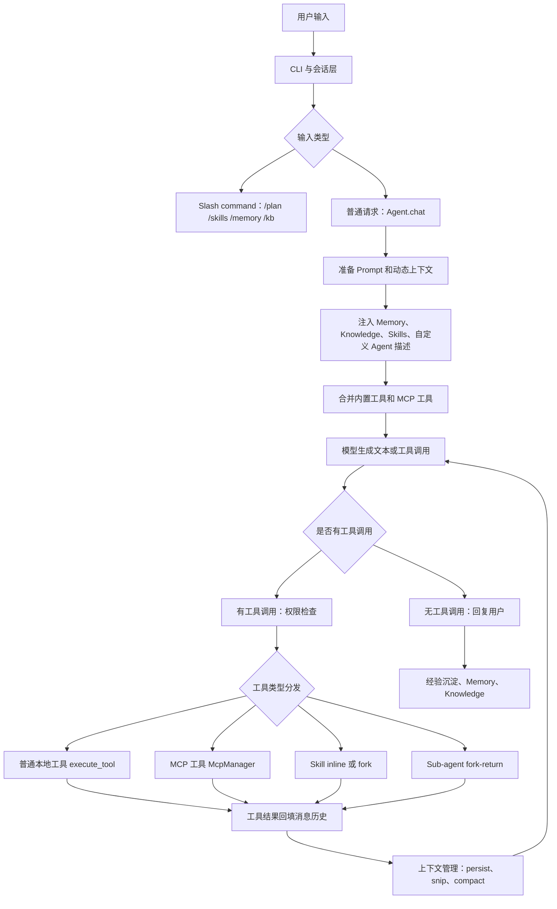
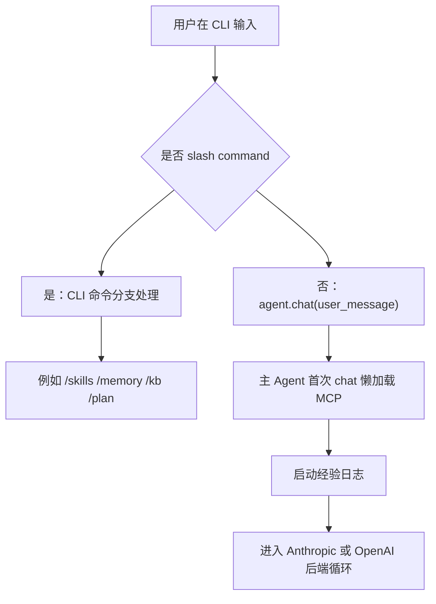
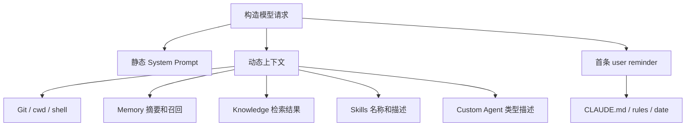
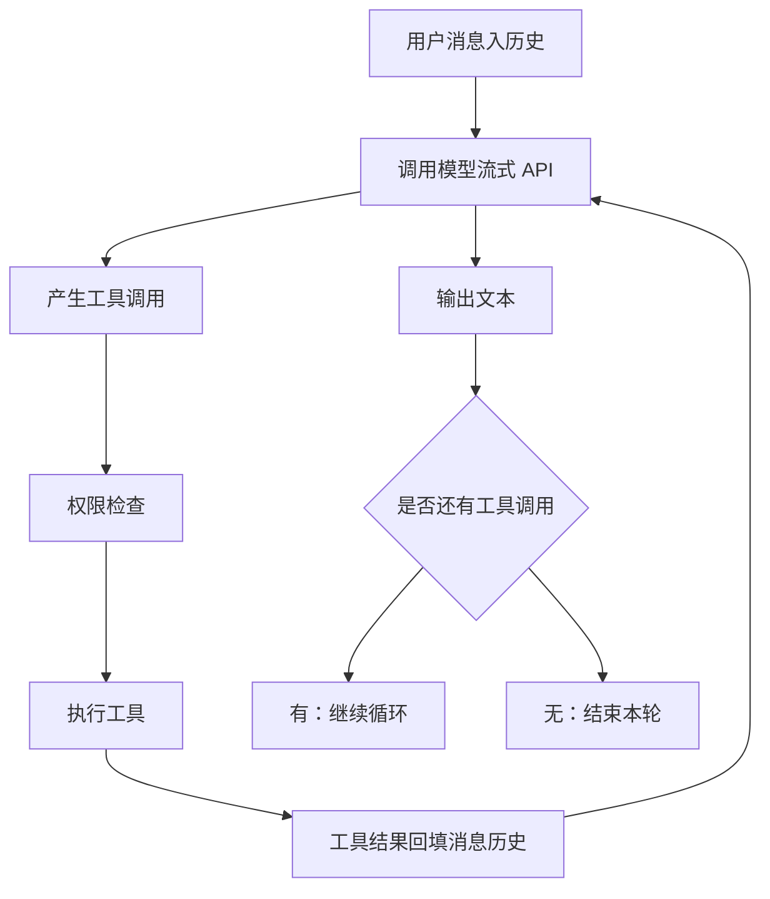
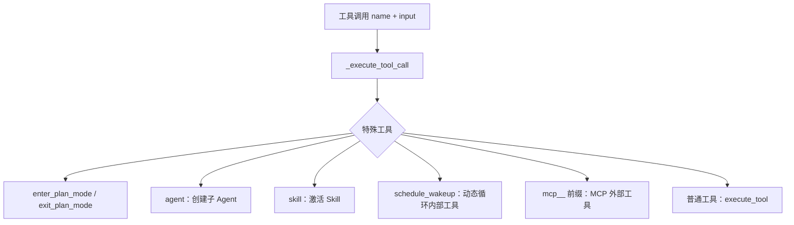
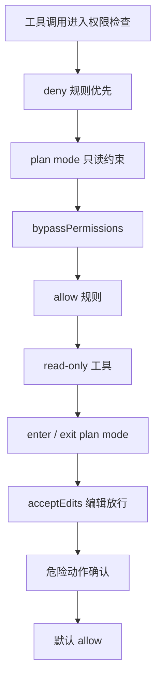
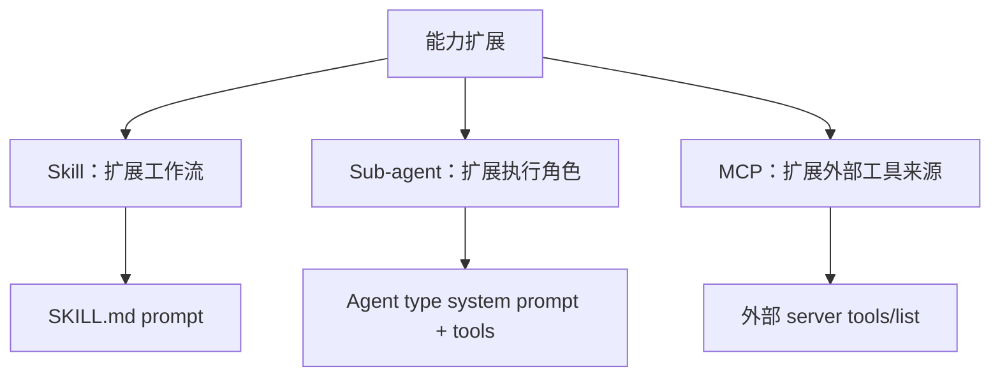
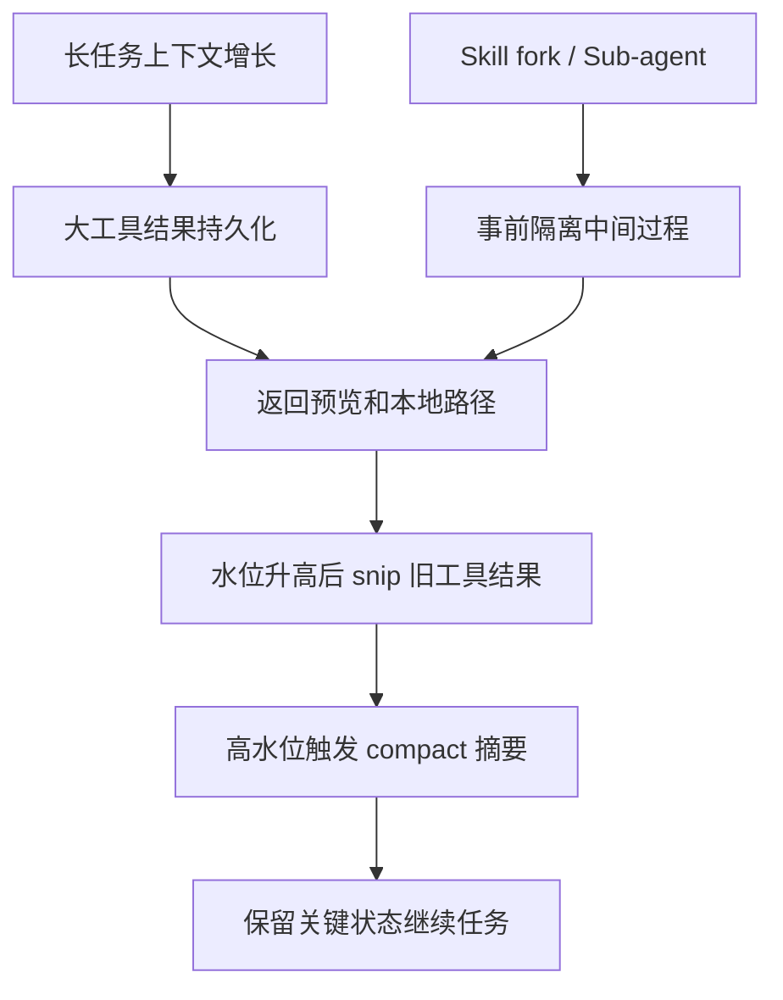
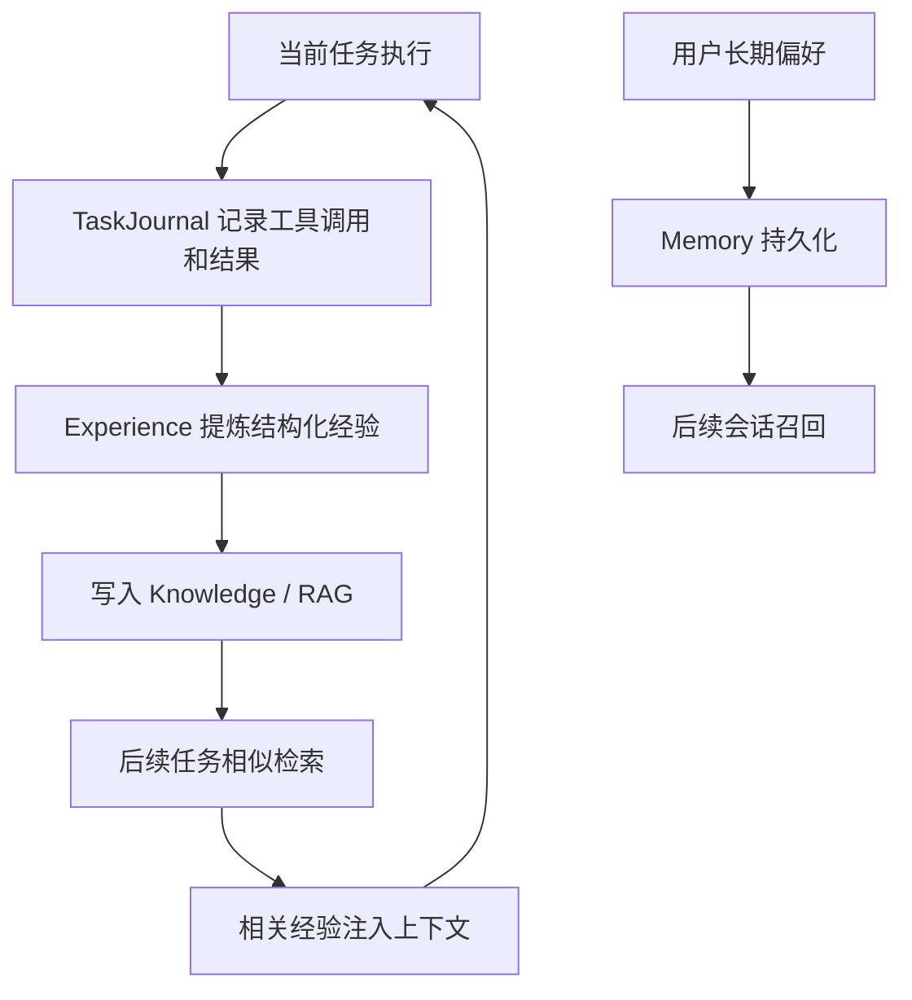
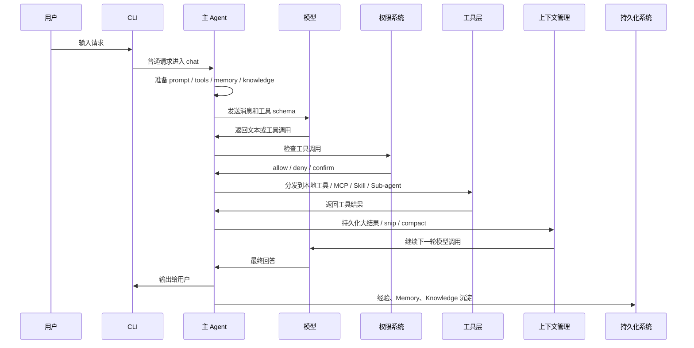

# 00 整体架构串联

## 第一部分：总结介绍

这个项目不能按“每章一个独立功能”来背。更好的理解方式是把它看成一套 Agent 运行时系统：用户输入进入 CLI，会话层把输入分成 slash command 和普通自然语言；普通请求进入主 Agent 的 `chat()`；主 Agent 准备 system prompt、动态上下文、工具列表、Memory、Knowledge、Skills、自定义 Agent 和 MCP 工具；模型在 Agent Loop 里生成回复或工具调用；工具调用先经过权限系统，再按工具类型分发到本地工具、MCP、Skill 或子 Agent；工具结果回填消息历史后继续下一轮；过程中上下文管理持续控制 token 水位；任务结束后，经验、Memory 和 Knowledge 把可复用信息沉淀下来。

所以整体架构可以用一句话概括：**Prompt 决定模型看见什么，Tool 决定模型能请求什么，Permission 决定什么能执行，Context Management 决定信息保留多久，Memory/Knowledge/Experience 决定什么能跨任务复用，Skill/Sub-agent/MCP 决定能力如何扩展、复用和隔离。**

这张图里有两条循环。第一条是 Agent Loop 的执行循环：模型输出、工具调用、工具执行、结果回填、再调用模型。第二条是知识复用循环：任务执行产生轨迹，轨迹被提炼成经验或记忆，后续任务再通过 Memory 或 Knowledge 召回。面试时要把这两条线讲出来，因为它们分别解释了“当前任务如何完成”和“经验如何跨任务复用”。

## 1. 入口层：CLI 与会话

对应章节是 `04-CLI与会话.md` 和 `01-Agent-Loop.md`。入口层回答的问题是：用户输入怎么进入 Agent。

CLI 不是简单读一行字符串。它要识别 `/skills`、`/memory`、`/kb`、`/plan`、`/cost`、`/compact` 等命令。有些命令在 CLI 层直接处理，比如列出技能、管理知识库、切换计划模式；有些普通自然语言请求会进入 `Agent.chat()`。这就是系统的第一处分流：并不是所有用户输入都要交给模型，有些确定性命令更适合由宿主代码直接执行。

`Agent.chat()` 是主运行入口。它会做几件关键事情：首次 chat 时懒加载 MCP；主 Agent 才会启动经验日志记录；根据当前后端选择 Anthropic 或 OpenAI-compatible 流式路径；结束后主 Agent 会自动保存会话。子 Agent 也复用 `chat()`，但由于 `is_sub_agent=True`，它不会初始化 MCP、不会记录主任务经验、不会自动保存。

面试时可以说：我不会把 Agent Loop 理解成孤立 while 循环，而是一次请求从 CLI 到模型到工具再回到模型的生命周期。CLI 负责确定性命令和会话控制，Agent.chat 负责真正的模型驱动执行。

## 2. Prompt 与动态上下文层

对应章节是 `03-System-Prompt工程.md`、`08-记忆系统.md`、`RAG-知识库系统.md`、`09-技能系统.md` 和 `11-多Agent架构.md`。这一层回答的问题是：模型在做决策前看到了什么。

System Prompt 是模型行为的底座，但这个项目没有把所有信息都硬塞进一段大 prompt。它把信息按生命周期分层：稳定的身份、工程规范、安全原则放在静态 system prompt；cwd、平台、shell、Git、Memory、Knowledge、Skills、自定义 Agent 描述放在动态上下文；项目级 `CLAUDE.md`、rules 和日期等内容通过 user context reminder 注入首条用户消息。这样可以兼顾准确性、上下文成本和 Prompt Cache 稳定性。

这层最重要的设计思想是渐进式披露。Memory 不全量塞入，只注入索引和相关召回；Knowledge 不全库塞入，而是按 query 检索相关片段；Skill 不一开始注入完整 `SKILL.md`，只注入名称、描述和 `when_to_use`；自定义 Agent 不注入完整 prompt，只注入类型名和描述；MCP 则在首次 chat 连接后把外部工具 schema 注入工具列表。模型只在需要时看到更详细的信息。

面试时可以这样串：Prompt 工程不是写一段固定文案，而是在设计信息路由。哪些信息稳定、哪些信息随项目变化、哪些信息只在相关时召回、哪些信息必须保持在宿主权限系统里，这些都影响成本、缓存命中和模型行为。

## 3. Agent Loop 与双后端执行层

对应章节是 `01-Agent-Loop.md` 和 `05-流式输出与双后端.md`。这一层回答的问题是：模型如何一轮轮推进任务。

Agent Loop 的基本结构是：把用户消息加入历史，调用模型；如果模型直接输出文本且没有工具调用，就结束本轮；如果模型请求工具，宿主执行工具并把 tool result 回填到消息历史，然后继续调用模型。这个循环持续到模型不再请求工具、预算耗尽、被中断或进入特殊上下文重建流程。

Anthropic 和 OpenAI-compatible 两条后端路径语义相似，但消息格式和流式事件不同。Anthropic 使用 content block，包括 `text` 和 `tool_use`，工具结果以 user message 里的 `tool_result` block 回填；OpenAI-compatible 使用 `tool_calls` 和 role=`tool` message 回填。项目把两条后端都包装进同一个 Agent 抽象，让上层工具、权限、上下文治理尽量复用。

流式输出里还有一个工程细节：部分并发安全工具可以在 streaming 期间提前启动。比如读文件、搜索这类只读工具，在 Anthropic content block 完成时就可以提前执行，不必等整段模型响应完全结束。这能降低等待时间。但 Auto Mode 下不是所有工具都能提前跑，因为需要先经过安全分类，不能让有风险工具绕过 classifier。

## 4. 工具系统与能力总线

对应章节是 `02-工具系统.md`、`09-技能系统.md`、`11-多Agent架构.md` 和 `12-MCP集成.md`。这一层回答的问题是：模型请求能力后，宿主怎么执行。

工具系统是 Agent 的能力总线。模型看到的是工具 schema，包括工具名、描述和输入参数；模型生成的是 tool call；宿主代码再根据工具名分发。这里一定要区分“模型视角”和“执行视角”。模型视角下，普通工具、MCP 工具、Skill 工具、Agent 工具都是工具；执行视角下，它们的后端完全不同。

分发顺序很重要：`enter_plan_mode` 和 `exit_plan_mode` 会修改 Agent 的 permission mode；`agent` 会创建子 Agent；`skill` 会解析 `SKILL.md`，inline 返回 prompt 或 fork 创建子 Agent；`schedule_wakeup` 只允许在 `/loop dynamic mode` 下使用；`mcp__server__tool` 会转发给 MCP manager；剩下的普通工具才交给 `tools.py` 的 `execute_tool()`。

面试时可以说：工具系统不是简单函数表，而是统一能力协议。模型只负责提出“我要调用哪个工具和参数”，宿主负责权限检查、路由、执行、结果持久化和消息回填。

## 5. 权限与安全层

对应章节是 `06-权限与安全.md`，并且要和 `09-技能系统.md`、`11-多Agent架构.md`、`12-MCP集成.md` 联动理解。这一层回答的问题是：模型想做的动作能不能执行。

权限系统是工具调用前的硬边界，不是 prompt 建议。典型顺序是：先看 deny 规则，因为 deny 永远优先；再看 plan mode，因为 plan mode 的只读约束要压过 allow 和 bypass；然后看 bypassPermissions；再看 allow 规则；再放行 read-only 工具；再放行 enter/exit plan mode；acceptEdits 下放行编辑工具；对危险 shell、新建文件、编辑不存在文件要求确认；最后默认 allow。

这个顺序和其他模块强相关。Skill 不能绕过权限，它只是 prompt 工作流；子 Agent 必须继承 plan 和 auto，否则主 Agent 可以把危险动作委派给子 Agent 洗白；MCP 工具虽然进入同一个工具生命周期，但当前 Python 实现没有专门识别 MCP 读写风险，Plan Mode 对 MCP 写操作也可能拦不住，这是生产级风险；`allowed-tools` 只能控制工具可见性，不能替代权限系统。

面试时可以说：权限系统必须放在宿主执行层，因为模型 prompt 只能引导，不能作为安全边界。只要是工具调用，不管来自普通工具、MCP、Skill 还是子 Agent，都应该在执行前经过权限策略。

## 6. Skill、Sub-agent、MCP 的能力扩展关系

对应章节是 `09-技能系统.md`、`11-多Agent架构.md` 和 `12-MCP集成.md`。这三个模块很容易混淆，但它们扩展的是不同维度。

Skill 扩展的是“怎么做”。它把可复用工作流写进 `SKILL.md`，例如提交代码、生成问候、执行某类审查流程。inline Skill 把 prompt 注入主上下文，fork Skill 创建子 Agent 隔离执行。

Sub-agent 扩展的是“谁来做”。它把任务拆给不同角色的 Agent，比如 `explore` 搜索代码、`plan` 制定计划、`reviewer` 做审查。子 Agent 的核心价值是隔离上下文和缩小工具范围。

MCP 扩展的是“能接入什么外部能力”。它通过外部 server 动态发现工具，比如 GitHub、数据库、Slack、浏览器。MCP 的核心价值是让 Agent 本体不为每个外部系统写死工具代码。

这三个模块可以组合。一个 Skill 可以 fork 出子 Agent；子 Agent 可以按角色限制工具；MCP 工具可以作为 Agent 的外部能力。但组合时要注意权限和上下文边界：Skill 是 prompt，不是权限；子 Agent 隔离上下文，但需要显式传递必要信息；MCP 动态工具有外部副作用，需要独立风险分类。

## 7. 上下文治理层

对应章节是 `07-上下文管理.md`，并且和 `09-技能系统.md`、`11-多Agent架构.md`、`08-记忆系统.md`、`RAG-知识库系统.md` 紧密相关。这一层回答的问题是：长任务如何不爆上下文、不被旧信息干扰。

上下文治理不是简单截断。这个项目按信息可恢复性分层处理：大工具结果先持久化完整副本，只给模型返回预览和路径；上下文达到一定水位后，对旧工具结果做 snip；更高水位时再做更激进治理；最后才做全局摘要，因为摘要的信息损失最大。用户前面问过的 50%、60%、75%、85% 可以理解成风险阶段，而不是理论最优值。

Skill fork 和 Sub-agent 是预防型上下文治理。它们在复杂任务开始前就把中间过程放到子 Agent 内部，主 Agent 只接收最终摘要。上下文压缩是事后治理，处理已经进入主上下文的内容。Memory 和 Knowledge 会额外注入信息，如果没有上下文治理，私有知识增强反而会挤占代码、工具结果和用户需求的空间。

这里还要和 Prompt Cache 一起讲。Prompt Cache 喜欢稳定前缀，如果频繁改写历史消息或每轮 compact，会降低缓存命中。因此在上下文没到高风险水位前，尽量不动稳定历史，只处理新工具结果和可恢复旧结果；当接近溢出时，避免上下文爆掉优先于缓存命中。

## 8. Memory、Knowledge、Experience 的长期复用闭环

对应章节是 `08-记忆系统.md`、`RAG-知识库系统.md`，以及经验沉淀相关逻辑。这一层回答的问题是：一次任务完成后的知识怎么复用。

短期上下文不是长期记忆。上下文会被 snip、compact、清理，也可能因为新会话而消失。长期复用要靠持久化系统：Memory 保存稳定偏好、项目事实和用户希望长期保留的信息；Knowledge/RAG 保存外部文档、规范、经验文档，并通过语义检索和关键词检索召回；Experience 从任务轨迹里提炼可复用流程和教训，再写入知识库，供后续相似任务召回复用。

这三者的边界也要讲清楚。Memory 回答“这个用户或项目有什么长期偏好和事实”；Knowledge 回答“外部资料里有什么依据”；Experience 回答“过去类似任务是怎么做成的”。Skill 则不同，它回答“以后遇到这类任务应该按什么流程做”。高质量经验可以沉淀成 Skill，但当前项目不是自动完成这个闭环。

面试时可以说：上下文是短期工作区，Memory 和 Knowledge 是长期存储，Experience 是从执行轨迹到长期知识的沉淀机制。一个成熟 Agent 不能只依赖当前上下文，因为上下文会变长、会压缩、会丢失。

## 9. 一次请求的端到端流程

把所有模块串起来，可以按一次用户请求讲：

1. 用户在 CLI 输入请求。
2. CLI 判断是 slash command 还是普通自然语言。
3. 普通请求进入 `Agent.chat()`。
4. 主 Agent 首次 chat 懒加载 MCP，发现外部工具并合并工具列表。
5. Prompt 层准备静态 system prompt、动态上下文、Memory、Knowledge、Skills、自定义 Agent 描述。
6. 模型流式生成文本或工具调用。
7. 如果有工具调用，先进入权限系统。
8. 权限通过后，按工具类型分发到本地工具、MCP、Skill 或子 Agent。
9. 工具结果经过大结果持久化和预览处理后回填消息历史。
10. 上下文管理检查 token 水位，必要时 snip 或 compact。
11. 模型继续下一轮，直到不再调用工具。
12. 主 Agent 输出最终答复。
13. 经验、Memory、Knowledge 记录可复用信息。

## 10. 面试时的整体表达

面试里最好的表达方式不是“我做了 Agent Loop、工具、权限、MCP”，而是把它们连成运行时链路：

> 我理解这个项目是一套 Agent Runtime。CLI 负责用户输入和会话命令，普通请求进入主 Agent 的 `chat()`。主 Agent 在每轮请求前准备 prompt、动态上下文、Memory、Knowledge、Skills、自定义 Agent 类型和工具 schema。模型在 Agent Loop 里生成文本或工具调用，工具调用先经过权限系统，再按类型分发到本地工具、MCP、Skill 或子 Agent。
>
> 执行过程中，上下文管理控制 token 水位。大工具结果先持久化，只返回预览；旧工具结果可以 snip；高水位才 compact。Skill fork 和 Sub-agent 是事前隔离，避免复杂任务把中间过程塞进主上下文。任务完成后，经验系统、Memory 和 RAG 知识库把可复用信息沉淀下来，后续相似任务再召回。
>
> 所以这个系统的核心不是某个单点功能，而是几个边界的组合：Prompt 是信息入口，Tool 是能力入口，Permission 是执行边界，Context 是短期工作区，Memory/Knowledge 是长期存储，Skill/Sub-agent/MCP 是能力扩展和上下文隔离机制。

## 第二部分：面试问答与追问补充

### Q1：面试官问：你如何用一条主线介绍整个项目？

我会按一次用户请求的生命周期讲。用户输入先到 CLI，CLI 判断是命令还是普通请求；普通请求进入 `Agent.chat()`，Agent 准备 prompt、动态上下文和工具列表；模型生成文本或工具调用；工具调用先过权限系统，再分发到本地工具、MCP、Skill 或子 Agent；结果回填后继续循环；过程中上下文管理负责防止 token 膨胀；任务完成后，经验、Memory 和 Knowledge 做持久化复用。

这样讲比按模块罗列更清楚，因为它能体现每个模块在运行时的位置和边界。面试官追问任何一块，都可以顺着这条链路展开。

### Q2：面试官问：Prompt、Tool、Permission 的关系是什么？

Prompt 决定模型看到什么信息和规则，Tool 决定模型可以请求哪些能力，Permission 决定这些请求能不能真正执行。三者不能混为一谈。

比如 Prompt 可以告诉模型不要乱改文件，但这只是行为引导；Tool schema 让模型知道存在 `edit_file`；真正拦截危险编辑的是权限系统。生产级 Agent 必须把安全边界放在宿主代码里，而不是只靠 prompt。

### Q3：面试官问：Memory、Knowledge、Experience、Skill 怎么区分？

Memory 保存长期偏好和项目事实，比如用户喜欢中文回答、某个项目的约定。Knowledge 保存外部文档和资料，通过检索召回依据。Experience 来自任务轨迹沉淀，记录过去类似任务怎么完成。Skill 是可复用工作流 prompt，指导 Agent 以后遇到这类任务怎么做。

简单说，Memory 是长期事实，Knowledge 是外部依据，Experience 是历史做法，Skill 是稳定流程。它们可以互相转化，例如高质量经验可以被总结成 Skill，但概念上不是同一层。

### Q4：面试官问：为什么要做渐进式披露？

因为上下文窗口有限，而且不是所有信息每轮都相关。如果把 Memory、Knowledge、Skill、Agent prompt、外部工具说明全部塞进 system prompt，模型请求会很大，也会引入大量噪声。

渐进式披露的做法是先给索引和摘要，真正需要时再加载详情。比如 Skill 先披露名称和描述，调用时才读取完整 `SKILL.md`；Knowledge 先通过 query 检索相关片段；自定义 Agent 先披露类型描述，调用时才加载完整 prompt。这样能控制 token 成本，也能减少无关信息干扰。

### Q5：面试官问：工具系统为什么要统一抽象？

因为模型不应该关心工具背后是本地函数、MCP server、Skill 还是子 Agent。模型只需要看到统一 schema，生成工具名和参数。宿主根据工具名做权限检查和执行分发。

统一抽象的好处是 Agent Loop 简洁，新增能力不一定要改核心循环。比如 MCP 工具只要动态注册 schema，调用时按 `mcp__` 前缀路由；Skill 和 Sub-agent 也通过工具入口接入，而不是在模型外另开一套流程。

### Q6：面试官问：为什么权限系统一定要在工具执行前？

因为模型输出本身不可信，工具调用可能有副作用。权限系统必须在执行前拦截，比如危险 shell、新建文件、编辑不存在文件、Plan Mode 下的写操作。

如果先执行再检查，就已经造成副作用了。这个项目的权限顺序也很重要：deny 优先，Plan Mode 只读约束优先，之后才是 allow、read-only、acceptEdits 和危险动作确认。这个顺序保证高优先级安全规则不会被低优先级规则绕过。

### Q7：面试官问：为什么 Skill 和 Sub-agent 都能降低上下文污染？

Skill fork 和 Sub-agent 都是事前隔离机制。复杂任务如果直接 inline 到主 Agent，读文件、搜索、日志和临时分析都会进入主上下文。fork 出子 Agent 后，中间过程留在子 Agent 内部，主 Agent 只拿最终摘要。

区别是 Skill 强调可复用工作流，Sub-agent 强调角色化任务委派。两者底层都可以用 `Agent(..., is_sub_agent=True)` 和 `run_once()` 实现 fork-return。

### Q8：面试官问：MCP 接入后权限为什么更复杂？

因为 MCP 工具是动态发现的，Agent 不能只靠本地固定工具名判断风险。一个 MCP 工具名可能是 `mcp__github__create_issue` 或 `mcp__slack__send_message`，它有外部副作用，但当前本地 `EDIT_TOOLS` 和 `READ_TOOLS` 不一定覆盖它。

所以生产里要给 MCP 工具引入独立风险分类，按 server 和 tool 做 trust level、read/write/destructive 标注，并让 Plan Mode 和 Auto Mode 都理解这些元数据。否则外部工具可能绕过本地权限假设。

### Q9：面试官问：上下文压缩和 Prompt Cache 会冲突吗？

会有一定冲突。Prompt Cache 依赖稳定前缀，如果频繁改写历史消息或每轮都 compact，会降低缓存命中。所以上下文没到高水位时，尽量不改写稳定历史，只控制新工具结果和可恢复旧结果。

但当上下文接近溢出时，可靠性优先于缓存命中。也就是说，Prompt Cache 优化成本，上下文治理保证任务能继续跑，两者要按风险水位权衡。

### Q10：面试官问：如何证明这个整体架构有效？

不能只说“功能能跑”。我会按端到端任务评估：任务成功率、平均上下文 token、峰值 token、compact 次数、工具调用成功率、权限误拦和漏拦、MCP 调用失败率、子 Agent 返回信息是否足够、经验召回是否提升后续任务成功率。

如果多 Agent 降低了上下文但成功率下降，说明子任务 prompt 或返回格式有问题。如果 RAG 提升召回但挤占上下文导致代码信息丢失，说明知识注入策略需要调。整体架构要用任务效果和失败原因一起评估。

