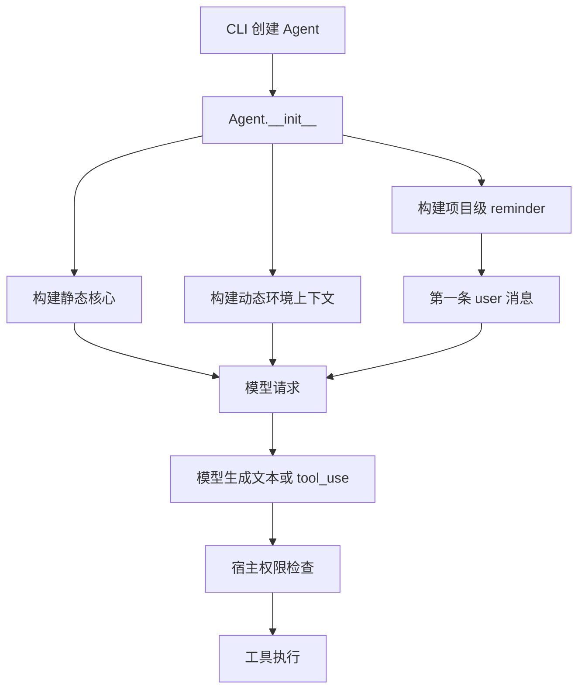

# 03 System Prompt 工程

## 第一部分：总结介绍

### 1. System Prompt 在整个 Agent 中处于什么位置

System Prompt 是模型每次做决策时读取的最高层运行说明。它描述 Agent 的身份、任务范围、工作方式、安全原则、工具使用偏好、输出风格和当前环境。用户说“修复这个项目的 bug”只提供了本轮目标；System Prompt 则补充了“这是一个 coding agent”“修改前先读文件”“优先使用专用工具”“危险操作需要确认”“当前工作目录是什么”等长期规则和环境事实。

但 System Prompt 不能代替宿主程序。它只能影响模型生成什么文本、选择什么工具，是一种模型侧软约束；真正的工具执行、权限检查、文件保护和危险操作拦截仍然必须由 Python 代码完成。如果模型因为误判或提示注入请求执行危险命令，`check_permission()` 仍应拒绝或要求确认。因此这个项目的安全结构是双层的：Prompt 负责引导模型做出正确决策，权限系统负责在执行边界做最终裁决。

从完整调用链看，Prompt 处于 CLI 与 Agent Loop 之间：



Python 版本的主要实现位于 `python/mini_claude/prompt.py`，Agent 在 `python/mini_claude/agent.py:272` 初始化时调用这些构建函数。

### 2. 为什么要把 Prompt 拆成三部分

当前实现不是简单返回一个巨大字符串，而是拆成三类生命周期不同的内容：

| 部分 | 主要内容 | 变化频率 | 放置位置 |
| --- | --- | --- | --- |
| 静态核心 | 身份、安全规则、工程规范、工具偏好、输出风格 | 跨用户、跨项目基本不变 | Anthropic system 的缓存块；OpenAI system 消息前部 |
| 动态上下文 | cwd、平台、Shell、Git、Memory、Knowledge、Skills、Sub-agent、deferred 工具名 | 随机器、项目或会话变化 | system 的动态尾部 |
| 用户上下文 reminder | `CLAUDE.md`、`.claude/rules/*.md`、当前日期 | 项目和日期变化 | 第一条 user 消息前部 |

拆分的核心原因是前缀缓存。模型请求的前缀越稳定，越有机会复用服务端已经处理过的 token。若把当前日期、Git status 和项目规则混进静态核心，那么这些内容一变化，后续前缀就很难命中原来的缓存。项目因此将真正稳定的规则放在最前面，把易变内容逐步放到后面。

这个设计还体现了“信息生命周期分层”：身份和原则是全局规则；环境和技能是会话级事实；项目说明和日期是项目级、时间相关事实。Prompt 工程并不只是写文案，而是在设计信息应该从哪里来、何时更新、以什么协议角色进入上下文，以及怎样控制 token 成本。

### 3. 静态核心 `SYSTEM_PROMPT_TEMPLATE`

静态模板定义在 `python/mini_claude/prompt.py:19`。它大致包含以下内容：

1. 身份和任务边界：说明这是交互式编程 Agent，主要处理软件工程任务。
2. 安全范围：对安全测试、破坏性攻击、批量攻击等场景进行区分。
3. 系统行为：说明普通文本会显示给用户、工具会经过权限模式、工具结果可能包含外部数据。
4. 工程方法：要求修改前读取代码，避免不必要的新文件、抽象和兼容性补丁。
5. 风险控制：根据可逆性、影响范围和共享状态判断是否需要确认。
6. 工具偏好：有专用文件工具时不使用 shell 的 `cat`、`sed`、`grep` 等替代。
7. 并发原则：无依赖的只读工具可以并行，有数据依赖的操作必须串行。
8. 输出要求：回答简洁、引用文件和行号、减少无意义的过程描述。

`build_static_system_prompt()` 在 `prompt.py:212` 中直接返回模板：

```python
def build_static_system_prompt() -> str:
    return SYSTEM_PROMPT_TEMPLATE
```

这里故意不执行字符串插值。若在这个函数中加入 `Path.cwd()` 或日期，静态块就失去了“字节稳定”的性质，缓存命中率会下降。

静态 Prompt 中提到“工具执行在用户选择的 permission mode 下进行”，但它只是提前告诉模型执行规则。实际工具调用仍会在 `Agent._chat_anthropic()` 或 `Agent._chat_openai()` 中进入 `check_permission()` 或 Auto Mode 分类器。面试时需要明确区分“模型知道规则”和“系统强制规则”。

### 4. 动态上下文如何构建

`build_dynamic_system_context()` 位于 `python/mini_claude/prompt.py:218`，它收集以下数据：

```python
plat = f"{platform.system()} {platform.machine()}"
shell = os.environ.get("SHELL", "/bin/sh")
git_context = get_git_context()
memory_section = build_memory_prompt_section()
knowledge_section = build_knowledge_prompt_section()
skills_section = build_skill_descriptions()
agent_section = build_agent_descriptions()
```

最后拼成：

```text
# Environment
Working directory: ...
Platform: ...
Shell: ...
Git branch: ...
Recent commits: ...
Git status: ...
Memory: ...
Knowledge: ...
Skills: ...
Agents: ...
Deferred tools: ...
```

这些信息分别解决不同问题：

- cwd 让模型知道相对路径应以哪里为基准。
- platform 和 shell 避免模型在 Windows 上生成 Unix 命令，或反过来。
- Git 信息让模型知道当前分支、最近工作和未提交修改。
- Memory 提供跨会话保存的用户偏好或项目经验。
- Knowledge 描述项目导入的外部资料及检索能力。
- Skills 告诉模型有哪些可加载的专业工作流。
- Sub-agent 描述告诉主 Agent 可以委派哪些任务。
- deferred 工具名建立工具系统中的渐进式披露入口。

这说明 System Prompt 和前面讲过的工具系统不是独立章节。`get_deferred_tool_names()` 只把延迟工具的名字放进 Prompt；完整 schema 仍由 `get_active_tool_definitions()` 控制是否进入 API 的 `tools` 字段。Prompt 负责让模型知道“还有能力可搜索”，工具系统负责让能力真正可调用。

### 5. Git 上下文的读取方式与边界

`get_git_context()` 位于 `prompt.py:183`，通过三个子进程读取：

```python
git rev-parse --abbrev-ref HEAD
git log --oneline -5
git status --short
```

每个命令设置 3 秒超时，整个过程出现异常时返回空字符串。这样非 Git 目录、Git 未安装或仓库状态异常不会阻止 Agent 启动。

这里有两个值得面试讨论的边界：

第一，异常被统一吞掉，所以可用性较好，但诊断性较弱。用户不会知道 Git 信息为何缺失。第二，动态上下文通常在 `Agent.__init__()` 时生成，并非每一轮模型请求前自动更新。如果 Agent 在本次会话里切换分支或产生新的文件修改，Prompt 中的 Git status 可能过时。项目提供 `refresh_dynamic_system_context()`，但当前主要由知识库等 CLI 侧变更主动调用，不是通用的每轮刷新机制。

每轮刷新会更准确，却需要重复执行 Git 命令、重建技能和记忆描述，还会降低 Prompt 前缀稳定性。因此这是准确性、启动成本和缓存命中之间的权衡。

### 6. `CLAUDE.md` 如何发现和合并

`load_claude_md()` 位于 `prompt.py:158`。它从当前工作目录开始，一直向父目录遍历到文件系统根目录：

```python
parts = []
d = Path.cwd().resolve()
while True:
    f = d / "CLAUDE.md"
    if f.is_file():
        parts.insert(0, f.read_text())
    if d.parent == d:
        break
    d = d.parent
```

使用 `insert(0, content)` 后，最终顺序是上层目录规则在前、当前项目附近的规则在后。例如：

```text
/workspace/CLAUDE.md
/workspace/service/CLAUDE.md
/workspace/service/api/CLAUDE.md
```

当 cwd 位于 `api` 时，三份文件都会加载。越靠近当前目录的规则越晚出现，通常更接近具体项目上下文。这是一种类似配置继承的设计，但代码没有实现自动冲突解析；如果规则矛盾，仍由模型根据顺序和语义理解。

除 `CLAUDE.md` 外，`_load_rules_dir()` 还会读取当前 cwd 下 `.claude/rules/` 目录中的所有 Markdown 文件，按文件名排序后拼接。需要注意，它只读取当前工作目录的 rules 目录，并不像 `CLAUDE.md` 一样逐级向上搜索。

### 7. `@include` 如何解析

项目允许在 `CLAUDE.md` 和 rules 文件中单独写一行：

```text
@./docs/team-rule.md
@~/global-rule.md
@/absolute/path/rule.md
```

`_resolve_includes()` 位于 `prompt.py:101`，使用正则只匹配整行 include。相对路径以当前被解析文件所在目录为基准；`~/` 展开到用户主目录；绝对路径直接读取。

它有两层防护：

- `_MAX_INCLUDE_DEPTH = 5` 防止无限递归。
- `visited` 集合检测循环引用。

若出现循环、文件不存在或读取失败，它不会让 Agent 启动失败，而是替换成 HTML 注释，例如：

```html
<!-- circular: @./a.md -->
<!-- not found: @./missing.md -->
```

这个设计偏向容错启动。不过 include 允许读取工作目录外的绝对路径和用户目录文件，因此其信任边界依赖本地文件权限和用户配置。如果项目来源不可信，项目指令本身也可能包含 Prompt Injection。System Prompt 已要求模型警惕外部工具结果，但项目规则的来源治理仍是宿主应用需要认真处理的问题。

### 8. 为什么 `CLAUDE.md` 和日期进入第一条 user 消息

`build_user_context_reminder()` 位于 `prompt.py:244`。它将项目说明和当前日期包装成：

```xml
<system-reminder>
As you answer the user's questions, you can use the following context:
...
# currentDate
Today's date is 2026-08-25.
...
</system-reminder>
```

Anthropic 路径由 `_push_anthropic_user_message()` 注入：

```python
{
    "role": "user",
    "content": [
        {"type": "text", "text": self._user_context_reminder},
        {"type": "text", "text": content},
    ],
}
```

OpenAI-compatible 路径则把 reminder 和用户文本拼成同一条 user 消息。这样做有三个原因：

1. 避免项目内容和日期污染可缓存的静态 System Prompt。
2. Anthropic 对话要求消息角色正确交替，把 reminder 嵌入第一条 user 消息比额外插入一个伪 system 消息更容易保持协议合法。
3. 当 `/clear` 或 plan 的 clear-and-execute 清空上下文后，辅助函数可以再次给新的第一条 user 消息补上 reminder。

必须注意，XML 标签不会改变 API 角色。`<system-reminder>` 从模型语义上看像系统注释，但协议层仍属于 `role: "user"`。用户甚至可能输入相似标签。因此不能把标签当作安全隔离或权限边界，它只是 Prompt 组织技巧。

### 9. Anthropic 的缓存断点

Anthropic 后端通过 `Agent._build_anthropic_system()` 把 system 构造成多个 block：

```python
blocks = [{
    "type": "text",
    "text": self._static_system_prompt,
    "cache_control": {"type": "ephemeral"},
}]
if dynamic_text:
    blocks.append({"type": "text", "text": dynamic_text})
```

`cache_control` 表示在静态核心结束位置建立缓存断点。当前实现还通过 `_with_cache_breakpoints()` 给消息历史最后一条消息的最后一个稳定 content block 添加另一个断点。这样旧消息可以形成滚动缓存前缀，而最新消息仍正常变化。

`_with_cache_breakpoints()` 返回历史的副本，不直接修改持久化消息：

```python
out = list(messages)
...
out[-1] = {**last, "content": content}
return out
```

这是一个很重要的工程细节。`cache_control` 是请求渲染层元数据，不应该污染 Session 存储、上下文压缩或后端转换。若直接写进 `_anthropic_messages`，恢复 Session 后可能携带已经失效的缓存标记，也会增加历史处理复杂度。

最后一个 block 如果是 `thinking` 或 `redacted_thinking`，代码不会把断点放在那里，因为思考内容不稳定，不利于缓存复用。

### 10. OpenAI-compatible 的 Prompt 处理

OpenAI-compatible 后端没有使用上述 Anthropic block 格式，而是在初始化时写入一条普通 system 消息：

```python
self._openai_messages.append({
    "role": "system",
    "content": self._system_prompt,
})
```

`build_system_prompt()` 会把静态和动态内容合并为字符串。项目依赖兼容服务自身的自动前缀缓存能力，而不是发送 Anthropic 的 `cache_control` 字段。

当 plan mode 切换或动态上下文刷新时，代码会更新 `_openai_messages[0]["content"]`。Anthropic system 不在持久化消息数组中，每次请求通过 `_build_anthropic_system()` 生成；OpenAI system 是消息历史的第一项。这是两种协议的重要区别。

### 11. Plan Mode 为什么同时修改 Prompt 和权限

Plan Mode 会给基础 Prompt 追加专门规则，让模型只分析、探索并写计划；与此同时，`permission_mode` 会改成 `plan`，权限层禁止普通写操作和 shell 操作。

只修改 Prompt 不够，因为模型仍可能生成 `edit_file`；只修改权限也不够，因为模型不知道应该转而输出计划，会不断请求被拒绝的工具。Prompt 和 permission mode 必须同步变化：前者改变模型的行为倾向，后者保证执行边界。

`toggle_plan_mode()` 修改 `_system_prompt` 后，还会更新 OpenAI 消息数组中的 system 消息；Anthropic 则在下次 `_build_anthropic_system()` 时根据当前 permission mode 动态附加 plan suffix。

### 12. System Prompt 与后续系统的关联

System Prompt 是多个系统的“能力目录和行为说明层”：

- 与工具系统关联：说明工具选择原则和 deferred 工具名，完整 schema 仍走 API `tools` 字段。
- 与权限系统关联：说明用户可能确认或拒绝，但真正 allow/deny 在 Python 中执行。
- 与 Session 关联：Anthropic system 不保存在 message history；OpenAI system 是历史第一条。项目 reminder 只在上下文第一条 user 消息注入。
- 与 Context Compact 关联：压缩后需要保留或重新建立 system 和项目上下文，同时不能拆断工具协议消息对。
- 与 Memory/Knowledge/Skills 关联：动态 Prompt 只披露摘要或入口，详细内容按需检索或读取，属于渐进式披露。
- 与 Streaming 关联：每一次流式 API 请求开始前，Prompt、活动工具 schema 和消息历史共同组成模型当前可见上下文。

### 13. 面试话术版本

这个项目没有把 System Prompt 当成一段固定文案，而是按生命周期拆成静态核心、动态环境和首条用户上下文三部分。静态核心包含身份、安全原则、工程规范和工具偏好，保持不变并在 Anthropic 请求中设置缓存断点；动态部分包含 cwd、Git、Memory、Knowledge、Skills、子 Agent 和延迟工具提示；项目级 `CLAUDE.md`、rules 和日期则包装成 `<system-reminder>` 注入第一条 user 消息，避免破坏静态前缀缓存。Anthropic 后端用多个 system block 和显式 `cache_control`，OpenAI-compatible 后端使用合并后的 system 消息并依赖服务端自动缓存。Prompt 只负责引导模型，权限检查仍由宿主代码强制执行；例如 Plan Mode 必须同时修改 Prompt 和 permission mode，才能兼顾行为引导与硬性安全边界。

## 第二部分：面试问答与追问补充

### Q1：面试官问：为什么你把 Prompt 工程单独拿出来讲？不就是写一段 system 吗？

因为在 Agent 里，Prompt 不是一段文案，而是模型运行时的操作手册。它决定模型怎么看待自己、工具、项目规则、权限边界、输出风格和当前环境。

更关键的是，Prompt 还和缓存、上下文预算、工具披露、Plan Mode、Memory、Knowledge 一起工作，所以它本质上是一个上下文注入系统。

### Q2：面试官问：为什么要把 Prompt 拆成静态、动态和 reminder 三部分？

因为三类信息的生命周期不同。静态核心基本不变，适合做缓存稳定前缀；动态上下文会随 cwd、Git、知识库、skills 变化；项目规则和日期又更像首轮上下文提醒。

拆分后的好处不是结构好看，而是能兼顾缓存命中、上下文准确性和协议兼容。

### Q3：面试官问：静态核心为什么不能塞 cwd、日期这些变量？

因为一旦把经常变化的信息塞进静态块，前缀就不稳定了，Prompt Cache 的命中率会明显下降。对长会话和多轮请求来说，这会直接增加成本和延迟。

所以静态核心只放身份、安全原则、工程规范和工具偏好这类高稳定信息。

### Q4：面试官问：动态上下文为什么不每轮都刷新？不是越新越好吗？

从准确性看，越新越好；但每轮都刷新 Git、Memory、Knowledge、skills 会增加本地构建成本，还会破坏 prompt 前缀稳定性。

所以当前实现选了一个工程折中：初始化时构建，少数场景显式刷新。面试时我会主动说明这是准确性和缓存稳定性的取舍。

### Q5：面试官问：为什么要把 Git branch、log、status 放进 Prompt？

因为它们能让模型理解当前开发上下文，比如当前在哪个分支、最近改过什么、工作树是否已经有未提交修改。这样模型更不容易在错误分支操作，或误覆盖用户本地改动。

这类信息属于“提升决策质量”的上下文，而不是必须依赖的核心配置。

### Q6：面试官问：Git 信息获取失败为什么不直接报错退出？

因为 Git 信息只是增强上下文，不是 Agent 启动的必要条件。非 Git 目录、裸目录或环境里没装 Git 时，Agent 仍然应该能解释代码和执行普通工具。

所以这里选择 fail-soft，而不是把辅助能力升级成硬依赖。

### Q7：面试官问：为什么需要多级 `CLAUDE.md`？

因为组织级规则、仓库级规则和子项目规则往往不是一个粒度。逐级向上查找可以让上层定义通用规范，下层补充更具体的模块约束。

这本质上是在做 Prompt 配置继承，只是当前实现主要依赖顺序，而不是显式优先级系统。

### Q8：面试官问：`CLAUDE.md` 和 `.claude/rules` 为什么不是同一种查找策略？

`CLAUDE.md` 更像层级继承配置，所以逐级向上查找合理；`.claude/rules` 当前更像“当前项目就地规则集”，所以只读取 cwd 下目录。

这不是唯一设计，但它反映了两种规则来源的定位不同。生产化时可以统一成更明确的优先级模型。

### Q9：面试官问：为什么支持 `@include`？这不是增加复杂度吗？

支持 include 的好处是规则可以模块化复用，例如团队共用规则、项目专项规则、个人本地规则可以拆开维护，不需要把一切都堆进单个 `CLAUDE.md`。

复杂度确实会上升，所以实现里加了最大深度和 visited 集合，防止循环引用和无限递归。

### Q10：面试官问：`@include` 有什么安全边界问题？

它允许读取相对路径、家目录甚至绝对路径文件，如果项目来源不可信，就可能把不该进入 Prompt 的内容读进来。它本质上扩大了 Prompt 的来源面。

所以生产中我会限制 include 范围、增加来源标记，并避免把外部项目规则当成高信任 system 事实。

### Q11：面试官问：为什么 `CLAUDE.md` 和日期要放进第一条 user 消息，而不是 system？

主要是为了不污染高稳定的静态 system 前缀。项目规则和日期变化比静态安全原则频繁，放进 system 会降低缓存命中。

另外 Anthropic 的 system 和消息历史协议是分开的，把 reminder 嵌在第一条 user 消息里更容易兼容后续 clear、compact 和消息交替。

### Q12：面试官问：`<system-reminder>` 是真的 system 吗？

不是，它只是 user 消息里的标签化文本。它对模型有语义提示作用，但协议层仍然是 user content。

面试时要说清楚：这种标签是 Prompt 工程技巧，不是权限边界，也不是安全隔离。

### Q13：面试官问：为什么只在第一条 user 消息里注入 reminder？

因为每轮重复注入太浪费 token，而且项目规则通常在整个会话里都长期有效。放进第一条消息后，它会作为历史一直存在。

只有上下文被清空或重建时，才需要重新注入。

### Q14：面试官问：Anthropic 为什么把 system 组织成多个 block，而不是一大段字符串？

因为它支持在静态块尾部放 `cache_control`，形成显式缓存边界。多 block 结构更适合把静态核心和动态尾部分开。

这体现的不是“Anthropic 语法不同”这么简单，而是 Prompt 工程和缓存策略的耦合。

### Q15：面试官问：为什么缓存元数据不能写进历史消息？

因为 `cache_control` 是请求渲染层元数据，不是对话语义。把它持久化进 Session 或消息数组，会污染恢复、压缩和跨后端转换。

所以 `_with_cache_breakpoints()` 只修改请求副本，不改持久化历史。

### Q16：面试官问：为什么不在 thinking 后面加缓存断点？

thinking 内容不稳定，而且有协议特殊性。把不稳定内容放在缓存边界尾部，既不利于命中，也容易引入兼容问题。

所以缓存尾部更适合选择稳定 text block，而不是 reasoning block。

### Q17：面试官问：OpenAI-compatible 后端为什么不做和 Anthropic 一样的缓存断点？

因为协议不同。当前实现依赖兼容服务自己处理前缀缓存，并从 usage 里读取 cached tokens，而不是自己发送 Anthropic 风格的 `cache_control`。

这也是双后端兼容里典型的问题：目标相同，但表达机制不同。

### Q18：面试官问：Prompt 和工具系统是什么关系？

Prompt 负责告诉模型工具使用原则，例如优先用专用工具、deferred 工具可以用 `tool_search` 激活；工具系统则真正决定哪些 schema 会进入 `tools` 字段。

所以 Prompt 解决“模型应该怎么想”，工具系统解决“模型实际上能调用什么”。

### Q19：面试官问：为什么 deferred 工具只在 Prompt 里先暴露名字？

这是渐进式披露的一部分。模型先知道“有这类能力存在”，需要时再通过 `tool_search` 拉取完整 schema。

这样能减少每轮固定上下文成本，同时不丢能力发现路径。

### Q20：面试官问：Prompt 为什么不能把 Memory、Knowledge、Skills 全量塞进去？

因为这些内容天然会增长。全量注入会迅速吃掉上下文，还会把大量无关信息带进当前任务。

所以 Prompt 更适合提供摘要、索引和入口，让详细内容按需召回。

### Q21：面试官问：Plan Mode 为什么一定要同时改 Prompt 和权限？

只改 Prompt，模型还是可能调写工具；只改权限，模型又不知道应该转为只规划，可能反复请求被拒绝的操作。

所以 Plan Mode 是双层同步切换：Prompt 改变模型行为倾向，permission mode 强制执行边界。

### Q22：面试官问：为什么说 Prompt 不是安全机制本身？

因为它只能影响概率，不能强制执行。即使 Prompt 明确说“不要执行危险命令”，模型仍可能被注入诱导、误判任务范围，或者直接生成危险 `tool_use`。

真正的安全边界仍然是宿主程序里的 permission gate、文件保护和执行器限制。

### Q23：面试官问：项目规则本身会不会成为 Prompt Injection 来源？

会。`CLAUDE.md`、include 文件、知识库文档本质上都是文本输入，只是信任级别不同。特别是来自不可信仓库时，项目规则不能自动获得和 system 同等级的信任。

所以面试时我会强调来源治理和权限隔离，而不是把一切文本规则都当系统真理。

### Q24：面试官问：如果让我继续改进这套 Prompt 工程，你会优先做什么？

我会优先做三件事：第一，给多来源规则建立明确优先级和来源标记；第二，增加动态上下文的按需刷新和 token budget 裁剪；第三，把 include 范围和错误日志治理做得更明确。

这些改动的目标都是提高可控性，而不是把 Prompt 写得更长。

### Q25：面试官问：你怎么测试 Prompt 工程？

我会做快照测试和场景测试。快照测试静态模板、Anthropic system blocks、OpenAI system message；场景测试多级 `CLAUDE.md` 顺序、循环 include、Git 失败容错、Plan Mode 切换、知识库和技能刷新。

Prompt 工程不能只靠人工肉眼看，因为一个小顺序变化就可能影响缓存和模型行为。

### Q26：面试官问：一句话总结这一章？

System Prompt 工程不是写一段说明，而是把长期规则、动态环境和项目上下文按生命周期分层注入模型，同时兼顾缓存稳定性、工具披露和安全边界。
