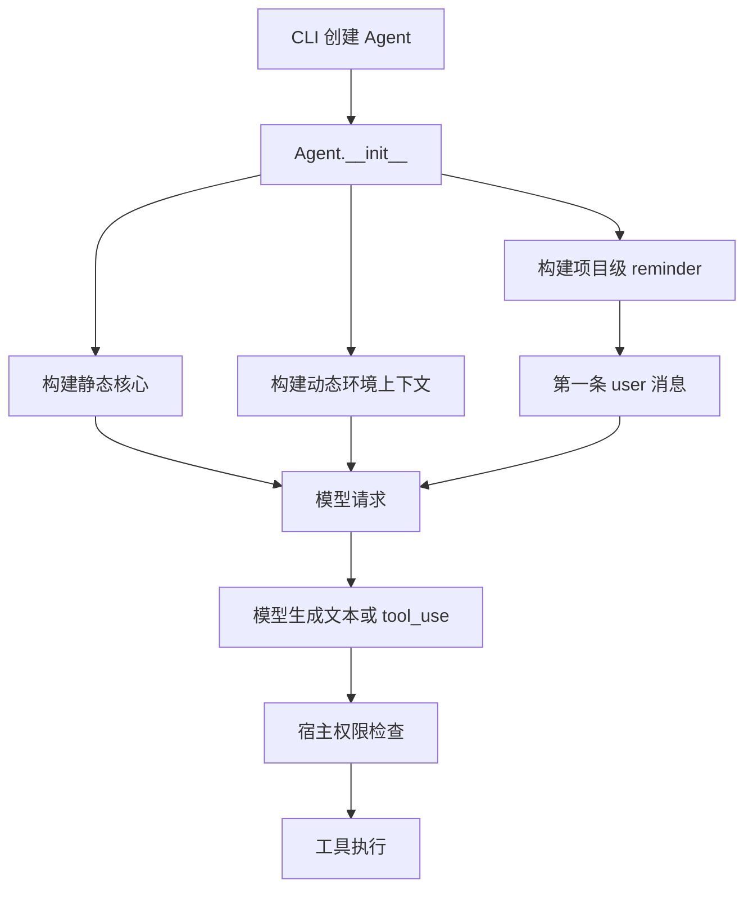

# 03 System Prompt 工程

## 第一部分：总结介绍

### 1. System Prompt 在整个 Agent 中处于什么位置

System Prompt 是模型每次做决策时读取的最高层运行说明。它描述 Agent 的身份、任务范围、工作方式、安全原则、工具使用偏好、输出风格和当前环境。用户说“修复这个项目的 bug”只提供了本轮目标；System Prompt 则补充了“这是一个 coding agent”“修改前先读文件”“优先使用专用工具”“危险操作需要确认”“当前工作目录是什么”等长期规则和环境事实。

但 System Prompt 不能代替宿主程序。它只能影响模型生成什么文本、选择什么工具，是一种模型侧软约束；真正的工具执行、权限检查、文件保护和危险操作拦截仍然必须由 Python 代码完成。如果模型因为误判或提示注入请求执行危险命令，`check_permission()` 仍应拒绝或要求确认。因此这个项目的安全结构是双层的：Prompt 负责引导模型做出正确决策，权限系统负责在执行边界做最终裁决。

从完整调用链看，Prompt 处于 CLI 与 Agent Loop 之间：



Python 版本的主要实现位于 `python/mini_claude/prompt.py`，Agent 在 `python/mini_claude/agent.py:272` 初始化时调用这些构建函数。

### 2. 为什么要把 Prompt 拆成三部分

当前实现不是简单返回一个巨大字符串，而是拆成三类生命周期不同的内容：

| 部分 | 主要内容 | 变化频率 | 放置位置 |
| --- | --- | --- | --- |
| 静态核心 | 身份、安全规则、工程规范、工具偏好、输出风格 | 跨用户、跨项目基本不变 | Anthropic system 的缓存块；OpenAI system 消息前部 |
| 动态上下文 | cwd、平台、Shell、Git、Memory、Knowledge、Skills、Sub-agent、deferred 工具名 | 随机器、项目或会话变化 | system 的动态尾部 |
| 用户上下文 reminder | `CLAUDE.md`、`.claude/rules/*.md`、当前日期 | 项目和日期变化 | 第一条 user 消息前部 |

拆分的核心原因是前缀缓存。模型请求的前缀越稳定，越有机会复用服务端已经处理过的 token。若把当前日期、Git status 和项目规则混进静态核心，那么这些内容一变化，后续前缀就很难命中原来的缓存。项目因此将真正稳定的规则放在最前面，把易变内容逐步放到后面。

这个设计还体现了“信息生命周期分层”：身份和原则是全局规则；环境和技能是会话级事实；项目说明和日期是项目级、时间相关事实。Prompt 工程并不只是写文案，而是在设计信息应该从哪里来、何时更新、以什么协议角色进入上下文，以及怎样控制 token 成本。

### 3. 静态核心 `SYSTEM_PROMPT_TEMPLATE`

静态模板定义在 `python/mini_claude/prompt.py:19`。它大致包含以下内容：

1. 身份和任务边界：说明这是交互式编程 Agent，主要处理软件工程任务。
2. 安全范围：对安全测试、破坏性攻击、批量攻击等场景进行区分。
3. 系统行为：说明普通文本会显示给用户、工具会经过权限模式、工具结果可能包含外部数据。
4. 工程方法：要求修改前读取代码，避免不必要的新文件、抽象和兼容性补丁。
5. 风险控制：根据可逆性、影响范围和共享状态判断是否需要确认。
6. 工具偏好：有专用文件工具时不使用 shell 的 `cat`、`sed`、`grep` 等替代。
7. 并发原则：无依赖的只读工具可以并行，有数据依赖的操作必须串行。
8. 输出要求：回答简洁、引用文件和行号、减少无意义的过程描述。

`build_static_system_prompt()` 在 `prompt.py:212` 中直接返回模板：

```python
def build_static_system_prompt() -> str:
    return SYSTEM_PROMPT_TEMPLATE
```

这里故意不执行字符串插值。若在这个函数中加入 `Path.cwd()` 或日期，静态块就失去了“字节稳定”的性质，缓存命中率会下降。

静态 Prompt 中提到“工具执行在用户选择的 permission mode 下进行”，但它只是提前告诉模型执行规则。实际工具调用仍会在 `Agent._chat_anthropic()` 或 `Agent._chat_openai()` 中进入 `check_permission()` 或 Auto Mode 分类器。面试时需要明确区分“模型知道规则”和“系统强制规则”。

### 4. 动态上下文如何构建

`build_dynamic_system_context()` 位于 `python/mini_claude/prompt.py:218`，它收集以下数据：

```python
plat = f"{platform.system()} {platform.machine()}"
shell = os.environ.get("SHELL", "/bin/sh")
git_context = get_git_context()
memory_section = build_memory_prompt_section()
knowledge_section = build_knowledge_prompt_section()
skills_section = build_skill_descriptions()
agent_section = build_agent_descriptions()
```

最后拼成：

```text
# Environment
Working directory: ...
Platform: ...
Shell: ...
Git branch: ...
Recent commits: ...
Git status: ...
Memory: ...
Knowledge: ...
Skills: ...
Agents: ...
Deferred tools: ...
```

这些信息分别解决不同问题：

- cwd 让模型知道相对路径应以哪里为基准。
- platform 和 shell 避免模型在 Windows 上生成 Unix 命令，或反过来。
- Git 信息让模型知道当前分支、最近工作和未提交修改。
- Memory 提供跨会话保存的用户偏好或项目经验。
- Knowledge 描述项目导入的外部资料及检索能力。
- Skills 告诉模型有哪些可加载的专业工作流。
- Sub-agent 描述告诉主 Agent 可以委派哪些任务。
- deferred 工具名建立工具系统中的渐进式披露入口。

这说明 System Prompt 和前面讲过的工具系统不是独立章节。`get_deferred_tool_names()` 只把延迟工具的名字放进 Prompt；完整 schema 仍由 `get_active_tool_definitions()` 控制是否进入 API 的 `tools` 字段。Prompt 负责让模型知道“还有能力可搜索”，工具系统负责让能力真正可调用。

### 5. Git 上下文的读取方式与边界

`get_git_context()` 位于 `prompt.py:183`，通过三个子进程读取：

```python
git rev-parse --abbrev-ref HEAD
git log --oneline -5
git status --short
```

每个命令设置 3 秒超时，整个过程出现异常时返回空字符串。这样非 Git 目录、Git 未安装或仓库状态异常不会阻止 Agent 启动。

这里有两个值得面试讨论的边界：

第一，异常被统一吞掉，所以可用性较好，但诊断性较弱。用户不会知道 Git 信息为何缺失。第二，动态上下文通常在 `Agent.__init__()` 时生成，并非每一轮模型请求前自动更新。如果 Agent 在本次会话里切换分支或产生新的文件修改，Prompt 中的 Git status 可能过时。项目提供 `refresh_dynamic_system_context()`，但当前主要由知识库等 CLI 侧变更主动调用，不是通用的每轮刷新机制。

每轮刷新会更准确，却需要重复执行 Git 命令、重建技能和记忆描述，还会降低 Prompt 前缀稳定性。因此这是准确性、启动成本和缓存命中之间的权衡。

### 6. `CLAUDE.md` 如何发现和合并

`load_claude_md()` 位于 `prompt.py:158`。它从当前工作目录开始，一直向父目录遍历到文件系统根目录：

```python
parts = []
d = Path.cwd().resolve()
while True:
    f = d / "CLAUDE.md"
    if f.is_file():
        parts.insert(0, f.read_text())
    if d.parent == d:
        break
    d = d.parent
```

使用 `insert(0, content)` 后，最终顺序是上层目录规则在前、当前项目附近的规则在后。例如：

```text
/workspace/CLAUDE.md
/workspace/service/CLAUDE.md
/workspace/service/api/CLAUDE.md
```

当 cwd 位于 `api` 时，三份文件都会加载。越靠近当前目录的规则越晚出现，通常更接近具体项目上下文。这是一种类似配置继承的设计，但代码没有实现自动冲突解析；如果规则矛盾，仍由模型根据顺序和语义理解。

除 `CLAUDE.md` 外，`_load_rules_dir()` 还会读取当前 cwd 下 `.claude/rules/` 目录中的所有 Markdown 文件，按文件名排序后拼接。需要注意，它只读取当前工作目录的 rules 目录，并不像 `CLAUDE.md` 一样逐级向上搜索。

### 7. `@include` 如何解析

项目允许在 `CLAUDE.md` 和 rules 文件中单独写一行：

```text
@./docs/team-rule.md
@~/global-rule.md
@/absolute/path/rule.md
```

`_resolve_includes()` 位于 `prompt.py:101`，使用正则只匹配整行 include。相对路径以当前被解析文件所在目录为基准；`~/` 展开到用户主目录；绝对路径直接读取。

它有两层防护：

- `_MAX_INCLUDE_DEPTH = 5` 防止无限递归。
- `visited` 集合检测循环引用。

若出现循环、文件不存在或读取失败，它不会让 Agent 启动失败，而是替换成 HTML 注释，例如：

```html
<!-- circular: @./a.md -->
<!-- not found: @./missing.md -->
```

这个设计偏向容错启动。不过 include 允许读取工作目录外的绝对路径和用户目录文件，因此其信任边界依赖本地文件权限和用户配置。如果项目来源不可信，项目指令本身也可能包含 Prompt Injection。System Prompt 已要求模型警惕外部工具结果，但项目规则的来源治理仍是宿主应用需要认真处理的问题。

### 8. 为什么 `CLAUDE.md` 和日期进入第一条 user 消息

`build_user_context_reminder()` 位于 `prompt.py:244`。它将项目说明和当前日期包装成：

```xml
<system-reminder>
As you answer the user's questions, you can use the following context:
...
# currentDate
Today's date is 2026-08-25.
...
</system-reminder>
```

Anthropic 路径由 `_push_anthropic_user_message()` 注入：

```python
{
    "role": "user",
    "content": [
        {"type": "text", "text": self._user_context_reminder},
        {"type": "text", "text": content},
    ],
}
```

OpenAI-compatible 路径则把 reminder 和用户文本拼成同一条 user 消息。这样做有三个原因：

1. 避免项目内容和日期污染可缓存的静态 System Prompt。
2. Anthropic 对话要求消息角色正确交替，把 reminder 嵌入第一条 user 消息比额外插入一个伪 system 消息更容易保持协议合法。
3. 当 `/clear` 或 plan 的 clear-and-execute 清空上下文后，辅助函数可以再次给新的第一条 user 消息补上 reminder。

必须注意，XML 标签不会改变 API 角色。`<system-reminder>` 从模型语义上看像系统注释，但协议层仍属于 `role: "user"`。用户甚至可能输入相似标签。因此不能把标签当作安全隔离或权限边界，它只是 Prompt 组织技巧。

### 9. Anthropic 的缓存断点

Anthropic 后端通过 `Agent._build_anthropic_system()` 把 system 构造成多个 block：

```python
blocks = [{
    "type": "text",
    "text": self._static_system_prompt,
    "cache_control": {"type": "ephemeral"},
}]
if dynamic_text:
    blocks.append({"type": "text", "text": dynamic_text})
```

`cache_control` 表示在静态核心结束位置建立缓存断点。当前实现还通过 `_with_cache_breakpoints()` 给消息历史最后一条消息的最后一个稳定 content block 添加另一个断点。这样旧消息可以形成滚动缓存前缀，而最新消息仍正常变化。

`_with_cache_breakpoints()` 返回历史的副本，不直接修改持久化消息：

```python
out = list(messages)
...
out[-1] = {**last, "content": content}
return out
```

这是一个很重要的工程细节。`cache_control` 是请求渲染层元数据，不应该污染 Session 存储、上下文压缩或后端转换。若直接写进 `_anthropic_messages`，恢复 Session 后可能携带已经失效的缓存标记，也会增加历史处理复杂度。

最后一个 block 如果是 `thinking` 或 `redacted_thinking`，代码不会把断点放在那里，因为思考内容不稳定，不利于缓存复用。

### 10. OpenAI-compatible 的 Prompt 处理

OpenAI-compatible 后端没有使用上述 Anthropic block 格式，而是在初始化时写入一条普通 system 消息：

```python
self._openai_messages.append({
    "role": "system",
    "content": self._system_prompt,
})
```

`build_system_prompt()` 会把静态和动态内容合并为字符串。项目依赖兼容服务自身的自动前缀缓存能力，而不是发送 Anthropic 的 `cache_control` 字段。

当 plan mode 切换或动态上下文刷新时，代码会更新 `_openai_messages[0]["content"]`。Anthropic system 不在持久化消息数组中，每次请求通过 `_build_anthropic_system()` 生成；OpenAI system 是消息历史的第一项。这是两种协议的重要区别。

### 11. Plan Mode 为什么同时修改 Prompt 和权限

Plan Mode 会给基础 Prompt 追加专门规则，让模型只分析、探索并写计划；与此同时，`permission_mode` 会改成 `plan`，权限层禁止普通写操作和 shell 操作。

只修改 Prompt 不够，因为模型仍可能生成 `edit_file`；只修改权限也不够，因为模型不知道应该转而输出计划，会不断请求被拒绝的工具。Prompt 和 permission mode 必须同步变化：前者改变模型的行为倾向，后者保证执行边界。

`toggle_plan_mode()` 修改 `_system_prompt` 后，还会更新 OpenAI 消息数组中的 system 消息；Anthropic 则在下次 `_build_anthropic_system()` 时根据当前 permission mode 动态附加 plan suffix。

### 12. System Prompt 与后续系统的关联

System Prompt 是多个系统的“能力目录和行为说明层”：

- 与工具系统关联：说明工具选择原则和 deferred 工具名，完整 schema 仍走 API `tools` 字段。
- 与权限系统关联：说明用户可能确认或拒绝，但真正 allow/deny 在 Python 中执行。
- 与 Session 关联：Anthropic system 不保存在 message history；OpenAI system 是历史第一条。项目 reminder 只在上下文第一条 user 消息注入。
- 与 Context Compact 关联：压缩后需要保留或重新建立 system 和项目上下文，同时不能拆断工具协议消息对。
- 与 Memory/Knowledge/Skills 关联：动态 Prompt 只披露摘要或入口，详细内容按需检索或读取，属于渐进式披露。
- 与 Streaming 关联：每一次流式 API 请求开始前，Prompt、活动工具 schema 和消息历史共同组成模型当前可见上下文。

### 13. 面试话术版本

这个项目没有把 System Prompt 当成一段固定文案，而是按生命周期拆成静态核心、动态环境和首条用户上下文三部分。静态核心包含身份、安全原则、工程规范和工具偏好，保持不变并在 Anthropic 请求中设置缓存断点；动态部分包含 cwd、Git、Memory、Knowledge、Skills、子 Agent 和延迟工具提示；项目级 `CLAUDE.md`、rules 和日期则包装成 `<system-reminder>` 注入第一条 user 消息，避免破坏静态前缀缓存。Anthropic 后端用多个 system block 和显式 `cache_control`，OpenAI-compatible 后端使用合并后的 system 消息并依赖服务端自动缓存。Prompt 只负责引导模型，权限检查仍由宿主代码强制执行；例如 Plan Mode 必须同时修改 Prompt 和 permission mode，才能兼顾行为引导与硬性安全边界。

## 第二部分：面试问答与追问补充

### Q1：System Prompt 在 Agent 中的核心作用是什么？

它为模型提供长期运行规则和环境信息，让模型知道自己是谁、能做什么、应该如何使用工具、当前处于什么项目环境。它影响模型的决策，但不直接执行工具或实现安全控制。

### Q2：为什么 System Prompt 不能作为唯一安全机制？

模型可能误解指令、被提示注入影响，或者直接生成高风险工具调用。Prompt 是概率性的软约束，真正执行前必须由确定性的权限代码再次判断，形成硬约束。

### Q3：这个项目为什么把 Prompt 拆成静态、动态和 reminder？

三类内容变化频率不同。拆分后能保持稳定前缀，提高缓存复用；也能清楚区分全局规则、会话环境和项目级上下文，降低更新和持久化时的耦合。

### Q4：静态核心为什么不能插入 cwd 或日期？

因为 cwd 和日期会变化。一旦插入，静态块就不再稳定，服务端缓存前缀容易失效，增加重复输入 token 和延迟。

### Q5：动态上下文包含什么？

包含 cwd、操作系统、Shell、Git 状态、Memory、Knowledge、Skills、子 Agent 描述和 deferred 工具名称等机器、项目或会话相关信息。

### Q6：动态上下文会在每一轮自动刷新吗？

不会。它主要在 Agent 初始化时构建，部分 CLI 侧状态变化会显式调用 `refresh_dynamic_system_context()`。因此长会话中 Git 信息可能滞后，这是缓存稳定性和实时准确性之间的取舍。

### Q7：为什么要把 Git branch、log 和 status 放进 Prompt？

这些信息能帮助模型判断当前开发上下文，避免在错误分支操作，理解最近改动，并注意用户已有的未提交修改。

### Q8：Git 信息读取失败为什么不让 Agent 启动失败？

Git 上下文是增强信息，不是核心依赖。非 Git 目录或 Git 不可用时，Agent 仍应能读写普通文件和回答问题，因此函数捕获异常并返回空字符串。

### Q9：`CLAUDE.md` 是怎么发现的？

从 cwd 开始逐级向父目录查找直到根目录，收集沿途所有 `CLAUDE.md`。上层文件排在前面，离 cwd 更近的文件排在后面。

### Q10：为什么需要多级 `CLAUDE.md`？

它允许组织级规则、仓库级规则和子项目规则分层配置。通用规则放在上层，具体模块规则放在更靠近 cwd 的目录。

### Q11：`.claude/rules/*.md` 和 `CLAUDE.md` 的查找范围一样吗？

不一样。`CLAUDE.md` 会逐级向上查找；当前实现只读取 cwd 下的 `.claude/rules/*.md`，不会遍历每一级父目录的 rules 文件夹。

### Q12：include 为什么需要最大深度和 visited 集合？

最大深度防止递归链过长，visited 防止 A 引用 B、B 又引用 A 的循环。这两者共同保证 Prompt 构建可以终止。

### Q13：`<system-reminder>` 是真正的 system 消息吗？

不是。它只是嵌入 user 消息中的文本标签。模型可能在语义上重视它，但 API 权限层仍然把它视为 user content，所以不能把它当作安全边界。

### Q14：为什么 reminder 不单独插入一条 system 消息？

Anthropic 的 system 通过请求参数单独提供，对话历史主要保持 user/assistant 交替。把项目上下文嵌入第一条 user 消息既保持协议结构，也避免项目内容破坏静态 system 缓存。

### Q15：为什么只在第一条 user 消息注入 reminder？

每一轮重复注入会浪费 token。第一条消息已经成为后续历史的一部分，模型在整个上下文中都能看到。清空上下文后，辅助函数会再次识别新的第一条 user 消息并重新注入。

### Q16：Anthropic 的 system 为什么是 list 而不是一个字符串？

多个 text block 可以在静态核心结束位置附加 `cache_control`，同时把动态尾部放在后面。单一字符串难以表达同样的显式缓存边界。

### Q17：`cache_control: ephemeral` 缓存了什么？

它在请求前缀的指定位置建立缓存断点，使前面稳定的工具 schema 和 system 内容有机会被复用。具体计费和有效期由服务端实现决定，项目只负责合理设置边界并统计命中 token。

### Q18：为什么缓存元数据不直接写入消息历史？

缓存标记属于某次 API 请求的渲染信息，不是对话语义。直接持久化会污染 Session、压缩和恢复逻辑，因此 `_with_cache_breakpoints()` 只修改请求副本。

### Q19：为什么不在 thinking block 后设置缓存断点？

thinking 内容通常不稳定，而且部分协议对思考块有特殊要求。把它作为缓存尾部不利于稳定命中，也可能引入兼容问题。

### Q20：OpenAI-compatible 后端如何处理缓存？

它把静态和动态 Prompt 合并为一条 system 消息，没有发送 Anthropic 的显式 `cache_control`，而是读取兼容服务返回的 cached token 信息并依赖服务端自动前缀缓存。

### Q21：为什么两个后端的 system 存储位置不同？

Anthropic SDK 将 system 作为独立请求字段传入，因此不放进 `_anthropic_messages`；OpenAI Chat Completions 把 system 作为消息数组的一部分，所以它是 `_openai_messages` 的第一条。

### Q22：Plan Mode 为什么不能只追加一段 Prompt？

Prompt 只能让模型倾向于不修改文件，无法保证模型不请求写工具。还必须把 permission mode 改成 plan，由宿主程序拒绝不允许的执行。

### Q23：Plan Mode 为什么也不能只靠权限拒绝？

如果模型不知道自己处于 Plan Mode，可能反复请求被拒绝的工具，造成无效循环。Prompt 告诉模型应该改为探索和生成计划，权限层再做最终保证。

### Q24：System Prompt 和工具 schema 有什么区别？

System Prompt 用自然语言描述行为原则和工具选择策略；工具 schema 是 API 级结构化契约，定义模型可以直接调用的工具名、参数和必填字段。只在 Prompt 中提到工具名不代表模型已经获得可调用 schema。

### Q25：deferred tool 为什么只在动态 Prompt 中暴露名字？

这是渐进式披露。模型先知道存在某种能力，需要时通过 `tool_search` 获取完整 schema，避免每轮都传输低频工具的大量参数定义。

### Q26：Memory、Knowledge 和 Skill 为什么不把全部内容都塞入 Prompt？

全部注入会快速占满上下文，还会增加无关信息干扰。Prompt 更适合提供摘要、描述和检索入口，具体内容按当前任务需要再检索或读取。

### Q27：项目规则可能遭受 Prompt Injection 吗？

可能。`CLAUDE.md`、include 文件、知识文档和工具结果本质上都是文本输入。可信项目可把规则作为配置使用；面对不可信仓库时，需要来源标记、权限隔离和宿主层安全检查，不能无条件执行其中的指令。

### Q28：当前 Prompt 构建有什么可改进点？

可以增加上下文刷新策略、为规则文件建立明确优先级、限制 include 的读取范围、记录被忽略的读取错误，并根据 token 预算裁剪 Git、Memory、Skills 等动态段落。

### Q29：如何测试 System Prompt 工程？

可以对静态模板做快照测试；在临时目录构造多级 `CLAUDE.md` 测试顺序；构造循环 include 测试终止；模拟 Git 失败测试容错；检查 Anthropic system block 的缓存断点；检查 OpenAI 第一条 system 消息在 plan mode 切换后被更新。

### Q30：面试时如何一句话总结这一章？

System Prompt 工程是把模型运行规则、环境事实和项目上下文按生命周期分层注入，并通过稳定前缀与渐进式披露控制缓存和 token；但所有安全规则最终仍必须由宿主代码强制执行。
