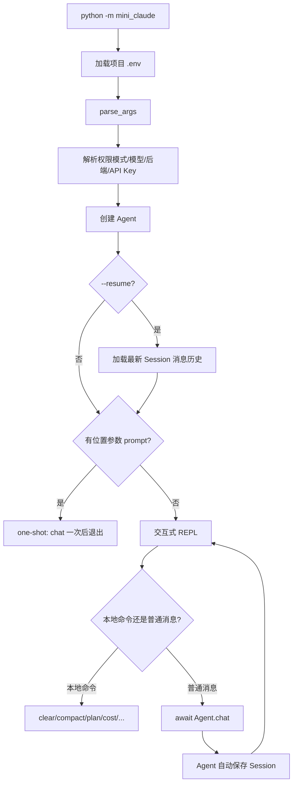

# 04 CLI 与会话

## 第一部分：总结介绍

### 1. CLI 在 Agent 架构中的职责

前面的 Agent Loop、工具系统和 System Prompt 构成了 Agent 内核，但它们本身不解决用户如何启动程序、怎样连续输入、如何中断、选择哪个模型、恢复哪段对话等产品问题。CLI 是最外层应用接口，负责把命令行参数和终端事件转换成 Agent 可以理解的配置和方法调用。

Python 入口位于 `python/mini_claude/__main__.py`，Session 持久化位于 `python/mini_claude/session.py`。整体调用链如下：



CLI 与 Agent 的边界很清楚：CLI 负责输入输出控制、参数和生命周期；Agent 负责模型调用、工具循环、上下文和会话数据。`/clear`、`/compact` 这类命令不会发给模型，而是由 CLI 拦截后直接调用 Agent 方法。

### 2. 同步入口为什么可以调用异步 Agent

`main()` 位于 `python/mini_claude/__main__.py:342`，它是普通同步函数，因为 Python 模块入口不能直接在顶层使用 `await`。真正的聊天和 REPL 是异步函数，因此 `main()` 使用 `asyncio.run()` 创建事件循环：

```python
if prompt:
    asyncio.run(_one_shot())
else:
    asyncio.run(run_repl(agent))
```

可以把执行过程理解为：

```text
同步 main
  -> 创建 asyncio event loop
  -> 执行 run_repl coroutine
  -> run_repl 遇到 await agent.chat()
  -> event loop 驱动网络流、MCP、工具任务
  -> REPL 退出
  -> 关闭 MCP 与 event loop
  -> main 返回
```

`async def` 调用后不会立即像普通函数一样执行到底，而是产生 coroutine 对象。`await` 表示暂停当前协程，直到等待对象完成。暂停期间事件循环可以调度其他 task，例如模型流式响应、多个并发只读工具或 MCP 子进程通信。

当前 REPL 使用同步 `input()`：

```python
line = input()
```

`input()` 会阻塞当前线程和事件循环。不过主 REPL 在等待用户输入时通常没有需要继续运行的聊天 task，因此对于简单单用户 CLI 可以接受。确认函数同样使用同步 `input()`。若系统需要在等待用户输入时继续处理后台任务、定时器或多个连接，可以改为 `await asyncio.to_thread(input)`，或者使用支持异步终端输入的库。

### 3. 参数解析如何工作

`parse_args()` 位于 `__main__.py:21`，使用标准库 `argparse`。位置参数定义为：

```python
parser.add_argument("prompt", nargs="*")
```

`nargs="*"` 表示接收零个或多个词。最终通过：

```python
prompt = " ".join(args.prompt) if args.prompt else None
```

还原成一条 one-shot Prompt。因此下面两种写法都会形成一条消息：

```bash
mini-claude "fix the parser bug"
mini-claude fix the parser bug
```

但推荐给包含 shell 特殊字符的 Prompt 加引号，避免通配符、重定向符和变量先被 shell 解释。

主要选项分为五类：

| 类别 | 参数 | 作用 |
| --- | --- | --- |
| 权限 | `--yolo`、`--plan`、`--accept-edits`、`--dont-ask`、`--auto` | 决定工具执行策略 |
| 模型 | `--model`、`--thinking` | 选择模型与思考模式 |
| 后端 | `--api-base` | 选择 OpenAI-compatible 接口 |
| 会话 | `--resume` | 恢复最近消息历史 |
| 预算 | `--max-cost`、`--max-turns` | 控制 Agent Loop 成本和轮数 |

### 4. 权限模式如何从 CLI 进入 Agent

`_resolve_permission_mode()` 位于 `__main__.py:43`：

```python
if args.yolo:
    return "bypassPermissions"
if args.plan:
    return "plan"
...
return "default"
```

解析结果在创建 Agent 时传入：

```python
agent = Agent(permission_mode=permission_mode, ...)
```

这里按固定顺序判断，意味着如果用户同时传入多个互斥权限参数，排在判断前面的模式获胜，例如 `--yolo --plan` 最终是 `bypassPermissions`。`argparse` 本可以使用 mutually exclusive group 在参数层直接拒绝冲突，但当前实现没有这样做。这是一个可以在面试中指出的改进点：显式报错通常比隐式优先级更容易理解。

权限参数只是选择模式，真正 allow、deny、confirm 仍发生在 Agent 处理工具调用时。CLI 不能仅凭启动参数直接执行工具。

### 5. `.env` 如何加载以及为什么不用命令行传 API Key

`_find_project_env()` 从 cwd 向父目录寻找最近的 `.env`。`_load_project_env()` 逐行解析键值，并通过：

```python
os.environ.setdefault(key, value)
```

写入环境变量。`setdefault` 的意义是：操作系统或 shell 已经显式设置的环境变量优先，不会被项目 `.env` 覆盖。这符合常见配置优先级：运行时显式配置高于文件默认值。

解析器支持空行、注释、`export KEY=value` 和简单的单引号、双引号，但不是完整 dotenv 语法。例如它不处理变量插值、多行值和复杂转义。这是“够用的轻量实现”，不是通用 dotenv 解析器。

API Key 只从环境变量读取，不提供 `--api-key`，可以减少密钥出现在 shell history、进程参数列表或终端录屏中的风险。但 `.env` 本身仍需加入 `.gitignore` 并设置合理文件权限。

### 6. 双后端选择规则

`main()` 中根据参数和环境变量决定 Anthropic 或 OpenAI-compatible：

```python
if OPENAI_API_KEY and OPENAI_BASE_URL:
    use_openai = True
elif ANTHROPIC_API_KEY:
    use_openai = False
elif OPENAI_API_KEY:
    use_openai = True
```

显式传入 `--api-base` 也会倾向 OpenAI-compatible。创建 Agent 时：

```python
agent = Agent(
    api_base=resolved_api_base if resolved_use_openai else None,
    anthropic_base_url=resolved_api_base if not resolved_use_openai else None,
    api_key=resolved_api_key,
)
```

`Agent.__init__()` 再通过 `bool(api_base)` 设置 `self.use_openai`。这说明“使用哪个后端”并不是根据模型名判断，而是根据配置路径判断。一个名称像 Claude 的模型也可能通过 OpenAI-compatible 网关调用；一个自定义 Anthropic base URL 则仍使用 Anthropic 消息协议。

配置优先级需要特别注意：当 `OPENAI_API_KEY` 和 `OPENAI_BASE_URL` 同时存在时，它们优先于 `ANTHROPIC_API_KEY`。如果用户同时配置两套密钥，程序可能选择 OpenAI-compatible，而不是用户直觉中的 Anthropic。因此成熟实现最好提供显式 `--provider`，并在冲突时打印最终选择。

### 7. One-shot 模式

只要命令行包含位置 Prompt，就进入 one-shot：

```python
async def _one_shot() -> None:
    try:
        await agent.chat(prompt)
    finally:
        await agent.close()
```

`finally` 很关键。第一次聊天可能懒加载 MCP server，MCP 通常对应子进程或网络连接。即使模型调用、工具执行或权限流程抛异常，`agent.close()` 也应运行，避免资源泄漏和残留子进程。

One-shot 适合脚本、CI 和自动化任务。`--dont-ask` 在这类无交互环境尤其重要：任何需要人工确认的动作都应自动拒绝，而不是永久等待 stdin。

### 8. REPL 模式

没有位置 Prompt 时，`run_repl()` 启动交互循环：

```python
while True:
    print_user_prompt()
    line = input()
    inp = line.strip()
    ...
    await agent.chat(inp)
```

输入被分成三类：

1. 空输入：忽略并继续。
2. `exit`、`quit` 或 EOF：退出循环并关闭资源。
3. 以 `/` 开头的本地命令：CLI 自己处理。
4. 其他普通文本：交给 `Agent.chat()`。

本地命令是应用层控制协议，而不是 LLM Prompt。例如 `/clear` 调用 `agent.clear_history()`，`/cost` 调用 `agent.show_cost()`，`/compact` 则 `await agent.compact()`。这样做比把命令交给模型更确定、更节省 token，也不会因为模型误解而改变行为。

当前完整版还包含 `/goal`、`/loop`、`/memory`、`/kb`、`/skills` 和 `/<skill-name>`。这说明 CLI 不只是聊天输入框，而是多个 Agent 子系统的统一控制面。

### 9. CLI 如何把用户确认能力注入 Agent

Agent 不应直接依赖某一种 UI。CLI 定义：

```python
async def confirm_fn(message: str) -> bool:
    answer = input("  Allow? (y/n): ")
    return answer.lower().startswith("y")

agent.set_confirm_fn(confirm_fn)
```

Agent 在权限结果为 confirm 时调用这个 callback。这样权限逻辑不需要知道确认来自终端、GUI、Web 页面还是测试 mock。这是一种依赖反转：Agent 依赖抽象的异步确认函数，具体交互由 CLI 注入。

Plan 审批同样通过 `plan_approval_fn` 注入，返回结构化结果，如 `execute`、`keep-planning` 或 `manual-execute`。结构化返回比简单布尔值能表达更完整的状态转换。

### 10. Ctrl+C 中断链路

`run_repl()` 注册 `SIGINT` handler：

```python
signal.signal(signal.SIGINT, handle_sigint)
```

当 Agent 正在处理任务时：

```python
agent.abort()
```

`Agent.abort()` 执行：

```python
self._aborted = True
if self._current_task and not self._current_task.done():
    self._current_task.cancel()
```

`Agent.chat()` 在进入后端循环前保存当前 task：

```python
self._current_task = asyncio.current_task()
try:
    await coro
except asyncio.CancelledError:
    self._aborted = True
finally:
    self._current_task = None
```

因此中断过程是：操作系统发出 SIGINT，CLI signal handler 调用 Agent.abort，当前 asyncio task 被取消，等待中的网络流或异步工具收到 cancellation，`chat()` 捕获 `CancelledError` 并清理状态。

`_aborted` 和 task cancellation 作用不同：task cancellation 立即打断当前 await；`_aborted` 让循环和工具处理代码在安全位置主动停止。两者结合比只设置一个布尔值响应更快，也比只取消 task 更容易让后续逻辑知道当前轮已中止。

未处理任务时，第一次 Ctrl+C 只提示再次按下退出，第二次退出。`/loop` 和 `/goal` 还有独立 stop 标记，因为它们可能处于轮次间等待，此时 `Agent.is_processing` 不一定为真。

### 11. Session 文件结构

Session 目录定义在 `python/mini_claude/session.py:9`：

```python
SESSION_DIR = Path.home() / ".mini-claude" / "sessions"
```

每个会话保存为 `<session_id>.json`。`Agent._auto_save()` 写入：

```python
{
    "metadata": {
        "id": self.session_id,
        "model": self.model,
        "cwd": str(Path.cwd()),
        "startTime": self.session_start_time,
        "messageCount": self._get_message_count(),
    },
    "anthropicMessages": self._anthropic_messages if not self.use_openai else None,
    "openaiMessages": self._openai_messages if self.use_openai else None,
}
```

消息历史必须保存协议结构，而不仅是终端显示文本。历史中可能包含：

- user 文本
- assistant 文本
- Anthropic `tool_use`
- Anthropic `tool_result`
- OpenAI assistant `tool_calls`
- OpenAI `role: tool` 结果
- OpenAI system 消息

如果只保存可见文本，恢复后模型会失去工具调用 ID 和结果配对关系，无法继续一个合法的工具对话上下文。

### 12. 为什么 Anthropic 和 OpenAI 分别保存消息

两个后端的协议结构不同。Anthropic system 在请求字段中，工具调用是 content block；OpenAI system 在消息数组中，工具调用位于 assistant message 的 `tool_calls`，结果是独立 `role: tool` 消息。

项目因此使用：

```python
self._anthropic_messages = []
self._openai_messages = []
```

这种设计避免每轮在统一内部格式和供应商格式之间反复转换，代码更直接；代价是 Session 无法自然跨后端恢复，同一套循环逻辑也有重复。

更成熟的架构可以定义供应商无关的内部事件模型，再由 adapter 负责序列化。但需要完整表达 text、thinking、tool call、tool result、usage 和缓存信息，否则所谓“统一格式”会造成语义丢失。

### 13. 自动保存发生在什么时候

`Agent.chat()` 的后端循环结束后执行：

```python
if not self.is_sub_agent:
    print_divider()
    self._auto_save()
```

所以主 Agent 每完成一轮用户聊天就保存，子 Agent 不单独保存。这样可以避免子 Agent 的内部上下文污染主 Session。

但当前 `_auto_save()` 捕获所有异常并静默忽略。这保证保存失败不会让聊天崩溃，却可能让用户误以为会话已经持久化。生产级实现应至少记录警告，并考虑临时文件加原子重命名，避免进程中断时写出半个 JSON 文件。

### 14. `--resume` 的恢复流程

`get_latest_session_id()` 读取所有 Session metadata，按 `startTime` 倒序选择最新 ID。`main()` 再调用：

```python
session = load_session(session_id)
agent.restore_session({
    "anthropicMessages": session.get("anthropicMessages"),
    "openaiMessages": session.get("openaiMessages"),
})
```

`restore_session()` 只恢复两种消息数组。它不会恢复：

- 原来的 `session_id`
- token 与费用统计
- 原来的 permission mode
- 最大成本与最大轮数
- 已确认路径
- deferred 工具激活状态
- MCP 连接状态
- goal、loop 或 plan 的运行时状态
- Memory prefetch task

因此这里的 resume 更准确地说是“恢复对话上下文”，不是“恢复进程快照”。新 Agent 会使用当前命令行配置、当前 System Prompt 和新的 session ID 继续处理，从语义上更像从旧对话创建一个新分支。

### 15. Session 当前实现的边界

第一，`get_latest_session_id()` 根据会话开始时间，而不是最后修改时间选择。长时间运行的旧会话刚刚更新后，仍可能排在新启动但内容较少的会话之后。

第二，metadata 保存 cwd，但恢复时没有按当前 cwd 过滤。用户在项目 B 执行 `--resume`，可能恢复项目 A 的最近会话，将不相关路径和上下文带入当前项目。

第三，当前后端和被恢复 Session 的后端可能不同。若以 OpenAI 模式启动却恢复了只有 `anthropicMessages` 的 Session，数据虽然被赋值，但当前循环读取 `_openai_messages`，实际无法延续旧对话。

第四，Session 文件是明文 JSON，可能包含源码片段、工具输出、命令结果和用户敏感信息。目录权限、数据保留和清理策略在真实产品中非常重要。

第五，普通 `write_text()` 不是原子写入。如果进程在写入中途崩溃，文件可能损坏。可以先写同目录临时文件，`fsync` 后再 `replace()`。

### 16. `/clear` 与删除 Session 的区别

`agent.clear_history()` 清空内存里的消息历史和 token 统计，并为 OpenAI 后端重新放入 system 消息。它不会删除磁盘中之前保存的 Session 文件。

下一次正常聊天完成后，当前新 Session 会保存清空后的新上下文。旧会话文件仍在 `~/.mini-claude/sessions/`。因此 `/clear` 的语义是“从当前上下文重新开始”，不是“永久删除历史记录”。

### 17. Session 与上下文压缩的关系

Session 负责跨进程持久化，compact 负责控制单次模型上下文大小，两者不是同一件事。长会话接近模型窗口时，Agent 会把旧消息总结为较短的对话摘要，再保留当前用户消息继续执行。之后自动保存的 Session 也是已经压缩后的消息数组。

压缩时不能拆断工具协议。例如 Anthropic assistant 的 `tool_use` 后必须跟对应的 user `tool_result`；OpenAI assistant 的 `tool_calls` 后必须有对应 `role: tool`。项目只在新用户轮次边界检查自动压缩，确保最后一条是普通 user 文本，再对前面的完整历史做总结。

### 18. 面试话术版本

这个项目的 CLI 是 Agent 的应用层入口。同步 `main()` 负责加载 `.env`、解析参数、选择权限模式和模型后端，再通过 `asyncio.run()` 启动异步 one-shot 或 REPL。REPL 会区分本地控制命令和普通模型消息，并通过 callback 向 Agent 注入终端确认与计划审批能力；Ctrl+C 则通过 signal handler 取消当前 asyncio task。Session 以 JSON 保存供应商原生消息历史，而不是只保存可见文本，因为工具调用和工具结果必须保留 ID 配对。`--resume` 当前只恢复对话消息，不恢复权限、费用、MCP、工具激活等运行时状态，因此更像从旧上下文创建新会话。Anthropic 和 OpenAI 消息协议不同，项目维护两套历史，换来实现直接，但也带来跨后端恢复和代码重复的问题。

## 第二部分：面试问答与追问补充

### Q1：CLI 层和 Agent 层如何分工？

CLI 负责参数、终端输入、本地命令、确认交互、信号和进程生命周期；Agent 负责 Prompt、模型请求、工具循环、权限执行和消息历史。CLI 不直接实现 Agent Loop。

### Q2：为什么 `main()` 是同步函数，`run_repl()` 是异步函数？

Python 模块入口从同步代码开始，而模型请求、MCP 和工具执行需要异步 IO。`main()` 用 `asyncio.run()` 创建事件循环并运行异步 REPL。

### Q3：`asyncio.run()` 做了什么？

它创建事件循环，运行指定 coroutine 直到结束，完成异步生成器清理后关闭循环。通常一个进程入口只调用一次，不应在已有事件循环内部再次调用。

### Q4：`await agent.chat()` 会阻塞整个程序吗？

它会暂停当前 REPL 协程等待本轮完成，但事件循环仍可调度模型网络流、并发工具和其他 task。同步 `input()` 才会阻塞当前事件循环线程。

### Q5：异步 REPL 中使用 `input()` 有什么问题？

`input()` 是阻塞调用。简单单用户 CLI 在等待输入时通常没有并发工作，所以影响有限；如果要支持后台定时任务或持续事件，应改为线程包装或异步终端库。

### Q6：本地 `/clear` 命令为什么不发送给模型？

它是确定性的应用控制操作。由 CLI 直接调用方法更可靠、更省 token，也不会依赖模型是否正确理解命令。

### Q7：为什么确认函数通过 callback 注入 Agent？

这样 Agent 不依赖终端 UI。CLI、GUI、Web 服务和测试都可以提供自己的异步确认实现，权限核心只依赖函数接口。

### Q8：多个 permission 参数同时出现会怎样？

当前代码按 `_resolve_permission_mode()` 的判断顺序选择第一个匹配模式，不会报冲突。更好的实现是使用 argparse mutually exclusive group 明确拒绝冲突参数。

### Q9：为什么 API Key 不通过命令行参数传入？

命令行参数可能出现在 shell history、进程列表和日志中。环境变量或受保护的凭据存储泄露面更小，但 `.env` 仍必须避免提交到 Git。

### Q10：为什么 `.env` 使用 `os.environ.setdefault()`？

它保留外部已经设置的环境变量，让 shell、CI 或容器注入的显式配置优先于项目文件默认值。

### Q11：项目的 dotenv 解析器是完整实现吗？

不是。它支持常见的单行键值、注释和简单引号，但不支持完整变量展开、多行字符串和复杂转义。复杂项目应使用成熟 dotenv 库。

### Q12：后端是根据模型名选择的吗？

不是。主要根据 `api_base` 和 API 环境变量选择协议。模型名只是发给已选后端的参数。

### Q13：One-shot 和 REPL 的主要区别是什么？

One-shot 执行一条 Prompt 后关闭资源并退出，适合脚本和 CI；REPL 持续读取用户输入，支持本地命令和多轮对话。

### Q14：为什么 one-shot 使用 `finally: await agent.close()`？

保证无论聊天成功、异常还是取消，MCP 连接和子进程都能释放，避免资源泄漏。

### Q15：Ctrl+C 是如何中断模型请求的？

SIGINT handler 调用 `Agent.abort()`，它设置 `_aborted` 并取消 `_current_task`。取消沿 await 链传播为 `CancelledError`，`chat()` 捕获后清理当前 task。

### Q16：为什么同时需要 `_aborted` 和 task.cancel()？

cancel 提供快速中断；布尔标记让 Agent Loop 和工具处理在后续检查点知道当前轮已被终止，避免继续启动新工具。

### Q17：Session 为什么保存 JSON，而不是数据库？

这是单机教学项目，JSON 实现简单、透明、容易调试。并发写入、索引、迁移、加密和大规模历史查询需求出现后，才有必要换数据库。

### Q18：Session 为什么不能只保存聊天文本？

工具调用包含结构化参数和调用 ID，工具结果必须和它配对。只保存文本会丢失协议状态，恢复后的消息可能被 API 拒绝或让模型误解执行过程。

### Q19：`--resume` 恢复了哪些内容？

只恢复 Anthropic 或 OpenAI 消息历史。它不恢复费用、权限、MCP、goal、loop、工具激活和其他运行时状态。

### Q20：恢复 Session 后为什么可能产生新 session ID？

Agent 在加载旧历史前已经初始化了新的 ID，restore 没有覆盖它。后续自动保存写入新文件，相当于从旧上下文分叉出一个新会话。

### Q21：`get_latest_session_id()` 当前有什么问题？

它按 startTime 而非最近更新时间选择，也不按 cwd 或后端过滤，因此可能恢复错误项目或不兼容后端的会话。

### Q22：为什么两个后端维护两套消息数组？

两者的 system、工具调用和工具结果协议不同。分别保存可以减少转换错误，但增加循环代码重复，也限制跨后端恢复。

### Q23：怎样实现跨后端恢复？

可定义供应商无关的内部消息事件模型，再写 Anthropic 和 OpenAI adapter。但内部模型必须完整保留 tool call ID、thinking、usage、缓存元数据等语义。

### Q24：Session 自动保存失败会怎样？

当前 `_auto_save()` 静默忽略异常，聊天仍可继续，但历史可能未落盘。生产实现应告警，并采用临时文件加原子替换。

### Q25：为什么 Session 写入要考虑原子性？

直接覆盖 JSON 时如果进程崩溃，可能留下不完整文件。先写临时文件并原子 rename，可以保证磁盘上要么是旧版本，要么是完整新版本。

### Q26：Session 有哪些隐私风险？

消息可能包含源码、命令输出、文件内容、用户输入和外部数据。应限制文件权限，提供清理和保留策略，必要时加密。

### Q27：`/clear` 会删除磁盘历史吗？

不会。它清空当前 Agent 内存历史和统计。磁盘上的旧 Session 仍存在，除非另外实现删除命令。

### Q28：Session 和 Memory 有什么区别？

Session 保存一段具体对话的原始协议历史；Memory 保存提炼后的长期事实或偏好，可以跨多个 Session 使用。Session 体积大且顺序敏感，Memory 更精炼、可检索。

### Q29：Session 和 compact 有什么区别？

Session 解决进程重启后的持久化；compact 解决单次上下文窗口不足。压缩后的历史也会被 Session 保存。

### Q30：为什么压缩必须在用户轮次边界做？

此时最后一条是普通 user 消息，前面的工具调用和结果已经成对完成。若在工具执行中间裁剪，可能留下孤立的 tool_use 或 tool_result，导致协议无效。

### Q31：如何测试 CLI？

可以测试参数解析、冲突权限、环境变量优先级、one-shot 资源关闭、REPL 命令分发、确认 callback、SIGINT 取消，以及无 API Key 时的退出码和错误信息。

### Q32：如何测试 Session？

使用临时目录替换 SESSION_DIR，测试保存加载往返、损坏 JSON、列表排序、恢复两种后端消息、自动保存失败以及工具调用与结果配对完整性。

### Q33：面试时如何一句话总结这一章？

CLI 把参数、终端事件和生命周期转换成 Agent 配置与异步调用；Session 则持久化完整协议消息以恢复上下文，但当前 resume 不是进程快照，只是对话历史恢复。
