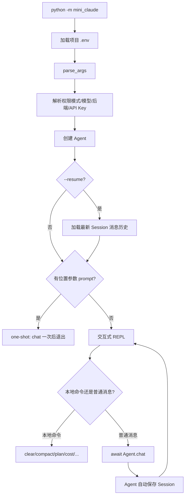

# 04 CLI 与会话

## 第一部分：总结介绍

### 1. CLI 在 Agent 架构中的职责

前面的 Agent Loop、工具系统和 System Prompt 构成了 Agent 内核，但它们本身不解决用户如何启动程序、怎样连续输入、如何中断、选择哪个模型、恢复哪段对话等产品问题。CLI 是最外层应用接口，负责把命令行参数和终端事件转换成 Agent 可以理解的配置和方法调用。

Python 入口位于 `python/mini_claude/__main__.py`，Session 持久化位于 `python/mini_claude/session.py`。整体调用链如下：



CLI 与 Agent 的边界很清楚：CLI 负责输入输出控制、参数和生命周期；Agent 负责模型调用、工具循环、上下文和会话数据。`/clear`、`/compact` 这类命令不会发给模型，而是由 CLI 拦截后直接调用 Agent 方法。

### 2. 同步入口为什么可以调用异步 Agent

`main()` 位于 `python/mini_claude/__main__.py:342`，它是普通同步函数，因为 Python 模块入口不能直接在顶层使用 `await`。真正的聊天和 REPL 是异步函数，因此 `main()` 使用 `asyncio.run()` 创建事件循环：

```python
if prompt:
    asyncio.run(_one_shot())
else:
    asyncio.run(run_repl(agent))
```

可以把执行过程理解为：

```text
同步 main
  -> 创建 asyncio event loop
  -> 执行 run_repl coroutine
  -> run_repl 遇到 await agent.chat()
  -> event loop 驱动网络流、MCP、工具任务
  -> REPL 退出
  -> 关闭 MCP 与 event loop
  -> main 返回
```

`async def` 调用后不会立即像普通函数一样执行到底，而是产生 coroutine 对象。`await` 表示暂停当前协程，直到等待对象完成。暂停期间事件循环可以调度其他 task，例如模型流式响应、多个并发只读工具或 MCP 子进程通信。

当前 REPL 使用同步 `input()`：

```python
line = input()
```

`input()` 会阻塞当前线程和事件循环。不过主 REPL 在等待用户输入时通常没有需要继续运行的聊天 task，因此对于简单单用户 CLI 可以接受。确认函数同样使用同步 `input()`。若系统需要在等待用户输入时继续处理后台任务、定时器或多个连接，可以改为 `await asyncio.to_thread(input)`，或者使用支持异步终端输入的库。

### 3. 参数解析如何工作

`parse_args()` 位于 `__main__.py:21`，使用标准库 `argparse`。位置参数定义为：

```python
parser.add_argument("prompt", nargs="*")
```

`nargs="*"` 表示接收零个或多个词。最终通过：

```python
prompt = " ".join(args.prompt) if args.prompt else None
```

还原成一条 one-shot Prompt。因此下面两种写法都会形成一条消息：

```bash
mini-claude "fix the parser bug"
mini-claude fix the parser bug
```

但推荐给包含 shell 特殊字符的 Prompt 加引号，避免通配符、重定向符和变量先被 shell 解释。

主要选项分为五类：

| 类别 | 参数 | 作用 |
| --- | --- | --- |
| 权限 | `--yolo`、`--plan`、`--accept-edits`、`--dont-ask`、`--auto` | 决定工具执行策略 |
| 模型 | `--model`、`--thinking` | 选择模型与思考模式 |
| 后端 | `--api-base` | 选择 OpenAI-compatible 接口 |
| 会话 | `--resume` | 恢复最近消息历史 |
| 预算 | `--max-cost`、`--max-turns` | 控制 Agent Loop 成本和轮数 |

### 4. 权限模式如何从 CLI 进入 Agent

`_resolve_permission_mode()` 位于 `__main__.py:43`：

```python
if args.yolo:
    return "bypassPermissions"
if args.plan:
    return "plan"
...
return "default"
```

解析结果在创建 Agent 时传入：

```python
agent = Agent(permission_mode=permission_mode, ...)
```

这里按固定顺序判断，意味着如果用户同时传入多个互斥权限参数，排在判断前面的模式获胜，例如 `--yolo --plan` 最终是 `bypassPermissions`。`argparse` 本可以使用 mutually exclusive group 在参数层直接拒绝冲突，但当前实现没有这样做。这是一个可以在面试中指出的改进点：显式报错通常比隐式优先级更容易理解。

权限参数只是选择模式，真正 allow、deny、confirm 仍发生在 Agent 处理工具调用时。CLI 不能仅凭启动参数直接执行工具。

### 5. `.env` 如何加载以及为什么不用命令行传 API Key

`_find_project_env()` 从 cwd 向父目录寻找最近的 `.env`。`_load_project_env()` 逐行解析键值，并通过：

```python
os.environ.setdefault(key, value)
```

写入环境变量。`setdefault` 的意义是：操作系统或 shell 已经显式设置的环境变量优先，不会被项目 `.env` 覆盖。这符合常见配置优先级：运行时显式配置高于文件默认值。

解析器支持空行、注释、`export KEY=value` 和简单的单引号、双引号，但不是完整 dotenv 语法。例如它不处理变量插值、多行值和复杂转义。这是“够用的轻量实现”，不是通用 dotenv 解析器。

API Key 只从环境变量读取，不提供 `--api-key`，可以减少密钥出现在 shell history、进程参数列表或终端录屏中的风险。但 `.env` 本身仍需加入 `.gitignore` 并设置合理文件权限。

### 6. 双后端选择规则

`main()` 中根据参数和环境变量决定 Anthropic 或 OpenAI-compatible：

```python
if OPENAI_API_KEY and OPENAI_BASE_URL:
    use_openai = True
elif ANTHROPIC_API_KEY:
    use_openai = False
elif OPENAI_API_KEY:
    use_openai = True
```

显式传入 `--api-base` 也会倾向 OpenAI-compatible。创建 Agent 时：

```python
agent = Agent(
    api_base=resolved_api_base if resolved_use_openai else None,
    anthropic_base_url=resolved_api_base if not resolved_use_openai else None,
    api_key=resolved_api_key,
)
```

`Agent.__init__()` 再通过 `bool(api_base)` 设置 `self.use_openai`。这说明“使用哪个后端”并不是根据模型名判断，而是根据配置路径判断。一个名称像 Claude 的模型也可能通过 OpenAI-compatible 网关调用；一个自定义 Anthropic base URL 则仍使用 Anthropic 消息协议。

配置优先级需要特别注意：当 `OPENAI_API_KEY` 和 `OPENAI_BASE_URL` 同时存在时，它们优先于 `ANTHROPIC_API_KEY`。如果用户同时配置两套密钥，程序可能选择 OpenAI-compatible，而不是用户直觉中的 Anthropic。因此成熟实现最好提供显式 `--provider`，并在冲突时打印最终选择。

### 7. One-shot 模式

只要命令行包含位置 Prompt，就进入 one-shot：

```python
async def _one_shot() -> None:
    try:
        await agent.chat(prompt)
    finally:
        await agent.close()
```

`finally` 很关键。第一次聊天可能懒加载 MCP server，MCP 通常对应子进程或网络连接。即使模型调用、工具执行或权限流程抛异常，`agent.close()` 也应运行，避免资源泄漏和残留子进程。

One-shot 适合脚本、CI 和自动化任务。`--dont-ask` 在这类无交互环境尤其重要：任何需要人工确认的动作都应自动拒绝，而不是永久等待 stdin。

### 8. REPL 模式

没有位置 Prompt 时，`run_repl()` 启动交互循环：

```python
while True:
    print_user_prompt()
    line = input()
    inp = line.strip()
    ...
    await agent.chat(inp)
```

输入被分成三类：

1. 空输入：忽略并继续。
2. `exit`、`quit` 或 EOF：退出循环并关闭资源。
3. 以 `/` 开头的本地命令：CLI 自己处理。
4. 其他普通文本：交给 `Agent.chat()`。

本地命令是应用层控制协议，而不是 LLM Prompt。例如 `/clear` 调用 `agent.clear_history()`，`/cost` 调用 `agent.show_cost()`，`/compact` 则 `await agent.compact()`。这样做比把命令交给模型更确定、更节省 token，也不会因为模型误解而改变行为。

当前完整版还包含 `/goal`、`/loop`、`/memory`、`/kb`、`/skills` 和 `/<skill-name>`。这说明 CLI 不只是聊天输入框，而是多个 Agent 子系统的统一控制面。

### 9. CLI 如何把用户确认能力注入 Agent

Agent 不应直接依赖某一种 UI。CLI 定义：

```python
async def confirm_fn(message: str) -> bool:
    answer = input("  Allow? (y/n): ")
    return answer.lower().startswith("y")

agent.set_confirm_fn(confirm_fn)
```

Agent 在权限结果为 confirm 时调用这个 callback。这样权限逻辑不需要知道确认来自终端、GUI、Web 页面还是测试 mock。这是一种依赖反转：Agent 依赖抽象的异步确认函数，具体交互由 CLI 注入。

Plan 审批同样通过 `plan_approval_fn` 注入，返回结构化结果，如 `execute`、`keep-planning` 或 `manual-execute`。结构化返回比简单布尔值能表达更完整的状态转换。

### 10. Ctrl+C 中断链路

`run_repl()` 注册 `SIGINT` handler：

```python
signal.signal(signal.SIGINT, handle_sigint)
```

当 Agent 正在处理任务时：

```python
agent.abort()
```

`Agent.abort()` 执行：

```python
self._aborted = True
if self._current_task and not self._current_task.done():
    self._current_task.cancel()
```

`Agent.chat()` 在进入后端循环前保存当前 task：

```python
self._current_task = asyncio.current_task()
try:
    await coro
except asyncio.CancelledError:
    self._aborted = True
finally:
    self._current_task = None
```

因此中断过程是：操作系统发出 SIGINT，CLI signal handler 调用 Agent.abort，当前 asyncio task 被取消，等待中的网络流或异步工具收到 cancellation，`chat()` 捕获 `CancelledError` 并清理状态。

`_aborted` 和 task cancellation 作用不同：task cancellation 立即打断当前 await；`_aborted` 让循环和工具处理代码在安全位置主动停止。两者结合比只设置一个布尔值响应更快，也比只取消 task 更容易让后续逻辑知道当前轮已中止。

未处理任务时，第一次 Ctrl+C 只提示再次按下退出，第二次退出。`/loop` 和 `/goal` 还有独立 stop 标记，因为它们可能处于轮次间等待，此时 `Agent.is_processing` 不一定为真。

### 11. Session 文件结构

Session 目录定义在 `python/mini_claude/session.py:9`：

```python
SESSION_DIR = Path.home() / ".mini-claude" / "sessions"
```

每个会话保存为 `<session_id>.json`。`Agent._auto_save()` 写入：

```python
{
    "metadata": {
        "id": self.session_id,
        "model": self.model,
        "cwd": str(Path.cwd()),
        "startTime": self.session_start_time,
        "messageCount": self._get_message_count(),
    },
    "anthropicMessages": self._anthropic_messages if not self.use_openai else None,
    "openaiMessages": self._openai_messages if self.use_openai else None,
}
```

消息历史必须保存协议结构，而不仅是终端显示文本。历史中可能包含：

- user 文本
- assistant 文本
- Anthropic `tool_use`
- Anthropic `tool_result`
- OpenAI assistant `tool_calls`
- OpenAI `role: tool` 结果
- OpenAI system 消息

如果只保存可见文本，恢复后模型会失去工具调用 ID 和结果配对关系，无法继续一个合法的工具对话上下文。

### 12. 为什么 Anthropic 和 OpenAI 分别保存消息

两个后端的协议结构不同。Anthropic system 在请求字段中，工具调用是 content block；OpenAI system 在消息数组中，工具调用位于 assistant message 的 `tool_calls`，结果是独立 `role: tool` 消息。

项目因此使用：

```python
self._anthropic_messages = []
self._openai_messages = []
```

这种设计避免每轮在统一内部格式和供应商格式之间反复转换，代码更直接；代价是 Session 无法自然跨后端恢复，同一套循环逻辑也有重复。

更成熟的架构可以定义供应商无关的内部事件模型，再由 adapter 负责序列化。但需要完整表达 text、thinking、tool call、tool result、usage 和缓存信息，否则所谓“统一格式”会造成语义丢失。

### 13. 自动保存发生在什么时候

`Agent.chat()` 的后端循环结束后执行：

```python
if not self.is_sub_agent:
    print_divider()
    self._auto_save()
```

所以主 Agent 每完成一轮用户聊天就保存，子 Agent 不单独保存。这样可以避免子 Agent 的内部上下文污染主 Session。

但当前 `_auto_save()` 捕获所有异常并静默忽略。这保证保存失败不会让聊天崩溃，却可能让用户误以为会话已经持久化。生产级实现应至少记录警告，并考虑临时文件加原子重命名，避免进程中断时写出半个 JSON 文件。

### 14. `--resume` 的恢复流程

`get_latest_session_id()` 读取所有 Session metadata，按 `startTime` 倒序选择最新 ID。`main()` 再调用：

```python
session = load_session(session_id)
agent.restore_session({
    "anthropicMessages": session.get("anthropicMessages"),
    "openaiMessages": session.get("openaiMessages"),
})
```

`restore_session()` 只恢复两种消息数组。它不会恢复：

- 原来的 `session_id`
- token 与费用统计
- 原来的 permission mode
- 最大成本与最大轮数
- 已确认路径
- deferred 工具激活状态
- MCP 连接状态
- goal、loop 或 plan 的运行时状态
- Memory prefetch task

因此这里的 resume 更准确地说是“恢复对话上下文”，不是“恢复进程快照”。新 Agent 会使用当前命令行配置、当前 System Prompt 和新的 session ID 继续处理，从语义上更像从旧对话创建一个新分支。

### 15. Session 当前实现的边界

第一，`get_latest_session_id()` 根据会话开始时间，而不是最后修改时间选择。长时间运行的旧会话刚刚更新后，仍可能排在新启动但内容较少的会话之后。

第二，metadata 保存 cwd，但恢复时没有按当前 cwd 过滤。用户在项目 B 执行 `--resume`，可能恢复项目 A 的最近会话，将不相关路径和上下文带入当前项目。

第三，当前后端和被恢复 Session 的后端可能不同。若以 OpenAI 模式启动却恢复了只有 `anthropicMessages` 的 Session，数据虽然被赋值，但当前循环读取 `_openai_messages`，实际无法延续旧对话。

第四，Session 文件是明文 JSON，可能包含源码片段、工具输出、命令结果和用户敏感信息。目录权限、数据保留和清理策略在真实产品中非常重要。

第五，普通 `write_text()` 不是原子写入。如果进程在写入中途崩溃，文件可能损坏。可以先写同目录临时文件，`fsync` 后再 `replace()`。

### 16. `/clear` 与删除 Session 的区别

`agent.clear_history()` 清空内存里的消息历史和 token 统计，并为 OpenAI 后端重新放入 system 消息。它不会删除磁盘中之前保存的 Session 文件。

下一次正常聊天完成后，当前新 Session 会保存清空后的新上下文。旧会话文件仍在 `~/.mini-claude/sessions/`。因此 `/clear` 的语义是“从当前上下文重新开始”，不是“永久删除历史记录”。

### 17. Session 与上下文压缩的关系

Session 负责跨进程持久化，compact 负责控制单次模型上下文大小，两者不是同一件事。长会话接近模型窗口时，Agent 会把旧消息总结为较短的对话摘要，再保留当前用户消息继续执行。之后自动保存的 Session 也是已经压缩后的消息数组。

压缩时不能拆断工具协议。例如 Anthropic assistant 的 `tool_use` 后必须跟对应的 user `tool_result`；OpenAI assistant 的 `tool_calls` 后必须有对应 `role: tool`。项目只在新用户轮次边界检查自动压缩，确保最后一条是普通 user 文本，再对前面的完整历史做总结。

### 18. 面试话术版本

这个项目的 CLI 是 Agent 的应用层入口。同步 `main()` 负责加载 `.env`、解析参数、选择权限模式和模型后端，再通过 `asyncio.run()` 启动异步 one-shot 或 REPL。REPL 会区分本地控制命令和普通模型消息，并通过 callback 向 Agent 注入终端确认与计划审批能力；Ctrl+C 则通过 signal handler 取消当前 asyncio task。Session 以 JSON 保存供应商原生消息历史，而不是只保存可见文本，因为工具调用和工具结果必须保留 ID 配对。`--resume` 当前只恢复对话消息，不恢复权限、费用、MCP、工具激活等运行时状态，因此更像从旧上下文创建新会话。Anthropic 和 OpenAI 消息协议不同，项目维护两套历史，换来实现直接，但也带来跨后端恢复和代码重复的问题。

## 第二部分：面试问答与追问补充

### Q1：面试官问：CLI 层和 Agent 层为什么要分开？

因为它们解决的问题不同。CLI 负责参数解析、终端输入、本地命令、确认交互、信号处理和进程生命周期；Agent 负责 Prompt、模型调用、工具循环、权限和上下文。

如果把这些都揉在一起，后续换 GUI、Web 或测试 harness 时会很难复用 Agent 核心。

### Q2：面试官问：为什么 `main()` 是同步的，而 REPL/聊天是异步的？

Python 进程入口天然从同步代码开始，适合做参数解析和环境准备；而真正的聊天过程包含大量 IO，例如模型请求、MCP 连接、异步工具执行，所以要交给 `asyncio.run()` 驱动。

这样可以把同步启动逻辑和异步运行逻辑分开，结构更清晰。

### Q3：面试官问：`await agent.chat()` 会不会把整个程序卡死？

不会。它会暂停当前 REPL 协程，但事件循环仍然可以调度网络 IO、并发工具和其他 task。真正会阻塞线程的是同步 `input()`。

这也是为什么“异步聊天”和“异步终端输入”是两个不同问题。

### Q4：面试官问：异步 REPL 里继续用 `input()` 合理吗？

对单用户 CLI 来说可以接受，因为等待用户输入时通常没有别的高价值并发任务要跑。但如果系统要支持后台定时任务、多个连接或持续事件流，`input()` 就会成为阻塞点。

所以这是一个实现成本和交互复杂度的折中，不是理想终态。

### Q5：面试官问：为什么像 `/clear`、`/compact`、`/memory` 这种命令不发给模型处理？

因为它们是确定性的本地控制动作，不需要模型推理。直接由 CLI 分发更可靠，也更省 token。

如果连这些命令都发给模型，本质上是在浪费上下文并增加出错面。

### Q6：面试官问：确认函数为什么用 callback 注入，而不是在 Agent 里直接写 `input()`？

这样 Agent 核心就不依赖终端。CLI、GUI、Web 审批流、自动化测试都可以提供各自的确认实现。

这是一种很标准的依赖反转：权限逻辑属于核心，交互方式属于外层适配器。

### Q7：面试官问：多个 permission 参数同时传入会怎样？这合理吗？

当前实现按 `_resolve_permission_mode()` 的顺序取第一个匹配项，不报冲突。它能工作，但不是最严谨的 CLI 设计。

更好的做法是用互斥参数组，让用户在参数层就明确选择一种模式，避免歧义。

### Q8：面试官问：为什么 API Key 不建议走命令行参数？

因为命令行参数容易出现在 shell history、进程列表和日志里。环境变量或受保护的凭据注入至少暴露面更小。

当然 `.env` 也不是绝对安全，它只是比命令行更合适的本地开发方案。

### Q9：面试官问：你们为什么自己解析 `.env`，而不是直接依赖库？

这个项目偏教学和轻量，自己实现一个有限解析器就够用了，依赖少、代码透明。

但我不会把它说成完整 dotenv 实现。复杂项目里，变量展开、多行值、转义规则和跨平台行为还是应该交给成熟库。

### Q10：面试官问：为什么用了 `os.environ.setdefault()`？

因为它让外部明确注入的环境变量优先级高于项目本地 `.env`。比如 CI、容器或 shell 已经设置了 key，不应该被项目文件静默覆盖。

这体现的是配置优先级意识，而不是单纯读文件。

### Q11：面试官问：后端是根据模型名选的吗？

不是，主要根据 API base 和客户端配置决定协议走向，模型名只是发给所选 provider 的参数。

这个点很重要，因为很多人会误以为“模型名里有 gpt 就一定走 OpenAI 协议”，实际系统里不一定成立。

### Q12：面试官问：One-shot 和 REPL 为什么都要支持？

One-shot 适合脚本化、自动化、CI 和单次任务；REPL 适合交互式多轮协作和本地命令控制。

它们共享 Agent 核心，但交互外壳不同。这样既保留自动化能力，也保留人工调试体验。

### Q13：面试官问：为什么 one-shot 里要在 `finally` 调 `agent.close()`？

因为无论任务成功、失败还是被取消，都可能有 MCP 连接、子进程或其他外部资源要释放。清理逻辑不能只放在成功路径。

这属于典型的资源生命周期兜底。

### Q14：面试官问：Ctrl+C 在这个项目里是怎么生效的？

CLI 的 signal handler 会调用 `Agent.abort()`，设置 `_aborted` 并取消当前 `_current_task`。取消会沿着 `await` 链传播到模型请求、stream 消费和工具等待。

这样既有快速打断，也有状态标记让后续逻辑知道这一轮已经终止。

### Q15：面试官问：为什么同时需要 `_aborted` 和 `task.cancel()`？

`task.cancel()` 负责立即打断当前等待点；`_aborted` 负责在后续检查点阻止新工具继续启动或继续进入下一轮。

只用其一都不够完整，一个偏即时中断，一个偏状态传播。

### Q16：面试官问：Session 为什么用 JSON，而不是一开始就用数据库？

因为当前目标是单机、教学、易读、易调试。JSON 足够表达完整消息历史，也方便手工查看和快照测试。

数据库更适合并发写入、索引查询、迁移和大规模历史管理，但会明显增加复杂度。

### Q17：面试官问：为什么 Session 不能只存聊天文本？

因为对 Agent 来说，真正重要的不只是可见文本，还有 tool call id、结构化参数、tool result、system 位置等协议状态。

只存聊天文本恢复后会丢掉工具配对，消息历史可能不再合法。

### Q18：面试官问：`--resume` 恢复的到底是什么？

它恢复的是消息历史，不是整个进程快照。费用统计、权限状态、MCP 连接、goal、loop、deferred tool 激活、缓存状态这些运行时信息都不会恢复。

所以更准确地说，它是“从旧上下文继续聊”，不是“恢复到旧进程状态”。

### Q19：面试官问：恢复后为什么会生成新的 session ID？

因为 Agent 启动时已经创建了新的会话标识，随后只是把旧消息读进来，没有把旧 ID 也恢复。后续自动保存时，就会以新 ID 写出一个“从旧历史分叉出来的新会话”。

这在实现上简单，但语义上不是严格 resume。

### Q20：面试官问：`get_latest_session_id()` 现在有什么不严谨的地方？

它按 startTime 选最近，而不是按最近修改时间，也不强校验 cwd、provider 或模型兼容性。所以理论上可能拿到错误项目、错误后端或过时会话。

生产化时应增加项目作用域和后端兼容过滤。

### Q21：面试官问：为什么两个后端维护两套消息数组？

因为 Anthropic 和 OpenAI-compatible 的 system、tool call、tool result 协议不同。直接分别保存最直观，也更少做错误转换。

代价是代码重复和跨后端 resume 困难。这是实现简单和统一抽象之间的权衡。

### Q22：面试官问：如果要实现跨后端恢复，你会怎么做？

我会先定义供应商无关的内部事件模型，把 user、assistant text、tool call、tool result、system、usage 等统一表示，再由各 provider adapter 负责序列化和反序列化。

关键难点在于不能丢 provider 特有语义，比如 tool call id、thinking、cache 元数据和 block 边界。

### Q23：面试官问：Session 自动保存失败为什么不直接让程序退出？

因为保存失败不一定影响当前任务继续执行，直接退出会把“持久化问题”升级成“任务中断”。当前实现更偏可用性优先。

但生产里不能静默吞掉，至少要告警，并尽量做重试或原子写入。

### Q24：面试官问：为什么 Session 写入要强调原子性？

因为直接覆盖 JSON 时，如果进程中途崩溃，磁盘上可能留下半个文件，后续整个会话都无法恢复。

先写临时文件、`fsync`、再 `replace()` 能保证要么看到旧版本，要么看到完整新版本。

### Q25：面试官问：`/clear` 的真实语义是什么？

它只是清空当前内存中的历史和统计，让后续对话从新的空上下文开始。它不会删除磁盘上已经保存的旧 Session。

所以 `/clear` 是“重开当前上下文”，不是“删除历史记录”。

### Q26：面试官问：Session、Memory、compact 这三个东西怎么区分？

Session 是完整协议历史，用于进程重启后恢复；Memory 是提炼后的长期事实或偏好；compact 是为了控制单次上下文窗口，对当前历史做压缩。

三者都和“历史”有关，但解决的问题完全不同。

### Q27：面试官问：为什么压缩只能在用户轮次边界做？

因为工具调用和工具结果必须配对。如果在工具循环中间压缩，可能留下孤立的 `tool_use` 或 `role=tool`，消息历史会变成非法协议。

这个点说明 CLI/Session 章节和上下文管理章节其实是相互关联的。

### Q28：面试官问：你怎么测试 CLI 层？

我会测参数解析、环境变量优先级、本地命令分发、one-shot 关闭资源、REPL 交互、确认 callback、SIGINT 取消，以及错误退出码。

CLI 测试的核心不是模型能力，而是“外层控制壳是否把用户动作正确转换成 Agent 行为”。

### Q29：面试官问：你怎么测试 Session？

我会用临时目录做保存加载往返，覆盖损坏 JSON、双后端历史、自动保存失败、resume 选择逻辑和工具调用配对完整性。

尤其要测坏文件和半文件，因为这类问题线上最难排查。

### Q30：面试官问：一句话总结这一章？

CLI 是 Agent 的运行外壳，负责把终端参数、命令和信号转换成 Agent 配置与生命周期；Session 则保存完整协议历史用于恢复，但当前 resume 恢复的是上下文，不是完整运行时状态。
