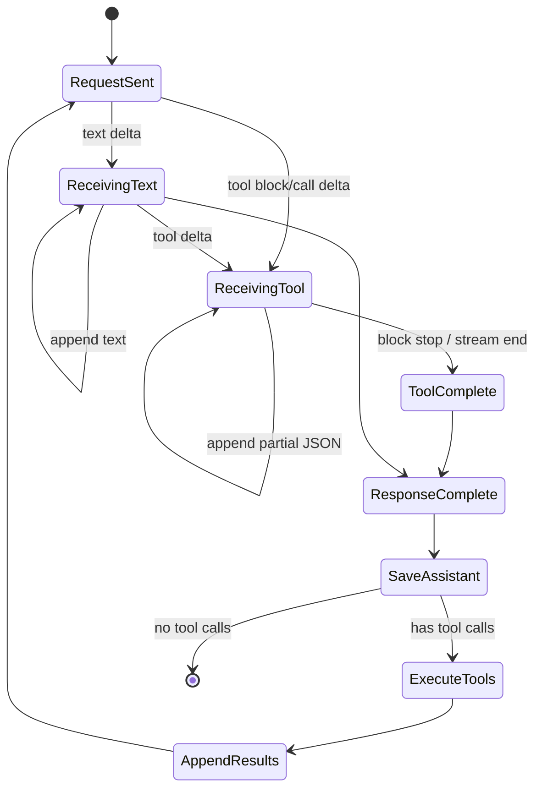

# 05 流式输出与双后端

## 第一部分：总结介绍

### 1. 流式输出不只是逐字打印

非流式请求会等待模型生成完整响应，然后一次性返回。实现简单，但用户在等待期间看不到任何进展。流式请求则把响应拆成连续事件或 chunk，模型生成一部分，客户端就消费一部分。

对普通文本来说，流式处理看起来只是不断 `print(delta)`；对 Agent 来说远比这复杂，因为响应还可能包含 thinking、多个工具调用、被拆开的 JSON 参数、结束原因和 token usage。程序必须一边把可见文本输出给用户，一边维护内部状态，最后重建一条完整 assistant 消息放进对话历史。

因此可以把 streaming 理解为一个协议状态机：



当前 Python 完整版在 `python/mini_claude/agent.py` 中保留两套后端循环：Anthropic 使用 `_chat_anthropic()` 和 `_call_anthropic_stream()`；OpenAI-compatible 使用 `_chat_openai()` 和 `_call_openai_stream()`。

### 2. 双后端选择与整体结构

`Agent.__init__()` 通过是否传入 `api_base` 决定后端：

```python
self.use_openai = bool(api_base)

if self.use_openai:
    self._openai_client = openai.AsyncOpenAI(...)
else:
    self._anthropic_client = anthropic.AsyncAnthropic(...)
```

`Agent.chat()` 再选择真正的循环：

```python
coro = (
    self._chat_openai(user_message)
    if self.use_openai
    else self._chat_anthropic(user_message)
)
await coro
```

两个后端共享的能力包括：

- System Prompt 和项目 reminder
- 活动工具披露
- Agent Loop
- 权限检查
- 普通、特殊和 MCP 工具执行
- 大工具结果落盘
- token 与费用统计
- 上下文压缩
- Session 自动保存
- 中断和重试

不同的部分主要是：

| 方面 | Anthropic | OpenAI-compatible |
| --- | --- | --- |
| system | 独立 `system` 请求字段，可为多个 block | 消息数组中的 `role: system` |
| 工具定义 | Anthropic `tools` schema | 转换成 function calling schema |
| 流事件 | content block start/delta/stop | chat completion chunk delta |
| 工具调用 | assistant content 中的 `tool_use` | assistant message 的 `tool_calls` |
| 工具结果 | 下一条 user 消息中的 `tool_result` | 独立 `role: tool` 消息 |
| 缓存 | 显式 `cache_control` | 依赖提供商自动缓存与 usage 字段 |
| 提前执行 | content block 完成后可提前执行安全工具 | 当前实现等待整条响应完成后执行 |

### 3. Anthropic 主循环如何运行

`_chat_anthropic()` 位于 `agent.py:1487`。一轮用户聊天内部可能多次请求模型：

```text
用户消息
  -> 模型请求
  -> 模型返回 tool_use
  -> 执行工具并回填 tool_result
  -> 再次请求模型
  -> 可能继续调用工具
  -> 模型最终只返回文本
  -> 结束本轮 chat
```

函数先调用 `_push_anthropic_user_message()`。如果是上下文中的第一条用户消息，会同时注入 `CLAUDE.md` 和日期 reminder。然后只在用户轮次边界执行自动 compact 检查，避免切断上一轮的 `tool_use` 与 `tool_result`。

进入 `while True` 后，每轮执行：

1. 检查 `_aborted`。
2. 运行压缩流水线，处理大结果等上下文优化。
3. 非阻塞消费已经完成的 Memory prefetch。
4. 启动 spinner。
5. 调用 `_call_anthropic_stream()`。
6. 停止 spinner，更新 usage。
7. 将完整 assistant 消息写入历史。
8. 若没有 `tool_use`，输出费用并结束。
9. 若有工具，检查预算、权限并执行。
10. 将所有 `tool_result` 作为下一条 user 消息写回，继续循环。

### 4. Anthropic 请求由什么组成

`_call_anthropic_stream()` 位于 `agent.py:1646`，请求参数为：

```python
create_params = {
    "model": self.model,
    "max_tokens": ...,
    "system": self._build_anthropic_system(),
    "tools": get_active_tool_definitions(self.tools),
    "messages": self._with_cache_breakpoints(
        self._anthropic_messages
    ),
}
```

这四个字段分别决定：使用哪个模型、最多生成多少 token、模型遵循哪些系统规则、当前能调用哪些工具、之前发生了什么。

工具列表不是固定的 `self.tools`，而是经过 `get_active_tool_definitions()` 过滤。因此上一章中的 deferred tool 激活状态会直接影响下一次流式请求。MCP 在第一次 `chat()` 时发现的新工具也会进入 `self.tools`，再经过同样的披露流程。

### 5. Anthropic 流事件的处理

代码使用异步上下文管理器和异步迭代器：

```python
async with client.messages.stream(**create_params) as stream:
    async for event in stream:
        ...
    final_message = await stream.get_final_message()
```

`async with` 确保网络流正常关闭；`async for` 每收到一个事件就继续处理，不必等完整响应。

关键事件有三种。

#### `content_block_start`

当新 content block 开始时，如果类型是 `tool_use`，代码记录工具 ID、名称和空参数缓冲区：

```python
tool_blocks_by_index[event.index] = {
    "id": cb.id,
    "name": cb.name,
    "input_json": "",
}
```

使用 `event.index` 是因为一个响应可以包含多个 block，例如先输出解释文本，再发两个工具调用。每个 block 的增量必须进入正确缓冲区。

#### `content_block_delta`

文本增量立即通过 `_emit_text()` 输出：

```python
if hasattr(delta, "text"):
    self._emit_text(delta.text)
```

thinking 增量会以 `[thinking]` 前缀显示。工具参数增量则累计 `partial_json`：

```python
tb["input_json"] += delta.partial_json
```

此时不能立即 `json.loads()`，因为任意中间片段都可能是：

```text
{"file_path":"python/mini_
```

它不是合法 JSON，必须等当前 block 完成。

#### `content_block_stop`

当前工具 block 完成时，代码取出累积字符串、解析 JSON，并回调 `on_tool_block_complete`：

```python
parsed = json.loads(tb["input_json"] or "{}")
on_tool_block_complete({
    "id": tb["id"],
    "name": tb["name"],
    "input": parsed,
})
```

如果解析失败，当前实现退化为 `{}`。这保证流处理不崩溃，但可能让工具收到缺失参数，最终返回更难理解的错误。更严格的实现可以保存解析错误，并禁止提前执行，等 final message 中 SDK 的正式结构确认。

### 6. 为什么还要调用 `get_final_message()`

终端已经显示了文本，不代表可以把零散增量直接当成对话历史。最终消息还负责提供：

- 完整文本 block
- 完整 `tool_use` block
- 正确的工具参数对象
- usage
- stop reason
- SDK 规范化后的消息结构

项目因此流式消费用于“低延迟显示与提前调度”，最终消息用于“协议正确性与持久化”。这两个目标不能混为一谈。

拿到最终消息后，项目过滤 thinking block：

```python
final_message.content = [
    block for block in final_message.content
    if block.type != "thinking"
]
```

thinking 可以流式显示，但不进入长期历史，主要是减少上下文消耗，并避免后续请求携带供应商可能有特殊约束的思考内容。代价是恢复 Session 后无法还原本轮完整 thinking 过程。

### 7. Anthropic 的流式工具提前执行

正常做法是等完整模型响应结束，再执行其中所有工具。当前项目进一步优化：某个 `tool_use` block 一旦收到 `content_block_stop`，说明该工具名称和参数已经完整；即使模型还在生成后续 block，也可以先启动这个工具。

`_chat_anthropic()` 为本轮建立：

```python
early_executions: dict[str, asyncio.Task] = {}
```

回调中只有满足以下条件才提前启动：

1. 工具属于 `CONCURRENCY_SAFE_TOOLS`。
2. 静态权限检查结果是 allow。
3. Auto Mode 下必须属于 `AUTO_MODE_FAST_PATH_TOOLS`，否则仍需等待 LLM 分类器判断。

启动方式：

```python
task = asyncio.create_task(
    self._execute_tool_call(block["name"], block["input"])
)
early_executions[block["id"]] = task
```

完整响应回来后，主循环按正式 `tool_use` 列表处理。如果 ID 已有 early task，就直接：

```python
raw = await early_task
```

这实现了时间重叠：

```text
模型生成工具 A ─────┐
工具 A 执行          ├────────┐
模型继续生成工具 B ──┘        │
完整响应结束                  │
等待工具 A 剩余时间 <─────────┘
```

提前执行只能用于低副作用、可重复执行的工具。否则会有两个风险：第一，流在后续失败并重试，工具可能执行两次；第二，最终消息可能和中间解析结果不一致。文件写入、shell、外部消息发送等工具不应进入这条 fast path。

### 8. 预算超限时为什么仍要补工具结果

完整响应可能已经包含多个 `tool_use`，随后项目才发现 max cost 或 max turns 超限。此时不能直接结束并留下 assistant 工具调用，因为 Anthropic 要求每个 `tool_use` 都有对应 `tool_result`。

代码先取消所有 early task，再追加拒绝结果：

```python
{
    "type": "tool_result",
    "tool_use_id": tu.id,
    "content": "Tool call not executed: ...",
}
```

即使不再发起下一轮 API，这样保存下来的 Session 仍保持协议完整，后续 resume 或 compact 不会遇到孤立的工具调用。

### 9. Anthropic 工具结果如何回填

工具执行后，结果先经过 `_persist_large_result()`。小结果原样保留，大结果落盘，只回填路径和预览。随后构造：

```python
tool_results.append({
    "type": "tool_result",
    "tool_use_id": tu.id,
    "content": res,
})
```

最后一次性写入：

```python
self._anthropic_messages.append({
    "role": "user",
    "content": tool_results,
})
```

`role: user` 是 Anthropic 工具协议要求，并不表示这些文本是终端用户手工输入。一个 user 消息可以同时携带多个工具结果，分别通过 `tool_use_id` 与 assistant 中的工具调用配对。

### 10. OpenAI-compatible 主循环

`_chat_openai()` 位于 `agent.py:1724`，整体 Agent Loop 与 Anthropic 相同，但协议表达不同：

1. `_push_openai_user_message()` 添加用户文本。
2. 检查上下文压缩并启动 Memory prefetch。
3. `_call_openai_stream()` 获取重建后的 completion。
4. 将 assistant message 放入 `_openai_messages`。
5. 没有 `tool_calls` 则结束。
6. 解析工具 JSON，逐个做权限检查。
7. 并发执行连续的安全工具，串行执行其他工具。
8. 每个结果作为独立 `role: tool` 消息写入历史。
9. 回到循环，再次调用模型。

### 11. OpenAI 流为什么需要手动组装

`_call_openai_stream()` 调用：

```python
stream = await client.chat.completions.create(
    model=self.model,
    tools=_to_openai_tools(...),
    messages=self._openai_messages,
    stream=True,
    stream_options={"include_usage": True},
)
```

然后初始化累积状态：

```python
content = ""
tool_calls: dict[int, dict] = {}
finish_reason = ""
usage = None
```

文本 delta 直接输出并追加到 `content`。工具调用可能被分成多片，例如：

```text
chunk 1: index=0, id=call_1, name=read_file, arguments={"file
chunk 2: index=0, arguments=_path":"agent.py"}
```

代码按 `tc.index` 查找缓冲区：

```python
existing = tool_calls.get(tc.index)
if existing:
    existing["arguments"] += tc.function.arguments
else:
    tool_calls[tc.index] = {
        "id": tc.id or "",
        "name": tc.function.name or "",
        "arguments": tc.function.arguments or "",
    }
```

为什么按 index，而不是只按 ID？因为后续参数 chunk 可能不重复携带 ID 和 name，而 index 会标识它属于响应中的第几个工具调用。流结束后按 index 排序，重建完整 `tool_calls`。

当前代码假设 id 和 name 会在第一次遇到该 index 时到达。如果某个兼容网关将 name 拆片，或者第一片只有空 id，后续代码不会补充 name/id，只会追加 arguments。这说明“OpenAI-compatible”并不意味着所有网关行为完全一致，生产实现要更健壮地合并每个字段。

### 12. OpenAI 为什么不在流中提前执行工具

理论上，只要某个 OpenAI tool call 的参数已经完整，也可以尝试提前执行；但 chunk 协议没有像 Anthropic `content_block_stop` 那样在当前实现中直接提供一个已处理的单工具完成节点。程序只能等完整 stream 结束，再根据 finish reason 和重建结果确认全部参数。

因此当前实现选择更稳妥的方式：流中只累计，流结束后统一解析、权限检查和执行。它牺牲少量延迟，降低了误判参数完整性和重复执行风险。

### 13. OpenAI 工具参数何时解析

流函数返回的是重建后的 assistant message，其中 `function.arguments` 仍是 JSON 字符串。主循环执行：

```python
try:
    inp = json.loads(tc["function"]["arguments"])
except Exception:
    inp = {}
```

解析失败时退化为 `{}`，与 Anthropic 中间 JSON 的容错策略类似。这样 Agent Loop 不会直接崩溃，但错误被弱化，工具可能只返回“缺少 file_path”。更好的做法是生成明确的 tool result：`Invalid tool arguments JSON`，把原始错误反馈给模型，让模型修正参数，而不是执行空参数工具。

### 14. 为什么权限检查串行，工具执行可以并行

OpenAI 路径分成两个阶段。

第一阶段按原顺序解析和权限检查：

```python
for tc in tool_calls:
    perm = check_permission(...)  # 或 await classifier
```

权限流程可能需要用户确认或 Auto Mode 分类器。多个确认同时弹出会造成糟糕交互，也可能破坏审批顺序，因此串行更合适。

第二阶段把连续并发安全工具分组：

```python
results = await asyncio.gather(
    *[_run_oai_safe(item) for item in batch["items"]]
)
```

例如模型依次请求：

```text
read_file A       safe
grep_search B     safe
edit_file C       unsafe
read_file D       safe
```

会形成：

```text
并发批次 [read A, grep B]
串行批次 [edit C]
并发批次 [read D]
```

这保留了危险或有副作用操作的相对顺序，同时并行执行连续只读操作。并发结果由 `asyncio.gather()` 按传入 task 的顺序返回，因此写回消息时仍能匹配原 tool call。

### 15. OpenAI 工具结果协议

每个工具结果单独保存：

```python
{
    "role": "tool",
    "tool_call_id": tc["id"],
    "content": result,
}
```

它必须紧跟在包含对应 `tool_calls` 的 assistant message 后面。若预算超限、权限拒绝或用户拒绝，也要为每个 tool call 写一条结果，说明未执行原因。

这和 Anthropic 的统一 user message 不同，但底层不变量相同：每个结构化工具调用都必须有可追踪的结构化结果。

### 16. 双后端为什么不共用同一条消息历史

如果强行让两套协议共享原始 dict，会遇到：

- system 是独立字段还是消息的问题。
- Anthropic content block 和 OpenAI message 字段的差异。
- 一个 user 消息含多个 tool result 与多个独立 tool 消息的差异。
- thinking block 是否可以转换和保留。
- cache_control 应放在哪里。
- usage 和 cached token 字段不一致。

当前项目选择两套原生历史，优点是每个后端逻辑清晰、容易对照官方协议；缺点是代码重复、Session 不易跨后端、修复 Agent Loop bug 时需要检查两条路径。

更进一步的架构可以抽出共享状态机：`ModelResponse(text, tool_calls, usage)` 和 `ToolResult(call_id, content)`，供应商 adapter 只负责流事件解析与消息序列化。但不能为了“统一”丢掉供应商特性，尤其是 Anthropic 的 block streaming 和显式缓存。

### 17. Thinking 模式如何处理

Agent 根据 `thinking` 参数和模型能力得到 `disabled`、`enabled` 或 `adaptive`。Anthropic 请求可能加入：

```python
create_params["thinking"] = {
    "type": "enabled",
    "budget_tokens": max_output - 1,
}
```

thinking delta 会流式打印，但最终消息中的 thinking block 被过滤，不写入持久历史。OpenAI-compatible 当前路径没有实现同等的 thinking 参数和事件语义，因此 `--thinking` 的帮助信息也注明主要针对 Anthropic。

要注意 `max_tokens` 与 thinking budget 的关系：思考 token 和最终输出通常共享输出预算。预算设置过大可能挤压最终回答，过小又可能限制复杂推理。

### 18. Spinner 与首个文本事件

模型请求开始前调用 `start_spinner()`。收到第一个 text 或 thinking delta 时停止 spinner，再输出换行和内容：

```python
if first_text:
    stop_spinner()
    self._emit_text("\n")
    first_text = False
```

如果模型只返回工具调用而没有文本，stream handler 可能不会通过 text delta 停止 spinner，因此调用者在完整响应返回后还会执行 `stop_spinner()`。这是一种双保险，确保终端 UI 不残留动画。

`_emit_text()` 对主 Agent 直接打印，对子 Agent 写入 `_output_buffer`。因此同一套 streaming 代码既能服务终端显示，也能让主 Agent 收集子 Agent 的最终文本。

### 19. Usage 与费用统计

Anthropic 最终消息直接提供：

- `input_tokens`
- `output_tokens`
- `cache_read_input_tokens`
- `cache_creation_input_tokens`

项目分别累计，因为缓存读取和缓存创建的计费倍率不同。`last_input_token_count` 会把输入、缓存读取、缓存创建和本轮输出加起来，估算下一轮上下文大小，用于触发自动 compact。

OpenAI-compatible 通过：

```python
stream_options={"include_usage": True}
```

请求在流中返回 usage。部分兼容网关可能不支持、放在没有 choices 的最后一个 chunk，或者缺少 `prompt_tokens_details.cached_tokens`。代码先处理 usage，再判断 `if not chunk.choices: continue`，因此可以接收“只有 usage、没有 choices”的尾 chunk。

OpenAI 路径把 cached token 从 prompt token 中扣出，避免重复计入普通输入。但项目使用简化的统一价格估算，真实网关和模型的缓存费率可能不同，所以 `/cost` 是估算值，不是账单系统。

### 20. 重试与指数退避

两套流调用都由 `_with_retry()` 包装。它只重试：

- HTTP 429
- HTTP 503
- HTTP 529
- overloaded
- ECONNRESET
- ETIMEDOUT

退避时间大致是 1、2、4 秒并加 jitter，上限 30 秒。jitter 用于避免多个客户端同时失败后在相同时间再次请求，形成惊群。

非重试错误或超过最大次数会继续抛出。权限拒绝、参数错误、认证失败通常不应盲目重试，因为相同请求不会自行变好。

### 21. 流式重试的重复输出问题

`_with_retry()` 重试的是整个流函数。如果第一次请求已经向终端输出：

```text
I will inspect the file...
```

随后网络断开，第二次请求可能再次输出同样前缀。当前代码没有回滚终端文本或给每次尝试单独缓冲，因此用户可能看到重复内容。

可选改进有三种：

1. 接受重复风险，在重试时明确打印“重新生成”，实现最简单。
2. 每次尝试先写入内存缓冲，成功后再显示，但失去即时流式体验。
3. 维护已输出前缀，重试时做前缀去重；实现复杂，且模型重试结果不一定逐字一致。

Agent 产品通常选择第一种并保持透明，因为完美拼接两个不同生成结果并不可靠。

### 22. 流式重试与提前工具执行的副作用

如果 Anthropic 流已经完成一个安全工具 block 并启动 early task，随后网络流失败，`_with_retry()` 会重发模型请求。之前的工具可能已经执行完，新的模型响应又可能生成同一个调用。

因此提前执行工具应满足：

- 只读或幂等。
- 不向外发送消息。
- 不写文件、不提交代码、不修改共享状态。
- 重复调用成本可接受。
- 最好支持 call ID 去重或结果缓存。

当前项目主要依靠 `CONCURRENCY_SAFE_TOOLS` 限制风险，但从严格分布式系统角度看，“只读”也不一定完全无副作用，例如 web 请求可能计费、触发审计或受到限流。成熟实现可以记录 request attempt 和 tool call fingerprint，避免同一次 Agent 轮次重复执行。

### 23. 中断如何影响流

CLI 调用 `Agent.abort()` 后，当前 `chat()` task 被取消。取消会沿着 await 传播到：

- SDK stream 迭代
- `get_final_message()`
- 正在等待的工具 task
- `asyncio.gather()`

`_with_retry()` 捕获的是 `Exception`。在现代 Python 中，`asyncio.CancelledError` 不应被当作普通网络异常盲目重试，而应继续传播到 `Agent.chat()` 的取消处理。

需要额外关注已经启动的 early tasks。如果父 task 被取消，独立 `asyncio.create_task()` 创建的任务不一定自动随父 task 完整清理。预算超限路径显式取消了它们，但一般中断路径也应确保所有尚未等待的 early task 被 cancel 并 gather，避免后台继续运行。

### 24. 错误发生后为什么消息协议完整性很重要

Agent 的消息历史不仅用于当前请求，还会被：

- 下一轮 API 调用
- Session 自动保存与恢复
- 上下文 compact
- Memory 查询
- 调试和测试

因此任何退出路径都不能随意留下半个协议状态。预算超限、权限拒绝和工具异常应转换成合法 tool result；流在 assistant 消息完整生成前失败时则不应把半成品 assistant 写入历史。协议完整性是 Agent Loop 能长期运行的基础。

### 25. 双后端适配层可以如何改进

当前实现适合教学，因为两条路径可以直接对应供应商协议。若项目扩大，可以分成三层：

```text
Agent Loop
  接收统一 ModelTurn：text、tool_calls、usage

Provider Adapter
  AnthropicAdapter / OpenAIAdapter
  负责 Prompt 序列化、stream 解析、消息格式转换

SDK / HTTP
  Anthropic Async SDK / OpenAI-compatible SDK
```

共享层负责预算、权限、工具执行、结果持久化和循环终止；adapter 负责供应商差异。这样修复权限、预算、并发等逻辑时不用修改两套循环。

但 adapter 必须允许供应商特有扩展，例如 Anthropic content block 完成回调、cache control、thinking，以及不同的 usage 字段。好的抽象不是把差异隐藏掉，而是把公共不变量和供应商特性分开。

### 26. 面试话术版本

这个项目的 streaming 不只是把文字逐段打印，而是把供应商流协议解析成完整 Agent Turn。Anthropic 路径根据 content block start、delta、stop 累计文本、thinking 和工具参数，一个工具 block 完成后，如果工具并发安全且权限已放行，可以提前创建 task，让工具执行与模型继续生成重叠；最终仍通过 `get_final_message()` 获取规范化消息并写入历史。OpenAI-compatible 路径按 tool call index 累积被拆散的 id、name 和 arguments，流结束后重建 assistant message，再串行做权限检查、并发执行连续安全工具。两套后端的 system、tool call、tool result 和缓存协议不同，所以项目维护两套消息历史。流式实现还必须处理重试重复输出、提前执行的幂等性、Ctrl+C cancellation、usage 统计，以及任何退出路径下工具调用和结果的协议配对。

## 第二部分：面试问答与追问补充

### Q1：流式输出和非流式输出的本质区别是什么？

非流式等待完整响应后一次返回；流式把生成过程拆成事件或 chunk。客户端需要增量消费并重建最终消息，换取更低的首字延迟和更好的交互体验。

### Q2：为什么 Agent streaming 比普通聊天 streaming 更复杂？

因为除了文本，还有 thinking、多个工具调用、分片 JSON、调用 ID、结束原因和 usage。任何一个字段拼错都可能导致错误工具执行或无效消息历史。

### Q3：为什么流式打印后还要获取 final message？

增量主要用于显示，final message 才包含 SDK 规范化后的完整 content、工具参数、usage 和 stop reason，适合写入对话历史和驱动 Agent Loop。

### Q4：Anthropic 的三个关键事件是什么？

`content_block_start` 创建 block 状态，`content_block_delta` 累积文本、thinking 或 partial JSON，`content_block_stop` 表示该 block 已完整，可以解析工具参数。

### Q5：为什么 Anthropic 工具状态按 event.index 保存？

一个响应可以同时包含多个文本和工具 block，增量交错到达时必须根据 index 找到正确缓冲区。

### Q6：为什么 partial JSON 不能边到达边 `json.loads()`？

中间片段通常不是完整 JSON。必须累积到工具 block 结束，再一次性解析。

### Q7：JSON 解析失败时退化成 `{}` 有什么问题？

它隐藏了真正的协议或模型参数错误，工具只会报缺少字段。更好的做法是产生明确的 invalid arguments tool result，并让模型重新生成。

### Q8：什么是流式工具提前执行？

某个工具 block 已完整时，不等待整个模型响应结束就启动工具，使工具 IO 与模型后续生成并行，降低总延迟。

### Q9：哪些工具适合提前执行？

只读、低副作用、幂等、重复成本低且权限自动允许的工具，例如读文件和本地搜索。写文件、shell、外部消息和共享状态操作不适合。

### Q10：为什么 Auto Mode 下不能随便提前执行并发安全工具？

并发安全只说明执行层副作用较低，不代表分类器已经授权。需要 Auto classifier 的工具必须先分类，不能为了降低延迟绕过权限判断。

### Q11：提前执行工具如何与最终 tool_use 对应？

early task 按 tool use ID 保存。最终消息回来后，主循环遍历正式 tool_use，用 ID 查找已启动 task并 await 结果。

### Q12：流式工具执行最大的风险是什么？

流后续失败并重试时，已启动工具可能重复执行。必须限制为幂等工具，必要时增加调用指纹和去重机制。

### Q13：为什么 OpenAI 工具调用按 index 累积？

后续 chunk 可能只带 arguments 增量，不重复 id 和 name。index 是响应中该工具调用的稳定位置标识。

### Q14：OpenAI 的 name 或 id 也可能分片吗？

不同兼容网关行为可能不同。当前实现主要补 arguments，假设第一次 chunk 已包含 id 和 name；更健壮的实现应对每个字段做增量合并。

### Q15：为什么 OpenAI 当前不做流式提前执行？

当前解析没有可靠的单工具完成事件，等待整条 stream 结束后再确认参数更稳妥，避免把不完整 JSON 当成正式调用。

### Q16：Anthropic 和 OpenAI 工具结果格式有什么区别？

Anthropic 把一个或多个 `tool_result` 放在下一条 user 消息中；OpenAI 为每个调用增加一条独立 `role: tool` 消息，并使用 `tool_call_id` 关联。

### Q17：为什么每个工具调用都必须有结果？

供应商协议要求调用与结果配对。即使拒绝、预算超限或执行失败，也应返回结构化失败结果，保持历史可继续使用。

### Q18：预算超限后为什么要取消 early task？

预算已经禁止继续执行，已提前启动但尚未完成的工具也不应继续消耗资源。随后还要为每个调用补“未执行”结果。

### Q19：为什么权限检查通常串行？

它可能涉及用户确认或 LLM 分类器。串行能保持审批顺序，避免终端同时出现多个确认问题，也减少状态竞争。

### Q20：为什么安全工具执行可以并行？

多个独立只读 IO 之间没有数据依赖，使用 `asyncio.gather()` 可以重叠等待时间，提高整体吞吐。

### Q21：`asyncio.gather()` 会打乱结果顺序吗？

任务完成顺序可能不同，但 `gather()` 返回结果的顺序与传入 awaitable 的顺序一致，因此仍可按原 tool call 顺序回填。

### Q22：并发安全等于绝对无副作用吗？

不等于。读文件通常无副作用，但 web 请求可能计费、记日志或触发限流。并发安全是项目级风险分类，不是数学保证。

### Q23：为什么两个后端维护独立 Agent Loop？

教学实现直接对应各自协议，容易理解和调试。但它会产生重复代码，公共逻辑修复需要同步修改两条路径。

### Q24：怎样抽象双后端而不丢失特性？

定义统一 ModelTurn 和 ToolCall 作为公共层，供应商 adapter 负责序列化与 stream 解析；同时保留 extension 字段或 callback 表达 cache、thinking 和 block-complete 等特性。

### Q25：thinking 为什么显示后又从历史中过滤？

显示可让用户看到模型正在推理；不持久化可以节省上下文，避免后续请求携带不稳定或受协议限制的思考块。

### Q26：过滤 thinking 的代价是什么？

Session 无法完整恢复推理过程，后续模型只能看到最终文本和工具行为。不过通常最终决策和工具结果比原始思考 token 更适合作为长期上下文。

### Q27：spinner 为什么在首个文本到达和请求结束时都停止？

有文本时应立即停止动画；如果响应只有工具调用没有文本，则要在完整响应结束后兜底停止，避免 UI 残留。

### Q28：OpenAI usage 为什么可能出现在没有 choices 的 chunk？

一些实现把 usage 放在流的尾部独立 chunk。代码必须先读取 usage，再跳过空 choices，否则会丢失 token 统计。

### Q29：缓存 token 为什么要单独统计？

普通输入、缓存读取和缓存创建的计费不同。混在一起会导致费用估算错误，也无法观察 Prompt 缓存命中效果。

### Q30：哪些错误适合自动重试？

限流、服务过载和暂时网络故障适合退避重试。认证失败、无效参数和权限拒绝通常不会自行恢复，不应重试相同请求。

### Q31：指数退避为什么需要 jitter？

若大量客户端同时失败，纯指数退避会让它们在同一时间再次请求。随机抖动将重试时间打散，降低惊群和再次过载风险。

### Q32：流式请求重试为什么会重复文本？

第一次尝试已经将部分 delta 输出到终端，失败后第二次从头生成。终端输出不可回滚，模型新结果也不一定与原结果完全相同。

### Q33：怎样处理重复流式输出？

可以明确提示正在重新生成、先缓冲后提交，或做复杂前缀去重。实际系统通常选择透明提示，因为跨生成结果做可靠拼接很困难。

### Q34：Ctrl+C 如何中断 stream？

CLI 取消当前 chat task，取消沿 await 链传播到 SDK 的异步流迭代和工具等待，Agent 捕获取消并结束本轮。

### Q35：为什么 cancellation 不应该被 `_with_retry()` 当网络错误重试？

取消代表用户明确要求停止，不是暂时故障。若捕获后重试，会违背用户意图并继续产生费用或副作用。

### Q36：独立创建的 early task 在父任务取消时一定会自动取消吗？

不一定。`asyncio.create_task()` 创建的是独立调度任务。调用方应保留引用，在异常或取消路径显式 cancel 并等待清理。

### Q37：流失败时半个 assistant 消息能写入历史吗？

不应写入。半成品可能含不完整工具参数或文本。只有 SDK 返回完整 final message 后，才能把 assistant turn 持久化。

### Q38：大工具结果和 streaming 有什么关系？

streaming 控制模型输出方式，不会解决工具结果占用上下文的问题。工具完成后仍需 `_persist_large_result()` 将超大结果落盘并只回填预览。

### Q39：streaming 会降低模型总生成时间吗？

单纯逐字输出主要降低用户感知的首字延迟，不一定减少模型计算时间。Anthropic 的安全工具提前执行可以把模型生成和工具 IO 重叠，从而真正降低端到端时间。

### Q40：如何测试 Anthropic streaming？

构造假的 start/delta/stop 事件，覆盖纯文本、多个工具 block、partial JSON、thinking、解析失败、final message、early execution、预算超限和 cancellation。

### Q41：如何测试 OpenAI streaming？

构造 text delta、多个 index 的交错 tool call、分片 arguments、无 choices 的 usage chunk、空 finish reason、无效 JSON、权限拒绝和并发批次顺序。

### Q42：如何测试流式重试？

让 fake stream 在输出部分 delta 后抛出可重试异常，验证退避次数、重复输出行为、历史中没有半成品消息，以及 early tasks 被正确取消或去重。

### Q43：面试时如何一句话总结这一章？

Agent streaming 是一个把供应商增量协议解析为完整模型回合的状态机；它既要降低显示延迟，也要保证工具参数、权限、并发、重试、取消、usage 和消息配对在任何路径下都正确。
