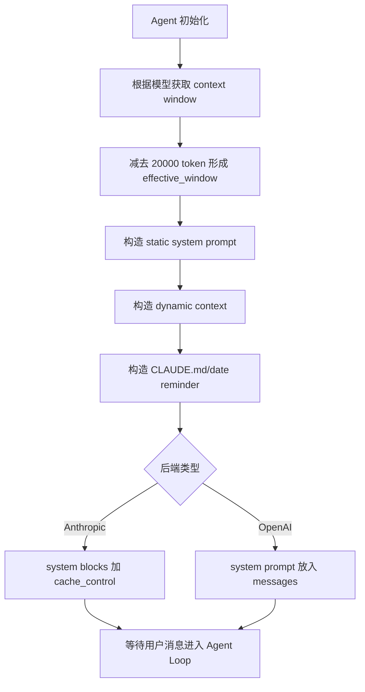
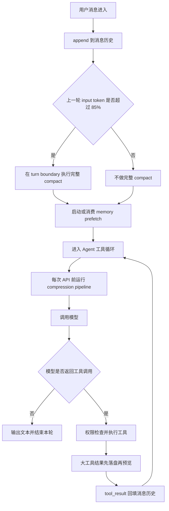
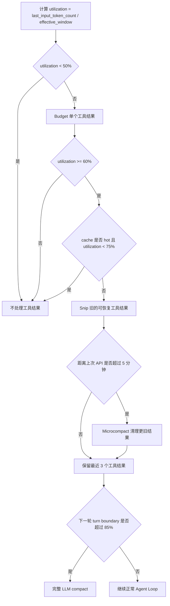
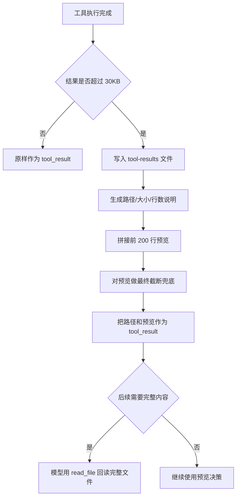
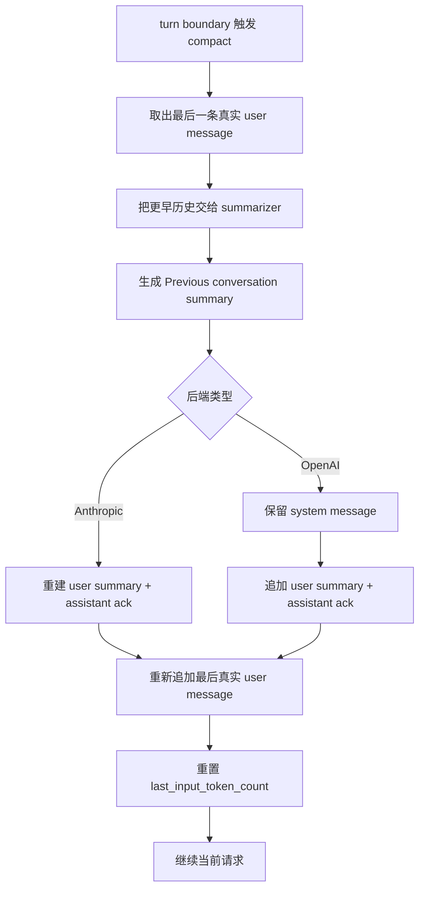
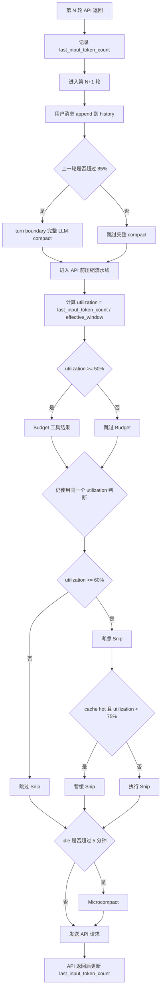
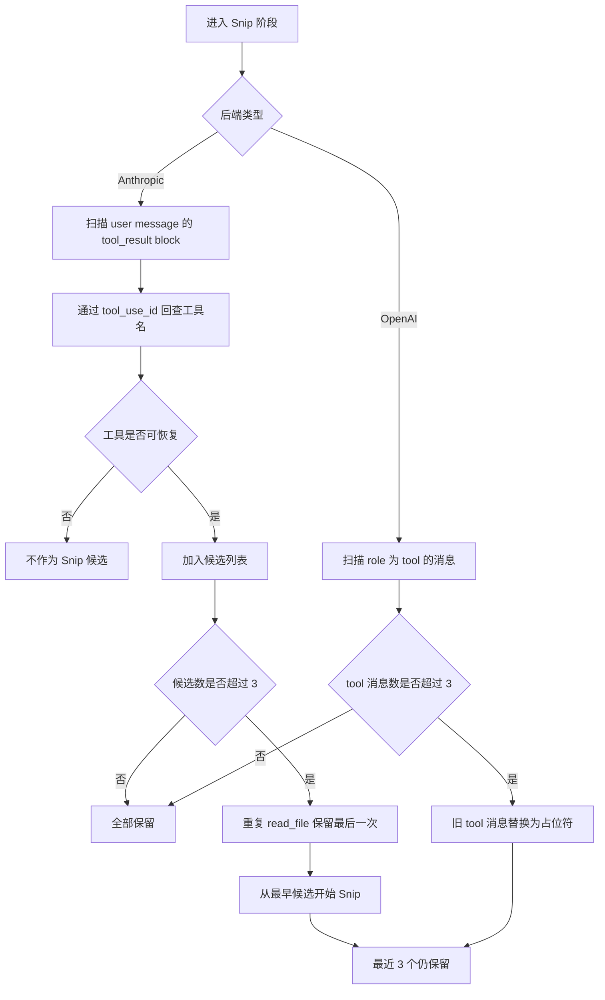
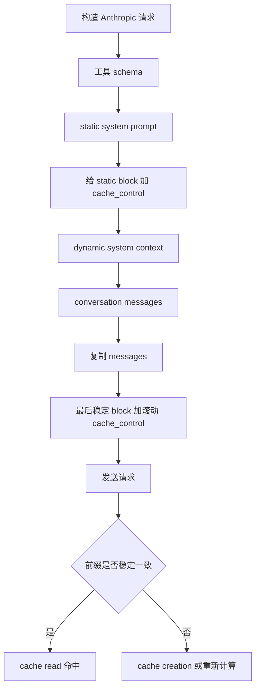
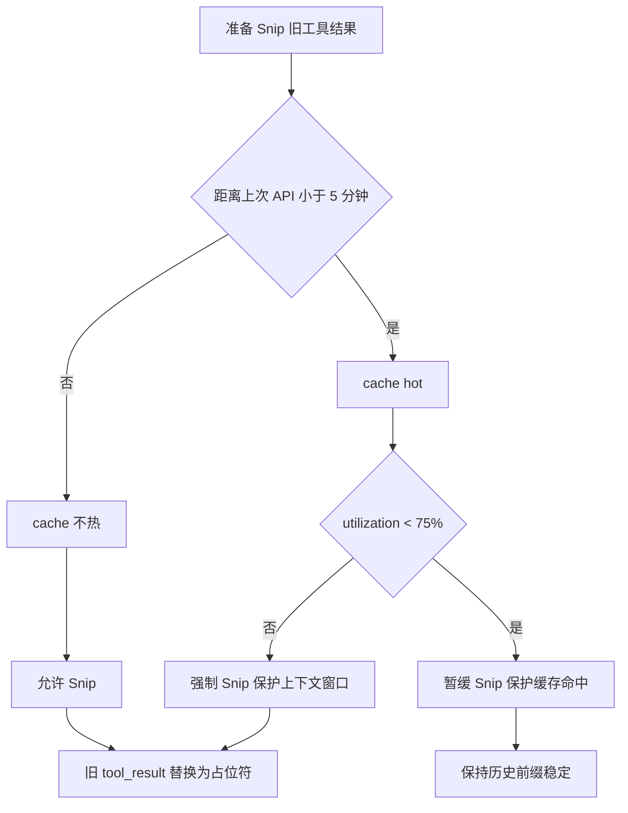
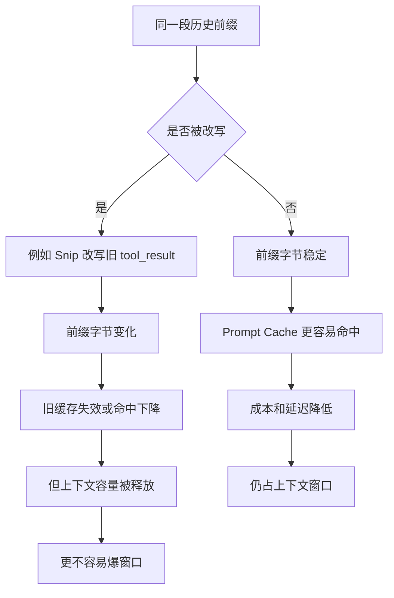

# 07 上下文管理

## 第一部分：总结介绍

上下文管理解决的是 Agent 能否长时间工作的基础问题。模型单次请求的上下文窗口并不只包含用户最新问题，还包含 System Prompt、动态环境、工具 schema、项目 reminder、历史用户消息、assistant 回复、工具调用、工具结果以及本轮输出预留。普通聊天的历史主要是文本，而 Coding Agent 每执行一次工具都会多出 `tool_use/tool_result`，文件内容、搜索结果和 shell 日志又经常很长，所以 Agent 比普通 Chatbot 更容易撑爆上下文。

这个项目的上下文管理不是简单删除最旧消息，而是一条渐进式压缩管道：先在工具结果进入历史前处理大结果，再在每次 API 请求前做本地裁剪，最后在用户轮次边界做 LLM 摘要。这个顺序很关键，因为越靠前的方法越便宜、越局部、越可恢复；越靠后的方法越有损，也越依赖模型概括能力。

第一层是大结果持久化。`Agent._persist_large_result()` 位于 [agent.py](/Users/8utterf1y/Desktop/agent项目/claude-mini/claude-code-from-scratch/python/mini_claude/agent.py:1246)。当工具结果 UTF-8 编码后超过 30KB，完整内容会写入 `~/.mini-claude/tool-results/`，消息历史里只保留文件路径、大小、行数和前 200 行预览。模型如果后续需要完整内容，可以再用 `read_file` 回读。这是“把低频大内容外部化”，而不是直接丢弃。代码还刻意先保存完整结果，再对预览调用 `_truncate_result()`，避免把残缺内容写入磁盘。

第二层是每次模型请求前的本地压缩管道，入口在 [agent.py](/Users/8utterf1y/Desktop/agent项目/claude-mini/claude-code-from-scratch/python/mini_claude/agent.py:1102) 的 `_run_compression_pipeline()`。它依次执行 Budget、Snip 和 Microcompact。Budget 根据上一轮 API usage 估算窗口利用率：超过 50% 时把过长工具结果压到约 30K 字符，超过 70% 时压到约 15K 字符。这里用字符数而不是精确 token，是为了避免绑定具体 tokenizer，但误差较大。

Snip 会把较旧、可重读的工具结果替换成占位符，例如 `[Content snipped - re-read if needed]`。它不删除 tool call，也不删除 tool result 的外壳，因此协议仍然完整，模型也知道之前调用过什么工具。Anthropic 路径会根据 `tool_use_id` 找回工具名，主要裁剪 `read_file`、`grep_search`、`list_files`、`run_shell` 等可恢复结果，并保留最近若干结果；OpenAI 路径当前更粗一些，会裁剪较旧的 `role: tool` 消息。这个差异是当前实现的一个边界。

Snip 还要考虑 prompt cache。Anthropic 的前缀缓存依赖历史前缀稳定，如果频繁改写旧消息，缓存命中率会下降。因此代码用 `last_api_call_time` 粗略判断缓存是否还热：5 分钟内且窗口压力不高时尽量不 Snip；如果利用率达到 75%，即使缓存还热也要裁剪，避免真正溢出。这里体现的是容量和成本之间的取舍：缓存省钱省延迟，但不能减少上下文窗口占用。

Microcompact 更激进，只在距离上次 API 调用超过 5 分钟时运行。它假设缓存大概率已经冷却，于是把除最近几个以外的工具结果清成 `[Old result cleared]`。这能释放更多上下文，但也更有损，因为某些旧 shell 输出或 MCP 结果未必能重现。面试时可以说：Microcompact 是一种成本敏感的兜底裁剪，不应替代结构化任务状态管理。

第三层是 Auto-compact，也就是 LLM 摘要。触发点在 [agent.py](/Users/8utterf1y/Desktop/agent项目/claude-mini/claude-code-from-scratch/python/mini_claude/agent.py:1035)：当上一轮 `last_input_token_count` 超过 `effective_window * 0.85` 时，Agent 会在新的用户消息加入后尝试压缩历史。`effective_window` 是模型上下文窗口减去固定 20000 token，用来给工具 schema、动态 Prompt、新输入和输出留空间。这个估算不精确，因为不同模型输出上限不同，且 `last_input_token_count` 来自上一轮 usage，不包含刚刚加入的超长用户消息。

Auto-compact 必须发生在用户轮次边界，不能随便在工具循环中间做。Anthropic 要求 assistant 的 `tool_use` 后面紧跟 user 的 `tool_result`，OpenAI 也要求 assistant 的 `tool_calls` 后面有对应 `role: tool` 消息。摘要函数会临时拿走最后一条用户消息，让模型总结前面的历史；如果此时最后一条其实是工具结果，就可能切断 tool call/result 配对，导致下一次请求协议非法。因此当前实现选择在普通用户消息刚进入历史时 compact，这时前面的历史已经是完整回合。

Anthropic compact 会把旧历史总结成一条 user 摘要，再加一条 synthetic assistant acknowledgement，最后重新追加当前真实用户消息。OpenAI compact 要额外保留第一条 system message，因为 OpenAI-compatible 的 system prompt 是消息数组的一部分。两条路径都会把 `last_input_token_count` 重置，等待下一次 usage 重新建立估算锚点。摘要本质上是有损语义压缩，可能漏掉约束、失败尝试、关键路径或测试状态，所以应该作为最后手段。

Prompt cache 和上下文压缩是两个不同问题。Anthropic 路径在静态 System Prompt 后加一个 `cache_control`，又在最后一条稳定消息 block 上加滚动缓存断点；OpenAI-compatible 路径不显式设置 cache control，而是依赖 provider 自动缓存，并从 usage 里读取 cached token。缓存能降低重复前缀的计算和费用，但 cached token 仍然占模型窗口。因此“缓存命中高”不代表“不需要 compact”。

上下文管理还和工具系统、RAG、Memory、Session、Sub-agent 有明显边界。Deferred tools 通过延迟披露 schema 减少固定 prompt 体积；RAG 把外部文档留在知识库中，只按需检索少量 chunk；Memory 保存跨会话长期事实；Session 保存当前对话历史；Sub-agent 用独立消息数组做探索，主 Agent 只接收最终结果，从而保护主上下文不被内部轨迹污染。但这些都不是同一个东西：Session 是历史，Compact 是压缩历史，Memory 是长期偏好，Knowledge/RAG 是可检索资料，Experience 是从任务轨迹里沉淀出来的可复用经验。

当前实现最值得主动指出的边界包括：usage 估算滞后；固定 20K reserve 不适配所有模型；大结果预览只取前 200 行可能漏掉末尾错误；Budget 可能破坏热缓存；Anthropic 和 OpenAI 裁剪策略不一致；Microcompact 会清除不可重现结果；LLM 摘要可能幻觉或遗漏；compact 后项目 reminder 没有显式重注入；压缩会永久写入 Session，缺少 append-only 原始事件日志。生产化时更好的设计是把“原始事件日志”和“模型上下文投影视图”分离：原始日志用于审计和恢复，投影视图按当前预算生成。

## 上下文生命周期与压缩流程

按事件流看，上下文管理从 Agent 初始化就开始了。初始化时先根据模型名拿到上下文窗口，再减去 20000 token 形成 `effective_window`，这是为了给后续输出、工具调用结构、动态 prompt 和估算误差留余量。随后 Agent 构造静态 System Prompt、动态环境上下文和首轮 user reminder；Anthropic 路径会把静态 system block 标记为 `cache_control`，OpenAI 路径则把 system prompt 放入 messages 数组。也就是说，上下文管理不是等窗口满了才发生，它从“哪些内容进入 prompt、哪些内容保持稳定、哪些内容放到 user reminder”就已经开始了。

每一轮用户消息进来后，Agent 先把用户消息 append 到对应后端的消息历史里，再在 turn boundary 执行 `_check_and_compact()`。这个顺序很关键：compact 发生时最后一条是普通用户消息，而不是工具结果，因此不会切断上一轮的 tool call/result 配对。随后启动或消费 memory prefetch，再进入 while 循环。每次真正发 API 请求前都会跑 `_run_compression_pipeline()`，这才是常态化上下文治理；完整 LLM compact 只是 85% 高水位时的兜底。

压缩流水线按损失程度递进。50% 以后先做 Budget，只限制单个过长工具结果，保留头尾；60% 以后开始 Snip，把旧的可恢复工具结果替换成 `[Content snipped - re-read if needed]`；如果 prompt cache 还热且利用率低于 75%，Snip 会暂缓，避免频繁改写历史导致缓存失效；超过 75% 后容量风险更高，就算破坏缓存也优先避免溢出；空闲 5 分钟后 Microcompact 会把更旧的工具结果清成 `[Old result cleared]`；85% 时才触发完整 LLM 摘要。

大工具结果的处理是“可恢复压缩”的典型例子。工具执行完成后，Agent 不直接把所有结果塞进历史，而是先判断结果是否超过 30KB。没超过就原样返回；超过就把完整结果保存到 `~/.mini-claude/tool-results/`，再把文件路径、大小、行数和前 200 行预览放回上下文。这个顺序必须是先 persist 再 truncate，否则磁盘里也只会剩下残缺内容。

完整 compact 的流程也要按协议看。Anthropic 不能留下孤立的 `tool_use`，OpenAI 不能留下孤立的 `tool_calls`，所以 compact 只在普通用户消息已经入队后执行。执行时临时保留最后一条真实用户消息，让模型总结之前的历史，再用 `[Previous conversation summary]` 替换旧历史，最后把当前用户消息追加回来。OpenAI 还要保留 system message，因为它在 messages 数组里；Anthropic 的 system 是请求参数，因此 compact 只重写 conversation messages。

这套流程的核心取舍是：能外部化的先外部化，能局部裁剪的先局部裁剪，能重新读取的只保留占位符和线索，最后才让模型做有损摘要。它既保护上下文窗口，也尽量保护任务状态和工具协议合法性。

## 阈值判断的真实依据

这里最容易误解的一点是：Budget、Snip、Microcompact 和完整 LLM compact 不是“每一级压缩后重新精确测一次上下文百分比，再决定下一级”。当前 Python 实现没有在每个阶段后重新调用 tokenizer，也没有维护精确的增量 token accounting。它主要使用上一轮 API 返回的 usage 来估算下一轮风险。

核心变量是 `last_input_token_count` 和 `effective_window`。`effective_window` 是模型上下文窗口减去 20000 token 余量；`last_input_token_count` 是上一轮 API 返回后记录的上下文规模。Anthropic 路径会把 `input_tokens`、`cache_read_input_tokens`、`cache_creation_input_tokens` 和 `output_tokens` 加起来，因为 cached token 虽然便宜，但仍然占窗口；OpenAI-compatible 路径用 `prompt_tokens + completion_tokens`。后续本地压缩流水线计算的比例就是 `utilization = last_input_token_count / effective_window`。

因此，50%、60%、75% 这些阈值基本是在同一个 `utilization` 上做分支，而不是 Budget 后重新测一次、Snip 后再重新测一次。Budget 执行后会修改 messages，让下一次实际请求更短，但代码不会立刻重算新的 utilization；Snip 是否执行仍然看进入 pipeline 时的旧估算。完整 LLM compact 的 85% 判断也一样，它发生在下一轮用户消息进入后的 turn boundary，但判断依据仍是上一轮记录的 `last_input_token_count`。

举一个具体例子：如果当前模型窗口是 200000，初始化后 `effective_window = 180000`。上一轮 API 返回后，如果 `last_input_token_count = 110000`，那么 `utilization = 110000 / 180000 = 61.1%`。下一次进入压缩流水线时，系统会先触发 50% 的 Budget，再进入 60% 的 Snip 判断。这里不会在 Budget 结束后重新计算“现在是否还超过 60%”，所以即使 Budget 实际已经把下一次请求压到更低，Snip 仍可能基于 61.1% 这个旧值继续判断。这个设计是低成本近似，不是精确 token 调度器。

各阶段的判断可以按下面这张表记：

| 阶段 | 判断依据 | 触发条件 | 做什么 | 是否重新测量 token |
| --- | --- | --- | --- | --- |
| Auto-compact | 上一轮 `last_input_token_count` | `> effective_window * 0.85` | 在用户轮次边界调用模型总结旧历史 | 否 |
| Budget | 同一个 `utilization` | `>= 50%` | 把过长工具结果压到约 30K chars，超过 70% 压到约 15K chars | 否 |
| Snip | 同一个 `utilization` + cache 状态 | `>= 60%`，但 cache hot 且 `< 75%` 会暂缓 | 把旧的可恢复工具结果替换成占位符 | 否 |
| Microcompact | 时间状态 | 距离上次 API 超过 5 分钟 | 把更旧工具结果清成 `[Old result cleared]` | 否 |

这带来两个结果。好处是实现简单，不依赖具体 tokenizer，也不需要每次改 messages 后扫描全量历史；坏处是判断有滞后性。比如 Budget 之后上下文实际已经降到 60% 以下，但 Snip 仍可能继续执行；又比如用户新输入特别长，85% 判断可能没有及时反映这条新消息带来的压力。生产化时更严谨的做法是使用模型对应 tokenizer 或增量 token accounting，在每个阶段后重新估算，或者把原始事件日志投影成上下文视图时统一计算预算。

这条线可以简化成一句话：**上一轮 usage 决定下一轮压缩风险等级；pipeline 按风险等级顺序处理 messages，但当前实现不会在每一层后重新精确测量。**

Snip 旧结果时，Anthropic 和 OpenAI 的细节不完全一样。Anthropic 消息里工具结果是 user message 的 content block，所以它会通过 `tool_use_id` 找回对应 tool_use，再判断工具名是否在 `SNIPPABLE_TOOLS` 里。当前只处理 `read_file`、`grep_search`、`list_files`、`run_shell`。找到候选后，如果候选数量不超过 `KEEP_RECENT_RESULTS = 3`，不做处理；如果超过 3 个，会先处理重复 `read_file`：同一个 `file_path` 被多次读取时，旧读取结果更容易过时，因此优先 snip 旧的，只保留最后一次。然后再从最早的候选开始 snip，保证最近 3 个可 snip 工具结果仍保留。OpenAI 路径更粗，只按 `role == "tool"` 收集旧 tool message，保留最近 3 个，其余替换成占位符。

这里的“保留最近 3 个”不是保留所有消息里的最近 3 条，而是保留这类可裁剪工具结果中的最近 3 个。普通用户消息、assistant 文本、tool_use 外壳、权限拒绝结果等不按这个规则删除。Snip 只替换工具结果正文，因此消息协议外壳还在，模型仍能知道“之前调用过某个工具，但正文已被裁剪，需要时重新读取”。

## Prompt Cache 详细解析

Prompt Cache 解决的是重复前缀的计算成本和延迟，不是上下文容量问题。Agent 每轮请求都会重复携带大量稳定内容，例如工具 schema、静态 System Prompt、安全规则、部分历史消息。如果这些前缀字节稳定，服务端可以复用缓存，下一轮只需要处理新增部分，从而降低费用和响应延迟。

Anthropic 路径里有两个缓存断点。第一个在 system 参数里：`_build_anthropic_system_blocks()` 会把静态 System Prompt 放进带 `cache_control` 的 block，动态环境、git、memory、knowledge manifest、skills 和 plan prompt 放在后面。这样静态核心尽量稳定，项目和会话相关内容不会污染全局可缓存前缀。第二个在消息数组里：`_with_cache_breakpoints()` 会复制 messages，并只在最后一个稳定消息块上临时加 `cache_control`，让前面的消息历史成为可缓存前缀。它只给副本加元数据，不修改真实历史，所以 session save、resume 和 compact 不会保存这些 API 层字段。

更具体地说，请求里大致分成四段：工具 schema 和静态 System Prompt 最稳定，适合缓存；动态环境、git、memory/knowledge manifest 和 skills 会随项目或会话变化，不能当全局稳定前缀；消息历史中较早部分如果没有被改写，也能成为滚动缓存前缀；当前用户消息、最新工具结果、memory recall 和 knowledge_search 返回内容最不稳定，通常不适合指望长期缓存。`CLAUDE.md` 和日期 reminder 被放进第一条 user message，而不是直接并入 static system prompt，也是为了避免每个项目都污染静态 system cache。

`_with_cache_breakpoints()` 返回的是 messages 的副本，不会把 `cache_control` 写进真实会话历史。原因是 cache metadata 是 API 请求层信息，不是对话语义。如果把它写进 Session，恢复会话、compact 历史、跨后端转换时都会混入无意义的协议字段。它还会避开 `thinking` 和 `redacted_thinking` block，因为这类内容不稳定，把缓存断点放在那里会降低命中率。

OpenAI-compatible 路径没有显式设置 `cache_control`，而是依赖 provider 自动缓存，并从 usage 里读取 `cached_tokens`。项目在成本统计里会把 `cached_tokens` 从普通 input token 中拆出来，避免重复计费估算；但在上下文压力估算里仍然把 prompt 和 completion 都算进去。这一点说明：缓存命中只影响计算成本，不代表这些 token 不占窗口。

Anthropic 的 usage 会把普通输入、cache read、cache creation 分开统计。项目里成本统计会分别累加 `total_input_tokens`、`total_cache_read_tokens` 和 `total_cache_creation_tokens`，因为 cache read 通常更便宜，cache creation 可能更贵；但估算下一轮上下文压力时，又把它们加回 `last_input_token_count`。这是一个很关键的设计信号：**便宜的 token 仍然是 token，仍然会占模型窗口。**

Prompt Cache 和 Snip 的冲突来自“是否改写历史”。Cache 依赖前缀稳定，Snip 要把旧 `tool_result` 正文替换成 `[Content snipped - re-read if needed]`。一旦改写旧消息，原来的缓存前缀就不再匹配。代码因此设置了 cache-aware gate：如果距离上次 API 调用不到 5 分钟，认为缓存还热；在 utilization 低于 75% 时暂缓 Snip，优先保护缓存；超过 75% 时说明容量风险更高，就算破坏缓存也执行 Snip。

所以两者的关系不是谁替代谁，而是分别优化不同目标：Prompt Cache 优化成本和延迟，Context Compression 优化容量和信息密度。缓存命中再高，cached token 仍然占上下文窗口；压缩再有效，也可能因为改写历史降低缓存命中。工程上要在低水位时保护缓存，在高水位时保护窗口。

可以用一个场景理解：上一轮刚调用 API，历史前缀还热，`utilization = 65%`。这时虽然超过了 60% 的 Snip 基础门槛，但因为还没到 75%，系统会暂缓 Snip，避免破坏可复用缓存。另一个场景是 `utilization = 78%`，缓存仍然热，但上下文已经接近危险区，此时系统会执行 Snip，因为爆窗口会直接导致任务失败，而 cache miss 只是成本和延迟变高。这个取舍就是“低水位保缓存，高水位保窗口”。

## 面试话术版本

这个项目把上下文管理做成了分层压缩流水线。工具结果超过 30KB 时先完整落盘，历史只保留路径和预览；每次 API 请求前根据窗口利用率和缓存热度执行 Budget、Snip、Microcompact，优先裁剪可重读的旧工具结果；当上一轮上下文超过有效窗口 85% 时，在新的用户轮次边界调用模型总结旧历史，避免破坏 tool call/result 配对。

我会特别区分 prompt cache 和 compact：cache 只是降低重复前缀的成本和延迟，cached token 仍占上下文窗口；compact 才是真正释放容量，但它会损失信息。项目还通过 deferred tools、RAG、Memory 和 sub-agent 分担上下文压力：工具 schema 延迟披露，外部文档按需检索，长期偏好放 Memory，子 Agent 的内部探索不污染主上下文。

这套实现的工程价值在于它不是盲删历史，而是在可恢复性、协议完整性、缓存稳定性和信息密度之间做取舍。生产化时我会补充准确 token 估算、结构化摘要、compact 后重注入项目规则、append-only 事件日志、tool-results 清理策略，以及统一两套后端的裁剪语义。

## 第二部分：面试问答与追问补充

### Q1：面试官问：你为什么要专门做上下文管理？直接依赖大模型长上下文不行吗？

长上下文只能提高上限，不能解决 Agent 长任务里的信息质量问题。Coding Agent 会不断追加工具 schema、文件内容、搜索结果、测试日志、知识库片段和工具调用轨迹，窗口再大也会被噪声占满。

所以我做上下文管理的目标不是单纯“省 token”，而是控制哪些信息常驻、哪些信息外部化、哪些信息可恢复、哪些信息必须摘要。它同时影响成本、延迟、任务成功率和消息协议合法性。

### Q2：面试官问：为什么不能简单删最旧的消息？

因为最旧不一定最没用。早期消息里可能有用户硬性约束、项目规则、关键设计决策，甚至还有未完成任务的背景。如果直接按时间删除，还可能删掉 assistant 的 `tool_use` 或 user 的 `tool_result`，导致 Anthropic/OpenAI 的工具消息配对被破坏。

我更倾向按信息价值和可恢复性处理：旧的文件读取结果、搜索结果、长日志可以裁剪或重新读取；用户目标、约束、最近失败原因和刚验证的测试结果要尽量保留。

### Q3：面试官问：你的上下文治理分了哪些层？为什么这样分？

我把它分成四层：大结果持久化、Budget、Snip/Microcompact、Auto-compact。大结果持久化最早发生，把超过 30KB 的完整工具结果写到磁盘，只把路径和预览放进上下文；Budget 根据窗口利用率限制单个工具结果大小；Snip/Microcompact 清理旧的可恢复工具结果；Auto-compact 最后才用模型摘要整个历史。

这个顺序体现的是风险递增：前面几层成本低、局部、相对可恢复；全局摘要最有损，所以只在高水位触发。

### Q4：面试官问：为什么工具结果超过 30KB 要先落盘，而不是直接截断？

直接截断会永久丢信息，后续如果需要错误堆栈中间部分或完整日志就恢复不了。当前实现先把完整结果保存到 `~/.mini-claude/tool-results/`，再把路径、大小、行数和前 200 行预览返回给模型。

这样模型大多数情况下只看预览就够了；如果后续发现细节不够，可以用 `read_file` 读取完整结果。这是把压缩设计成可恢复，而不是直接丢弃。

### Q5：面试官问：为什么一定要先 persist 再 truncate？

顺序很关键。如果先 truncate，再把结果保存到磁盘，磁盘里的也只是残缺内容，后续无法恢复。当前代码先保存原始完整结果，再对放入上下文的预览做截断兜底。

这个点可以体现工程细节：上下文压缩不是为了“看起来短”，而是在尽量不损失事实的前提下降低模型输入压力。

### Q6：面试官问：为什么保留最近 3 个工具结果？

这是一个工程折中。最近几次工具调用通常和当前决策最相关，比如刚读的文件、刚失败的测试、刚修改后的验证结果。如果全部裁剪，模型容易丢掉当前状态。

保留 3 个不是理论最优值，而是为了在信息保留和上下文占用之间取平衡。更严谨可以通过实验调参，比如比较保留 1、3、5 个结果时的任务成功率、平均上下文体积和信息丢失失败率。

### Q7：面试官问：你这些阈值 50%、60%、75%、85% 是怎么来的？

这些阈值是按上下文风险阶段设计的工程参数。50% 时风险还不高，先控制单次工具结果；60% 时开始处理旧内容；75% 时说明接近高水位，即使会影响缓存，也要优先避免溢出；85% 时才做全局摘要，因为摘要信息损失最大。

我不会说这些阈值是理论最优。它们是可调参数，应该通过长任务评测继续优化，比如看不同阈值下的上下文体积、compact 次数、任务成功率、缓存命中率和“压缩导致失败”的次数。

### Q8：面试官问：如果压缩掉的信息后面又需要，怎么办？

我尽量让前几层压缩可恢复。大结果会保存完整副本，返回给模型的是预览和本地路径；旧工具结果被 snip 后，模型可以重新 `read_file`、`grep_search` 或重新运行必要的只读查询获取当前需要的信息。

只有全局摘要属于信息损失更大的操作，所以它放在 85% 高水位才触发。这样可以降低关键细节过早丢失的风险。

### Q9：面试官问：LLM 摘要为什么必须在用户轮次边界做？

因为工具消息有严格配对要求。Anthropic 的 assistant `tool_use` 后必须有 user `tool_result`，OpenAI 的 assistant `tool_calls` 后必须有对应 `role=tool`。如果在工具循环中间拿历史去摘要，可能留下孤立工具调用，下一轮 API 请求会不合法。

所以当前设计是在新的普通用户消息加入后做 compact。此时前面的工具调用已经闭合，摘要函数临时拿走最后这条普通用户消息，再总结之前历史，最后把当前用户消息放回去。

### Q10：面试官问：Auto-compact 为什么不是越早越好？

因为全局摘要是有损语义压缩。它可能漏掉用户约束、失败尝试、关键文件路径、测试结果，也可能把模型推断写成事实。如果过早摘要，任务还没进入高风险状态就丢信息，得不偿失。

所以我会先用大结果落盘、Budget、Snip 这些局部策略，只有窗口达到高水位才启用摘要。

### Q11：面试官问：你怎么证明上下文压缩没有伤害效果？

不能只看上下文体积降低，还要同时看任务完成率和失败原因。我会对比开启和关闭上下文治理，在同一批长链路任务上统计平均上下文 token、峰值 token、compact 次数、任务成功率和“信息被压掉导致失败”的次数。

如果上下文降低 34%，但成功率明显下降，那说明压缩过激。理想结果是上下文体积下降，同时任务成功率不下降，甚至因为减少旧噪声而略有提升。

### Q12：面试官问：你说平均上下文体积降低 34%，具体怎么采样？

每个任务运行过程中，我会记录每轮发给模型前的上下文估算 token，包括消息历史、工具结果、工具 schema、动态 prompt、知识注入内容。对一组长任务求平均，比较开启治理和关闭治理两种配置。

这里的 34% 是平均上下文体积下降，不是总 token 成本一定下降 34%。总成本还受任务轮数、模型输出长度、缓存命中、是否额外调用 summary 或经验提炼模型影响。

### Q13：面试官问：Prompt Cache 和上下文压缩会冲突吗？

会有一定冲突。Prompt Cache 依赖稳定前缀，如果频繁改写历史消息或每轮都摘要，会降低缓存命中。所以上下文没有接近高水位时，我尽量不改写稳定历史，只控制新工具结果和旧的可恢复内容。

当上下文利用率到 75% 或 85% 以上时，避免溢出的优先级高于缓存命中。面试时我会强调：这是成本和可靠性的权衡，不是单纯追求压缩率。

### Q14：面试官问：Prompt Cache 能不能代替上下文压缩？

不能。Cache 只是让相同前缀更便宜、更快，但这些 token 仍然在模型上下文窗口里。比如 100K token 的历史即使命中缓存，也仍然占 100K 上下文。

所以 cache 优化成本和延迟，compact 优化容量和信息密度。两者配套，但不能互相替代。

### Q15：面试官问：上下文压缩和知识库、经验库有什么关系？

知识库和经验库会增加额外上下文，因为模型需要读规范、设计文档和历史经验。如果没有上下文治理，私有知识增强反而可能挤占代码和测试日志空间。

所以这几个模块是配套的：知识库负责提供外部依据，上下文治理负责控制这些依据和工具结果的生命周期，经验持久化则避免把已完成任务完全依赖短期上下文记忆。

### Q16：面试官问：为什么 Experience 不能直接从压缩后的聊天历史里提炼？

因为聊天历史会被 snip、microcompact 和 compact 改写，里面的工具结果可能已经变成占位符或摘要。如果用它做经验提炼，证据链不稳定。

所以项目用独立 `TaskJournal` 记录用户消息、工具调用、工具结果、权限拒绝和验证状态。上下文可以被压缩，但经验沉淀需要相对不可变的事件轨迹。

### Q17：面试官问：Memory、Knowledge、Session、Experience 在上下文管理里分别扮演什么角色？

Session 是当前对话历史，负责恢复本次会话；Memory 是少量长期偏好和项目事实；Knowledge/RAG 是大量外部文档的按需检索；Experience 是从任务轨迹沉淀出的可复用流程。

它们的共同点是都能影响模型上下文，但生命周期和粒度不同。上下文管理要做的是决定什么时候注入、注入多少、是否可恢复，而不是把所有信息都塞进 Prompt。

### Q18：面试官问：为什么工具 schema 也是上下文治理的一部分？

因为工具定义、description、参数 schema 每轮都会进入模型请求。工具越多，固定前缀越大，留给消息历史和文件内容的空间就越少。

所以项目用 deferred tools 做渐进式披露：高频工具常驻，低频工具先只在 prompt 里提示名字，模型需要时通过 `tool_search` 激活完整 schema。

### Q19：面试官问：Sub-agent 对上下文有什么帮助？

Sub-agent 用独立消息历史做探索，主 Agent 只接收最终总结结果。这样大量 read、grep、shell 输出不会直接污染主上下文。

但它不是免费优化。子 Agent 自己的 token 仍然计费，最终返回如果过长也会进入主上下文，所以适合并行探索或隔离大量中间过程，不适合滥用。

### Q20：面试官问：当前上下文管理最主要的风险是什么？

第一，`last_input_token_count` 来自上一轮 usage，对新加入的超长消息不敏感；第二，字符数截断不是精确 token；第三，LLM 摘要可能丢约束或幻觉；第四，压缩会写入 Session，缺少原始事件日志用于恢复。

我会把这些说成当前教学实现的边界。生产化要补准确 tokenizer、结构化摘要、项目 reminder 重注入、append-only event log、tool-results 清理和敏感信息治理。

### Q21：面试官问：你如何设计一个更严谨的上下文压缩评测？

我会构造长链路 coding task，包括多文件阅读、失败测试、修复、二次验证、知识库召回和用户中途追加约束。每个任务分别跑开启/关闭压缩，以及不同阈值配置。

指标至少包括平均输入 token、峰值 token、cache hit rate、compact 次数、任务成功率、测试通过率、用户约束保留率、因信息丢失导致的失败数。只看 token 下降是不够的。

### Q22：面试官问：你怎么防止摘要遗漏关键事实？

当前实现只做简洁摘要，属于可用但不够严谨。更好的方式是固定摘要 schema：用户目标、硬性约束、已完成修改、未完成事项、关键文件、失败尝试、验证结果、下一步。

还可以让摘要后做一次自检，把摘要中的关键文件和测试状态与原始事件日志比对，或者保留最近关键工具结果不进入摘要范围。

### Q23：面试官问：如果用户问“之前那个失败日志再看一下”，压缩后还能回答吗？

如果失败日志当时超过 30KB 并被持久化，模型可以根据路径重新读取完整日志。如果只是被 snip 的可重读结果，也可以重新执行相关读取或搜索。

如果它只存在于已经被全局摘要压缩掉的对话里，而且没有落盘或事件日志，那就可能恢复不了。这正是为什么生产化要把原始事件日志和上下文投影视图分离。

### Q24：面试官问：为什么 OpenAI 和 Anthropic 的压缩实现会有差异？

两家的消息协议不同。Anthropic 的工具结果在 user message 的 content blocks 里，可以通过 `tool_use_id` 回查工具名；OpenAI 是 assistant `tool_calls` 加独立 `role=tool` 消息。当前项目为了教学直接维护两套历史，所以 Snip 策略不完全一致。

生产化可以抽象一个统一的 tool event index，把不同 provider 的消息都映射成统一事件，再生成各自协议需要的投影视图。

### Q25：面试官问：一句话总结你这套上下文管理的价值？

我不是简单裁剪历史，而是把上下文当成可管理资源：大结果外部化、旧结果按可恢复性裁剪、高水位才摘要，同时兼顾工具协议、Prompt Cache、知识库注入和经验沉淀，让 Agent 能在长任务里持续工作而不丢关键状态。
