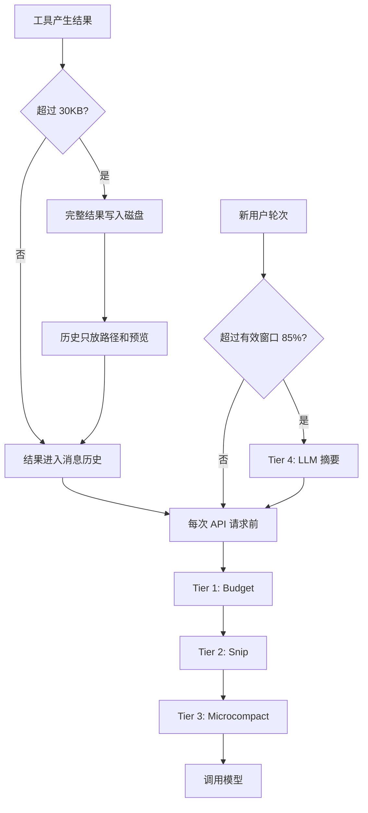

# 07 上下文管理

## 第一部分：总结介绍

### 1. 上下文管理解决什么问题

模型每次 API 调用看到的不只是最新用户问题，而是工具 schema、System Prompt、动态环境、项目 reminder、用户和 assistant 历史、工具调用与结果，以及本轮输出预算。Agent Loop 每调用一次工具，就会增加 `tool_use/tool_result`；文件、搜索和 Shell 输出又往往很长，因此 Agent 比普通 Chatbot 更容易撑满上下文窗口。

上下文管理需要同时解决四个问题：容量不能超过模型窗口；信息质量上要保留当前任务需要的内容；成本上要避免反复计算相同前缀；裁剪后还必须满足消息角色和工具调用配对协议。因此它不是简单删除最旧消息，而是在信息价值、可恢复性、缓存稳定性和协议完整性之间做取舍。

当前 Python 完整版采用渐进式管道：



大结果持久化发生在工具结果进入历史前。Tier 1 到 Tier 3 是不调用模型的本地改写，在每次 API 请求前执行。Tier 4 需要额外模型调用，只在普通用户轮次边界触发。整体原则是先局部、后全局，先可恢复、后有损。

### 2. 上下文窗口与有效窗口

`python/mini_claude/agent.py:104` 定义已知模型窗口，Claude 4 系列按 200K，`gpt-4o` 系列按 128K；未知模型默认 200K。Agent 初始化时计算：

```python
self.effective_window = _get_context_window(model) - 20000
```

不能把完整窗口都交给旧历史，因为最新用户输入、工具 schema、动态 Prompt 和模型输出还需要空间。固定预留 20K 是简单保护，但不同模型最大输出可能是 16K、32K 或 64K，所以它并不精确。未知兼容模型默认 200K 也可能导致压缩过晚。生产实现应从 provider 元数据读取窗口，并根据最大输出和当前工具 schema 动态计算 reserve。

### 3. `last_input_token_count` 如何估算压力

项目不在每一轮本地重新 tokenize 全部历史，而是使用最近一次 API 返回的 usage 作为锚点。Anthropic 路径计算：

```python
self.last_input_token_count = (
    response.usage.input_tokens
    + cache_read
    + cache_creation
    + response.usage.output_tokens
)
```

缓存读取和创建 token 仍要加回，因为缓存只降低计算费用，不会把内容移出模型窗口。本轮 output 也会成为下一轮历史输入。OpenAI-compatible 路径使用 `prompt_tokens + completion_tokens`。

这个值是低成本近似，不是实时精确 token 数。它来自上一轮 API，不包含刚加入的超长用户消息；本地 Snip 后也不会立刻重新计算。因此成熟实现通常使用“最近 usage 锚点 + 新增消息字符粗估”，在不额外调用 token API 的情况下提高准确性。

### 4. Prompt cache 不等于上下文压缩

这是最常见的面试误区：Prompt cache 减少重复计算、延迟和费用，但缓存的 token 仍占上下文窗口。历史有 100K token，即使 90K 命中缓存，模型仍在约 100K token 的上下文中推理。

所以缓存和压缩解决不同问题：缓存优化成本，压缩释放容量并提高信息密度。项目既统计 cached token，又把它计入窗口压力，正是因为两者不能混淆。

### 5. 第 0 层：执行结果截断兜底

`python/mini_claude/tools.py:701` 定义 `MAX_RESULT_CHARS = 50000`。`_truncate_result()` 对超长文本保留头尾，在中间插入截断说明。保留头尾是因为文件开头常有 imports 和结构定义，命令输出结尾常有错误摘要、测试汇总和堆栈末端。

但主流程不会先对原始工具结果做不可逆截断，而是先进入 Agent 的 30KB 持久化层。50K 截断只作为持久化预览的兜底，避免“先截断、再把残缺内容写盘”的信息丢失。

### 6. 第 0.5 层：大结果持久化

`Agent._persist_large_result()` 位于 `python/mini_claude/agent.py:1181`。结果 UTF-8 编码后超过 30KB 时，完整内容保存到：

```text
~/.mini-claude/tool-results/<timestamp>-<uuid>-<tool-name>.txt
```

消息历史只保留结果大小、行数、完整路径和前 200 行预览。模型需要详细内容时可以再次调用 `read_file`。UUID 用于避免并发工具在同一毫秒保存时覆盖。

正确顺序必须是：

```text
完整结果 -> 保存完整文件 -> 生成预览 -> 必要时截断预览
```

持久化是可恢复压缩，truncate 是不可恢复压缩。它体现“外部化上下文”：低频大数据不必一直占据模型注意力，只需在上下文保留索引和足够判断是否回读的预览。

当前边界包括：只预览前 200 行可能漏掉末尾错误；tool-results 没有清理策略；Session 中的绝对路径换机器后失效；持久化文件可能包含敏感源码和日志；30KB 按字节计算，而后面的 Budget 按字符计算。

### 7. 多层管道的执行位置

`python/mini_claude/agent.py:1037` 的 `_run_compression_pipeline()` 根据后端依次运行 Budget、Snip、Microcompact。Anthropic 和 OpenAI Agent Loop 都在每次模型请求前调用，所以一次用户消息内部多轮工具循环时，管道也可能运行多次。

三层都直接修改 `_anthropic_messages` 或 `_openai_messages`，不产生额外模型费用；但修改后的历史会被 Session 自动保存，因此本地压缩不仅影响本次请求，也改变之后可恢复的会话内容。

### 8. Tier 1：Budget 动态缩减

Budget 使用：

```python
utilization = last_input_token_count / effective_window
```

动态控制单个历史工具结果大小：

| 有效窗口利用率 | 结果预算 |
| --- | --- |
| `< 50%` | 不处理 |
| `50% - 70%` | 超过 30K 字符时压至约 30K |
| `> 70%` | 超过 15K 字符时压至约 15K |

Anthropic 修改 user 消息中的 `tool_result.content`，OpenAI 修改 `role: "tool"` 消息。两者都保留头尾。

Budget 是有损操作，并不保证被截断结果已经落盘。某个结果可能按字节未超过持久化阈值，却按字符超过后续 Budget，或在窗口压力升高后才被压缩。字符数也只是 token 粗估，不同语言、源码和 JSON 的 token 密度不同。

### 9. Tier 2：Snip 旧结果

相关常量位于 `agent.py:166`：

```python
SNIPPABLE_TOOLS = {"read_file", "grep_search", "list_files", "run_shell"}
SNIP_PLACEHOLDER = "[Content snipped - re-read if needed]"
SNIP_THRESHOLD = 0.60
SNIP_HOT_OVERRIDE = 0.75
KEEP_RECENT_RESULTS = 3
```

Snip 不删除工具调用，只把旧结果内容替换为占位符。模型仍知道过去调用过什么工具和参数，协议中的 call/result 配对也仍存在；需要时可以重新读取文件或重新搜索。

Anthropic 通过 `tool_use_id` 回查对应工具。它会裁剪最后 3 个可 Snip 结果之前的内容，并对同一文件的多次 `read_file` 只保留最新结果。严格来说“最近 3 个永远保留”并不完全准确：若最近 3 次中重复读取同一文件，较旧的一次仍可能被去重。

OpenAI 路径更粗：它没有回查工具类型，而是将最后 3 条之前的所有 `role: tool` 内容替换。因此编辑、MCP 和特殊工具旧结果也可能被裁剪。两后端的语义保留策略并不对称，生产实现应建立统一的 tool call 索引。

### 10. Snip 与缓存热度的冲突

Prompt cache 依赖前缀字节稳定。Snip 原地修改旧结果后，从该位置开始的缓存可能失效。因此代码按最后 API 时间近似缓存热度：

- 5 分钟内且利用率低于 75%：不 Snip，优先保留热缓存。
- 5 分钟内但利用率达到 75%：强制 Snip，避免窗口溢出。
- 缓存已冷且利用率达到 60%：正常 Snip。

这是容量与成本的权衡。缓存压力不高时，命中收益更重要；窗口接近极限时，宁可重建缓存也要释放空间。

不过 Tier 1 Budget 没有缓存热度门，只要利用率超过 50% 就可能改写旧结果，因此当前管道并非完全 cache-aware。5 分钟也只是对 TTL 的近似，不同 provider 可能不同。

### 11. Tier 3：Microcompact

Microcompact 只在距离上次 API 调用超过 5 分钟时运行。它认为 Prompt cache 大概率已经冷却，因此可以更激进地修改旧前缀。

触发后，除最近 3 个工具结果外，其他结果内容统一替换为：

```text
[Old result cleared]
```

工具调用和结果消息外壳仍保留，协议不会被切断。与 Snip 不同，Microcompact 不考虑工具类型、重复文件或可恢复性，因此旧 Shell、MCP、编辑 diff 等不可重现信息也可能丢失。缓存冷只能说明改写成本较低，不能证明旧内容没有语义价值。

### 12. Tier 4：Auto-compact 触发阈值

`python/mini_claude/agent.py:970` 检查：

```python
if self.last_input_token_count > self.effective_window * 0.85:
    await self._compact_conversation()
```

200K 模型的有效窗口是 180K，触发点为 153K，即完整窗口约 76.5%；128K 模型的有效窗口为 108K，触发点为 91.8K。

检查发生在新用户消息加入历史后，但判断值仍是上一轮 usage。超长新用户输入没有被本地估算，仍可能在触发前直接造成溢出，这是当前实现的重要边界。

### 13. 为什么只能在 turn boundary 摘要

Anthropic 要求 assistant `tool_use` 后紧跟 user `tool_result`；OpenAI 要求 assistant `tool_calls` 后有对应 `role: tool`。压缩函数会先拿走消息数组最后一条，再让模型总结前面内容。

如果在工具循环中间调用，最后一条可能是 tool result。把它拿走后，前一个 assistant 工具调用失去配对，摘要 API 请求本身就会无效。因此当前契约是：先加入新的普通用户文本，再执行 `_check_and_compact()`。这时移除最后用户消息后，前面历史已经是一个完整回合。

协议完整性高于压缩便利，不能为了省 token 留下孤立工具调用。

### 14. Anthropic 摘要流程

`_compact_anthropic()` 位于 `agent.py:982`：

1. 消息少于 4 条时返回。
2. 保存最后一条普通 user 消息。
3. 将之前完整历史加上总结指令发给模型。
4. 要求保留关键决策、文件路径和继续任务所需上下文。
5. 使用最多 2048 token 生成摘要。
6. 用摘要替换旧历史。
7. 将当前真实用户消息重新追加到末尾。

压缩后历史为：

```python
[
    {"role": "user", "content": "[Previous conversation summary]\n..."},
    {"role": "assistant", "content": "Understood. I have the context..."},
    last_user_msg,
]
```

中间 synthetic assistant acknowledgement 用来维持 user/assistant 交替。完成后把 `last_input_token_count` 置零，等待下一次 API usage 重新建立锚点。

### 15. OpenAI 摘要流程

OpenAI system prompt 位于消息数组第一项，所以 `_compact_openai()` 必须保存原 `system_msg`。摘要请求使用单独 summarizer system，并传入业务历史 `messages[1:-1]`。压缩后恢复原 system、摘要 user、synthetic assistant 和当前 user。

OpenAI 最低消息数是 5，Anthropic 是 4，因为 OpenAI 数组额外包含 system。两条路径都只做一次摘要，没有恢复最近文件、活跃 Skill 或原始工具结果引用。

### 16. LLM 摘要是有损语义压缩

摘要可能遗漏用户约束、未完成错误、精确命令和代码细节，也可能把模型旧判断写成事实或产生幻觉。当前提示只要求简洁保留决策、路径和继续所需上下文，没有固定结构和事实校验，因此 Auto-compact 应作为最后手段。

更可靠的摘要格式应固定保留：用户目标、明确约束、已完成工作、未完成工作、关键文件、失败尝试、工具事实、测试状态和下一步。还可以先生成分析草稿，再生成结构化摘要，并对关键事实做验证。

### 17. Compact 后的项目 reminder 边界

`CLAUDE.md` 和日期原本放在第一条 user 消息的 `<system-reminder>` 中。Auto-compact 会用摘要消息替换旧历史，却不会显式重新调用 `build_user_context_reminder()`。

因此项目指令只能依赖 summarizer 是否把它保留下来，可能被压缩、改写或遗漏。静态和动态 System Prompt 仍存在，但项目级规则有丢失风险。更好的设计是把项目 reminder 当作可重建独立层，compact 后重新注入，而不是依赖摘要复述。

### 18. 手动 `/compact` 与 `/clear`

CLI 的 `/compact` 直接调用 `await agent.compact()`，不检查 85% 阈值。命令在 REPL 边界执行，一般不会切断工具配对。当前上层无论底层是否因消息太少而返回，都会打印 `Conversation compacted.`，因此短会话可能显示成功但实际没有变化。

`/clear` 删除全部历史并重置输入、输出、缓存和 last input 统计；OpenAI 重新放入 system。`/compact` 用摘要续接任务，不清空累计费用，只重置 `last_input_token_count`。Clear 是重新开始，compact 是有损续接。

### 19. 压缩与 Session

Budget、Snip、Microcompact 都原地修改消息数组，Auto-compact 直接替换数组。每轮结束后 Session 保存当前数组，因此压缩后的内容会永久进入会话文件，恢复时得不到压缩前原文。

只有超过 30KB 并被持久化的工具结果仍可能从磁盘回读。更成熟的设计应将 append-only 原始事件日志与模型上下文投影视图分离：原始日志用于审计和恢复，模型只看到按预算生成的压缩视图。

### 20. Anthropic Prefix Cache

Anthropic 有两个显式缓存断点。`_build_anthropic_system()` 在静态 System Prompt block 上添加：

```python
{"cache_control": {"type": "ephemeral"}}
```

动态环境放在后面。工具 schema 的服务端渲染顺序位于 system 前，因此也被这个前缀断点覆盖。

`_with_cache_breakpoints()` 又给最后一条消息的最后一个稳定 content block 添加断点，使之前轮次形成滚动缓存前缀。它只修改请求副本，不污染持久化历史。Thinking 和 redacted thinking 不作为断点尾部，因为内容不稳定且协议特殊。

缓存元数据属于 render-time request data，不属于对话语义。如果写进历史，会污染 Session、compact 和后端转换。

### 21. OpenAI-compatible 缓存与费用

OpenAI-compatible 路径不发送 Anthropic `cache_control`，而是依赖 provider 自动缓存相同前缀，并从 `prompt_tokens_details.cached_tokens` 读取命中量。不同网关可能缺失该字段，TTL 和计价也可能不同。

Agent 分别累计普通输入、输出、cache read 和 cache creation。当前估算大致按普通输入 1 倍、缓存读 0.1 倍、缓存写 1.25 倍计价，OpenAI-compatible 也使用该近似，因此 `/cost` 不是实际账单。

### 22. 工具 schema、Memory 与 Sub-agent

工具 schema 也占上下文。工具越多、description 和参数越长，固定前缀越大。Deferred tools 通过只先披露名字、按需激活完整 schema，直接降低上下文压力。MCP 动态发现大量工具时尤其需要渐进式披露。

Session 保存当前会话顺序历史；Compact 压缩长历史；Memory 保存跨会话长期事实；Knowledge 保存外部文档并按需检索。它们生命周期不同，不能互相替代。

子 Agent 使用独立消息数组进行大量探索，主 Agent 只接收最终文本，能保护主上下文不被内部工具轨迹污染。但子 Agent token 仍计入总成本，最终返回过长也会进入大结果持久化。

Anthropic thinking delta 可以显示，但最终 thinking block 被过滤，不写入长期历史。这减少上下文增长，代价是 Session 和 compact 无法恢复原始推理过程。

### 23. 信息价值排序

上下文不应简单认为“越旧越不重要”。Coding Agent 中通常优先保留：

```text
用户当前目标和明确约束
尚未完成的计划、错误和阻塞
最近文件内容与测试结果
关键架构事实和决策
工具调用元数据
可重新获取的旧文件内容
重复搜索结果和长日志
```

当前实现已经保留工具调用元数据、优先裁剪可重读内容、保留近期结果并最后才摘要全部历史，但缺少显式任务状态和结构化关键事实，摘要质量仍高度依赖模型。

### 24. 当前实现的关键边界

1. `last_input_token_count` 是上一轮锚点，不精确包含新消息。
2. 未知模型默认 200K，可能压缩过晚。
3. 固定预留 20K 不适合所有输出上限。
4. 大结果预览只取前 200 行，可能漏结尾错误。
5. Budget 按字符而非 token，且可能破坏热缓存。
6. Anthropic 与 OpenAI Snip 策略不对称。
7. Microcompact 会清除不可重现结果。
8. 摘要可能遗漏约束或产生幻觉。
9. Compact 后项目 reminder 没有显式重注入。
10. 压缩会永久写入 Session，缺少原始事件日志。
11. 没有 autocompact 失败熔断器。
12. tool-results 没有 TTL、配额和敏感信息清理。

### 25. 改进方向

可以增加 append-only event log 和独立 context projection；使用 provider tokenizer 或 usage 加新增字符估算；动态计算输出 reserve；有损裁剪前统一落盘；统一两后端工具索引；采用结构化摘要；compact 后重注入项目规则、Memory 和活跃 Skill；加入摘要失败熔断器；对 tool-results 做 TTL、配额、加密和垃圾回收；监控 cache hit 突降并定位前缀变化。

### 26. 面试话术版本

这个项目把上下文管理做成渐进式压缩流水线。模型窗口不仅包含聊天文本，还包含工具 schema、System Prompt、项目上下文、消息历史和输出预算。工具结果超过 30KB 时先完整落盘，历史只保留路径和预览；每次 API 请求前依次执行 Budget、Snip 和 Microcompact，根据窗口利用率与缓存热度裁剪历史工具结果；当上一轮上下文超过有效窗口的 85% 时，只在新的用户轮次边界调用模型生成摘要，避免切断 `tool_use/tool_result` 配对。Anthropic 使用静态 System Prompt 和最后消息两个显式缓存断点，OpenAI-compatible 依赖 provider 自动缓存。缓存只降低重复计算和费用，不减少上下文占用。当前实现仍是有损教学方案，存在 usage 滞后、两后端裁剪不对称、摘要可能丢信息和项目 reminder 未显式重注入等边界。

## 第二部分：面试问答与追问补充

### Q1：什么是模型上下文窗口？

它是模型单次请求能处理的 token 总容量，包括工具 schema、System Prompt、消息历史、当前输入和输出预留。

### Q2：为什么 Agent 更容易撑满上下文？

每个工具循环都会新增结构化调用和结果，文件、搜索与 Shell 输出通常比普通聊天文本大得多。

### Q3：上下文管理的四个目标是什么？

控制容量、保留高价值信息、降低成本延迟，并保证消息与工具协议合法。

### Q4：为什么不能直接删除最旧消息？

旧消息可能含用户约束和关键决策，还可能切断 tool call/result 配对。

### Q5：什么是渐进式压缩？

先使用局部、低成本、尽量可恢复的方法，窗口压力很高时才使用全局、有损的模型摘要。

### Q6：这个项目有哪些上下文压缩层？

大结果持久化、Budget、Snip、Microcompact 和 Auto-compact。

### Q7：为什么需要 `effective_window`？

需要给新消息、工具 schema、动态 Prompt 和本轮输出预留空间，不能让旧历史占满模型极限。

### Q8：当前有效窗口怎么计算？

模型 context window 减去固定 20000 token。

### Q9：固定 20K reserve 有什么问题？

不同模型输出上限不同，支持 64K 输出的模型可能预留不足，小模型可能预留过多。

### Q10：`last_input_token_count` 是什么？

最近一次 API usage 提供的下一轮上下文压力锚点，包括输入、缓存 token 和本轮输出。

### Q11：为什么 cached token 仍要计入窗口？

缓存只降低重复计算和价格，内容仍在模型可见上下文中。

### Q12：Prompt cache 可以代替 compact 吗？

不能。Cache 解决成本，compact 解决容量和信息密度。

### Q13：usage 锚点有什么误差？

它来自上一轮，不精确包含刚加入的新用户消息；本地裁剪后也不会立即更新。

### Q14：为什么工具结果超过 30KB 要落盘？

完整信息仍可按需读取，而不是为了缩小 Prompt 永久删除。

### Q15：为什么 persist 必须早于 truncate？

先 truncate 会导致写盘内容也已经残缺，失去可恢复性。

### Q16：为什么结果文件名包含 UUID？

避免并发工具在同一毫秒持久化时互相覆盖。

### Q17：持久化和截断有什么区别？

持久化把数据移出 Prompt但保留完整副本；截断直接丢弃部分信息。

### Q18：为什么截断保留头尾？

开头常有背景和定义，结尾常有错误汇总和堆栈关键部分。

### Q19：前 200 行预览有什么问题？

关键错误可能位于末尾，可改为头尾预览或工具特定摘要。

### Q20：Budget 什么时候触发？

50% 利用率后限制到约 30K 字符，70% 后收紧到约 15K 字符。

### Q21：Budget 为什么按字符而不是 token？

字符统计简单、无 tokenizer 依赖，但只能粗略反映 token。

### Q22：Budget 截断一定可恢复吗？

不一定。只有之前已落盘的结果可恢复，其他历史结果可能永久丢失。

### Q23：Snip 做了什么？

保留工具调用及结果消息结构，只用占位符替换低价值旧结果内容。

### Q24：为什么保留 tool_use 元数据？

模型仍需要知道执行过什么，同时协议要求调用和结果保持配对。

### Q25：Anthropic 哪些结果可 Snip？

`read_file`、`grep_search`、`list_files` 和 `run_shell`。

### Q26：同一文件多次读取怎么处理？

旧读取被裁剪，只保留最新结果，因为它更接近当前文件状态。

### Q27：最近 3 个结果一定保留吗？

不完全。同文件重复读取规则仍可能裁掉最近 3 个中的旧副本。

### Q28：OpenAI 与 Anthropic Snip 有何差异？

Anthropic按工具语义筛选；OpenAI 当前裁剪最后 3 条之前的所有 tool 消息，策略更粗。

### Q29：Snip 为什么关注缓存热度？

改写旧消息会让缓存前缀失效；压力不高时保留热缓存更划算。

### Q30：什么时候强制破坏热缓存？

有效窗口利用率达到 75% 时，避免溢出比缓存命中更重要。

### Q31：Budget 会破坏热缓存吗？

可能。Budget 没有热缓存门，是当前实现的不完整之处。

### Q32：Microcompact 什么时候运行？

距离上次 API 调用超过 5 分钟时。

### Q33：Microcompact 为什么更激进？

它假设缓存已冷，直接清理除最近 3 个外的全部工具结果，但这不代表旧信息一定无价值。

### Q34：Auto-compact 何时触发？

上一轮 `last_input_token_count` 超过 `effective_window * 0.85` 时。

### Q35：为什么它只能在用户轮次边界触发？

压缩会临时拿走最后消息；若在工具中段执行，会切断 tool call/result 配对，使摘要请求无效。

### Q36：Anthropic compact 后历史是什么结构？

摘要 user、synthetic assistant acknowledgement、当前真实 user。

### Q37：synthetic assistant 有什么作用？

保持 user/assistant 角色交替，使当前用户消息处于合法位置。

### Q38：OpenAI compact 为什么保留第一条 system？

OpenAI System Prompt 是消息数组的一部分，删除后 Agent 会失去身份、规则和环境。

### Q39：为什么摘要是最后手段？

LLM 摘要可能遗漏约束、混淆状态或产生幻觉，是有损语义压缩。

### Q40：如何提高摘要质量？

使用固定结构保留目标、约束、完成项、未完成项、关键文件、错误、测试与下一步，并做事实校验。

### Q41：compact 后 `CLAUDE.md` 会怎样？

当前没有显式重注入 reminder，只依赖 summarizer 保留项目规则，存在遗漏风险。

### Q42：如何修复 reminder 丢失？

将其作为独立可重建层，compact 后重新生成并注入，而不是让摘要复述。

### Q43：`/compact` 与自动 compact 有何区别？

手动命令不检查阈值，底层使用相同摘要逻辑。

### Q44：`/clear` 与 `/compact` 有何区别？

Clear 删除历史并重置统计；compact 用摘要保留继续工作所需语义。

### Q45：为什么短会话 `/compact` 可能是假成功？

底层消息不足会直接返回，但上层仍统一打印已压缩。

### Q46：压缩如何影响 Session？

压缩直接修改消息数组，自动保存后只能恢复压缩版本。

### Q47：如何同时保留审计和小上下文？

保存 append-only 原始事件日志，另行生成供模型使用的压缩投影视图。

### Q48：Anthropic 有几个缓存断点？

静态 System Prompt 末尾和最后一条消息的最后一个稳定 block，共两个。

### Q49：为什么缓存元数据不写入历史？

它属于请求渲染层，不属于对话语义，写入会污染 Session 和 compact。

### Q50：为什么 thinking 不作为缓存尾部？

Thinking 内容不稳定且协议特殊，不利于稳定命中。

### Q51：OpenAI-compatible 如何缓存？

依赖 provider 自动前缀缓存，并从 cached token usage 中读取命中量。

### Q52：为什么工具 schema 是上下文问题？

每个工具的 description 和参数 schema 每轮都占 token，工具越多固定前缀越大。

### Q53：Deferred tools 如何减少上下文？

先只披露名字，需要时再激活完整 schema，避免低频工具定义常驻。

### Q54：Memory、Knowledge、Session 和 Compact 有何区别？

Session 是当前顺序历史，Compact 压缩历史，Memory 是长期事实，Knowledge 是按需检索的外部文档。

### Q55：子 Agent 为什么保护主上下文？

它在独立历史中完成大量探索，只把最终文本返回主 Agent。

### Q56：子 Agent 会减少总成本吗？

不一定。它主要隔离主窗口，自己的 token 仍计费。

### Q57：为什么 thinking 不进入长期历史？

减少上下文增长并避免不稳定推理内容，保留最终文本和工具事实即可继续任务。

### Q58：上下文压缩应优先删除什么？

优先删除可重建、重复、体积大且与当前目标关系低的旧文件内容、搜索结果和日志。

### Q59：如何测试大结果持久化？

覆盖超过 30KB、多行、单行超长和并发结果，验证完整文件、唯一名称、预览与先保存后截断顺序。

### Q60：如何测试协议完整性？

构造多组 tool call/result，在合法 turn boundary 和非法工具中段压缩，验证不会产生孤立调用。

### Q61：如何测试缓存与 Snip 取舍？

模拟不同利用率和最后 API 时间，覆盖冷缓存 60%、热缓存 60%、热缓存 75% 和 Budget 50% 等边界。

### Q62：如何测试摘要质量？

历史中放入明确约束、失败尝试、关键文件和未完成工作，压缩后验证下一轮能准确继续。

### Q63：当前最重要的改进是什么？

分离原始日志和上下文视图、重注入项目规则、统一两后端裁剪语义，并在有损裁剪前保证可恢复。

### Q64：面试时如何一句话总结这一章？

上下文管理通过外部化大结果、渐进裁剪历史、在安全轮次边界生成摘要并维护稳定缓存前缀，让 Agent 在有限窗口内长期运行，同时尽量保留高价值信息和工具协议完整。
