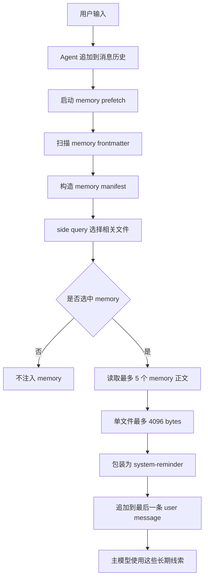
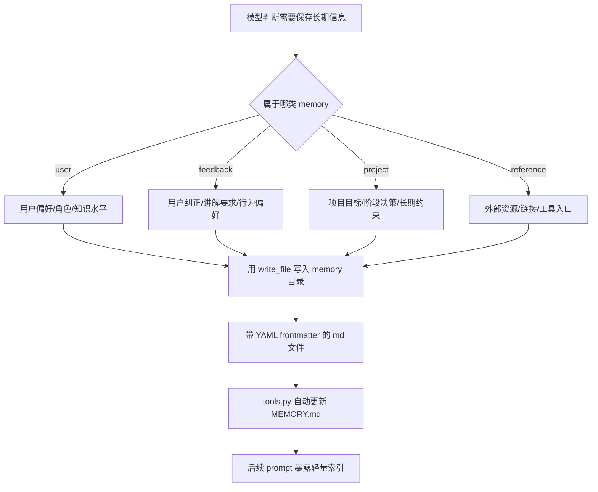
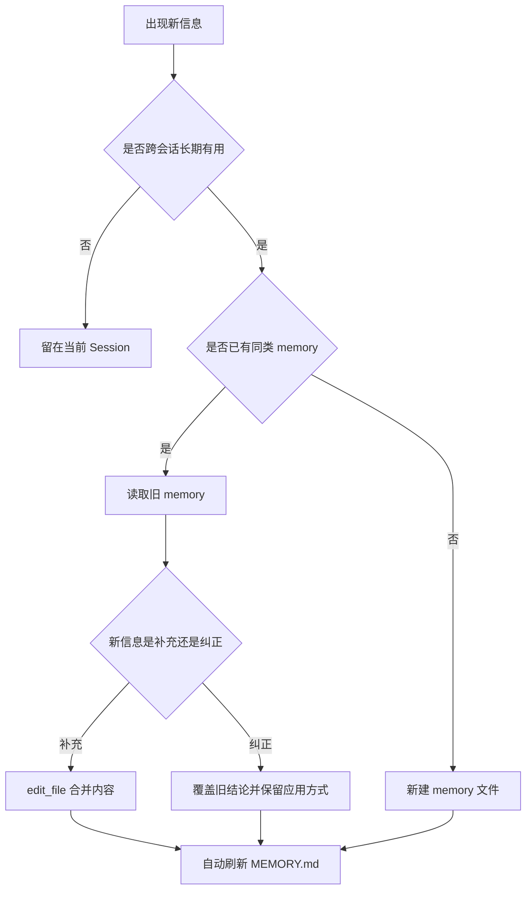

# 08 记忆系统

## 第一部分：总结介绍

记忆系统解决的是 Agent 跨会话保留少量长期信息的问题。它不是当前对话历史，也不是 RAG 知识库。Session 保存本次聊天的完整消息流；Knowledge 保存外部文档并通过检索返回证据；Experience 从任务轨迹里提炼可复用流程；Memory 则保存用户偏好、项目状态、反馈纠正和参考入口这类“长期有用、体积较小、但不应该每轮都塞满上下文”的信息。Python 版核心实现位于 [memory.py](/Users/8utterf1y/Desktop/agent项目/claude-mini/claude-code-from-scratch/python/mini_claude/memory.py:1)，接入 Agent Loop 的位置在 [agent.py](/Users/8utterf1y/Desktop/agent项目/claude-mini/claude-code-from-scratch/python/mini_claude/agent.py:1518)，Prompt 暴露入口在 [prompt.py](/Users/8utterf1y/Desktop/agent项目/claude-mini/claude-code-from-scratch/python/mini_claude/prompt.py:224)。

这个项目的 Memory 是项目级文件系统持久化。`get_memory_dir()` 会根据当前工作目录生成 project hash，把 memory 放到 `~/.mini-claude/projects/<project-hash>/memory/`。每条 memory 是一个 Markdown 文件，带 YAML frontmatter，包含 `name`、`description`、`type` 和正文。项目还维护一个 `MEMORY.md` 索引文件，用来记录所有 memory 的标题、类型和描述。这个索引不是事实源，事实源是单个 memory 文件；索引只是为了让模型和用户先看到“有哪些长期记忆可用”，避免每轮读取全部正文。

Memory 支持四种类型：`user`、`feedback`、`project`、`reference`。`user` 保存用户角色、偏好和知识水平，例如用户希望用中文讲解、偏好 Python 版本、准备面试。`feedback` 保存用户对 Agent 的纠正和要求，重点是 Why 和 How to apply，例如“不要只按章节讲，要按事件流讲”。`project` 保存项目目标、阶段性决策、约束和当前方向，例如“当前解析的是 mini Claude Code 的 Python 实现”。`reference` 保存外部资源入口，例如文档链接、仪表盘、服务地址和工具入口。四类 memory 的共同特点是：它们应该跨会话复用，但不能替代代码、Git、知识库或当前上下文。

模型知道 Memory 能力，靠的是 `build_memory_prompt_section()` 注入到动态 system context。这里明确告诉模型 memory 目录在哪里、有哪些类型、如何保存、不要保存什么、什么时候召回。保存格式也在 prompt 中写死：模型应该使用 `write_file` 工具，在 memory 目录下创建带 frontmatter 的 `.md` 文件。当前 Python 版没有专门的 `memory_save` 工具，保存和更新本质上都是文件写入；`save_memory()` 函数存在，但主要是程序内部 API，Agent 实际更常通过 `write_file` 按 prompt 指令写 memory 文件。

模型什么时候写入 Memory，主要是软判断，不是硬规则触发。Prompt 只告诉模型“当用户要求 remember/recall，或者 prior context seems relevant 时使用 memory”，但没有一个独立分类器自动决定“这句话必须存”。因此，写入 memory 的判断来自主模型：如果用户明确说“记住我以后都要用 Python 版讲”，这是强信号；如果用户连续纠正讲解方式，模型也可以主动沉淀为 `feedback`；如果任务里形成长期项目决策，可以保存为 `project`；如果用户给了长期可复用链接，可以保存为 `reference`。但临时任务细节、代码结构、Git 历史、已经写在 `CLAUDE.md` 的规则不应该写入 Memory。

更新 Memory 也是通过文件覆盖或编辑实现。`save_memory()` 的文件名由 `type + slug(name)` 决定，同名同类型会写到同一路径，相当于覆盖更新；模型也可以先 `read_file` 读旧 memory，再用 `edit_file` 修改正文。写入完成后，`tools.py` 的 `_auto_update_memory_index()` 会发现写入路径在 memory 目录下，并自动重建 `MEMORY.md`。所以模型不需要手动维护索引，也不应该直接编辑 `MEMORY.md`。这点很重要：如果让模型手动维护索引，索引很容易和真实文件不一致。

删除 Memory 在代码里有 `delete_memory(filename)`，会删除文件并更新索引。但当前 CLI 只暴露 `/memory` 列表，没有提供 `/memory delete` 命令；工具层也没有专门的 `delete_memory` 工具。也就是说，删除能力在内部函数层存在，但对模型的常规操作面并不完整。模型如果真的要删除 memory，只能通过文件操作能力间接实现，例如运行 shell 删除或改写文件，这会受权限系统约束。面试时要主动指出这是教学实现边界：生产系统应该提供显式 `memory_delete` 或 `memory_update` 工具，并对删除做确认、审计和可恢复备份。

读取和召回 Memory 分两层。第一层是启动时把轻量 `MEMORY.md` 索引注入 prompt，让模型知道有哪些 memory。第二层是按需语义召回：每轮用户消息进入后，Agent 会启动 memory prefetch，调用 side query 根据用户 query 和 memory manifest 选择最多 5 个明确相关的 memory 文件。被选中的文件才会读取正文，并以 `<system-reminder>` 形式追加到最后一条 user message。这样既让模型拥有长期记忆，又不会把所有 memory 常驻上下文。

Memory recall 也有上下文治理。系统最多扫描 200 个 memory 文件；单个 memory 注入最多 4096 bytes；单 session memory 注入累计最多 60KB；同一条 memory 在一个 session 里注入过后会加入 `_already_surfaced_memories`，避免反复注入。旧 memory 还会带 freshness warning，提醒模型这只是历史观察，不是实时事实，涉及代码行为时必须重新读当前代码验证。这说明 Memory 在设计上是“线索”，不是 source of truth。

Memory 和权限系统也有关。保存 memory 依赖 `write_file`，因此仍然经过工具权限、read-before-edit、mtime 等机制。Memory 文件里的内容也不能升级为系统指令，它只是被包装在 `<system-reminder>` 里提供上下文。特别是用户或外部内容如果写入了恶意 memory，模型仍应该把它视为辅助信息，而不是绕过 system prompt、权限系统或项目规则。

## 面试话术版本

这个项目的 Memory 是项目级、文件型、轻量长期记忆层。它不保存完整聊天历史，也不替代 RAG 知识库，而是保存用户偏好、用户反馈、项目决策和参考入口这类跨会话可复用的信息。每条 memory 是带 YAML frontmatter 的 Markdown 文件，放在 `~/.mini-claude/projects/<project-hash>/memory/`，同时自动生成 `MEMORY.md` 索引。

模型知道如何使用 Memory，是因为 system prompt 的动态上下文里注入了 Memory System 说明：有哪些 memory 类型、保存格式、memory 目录、不要保存什么以及何时召回。当前 Python 版没有专门的 memory tool，写入和更新本质上是模型调用 `write_file` 或 `edit_file` 操作 memory 目录下的文件；写入后工具层自动更新索引。删除函数在代码里存在，但 CLI 和工具面没有完整暴露，这是教学实现的边界。

我会特别强调：Memory 的写入判断主要是模型基于 prompt 的软判断，不是硬触发规则。明确的“记住我...”是强信号，反复纠正是 `feedback` 信号，长期项目决策是 `project` 信号，外部长期入口是 `reference` 信号。召回时不是全量注入，而是用 side query 根据用户 query 和 memory manifest 最多选择 5 个相关文件，并受单文件 4KB、单 session 60KB 等预算限制。这样既有长期记忆，又避免污染上下文。

## 第二部分：面试问答与追问补充

### Q1：面试官问：Memory 和 Session、Knowledge、Experience 有什么区别？

Session 是当前会话历史，保存本次对话怎么进行；Memory 是少量长期偏好和项目事实；Knowledge 是外部文档知识库，需要检索证据；Experience 是从任务轨迹里提炼出来的可复用工作流。

我不会把它们混成一个“记忆”。它们的生命周期、粒度和可信度不同。Memory 更像长期提醒，Knowledge 更像证据库，Experience 更像经验沉淀，Session 更像短期上下文。

### Q2：面试官问：模型怎么知道什么时候写入 Memory？

主要靠 prompt 里的 Memory System 说明和模型自己的判断。代码没有独立分类器强制判断“这句话必须写 memory”。当用户明确说“记住...”，或者用户给出会长期影响后续行为的偏好、反馈、项目决策、参考入口时，模型可以选择写入。

这是一种软策略，好处是简单灵活；缺点是可能漏写或误写。生产化可以增加 memory candidate classifier，让模型先提出候选，再由策略层或用户确认是否持久化。

### Q3：面试官问：四种 Memory 类型分别什么时候持久化？

`user` 用于用户长期画像，比如用户技术水平、语言偏好、面试准备方向。`feedback` 用于用户对 Agent 行为的纠正，比如“讲解要按事件流，不要只列概念”。`project` 用于项目级长期目标和决策，比如当前项目的重点模块、技术约束、阶段结论。`reference` 用于长期可复用入口，比如文档 URL、服务控制台、设计稿、监控面板。

判断标准不是“这句话属于哪个名词”，而是它是否跨会话仍有价值。如果只是当前任务临时信息，留在 Session；如果是大量外部文档，放 Knowledge；如果是任务流程经验，放 Experience。

### Q4：面试官问：Memory 保存格式为什么用 Markdown + YAML frontmatter？

因为它兼顾可读性和结构化。YAML frontmatter 提供 `name`、`description`、`type`，方便扫描索引和做语义选择；Markdown 正文适合写自然语言偏好、决策和说明。

相比数据库，这种方式更适合教学项目：容易观察、容易编辑、没有额外服务依赖。生产化如果 memory 数量很大，才需要数据库、版本管理和检索索引。

### Q5：面试官问：`MEMORY.md` 是事实源吗？

不是。事实源是每个 memory markdown 文件，`MEMORY.md` 只是自动生成的轻量索引。它帮助模型知道有哪些 memory，但不承载完整内容。

这样做可以避免每轮都读取全部 memory 正文。模型先看到索引，再通过 side query 选择相关 memory，最后只注入少量正文。

### Q6：面试官问：更新 Memory 是怎么发生的？

当前 Python 版没有专门的 update API。更新本质上是文件编辑：模型可以读旧 memory，然后用 `edit_file` 修改；或者按相同 `type + name slug` 写入同一路径，形成覆盖。写入完成后 `_auto_update_memory_index()` 会自动刷新索引。

这说明更新判断也主要靠模型。生产环境我会增加显式 `memory_update`，要求指定旧 memory id、更新原因、变更摘要，并保留版本历史，避免静默覆盖重要偏好。

### Q7：面试官问：什么时候应该更新而不是新建 Memory？

如果新信息是在修正同一个长期事实，应该更新。例如用户原来偏好“讲 TypeScript”，后来明确改成“只讲 Python”，这是同一偏好的替换。如果是新增独立偏好或新项目决策，可以新建。

核心判断是语义是否指向同一条长期事实。否则 memory 会碎片化，召回时容易出现互相矛盾的旧信息。

### Q8：面试官问：什么时候会删除 Memory？

代码里有 `delete_memory(filename)`，删除后会更新索引。但当前 CLI 只支持 `/memory` 列表，没有暴露 `/memory delete`；工具系统也没有独立 `memory_delete` 工具。所以常规模型流程不会自动删除 memory。

如果用户明确要求删除，只能通过文件操作或 shell 间接完成，并受权限系统约束。生产化应该提供显式删除工具，要求用户确认，并最好支持软删除或恢复。

### Q9：面试官问：模型会不会自动清理过期 Memory？

当前不会。代码会通过 `memory_freshness_warning()` 提醒旧 memory 可能过时，但不会自动删除或自动更新。

这是保守设计。自动删除长期记忆风险很高，可能删掉仍然有价值的用户偏好。更好的做法是标记 stale、降低召回权重，或者在用户确认后清理。

### Q10：面试官问：Memory 召回为什么要用 side query？

因为主模型不应该每轮读取所有 memory 正文。side query 只拿用户 query 和 memory manifest，输出最多 5 个明确相关的文件名，相当于轻量路由器。

这样做降低主上下文压力，也让 recall 判断更可控。它的缺点是依赖 description 质量，如果 memory 描述写得差，就可能召回不到。

### Q11：面试官问：为什么 Memory 不直接做向量检索？

因为 memory 规模通常较小，而且 frontmatter 的 `name/description/type` 已经提供了强 metadata。用 side query 选择文件比引入 embedding、HNSW、FTS、RRF 简单很多。

我会把向量检索留给 Knowledge。Memory 是轻量长期记忆，不应该为了小规模数据引入复杂索引和一致性成本。

### Q12：面试官问：Memory 召回后怎么注入上下文？

选中的 memory 会读取正文，包装成 `<system-reminder>`，追加到最后一条 user message，而不是写进 system prompt。这样能保持 system prompt 的稳定性，减少对 prompt cache 的影响，也保持 user/assistant 消息交替结构。

这和项目里的 prompt cache 策略一致：静态 system 尽量稳定，项目和会话相关的动态内容放到更靠后的上下文里。

### Q13：面试官问：Memory 如何控制上下文占用？

它有多层限制：最多扫描 200 个文件，最多选择 5 个相关 memory，单个 memory 注入最多 4096 bytes，单 session memory 注入累计最多 60KB，并且已注入过的 memory 会加入 `_already_surfaced_memories` 避免重复注入。

这说明 Memory 是上下文增强，不是无限追加。否则长期记忆越多，反而会挤占代码、工具结果和用户当前问题的空间。

### Q14：面试官问：旧 Memory 为什么要 freshness warning？

因为 memory 是历史观察，不是实时事实。用户偏好可能变化，项目结构可能变化，代码行为更可能变化。旧 memory 被召回时要提醒模型：涉及事实判断时必须回到当前代码或文档验证。

这能降低“过期正确”的风险。Memory 应该帮助定位和提醒，不应该替代当前 source of truth。

### Q15：面试官问：Memory 写入是不是一定要用户确认？

当前 Python 实现没有专门的 memory 写入确认机制。因为写 memory 本质上是 `write_file`，会走普通工具权限；如果是新建文件，在默认权限下可能触发确认，具体取决于权限模式和路径。

生产环境里，我会把 memory 写入和普通文件写入区分开：保存长期用户偏好最好有用户确认或可撤销机制，避免模型误把临时信息永久化。

### Q16：面试官问：Memory 内容可信任吗？

不能完全信任。Memory 可能来自用户历史输入，也可能被错误写入或过期。它应该被视为辅助上下文，而不是最高优先级指令。

如果 Memory 和当前用户明确指令冲突，以当前用户指令为准；如果 Memory 和代码事实冲突，以当前代码和测试为准；如果 Memory 和 system/developer 安全规则冲突，安全规则优先。

### Q17：面试官问：为什么不把 Memory 全部塞进 system prompt？

因为 memory 会增长，全部塞进去会浪费上下文，也会破坏 prompt cache。很多 memory 在当前任务里不相关，注入只会增加噪声。

所以项目只把轻量索引放进 prompt，再用 side query 按需召回正文。这是长期记忆和上下文成本之间的折中。

### Q18：面试官问：Memory 和 `CLAUDE.md` 有什么边界？

`CLAUDE.md` 是项目规则和协作约定，适合保存团队级、项目级明确规范。Memory 是 Agent 的长期个人化记忆，适合保存用户偏好、反馈和阶段性项目上下文。

Prompt 里明确写了不要把已经在 `CLAUDE.md` 的内容再存 memory。否则同一规则会有两个来源，后续更新容易不一致。

### Q19：面试官问：当前 Memory 实现最大的风险是什么？

第一，写入和更新判断主要靠模型，可能漏写、误写或过度写。第二，没有显式 memory update/delete 工具，删除和版本管理弱。第三，召回依赖 description 质量。第四，旧 memory 不自动失效，只是 warning。

生产化我会增加候选写入分类器、用户确认、版本历史、软删除、冲突检测、过期策略和 memory 质量评估。

### Q20：面试官问：一句话总结 Memory 系统？

这个 Memory 系统是一个项目级文件型长期记忆层：用 Markdown + frontmatter 保存四类长期信息，用 `MEMORY.md` 暴露轻量索引，用 side query 按需召回少量正文，并通过大小限制、freshness warning 和权限系统控制上下文成本与误用风险。
