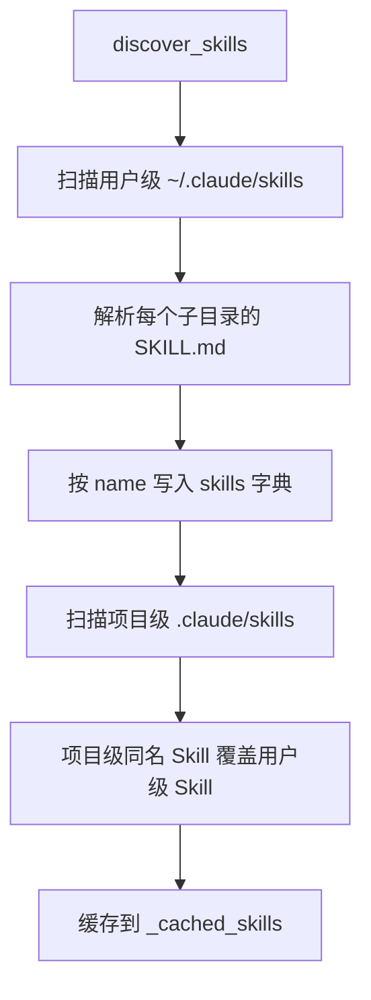
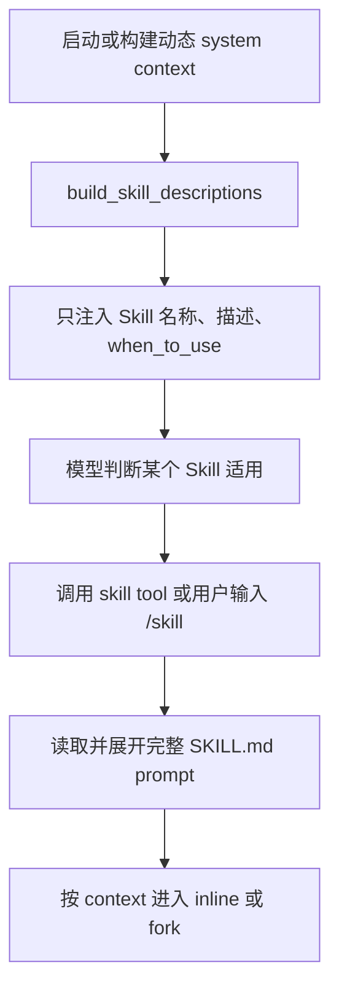
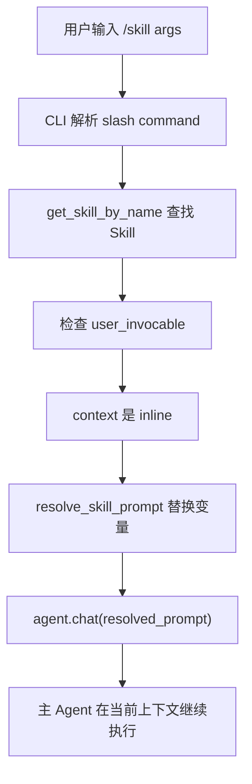
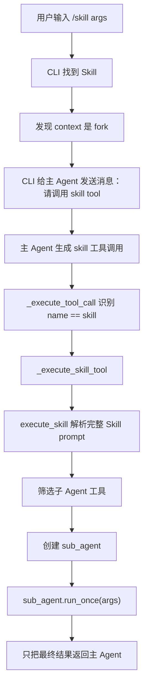
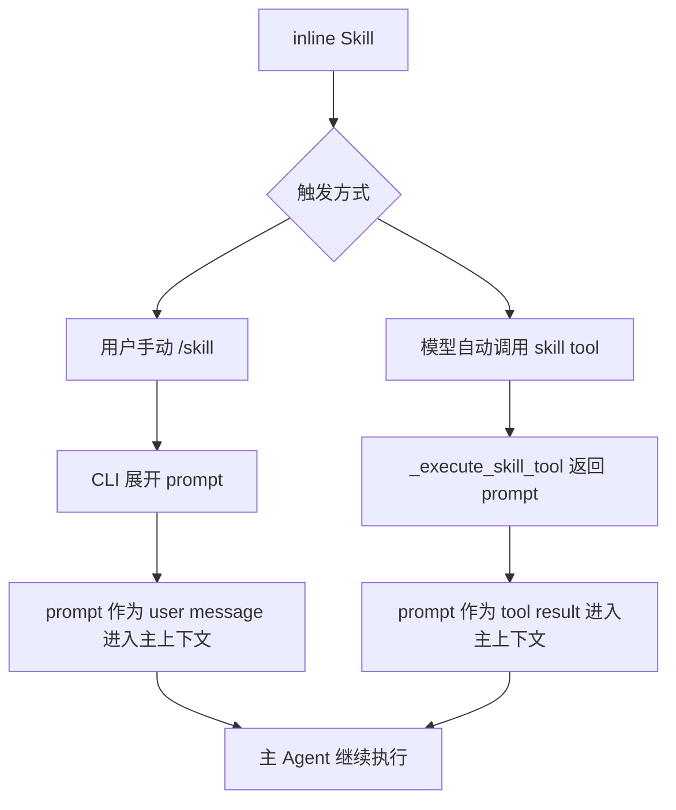
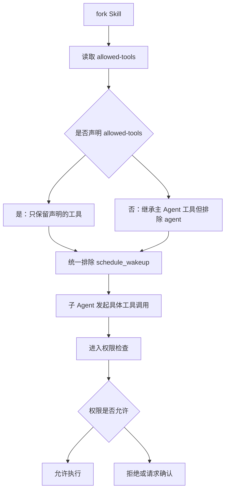
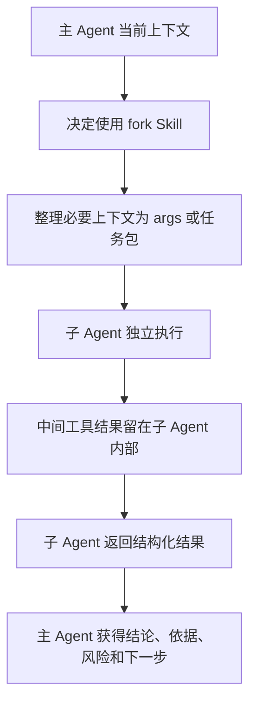
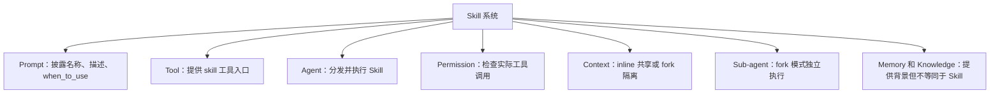

# 09 技能系统

## 第一部分：总结介绍

技能系统的核心作用，是把一类可复用的工作流沉淀成 `SKILL.md`，让 Agent 在合适的时候按既定步骤完成任务。它不是普通工具，也不是记忆。工具提供“能做什么”的执行能力，例如读文件、搜索、运行命令；Skill 提供“应该怎么做”的流程提示，例如提交代码前先看 staged diff、再写 commit message、最后执行提交。记忆保存长期偏好和项目事实，知识库保存可检索文档，而 Skill 更像可复用的任务操作手册。

在 Python 版本里，Skill 的定义集中在 `python/mini_claude/skills.py`。`SkillDefinition` 包含 `name`、`description`、`when_to_use`、`allowed_tools`、`user_invocable`、`context`、`prompt_template`、`source`、`skill_dir` 等字段。其中最关键的是 `context`，它决定 Skill prompt 进入主 Agent 上下文，还是创建子 Agent 独立执行。默认是 `inline`，只有 frontmatter 显式写 `context: fork` 时才进入 fork 模式。

Skill 的发现过程由 `discover_skills()` 完成。它先扫描用户级目录 `~/.claude/skills`，再扫描项目级目录 `.claude/skills`。加载结果用 skill name 做 key，所以项目级 Skill 会覆盖用户级同名 Skill。每个 Skill 必须是一个目录，目录里存在 `SKILL.md` 才会被识别。解析时先读取 frontmatter，再把正文作为 `prompt_template` 保存。当前 Python 实现只扫描 `~/.claude/skills` 和 `.claude/skills`，仓库里的 `.agents/skills` 示例不会被这份发现逻辑加载，这是面试时需要说清楚的实现边界。

Skill 系统也体现了渐进式披露。系统 prompt 不会一开始注入每个 `SKILL.md` 的完整正文，而是通过 `build_skill_descriptions()` 只暴露名称、描述、`when_to_use` 和调用方式。这样模型平时只知道“有哪些 Skill、什么时候该用”，真正需要某个 Skill 时，才通过 `skill` tool 或 CLI slash command 解析完整 prompt。这个设计可以避免 Skill 数量增多后系统 prompt 急剧膨胀，也降低无关工作流对当前任务的干扰。

用户可以通过 `/skills` 查看当前发现的 Skill，也可以通过 `/<skill-name> args` 手动调用可用户触发的 Skill。CLI 逻辑在 `python/mini_claude/__main__.py`。如果用户输入 `/greet 张三`，CLI 会解析 slash command，调用 `get_skill_by_name("greet")` 找到 Skill，再检查它是否 `user_invocable`。如果是 `inline`，CLI 会直接调用 `resolve_skill_prompt()` 替换 `$ARGUMENTS` 或 `${ARGUMENTS}`，然后把解析后的 prompt 交给 `agent.chat()`，相当于把 Skill prompt 作为新的用户消息注入主 Agent。

`inline` 的特点是简单、直接、低成本。它不创建子 Agent，也不隔离上下文。Skill prompt 会进入主 Agent 当前会话，主 Agent 后续的工具调用、分析和输出都继续留在同一个上下文里。因此它适合短流程、格式模板、轻量写作、简单解释这类任务。例如项目里的 `.claude/skills/greet/SKILL.md` 就是典型 inline Skill，作用只是生成简短问候，没有必要单独开一个子 Agent。

但是 inline 的缺点也很明确：它更容易造成上下文污染。所谓上下文污染，不只是上下文变长，而是大量局部任务的中间信息会影响后续决策。比如一个代码审查 Skill 如果 inline 执行，它读取的文件片段、测试日志、失败尝试、临时分析都会留在主 Agent 上下文里。后面用户切换到别的章节时，模型仍可能被这些旧信息干扰。

`fork` 是为了解决这类问题。fork 模式不会让主 Agent 直接执行 Skill prompt，而是通过 `skill` tool 创建一个子 Agent。子 Agent 使用 Skill prompt 作为自己的 `custom_system_prompt`，使用经过过滤的工具列表独立完成任务，最后只把最终文本结果返回主 Agent。主 Agent 不会接收子 Agent 的完整中间过程，因此 fork 可以把复杂任务的过程上下文隔离出去。

这里有一个容易混淆的点：用户手动调用 inline Skill 时，不一定经过 `skill` tool；CLI 会直接把解析后的 prompt 交给 `agent.chat()`。但用户手动调用 fork Skill 时，CLI 不直接创建子 Agent，而是让主 Agent 调用 `skill` tool。这样设计的好处是，fork Skill 的执行、工具过滤、权限继承和 token 统计都集中在 Agent 层，不会散落在 CLI 层。

模型也可以自动调用 Skill。系统 prompt 里已经通过 `build_skill_descriptions()` 告诉模型有哪些 Skill，并提示模型可以用 `skill` tool 程序化调用。`skill` tool 的 schema 定义在 `python/mini_claude/tools.py`，输入包括 `skill_name` 和可选的 `args`。当模型调用 `skill` tool 时，`agent.py` 的 `_execute_tool_call()` 会特殊分发到 `_execute_skill_tool()`，而不是交给普通 `execute_tool()`。

```mermaid
flowchart TD
    A["模型决定调用 skill tool"] --> B["_execute_tool_call"]
    B --> C["name == skill"]
    C --> D["_execute_skill_tool"]
    D --> E["execute_skill 读取 Skill 定义并展开 prompt"]
    E --> F{"context 类型"}
    F --> G["inline：prompt 作为工具结果返回主 Agent"]
    F --> H["fork：创建子 Agent 独立执行"]
    G --> I["主 Agent 下一轮按 Skill prompt 继续工作"]
    H --> J["子 Agent 返回最终文本给主 Agent"]
```

因此 inline 也有两种入口。用户手动 `/skill` 时，Skill prompt 作为 user message 进入主上下文；模型自动调用 `skill` tool 时，Skill prompt 作为 tool result 进入主上下文。两者的共同点是都由主 Agent 继续执行，不创建子 Agent。区别只是消息角色不同，一个来自用户输入路径，一个来自工具结果路径。

fork 模式下，`allowed-tools` 很重要。它不是权限系统本身，而是子 Agent 的工具可见性过滤。如果 Skill 声明了 `allowed-tools`，子 Agent 只能看到这些工具；如果没有声明，子 Agent 默认继承主 Agent 的大部分工具，但会排除 `agent`，避免递归创建子 Agent，同时始终排除 `schedule_wakeup`，因为它只属于动态循环驱动内部。即使某个工具出现在 `allowed-tools` 里，真正执行时仍要经过权限系统检查。所以 `allowed-tools` 决定“看得见哪些工具”，权限系统决定“这次能不能执行”。

fork 的主要收益是隔离上下文污染，但它也带来上下文交流问题。子 Agent 不会天然继承主 Agent 的完整消息历史。它主要拿到 Skill prompt、用户 args、筛选后的工具列表、权限模式，以及它自己通过工具读取到的信息。如果子任务需要主 Agent 已经知道的背景，主 Agent 必须把必要信息明确写进 args，或者让子 Agent 自己通过读文件、搜索等工具重新获取真实项目状态。

这就是 fork 的核心权衡：它减少主上下文污染，但要求上下文传递更显式。工程上更好的做法不是把主 Agent 全部 messages 复制给子 Agent，而是构造结构化任务包，只传任务目标、相关文件、约束条件、已知背景和期望输出。这样既能降低 token 成本，又能避免无关历史干扰子任务。

子 Agent 的返回结果本身承担了压缩上下文的责任。因为主 Agent 看不到子 Agent 的完整轨迹，所以子 Agent 不应该只返回一句结论，而应该返回做了什么、关键依据、修改或检查了哪些文件、是否有失败和未验证点。这样既避免完整日志污染主上下文，又保留必要的可审计性。

从系统关系上看，Skill 连接了 Prompt、Tool、Permission、Context 和 Sub-agent。Prompt 负责披露 Skill 摘要，Tool 负责提供 `skill` 调用入口，Agent 负责分发 `skill` tool，Permission 负责实际工具执行安全，Context 管理决定 inline 还是 fork，Sub-agent 则承担 fork 的隔离执行。它不是一个孤立模块，而是 Agent 系统里“可复用工作流 + 渐进式披露 + 上下文治理”的结合点。

当前实现还有几个边界。第一，`user_invocable` 示例里写的是下划线，但解析代码检查的是 `user-invocable` 连字符；由于默认值是 true，所以 `user_invocable: true` 看起来能工作，但如果写 `user_invocable: false`，这份代码不会识别。第二，Skill 发现结果有缓存，运行中新增 Skill 需要调用 `reset_skill_cache()` 或重启会话才能稳定刷新。第三，Python 版本只实现本地 `SKILL.md`，没有实现插件市场、远程 Skill、复杂 schema 校验或热加载。这些不是理念问题，而是教学项目的实现取舍。

## 面试话术版本

这个项目里的 Skill 是一种可复用 prompt 工作流，它把常见任务的步骤写进 `SKILL.md`。系统不会一开始把所有 Skill 正文都塞进 prompt，而是只注入名称、描述和 `when_to_use`，让模型知道什么时候可以用；真正使用时才通过 slash command 或 `skill` tool 展开完整 prompt，这就是渐进式披露。

Skill 有两种上下文模式。`inline` 会把解析后的 Skill prompt 注入主 Agent 当前上下文，让主 Agent 继续执行，适合短模板和轻量流程。`fork` 会通过 `skill` tool 创建子 Agent，把 Skill prompt 作为子 Agent 的 system prompt，并按 `allowed-tools` 过滤工具，最后只把结果返回主 Agent，适合复杂、多工具、容易产生大量中间日志的任务。

我理解这里的核心不是“能不能调用 Skill”，而是上下文生命周期管理。inline 的优势是便宜、直接、能共享主上下文，但容易污染主会话；fork 的优势是隔离过程上下文、控制工具范围、降低主上下文膨胀，但需要显式传递必要背景。工程上要根据任务复杂度、中间信息体量、权限范围和可审计性来决定使用哪种模式。

## 第二部分：面试问答与追问补充

### Q1：面试官问：Skill 和普通 Tool 有什么区别？

Tool 是执行能力，Skill 是工作流提示。比如 `read_file`、`grep_search`、`run_shell` 是工具，它们真正操作文件或命令；Skill 是告诉 Agent 如何组合这些工具完成某类任务的 prompt 模板。

所以 Skill 不直接等于能力本身，它更像“任务操作手册”。Skill 可以指导模型调用多个工具，但真正的工具执行仍然走 Agent 的工具分发和权限检查。

### Q2：面试官问：为什么 Skill 不直接全部放进 system prompt？

因为 Skill 数量一多，完整正文会显著增加 system prompt 体积，而且很多 Skill 和当前任务无关。全量注入会浪费 token，也可能干扰模型判断。

这个项目采用渐进式披露：system prompt 只暴露 Skill 名称、描述和 `when_to_use`；模型或用户真正触发某个 Skill 时，才加载完整 `SKILL.md`。这样既保留可发现性，又控制上下文成本。

### Q3：面试官问：Skill 是怎么被发现的？

Python 版本通过 `discover_skills()` 发现 Skill。它先扫描 `~/.claude/skills`，再扫描当前项目的 `.claude/skills`。每个 Skill 是一个子目录，里面必须有 `SKILL.md`。

发现结果用 Skill name 做 key，所以项目级 Skill 会覆盖用户级同名 Skill。这个逻辑让用户可以有全局技能，同时项目可以定义自己的定制版本。

### Q4：面试官问：`.agents/skills` 会被 Python 版本加载吗？

当前不会。虽然仓库里有 `.agents/skills/commit/SKILL.md` 和 `.agents/skills/greet/SKILL.md`，但 Python 代码只扫描 `~/.claude/skills` 和 `.claude/skills`。

面试时我会明确说这是当前实现边界。如果要兼容 `.agents/skills`，需要扩展 `discover_skills()` 的扫描路径，并定义路径优先级和冲突覆盖规则。

### Q5：面试官问：`inline` 和 `fork` 的本质区别是什么？

`inline` 是主 Agent 执行，Skill prompt 进入主 Agent 当前上下文。`fork` 是子 Agent 执行，Skill prompt 作为子 Agent 的 system prompt，子 Agent 完成后只把最终结果返回主 Agent。

本质上这是上下文策略的区别：inline 追求共享和低成本，fork 追求隔离和可控。

### Q6：面试官问：用户手动调用 Skill 一定会走 `skill` tool 吗？

不一定。用户输入 `/skill args` 时，CLI 会先解析 slash command。如果这个 Skill 是 inline，CLI 直接展开 prompt 并调用 `agent.chat(resolved_prompt)`，不经过 `skill` tool。

如果这个 Skill 是 fork，CLI 会给主 Agent 发送一条“请调用 skill tool”的消息，后续由主 Agent 通过 `skill` tool 创建子 Agent。模型自动触发 Skill 时，也会走 `skill` tool。

### Q7：面试官问：为什么 fork 手动调用时不直接在 CLI 创建子 Agent？

因为子 Agent 创建、工具过滤、权限继承、token 统计都属于 Agent 执行层职责。如果 CLI 直接创建子 Agent，会让调用路径分散，用户手动触发和模型自动触发也会变成两套流程。

现在的设计是：CLI 只负责识别用户命令，真正的 fork 执行统一回到 Agent 的 `skill` tool 分发路径。这样行为更集中，也更容易维护。

### Q8：面试官问：inline 为什么更容易造成上下文污染？

因为 inline 会把 Skill prompt 和后续执行过程都留在主 Agent 上下文里。简单任务问题不大，但如果是代码审查、测试、提交这类长链路任务，大量 diff、日志、临时分析都会跟着主会话继续存在。

上下文污染不只是 token 变多，还包括旧任务的中间信息影响后续决策。比如用户切到另一个模块时，模型可能仍然被前一个 Skill 的过程信息干扰。

### Q9：面试官问：fork 是怎么降低上下文污染的？

fork 创建子 Agent，让子 Agent 独立读文件、运行工具、分析中间结果。主 Agent 不接收这些完整过程，只接收最终输出。

所以 fork 可以把“过程上下文”留在子 Agent 内部，把“结果上下文”返回给主 Agent。它是一种预防型上下文治理，不是等上下文变长之后再压缩。

### Q10：面试官问：fork 会不会导致子 Agent 上下文不够？

会，这是 fork 的代价。子 Agent 不自动继承主 Agent 的完整历史，只拿到 Skill prompt、args、工具列表和权限模式。如果它需要主 Agent 已经知道的背景，就必须通过 args 显式传入，或者让它自己用工具重新读取项目状态。

所以 fork 的关键设计不是盲目隔离，而是“只传必要上下文”。更好的方案是传结构化任务包，包括任务目标、相关文件、约束、已知背景和期望输出。

### Q11：面试官问：主 Agent 和子 Agent 是怎么交流的？

当前项目是一次性派发、一次性返回。主 Agent 调用 `skill` tool，传入 `skill_name` 和 `args`；`_execute_skill_tool()` 创建子 Agent；子 Agent 用 `run_once()` 完成任务；最后返回最终文本给主 Agent。

它不是主子 Agent 多轮实时对话。这个设计简单，隔离性强，但要求子 Agent 最终结果足够完整。

### Q12：面试官问：fork 子 Agent 最终应该返回什么？

不应该只返回一句结论。因为主 Agent 看不到子 Agent 的完整执行轨迹，所以返回结果应该包括做了什么、关键依据、涉及文件、失败或风险、未验证点和下一步建议。

这样既避免把完整日志塞回主上下文，又能保留可解释性和可审计性。

### Q13：面试官问：`allowed-tools` 是权限系统吗？

不是。`allowed-tools` 是工具可见性过滤，它决定子 Agent 能看到哪些工具。权限系统决定某次工具调用能不能真正执行。

即使工具在 `allowed-tools` 中，实际执行时仍然会经过权限检查。反过来，如果工具没进入子 Agent 的工具列表，子 Agent 根本不会生成对这个工具的调用。

### Q14：面试官问：为什么 fork 默认排除 `agent` 和 `schedule_wakeup`？

排除 `agent` 是为了避免子 Agent 再创建子 Agent，导致递归调用链不可控。排除 `schedule_wakeup` 是因为它只属于 `/loop dynamic mode` 的内部驱动工具，不应该被普通 fork Skill 继承。

这体现了工具作用域控制：不是主 Agent 有什么工具，子 Agent 就必须继承什么工具。

### Q15：面试官问：Skill 的 `user_invocable` 有什么作用？

`user_invocable` 控制用户能不能通过 `/<skill-name>` 手动调用这个 Skill。用户可调用的 Skill 会在 prompt 描述里以 `/name` 展示，自动 Skill 则主要由模型根据 `when_to_use` 判断后用 `skill` tool 调用。

当前 Python 解析代码检查的是 `user-invocable`，但示例写的是 `user_invocable`。因为默认值是 true，示例中的 true 不会暴露问题；如果想写 false，就需要注意这个字段兼容问题。

### Q16：面试官问：`when_to_use` 的作用是什么？

`when_to_use` 是给模型看的触发条件。它不会被宿主代码强制执行，而是注入到动态 system context 里，帮助模型判断什么时候应该调用某个 Skill。

所以它属于 prompt 侧引导，不是权限规则。如果需要硬约束，必须在工具执行、权限检查或 Skill 调度代码里实现。

### Q17：面试官问：Skill prompt 里的 `$ARGUMENTS` 是怎么替换的？

`resolve_skill_prompt()` 会把 `$ARGUMENTS` 或 `${ARGUMENTS}` 替换成用户传入的 args，并把 `${CLAUDE_SKILL_DIR}` 替换成 Skill 所在目录。

这使 Skill 可以写成通用模板。比如用户输入 `/greet 张三`，Skill 正文里的 `$ARGUMENTS` 就会变成 `张三`。

### Q18：面试官问：Skill 和 Memory 有什么区别？

Memory 保存长期偏好、项目事实或用户希望持久化的信息，目标是跨任务复用背景。Skill 保存可复用的操作流程，目标是指导 Agent 如何完成一类任务。

简单说，Memory 回答“我应该记住什么”，Skill 回答“我应该怎么做”。

### Q19：面试官问：Skill 和 Knowledge 有什么区别？

Knowledge 是外部资料检索系统，通常通过关键词或向量召回相关文档片段。Skill 是预定义工作流 prompt，不是按语义检索文档。

Knowledge 提供依据，Skill 提供方法。一个 Skill 可以指导 Agent 去查 Knowledge，但两者不是同一层能力。

### Q20：面试官问：Skill 和经验库有什么关系？

经验库通常来自任务轨迹沉淀，记录过去某类任务怎么成功完成。Skill 是显式编写的稳定流程。

工程上可以把高质量、重复出现的经验总结成 Skill，但当前 Python 项目没有自动把经验转成 Skill。这属于后续可扩展方向。

### Q21：面试官问：fork 和上下文压缩有什么关系？

fork 是事前隔离，压缩是事后治理。fork 在复杂任务开始前就把中间过程放到子 Agent，避免污染主上下文；上下文压缩是在主上下文已经增长后，对旧工具结果和历史消息做 snip 或 summary。

两者可以配合。复杂 Skill 用 fork 降低进入主上下文的信息量，主 Agent 自己仍然需要按阈值做上下文治理。

### Q22：面试官问：fork 会不会隐藏太多过程，导致主 Agent 无法审计？

会有这个风险。如果子 Agent 只返回最终结论，主 Agent 就不知道依据和风险。

解决办法不是把所有日志都返回，而是让子 Agent 返回结构化证据，例如关键命令结果、修改文件、检查结论、风险和未验证点。这样既控制上下文体积，又保留审计能力。

### Q23：面试官问：如何判断一个 Skill 应该 inline 还是 fork？

我会看任务是否会产生大量中间上下文、是否需要多轮工具调用、是否需要独立工具范围、是否希望和主任务隔离。

短模板、轻量写作、格式转换适合 inline。代码审查、提交、测试修复、复杂检索、迁移分析适合 fork。

### Q24：面试官问：如果 fork 子 Agent 需要主 Agent 之前的上下文怎么办？

不要直接复制主 Agent 全部历史，而是传最小必要上下文。可以把任务目标、相关文件、约束、用户要求、已知背景整理成 args 或结构化任务包。

如果需要最新代码状态，优先让子 Agent 用工具重新读取文件，因为工具读取的是当前真实状态，比复制旧上下文更可靠。

### Q25：面试官问：Skill 为什么要和权限系统分开设计？

Skill 是 prompt 层工作流，权限是宿主层安全机制。Skill 可以建议调用某个工具，但不能绕过权限检查。

这种分层很重要。即使恶意或错误的 Skill prompt 要求执行危险命令，真正执行时仍然应该经过权限系统判断、deny 规则、plan mode、危险操作确认等流程。

### Q26：面试官问：这个 Skill 系统有哪些生产级改进方向？

可以补充 schema 校验，避免 frontmatter 字段写错；修复 `user_invocable` 和 `user-invocable` 的兼容问题；支持热加载和缓存失效；支持 Skill 版本管理；支持更细的工具权限声明；支持结构化子 Agent 返回；支持从高质量经验自动生成候选 Skill。

还可以给 Skill 调用加评测，例如统计触发准确率、任务成功率、上下文节省量、fork 额外成本和失败原因。

