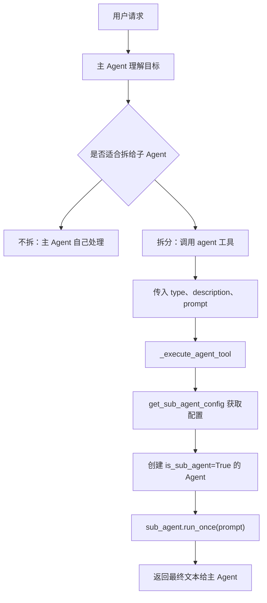
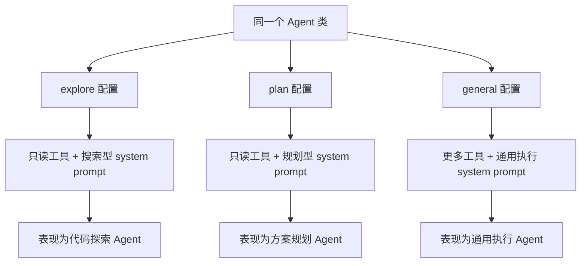
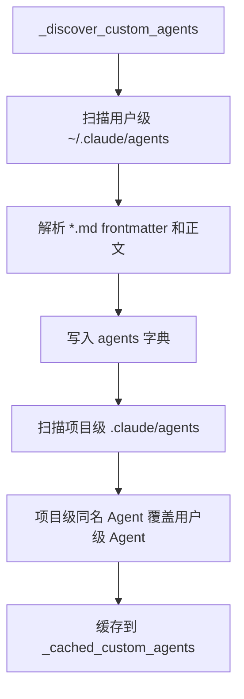
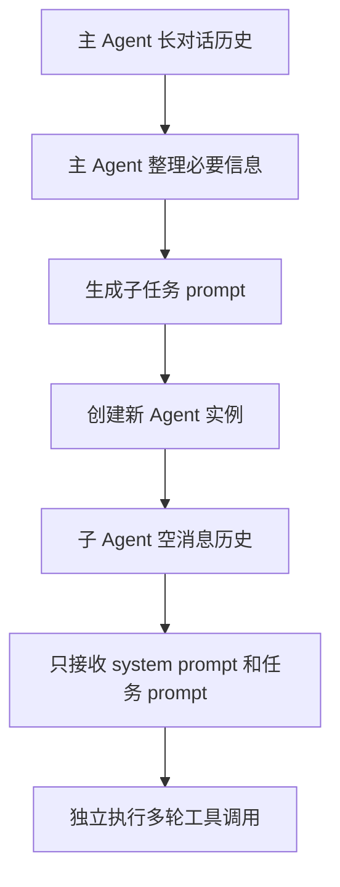
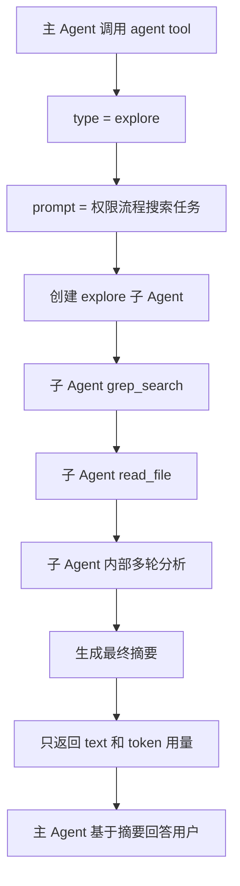
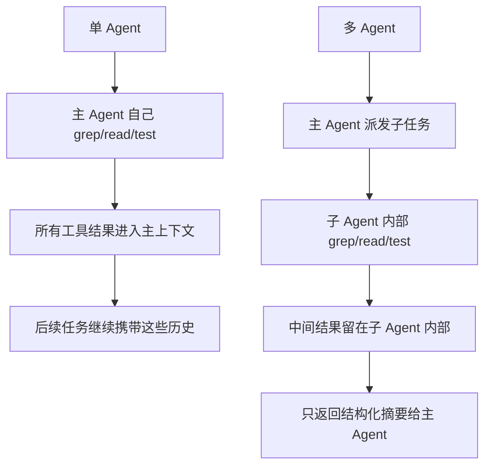
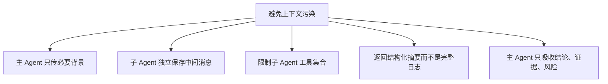
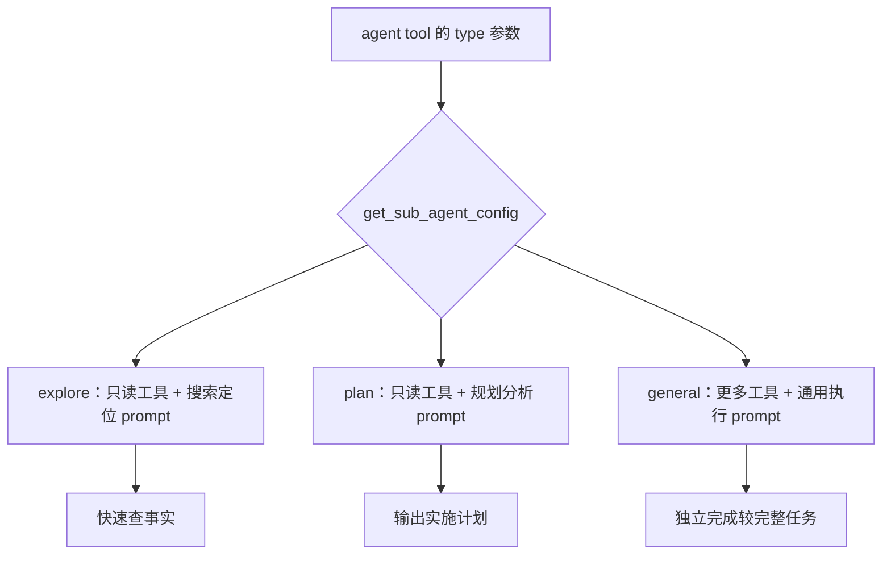

# 11 多 Agent 架构

## 第一部分：总结介绍

这个项目里的多 Agent 架构，本质是 `fork-return pattern`：主 Agent 把一个边界清楚的子任务交给子 Agent，子 Agent 在自己的上下文里独立完成搜索、分析或执行，最后只把最终结果返回给主 Agent。它不是把多个 Agent 混在同一个 message list 里协作，而是通过隔离上下文来降低主会话污染。

主入口是 `agent` 工具，定义在 `python/mini_claude/tools.py`。它要求模型传入 `type`、`description` 和 `prompt`。`type` 决定启动哪类子 Agent，`description` 用于 UI 展示和日志，`prompt` 是主 Agent 整理后交给子 Agent 的具体任务说明。这里要注意，主 Agent 不会把自己的长对话历史完整传给子 Agent，而是只传这个结构化 prompt。

真正创建子 Agent 的逻辑在 `python/mini_claude/agent.py` 的 `_execute_agent_tool()`。主 Agent 收到 `agent` 工具调用后，会先根据 `type` 调用 `get_sub_agent_config()` 取得子 Agent 的 system prompt 和工具集合，然后重新构造一个新的 `Agent` 实例，并传入 `custom_system_prompt`、`custom_tools`、`is_sub_agent=True` 和继承后的 `permission_mode`。因此子 Agent 复用同一个 `Agent` 类，但它的系统提示词、工具可见范围、消息历史和运行行为都和主 Agent 不同。



子 Agent 类型分为内置类型和自定义类型。内置类型在 `python/mini_claude/subagent.py` 中硬编码，包括 `explore`、`plan` 和 `general`。这三个子 Agent 并不是三个不同的 Python 类，它们都复用同一个 `Agent` 类，区别来自 `get_sub_agent_config()` 返回的 `system_prompt` 和 `tools`。也就是说，系统通过“角色提示词 + 工具集合 + 调用时传入的任务 prompt”控制它们表现出不同行为。

`explore` 是只读代码探索 Agent，适合找文件、查调用链、定位实现。它只拿 `read_file`、`list_files`、`grep_search`，system prompt 明确要求快速搜索、分析现有代码、禁止任何修改。`plan` 也是只读 Agent，工具集合和 `explore` 一样，但 system prompt 的目标不同：它不是单纯找信息，而是理解架构后输出结构化实施计划、关键文件和风险。`general` 是通用执行 Agent，默认拿除 `agent` 以外的大部分工具，能完成更完整的独立任务，但不能继续创建子 Agent，避免递归委派不可控。

| 子 Agent 类型 | 主要职责 | 工具集合 | 行为控制方式 | 适合场景 |
|---|---|---|---|---|
| `explore` | 快速搜索和事实收集 | `read_file`、`list_files`、`grep_search` | system prompt 强调只读、快速定位、返回发现 | 查调用链、找实现位置、收集代码事实 |
| `plan` | 只读分析并制定方案 | `read_file`、`list_files`、`grep_search` | system prompt 强调架构理解、步骤、风险 | 修改前规划、方案评估、列实施步骤 |
| `general` | 独立完成较完整任务 | 除 `agent` 外的大部分工具 | system prompt 强调完成任务但不过度扩展 | 相对独立的执行、验证、整理任务 |



自定义 Agent 从 `~/.claude/agents/*.md` 和项目级 `.claude/agents/*.md` 加载。用户级优先级低，项目级优先级高，同名时项目级覆盖用户级。每个自定义 Agent 文件通过 frontmatter 定义 `name`、`description`、`allowed-tools`，正文则作为该子 Agent 的 system prompt。当前项目里的 `.claude/agents/reviewer.md` 就是一个代码审查子 Agent，它通过 `allowed-tools: read_file,list_files,grep_search` 把能力限制为只读分析。



自定义 Agent 的披露也采用渐进式披露。`build_agent_descriptions()` 只把自定义 Agent 的名称和描述加入动态 system prompt，让主 Agent 知道有哪些额外类型可用。真正调用某个类型时，才通过 `get_sub_agent_config()` 读取它的完整 system prompt 和工具限制。这样可以避免把所有自定义 Agent 的完整 prompt 一开始就塞进主 Agent 上下文。

子 Agent 的上下文是独立的。它不是复用主 Agent 的 `_anthropic_messages` 或 `_openai_messages`，而是在新 `Agent` 实例里重新初始化自己的消息列表。主 Agent 传给子 Agent 的只有整理后的 `prompt`、子 Agent 类型对应的 system prompt、工具集合、权限模式、模型和 API base。主 Agent 前面长对话中的所有工具结果、历史问答、临时分析，不会自动进入子 Agent。



举一个具体例子。用户问：“帮我分析权限系统的执行流程，重点看危险命令如何拦截。”主 Agent 可能判断这个任务需要大量搜索，但不希望这些 grep 和 read 结果污染主上下文，于是调用：

```json
{
  "type": "explore",
  "description": "trace permission flow",
  "prompt": "请只读搜索权限系统相关代码，重点定位 check_permission、危险 shell 判断、plan mode、acceptEdits、allow/deny 规则的调用链。返回关键文件、函数、执行顺序和风险点，不要修改文件。"
}
```

这个 prompt 是主 Agent 对用户意图的压缩和任务化表达。子 Agent 收到后，只知道这段明确任务，不知道主 Agent 前面所有长对话。它会在自己的消息历史里调用 `grep_search`、`read_file`、`list_files`，最后输出一段结构化摘要。主 Agent 收到的不是子 Agent 的完整 message history，而是 `run_once()` 返回的最终 `text` 和 token 用量。



`run_once()` 是子 Agent 隔离输出的关键。它会设置 `_output_buffer` 捕获子 Agent 的最终输出，然后调用 `sub_agent.chat(prompt)`。子 Agent 在内部可能经历多轮模型调用和工具调用，但这些中间 messages 都留在子 Agent 自己的 `_anthropic_messages` 或 `_openai_messages`。最后 `run_once()` 只返回拼接后的文本，以及本次子 Agent 消耗的 input/output token。主 Agent 再把这段文本当作工具结果接收。

这就是多 Agent 和单 Agent 的关键区别。单 Agent 会把所有探索、工具结果、中间失败、临时分析都留在同一个上下文里；多 Agent 把局部任务的过程上下文放在子 Agent 内部，主 Agent 只接收结果上下文。它不是让模型天然变聪明，而是在工程上重新划分上下文边界。



主 Agent 和子 Agent 的分工也很明确。主 Agent 负责理解用户目标、判断是否拆分、选择子 Agent 类型、构造子任务 prompt、控制整体安全边界、整合结果并最终对用户负责。子 Agent 负责执行一个边界清楚的局部任务，比如代码探索、方案规划、代码审查、测试定位或文档梳理，并把结果结构化返回。

子 Agent 的切分维度通常有四类。第一是任务阶段，例如探索、规划、执行、审查；第二是专业角色，例如 reviewer、tester、security-auditor、doc-writer；第三是权限范围，例如只读、可编辑、可运行命令；第四是上下文污染风险，例如是否会读取大量文件、产生大量日志、进行多轮试错。这个项目的 `explore` 和 `plan` 就是按任务阶段和只读权限切分，`reviewer` 则是按专业角色和只读工具切分。

为了避免上下文污染，主 Agent 不应该把完整历史复制给子 Agent，而应该只传必要上下文。子 Agent 也不应该把完整工具日志倒灌给主 Agent，而应该返回结论、关键依据、涉及文件、风险和未验证点。这样既能保留可审计性，又不会把大量中间过程重新塞回主上下文。



权限继承是多 Agent 里不能漏的安全点。子 Agent 的权限模式由 `_child_permission_mode()` 决定：如果主 Agent 是 `plan`，子 Agent 也必须是 `plan`；如果主 Agent 是 `auto`，子 Agent 也必须是 `auto`；其他模式在这个教学实现里统一变成 `bypassPermissions`。这样做主要是防止主 Agent 在 plan mode 或 auto mode 下，通过委派子 Agent 绕过只读限制或自动安全分类。

不过这份 Python 实现有教学项目的简化。生产级系统里，更稳妥的做法是每个子 Agent 工具调用都继续按照主会话策略逐个检查，并保留更细粒度的权限继承规则。`allowed-tools` 也不能代替权限系统，因为它只决定子 Agent 看得到哪些工具，不决定工具是否允许执行。

子 Agent 和 MCP 的关系也有边界。主 Agent 首次 `chat()` 时会懒加载 MCP，但条件是 `not self.is_sub_agent`，所以子 Agent 不会自己初始化 MCP。当前实现下，子 Agent 更适合使用内置本地工具。如果生产级要让子 Agent 稳定调用 MCP，需要共享主 Agent 已连接的 MCP manager，或者在创建子 Agent 时注入可用的 MCP 连接。

最后，多 Agent 和 Skill fork 是相邻但不同的机制。普通多 Agent 通过 `agent` tool 创建子 Agent，system prompt 来自 agent type；Skill fork 通过 `skill` tool 创建子 Agent，system prompt 来自 `SKILL.md`。两者底层都使用 `Agent(..., is_sub_agent=True)` 和 `run_once()`，都是 fork-return，但一个强调通用任务委派，一个强调可复用工作流隔离执行。

## 核心解析主线：13 个关键点

### 1. 多 Agent 架构解决什么问题

多 Agent 主要解决单 Agent 长任务里的上下文污染、职责混杂和 token 成本问题。单 Agent 如果自己完成搜索、规划、验证、审查，所有中间工具结果都会进入同一个 message history。任务越长，主上下文越容易被旧文件片段、搜索结果、失败日志和临时分析占满。

这个项目采用的不是复杂的多智能体实时协商，而是更工程化的 fork-return：主 Agent 派发一个子任务，子 Agent 在隔离上下文里独立完成，最后只返回摘要。这样主 Agent 保留全局控制权，子 Agent 消化局部细节。

### 2. `agent` 工具是多 Agent 的唯一调度入口

主 Agent 创建子 Agent 不是直接调用某个 Python 函数给模型看，而是模型先生成 `agent` 工具调用。`agent` 工具 schema 定义在 `tools.py`，核心参数是 `type`、`description` 和 `prompt`。

`type` 表示要启动哪类子 Agent，`description` 用于 UI 和日志展示，`prompt` 是主 Agent 整理后的详细子任务说明。这个设计让委派行为也纳入标准 Agent Loop：先由模型决定是否调用工具，再经过权限和执行分发，最后把工具结果返回模型。

### 3. 三个内置子 Agent 如何区分

`explore`、`plan`、`general` 不是三个不同的类，而是同一个 `Agent` 类在不同配置下的三种角色。真正区分它们的是 `get_sub_agent_config()` 返回的 system prompt 和工具集合。

`explore` 使用只读工具，prompt 强调快速搜索、定位实现、返回发现；`plan` 也使用只读工具，但 prompt 强调理解架构、设计步骤、列关键文件和风险；`general` 使用更多工具，prompt 强调独立完成任务，但工具集合排除了 `agent`，防止递归委派。也就是说，行为差异由“工具硬约束 + prompt 软约束 + 主 Agent 传入任务”共同塑造。



### 4. 自定义 Agent 如何被发现

自定义 Agent 从用户级 `~/.claude/agents/*.md` 和项目级 `.claude/agents/*.md` 加载。加载顺序是先用户级、后项目级，同名时项目级覆盖用户级。每个 md 文件的 frontmatter 提供 `name`、`description`、`allowed-tools`，正文则作为该 Agent 的 system prompt。

当前项目里的 `.claude/agents/reviewer.md` 就是自定义 Agent 示例。它用 `allowed-tools` 把能力限制为 `read_file`、`list_files`、`grep_search`，正文则规定它作为 code review specialist 只报告真实问题。这说明自定义 Agent 的核心是“角色 prompt + 工具白名单”。

### 5. 自定义 Agent 如何披露给主 Agent

自定义 Agent 不会把完整 prompt 全量塞进主 Agent 的 system prompt。`build_agent_descriptions()` 只把自定义 Agent 的名称和描述加入动态 system context，让主 Agent 知道有哪些额外类型可以使用。

真正调用时，`get_sub_agent_config()` 才读取自定义 Agent 的完整 system prompt 和工具配置。这和 Skill 的渐进式披露思路类似：常驻上下文只放索引和摘要，详细执行规则按需加载，避免主 Agent prompt 膨胀。

### 6. 主 Agent 如何创建子 Agent

当模型调用 `agent` 工具后，`_execute_tool_call()` 会把 `name == "agent"` 的调用分发给 `_execute_agent_tool()`。这里先取出 `type`、`description`、`prompt`，再调用 `get_sub_agent_config(type)` 获取子 Agent 配置。

随后代码重新构造一个 `Agent` 实例，并传入 `custom_system_prompt=config["system_prompt"]`、`custom_tools=config["tools"]`、`is_sub_agent=True`、`permission_mode=self._child_permission_mode()`。这说明子 Agent 复用了同一个 Agent Loop 实现，但入口 system prompt、工具集合、权限模式和运行标志都被改写了。

### 7. `run_once()` 如何隔离输出

子 Agent 不是进入一个长期 REPL，而是通过 `run_once(prompt)` 执行一次子任务。`run_once()` 会设置 `_output_buffer`，然后调用 `self.chat(prompt)`。子 Agent 最终生成的文本会被 `_emit_text()` 捕获到 buffer，而不是直接打印给用户。

执行结束后，`run_once()` 只返回两类数据：最终文本 `text` 和本次消耗的 input/output token。子 Agent 内部多轮工具调用形成的完整 message history 不会返回主 Agent。这是 fork-return 模式能避免上下文污染的关键。

### 8. 子 Agent 和主 Agent 的上下文关系

子 Agent 不继承主 Agent 的完整 `_anthropic_messages` 或 `_openai_messages`。它是新建 Agent 实例，消息历史从空开始。主 Agent 传给它的是整理后的任务 prompt，而不是整段长对话。

因此子 Agent 能看到的上下文只有自己的 system prompt、主 Agent 明确传入的任务 prompt、它自己通过工具读到的文件或结果。好处是隔离主上下文噪声，代价是主 Agent 必须把必要背景说清楚。多 Agent 的工程难点也在这里：不能传太多，否则污染；不能传太少，否则子任务偏题。

### 9. 子 Agent 的权限继承

子 Agent 的权限模式由 `_child_permission_mode()` 决定。主 Agent 如果处于 `plan`，子 Agent 也必须处于 `plan`；主 Agent 如果处于 `auto`，子 Agent 也必须处于 `auto`；其他模式在当前教学实现里统一变成 `bypassPermissions`。

这里的核心安全考虑是防止权限绕过。假设主 Agent 在 plan mode 不能改文件，如果子 Agent 不继承 plan mode，主 Agent 就可以把修改任务包装成子任务委派出去。Auto Mode 也是一样，如果子 Agent 不继承 auto，危险操作可能绕过自动分类器。

### 10. 子 Agent 与 MCP 的关系

主 Agent 第一次 `chat()` 时会懒加载 MCP，但条件里有 `not self.is_sub_agent`，所以子 Agent 默认不会自己连接 MCP。这个设计降低了复杂度，也避免每个子 Agent 都启动外部 MCP 进程。

代价是当前 Python 实现里子 Agent 对 MCP 支持不完整。如果子 Agent 看到了 MCP 工具 schema，但自己的 `_mcp_manager` 没有连接，对应调用可能失败。生产级实现需要选择策略：要么禁止子 Agent 使用 MCP，要么把主 Agent 已连接的 MCP manager 注入子 Agent，并继续做权限和审计。

### 11. 子 Agent 与经验日志、Memory、自动保存的关系

子 Agent 的中间行为默认不进入主任务经验日志。`_record_tool_request()`、`_record_tool_result()`、`_record_tool_denial()` 遇到 `is_sub_agent` 会直接 return；Memory 预取对子 Agent 也关闭；聊天结束时只有主 Agent 会打印分隔线和自动保存。

这个设计继续服务于隔离：子 Agent 内部的搜索和试错不污染主会话经验。但它也意味着，如果子 Agent 发现了重要结论，必须在最终结果里结构化返回，主 Agent 才能把它纳入后续回答、经验沉淀或文档总结。

### 12. 多 Agent 和 Skill fork 的关系

普通多 Agent 和 Skill fork 底层都创建 `Agent(..., is_sub_agent=True)`，也都调用 `run_once()`，所以它们共享 fork-return 的上下文隔离机制。

区别在入口和 system prompt 来源。普通多 Agent 入口是 `agent` tool，system prompt 来自 agent type，比如 `explore`、`plan`、`general`、`reviewer`；Skill fork 入口是 `skill` tool，system prompt 来自 `SKILL.md`。前者是通用任务委派，后者是可复用工作流的隔离执行。

### 13. 什么时候应该使用子 Agent

适合使用子 Agent 的任务通常有几个特征：搜索范围大但最终只需要摘要；任务相对独立；会产生大量中间工具结果；需要不同角色或工具范围；可以并行拆成多个互不依赖的调查任务。比如代码探索、架构规划、代码审查、测试失败定位，都适合拆给专门子 Agent。

不适合使用子 Agent 的任务也很明确：任务很短、需要频繁用户确认、强依赖主 Agent 的隐含上下文、涉及高风险状态修改，或者子 Agent 的输出很难被主 Agent 审计。面试时要强调，子 Agent 不是越多越好，拆分粒度要服务于上下文隔离、职责清晰和结果可验证。

## 面试话术版本

这个项目的多 Agent 架构采用 fork-return pattern。主 Agent 通过 `agent` 工具把一个明确的子任务派发给子 Agent，子 Agent 是重新创建的 `Agent` 实例，有自己的 system prompt、工具集合和消息历史。主 Agent 的完整长对话不会传给子 Agent，子 Agent 内部多轮工具调用产生的 messages 也不会完整返回主 Agent，最后只返回文本结果和 token 用量。

这样做的核心价值是上下文隔离。单 Agent 会把搜索、读文件、测试日志和中间分析都堆在主上下文里，容易污染后续决策；多 Agent 把局部任务的过程上下文留在子 Agent 内部，只把结论、依据和风险返回主 Agent。主 Agent 负责理解目标、拆任务、选 Agent 类型、写清楚 prompt、整合结果；子 Agent 负责边界清楚的局部任务。

子 Agent 通常按任务阶段、专业角色、权限范围和上下文污染风险切分。比如 `explore` 只读探索代码，`plan` 只读生成方案，`reviewer` 做代码审查。为了避免污染，主 Agent 不复制完整历史，只传必要背景；子 Agent 不返回完整消息列表，只返回结构化摘要。这里的重点不是“多开几个模型”，而是清晰划分上下文生命周期和工具权限边界。

## 第二部分：面试问答与追问补充

### Q1：面试官问：主 Agent 的长对话列表会完整传给子 Agent 吗？

不会。这个项目里子 Agent 是重新创建的 `Agent` 实例，不是复用主 Agent 的 message list。创建子 Agent 时只传了 `custom_system_prompt`、`custom_tools`、`is_sub_agent=True` 和继承后的权限模式。子 Agent 初始化时会重新创建自己的 `_anthropic_messages` 和 `_openai_messages`，所以主 Agent 的长历史不会自动复制过去。

真正传给子 Agent 的业务信息，是 `agent` tool 里的 `prompt` 字段。这个 prompt 应该由主 Agent 把用户目标、必要背景、约束和输出要求整理清楚后再交出去。这样做的好处是能隔离上下文污染，坏处是如果主 Agent 没把关键信息写进去，子 Agent 就可能漏掉上下文。所以多 Agent 不是简单“复制上下文给另一个模型”，而是“主 Agent 压缩并转述必要上下文”。

### Q2：面试官问：子 Agent 能读到主 Agent 的上下文信息吗？

不能直接读到完整上下文。子 Agent 能看到的只有三类信息：第一是自己的 system prompt，比如 `EXPLORE_PROMPT` 或 `PLAN_PROMPT`；第二是主 Agent 传入的任务 prompt；第三是它自己通过工具读取到的文件、搜索结果或命令输出。

这是一种有意的隔离设计。比如主 Agent 前面已经和用户讨论过“重点关注危险 shell 判断”，如果主 Agent 没有把这个重点写进子任务 prompt，子 Agent 就不会天然知道。更好的做法是把必要背景明确写进去，或者让子 Agent 通过 `read_file`、`grep_search` 读取当前代码事实。面试时我会强调：子 Agent 不继承完整上下文，是为了避免把主会话里的噪声和历史状态带入子任务。

### Q3：面试官问：能举例说明主 Agent 怎么把任务给子 Agent 吗？

比如用户让主 Agent 分析权限系统：“帮我看危险命令是怎么被拦截的。”主 Agent 判断这需要搜索多个文件，但最终只需要一份流程摘要，于是可以调用 `agent` 工具，把任务交给 `explore`：

```json
{
  "type": "explore",
  "description": "trace permission flow",
  "prompt": "请只读搜索权限系统相关代码，重点定位 check_permission、危险 shell 判断、plan mode、acceptEdits、allow/deny 规则的调用链。返回关键文件、函数、执行顺序和风险点，不要修改文件，不要返回完整文件内容。"
}
```

这条 prompt 里已经包含了任务目标、搜索范围、禁止事项和返回格式。子 Agent 收到后会在自己的上下文里调用 `grep_search`、`read_file` 等只读工具，最后返回一段结构化摘要。主 Agent 再基于这个摘要组织最终回答。这里的关键是：主 Agent 不是把“所有历史”给子 Agent，而是把“足够完成子任务的最小上下文”给子 Agent。

### Q4：面试官问：子 Agent 多轮对话后的所有 messages 会返回给主 Agent 吗？

不会。子 Agent 内部可能经历多轮模型调用和工具调用，例如先搜索函数名，再读取文件，再补充搜索调用点，最后形成结论。这些中间 messages 都留在子 Agent 自己的 `_anthropic_messages` 或 `_openai_messages` 里，不会完整回传给主 Agent。

主 Agent 最后拿到的是 `run_once()` 返回的 `text` 和 token 用量。`text` 是子 Agent 最终输出的文本，不是完整 transcript。这正是拆分子 Agent 的意义：让局部任务的中间过程在子 Agent 内部消化掉，主 Agent 只吸收结论、依据和风险。如果把子 Agent 的全部 messages 再返回给主 Agent，就会重新污染主上下文，基本抵消 fork-return 的价值。

### Q5：面试官问：那多 Agent 和单 Agent 有什么本质区别？

本质区别是上下文边界和职责边界。单 Agent 做所有事时，搜索、读文件、测试日志、中间失败和临时分析都会进入同一个上下文。模型后续每轮都可能带着这些历史继续推理，成本上升，也容易被旧任务信息干扰。

多 Agent 则把局部任务放到独立上下文里，子 Agent 在内部完成探索或分析，最后只返回摘要。它不一定提升单次模型推理能力，但能让复杂任务更可控：主 Agent 保持全局目标和用户沟通，子 Agent 消化局部细节。面试时我会说，多 Agent 的收益不是“多个模型一定更聪明”，而是上下文生命周期被切开了。

### Q6：面试官问：拆子 Agent 的意义是什么？

主要有四个意义。第一是隔离上下文污染，把大量中间搜索结果、文件内容和日志留在子 Agent 内部。第二是降低主上下文 token 压力，主 Agent 只需要保留最终摘要。第三是职责更清晰，主 Agent 做任务拆解和结果整合，子 Agent 做局部执行。第四是工具范围更可控，比如 `explore` 和 `plan` 只拿只读工具。

例如分析一个权限系统时，子 Agent 可能读十几个函数和多段日志，但主 Agent 最后只需要“入口在哪里、判断顺序是什么、有哪些风险”。如果单 Agent 自己读完所有内容，主上下文会被这些中间材料填满；用子 Agent 则能把过程压缩成一份面向决策的结果。

### Q7：面试官问：主 Agent 和子 Agent 分别负责什么？

主 Agent 是 orchestrator，负责理解用户真实目标、判断任务是否要拆、选择子 Agent 类型、构造清楚的子任务 prompt、控制整体安全边界、整合多个结果，并最终对用户负责。主 Agent 不能把整体判断完全甩给子 Agent，因为它掌握对话目标和用户偏好。

子 Agent 是 isolated worker，负责执行边界清楚的局部任务。比如 `explore` 负责查代码事实，`plan` 负责给实施计划，`reviewer` 负责审查代码问题。子 Agent 的输出应该服务于主 Agent 的决策，而不是替代主 Agent 直接决定最终对用户说什么或做什么。

### Q8：面试官问：子 Agent 是按什么维度切分的？

子 Agent 可以按四个维度切分。第一是任务阶段，比如探索、规划、执行、审查。第二是专业角色，比如 reviewer、tester、security-auditor、doc-writer。第三是权限范围，比如只读、可编辑、可运行命令。第四是上下文污染风险，比如某个任务是否会读大量文件、产生大量日志、进行多轮试错。

这个项目里的 `explore` 和 `plan` 主要体现了任务阶段和只读权限的切分：两者工具集合一样，但 system prompt 不同，所以行为目标不同。`general` 则代表更完整的独立执行能力，但排除了 `agent` 工具，避免递归委派。自定义 `reviewer` 则体现了专业角色切分。

### Q9：面试官问：如何避免上下文污染？

我会从输入、执行和输出三段控制。输入上，主 Agent 不把完整历史传给子 Agent，只传必要背景和任务约束。执行上，子 Agent 有自己的 message history，中间工具结果留在子 Agent 内部，并且通过 `custom_tools` 或 `allowed-tools` 限制可用工具。输出上，子 Agent 不返回完整日志，而是返回结构化摘要。

好的返回应该包含结论、关键依据、涉及文件、执行过的验证、风险和未验证点。这样主 Agent 能继续决策和解释，但不会背上所有搜索噪声。这个设计和上下文压缩也有关：子 Agent 是事前隔离，压缩是事后治理。

### Q10：面试官问：如果子 Agent 不拿完整上下文，会不会漏信息？

会，这就是 fork-return 的主要代价。子 Agent 不拿完整历史，意味着它可能不知道用户之前强调过的限制、偏好或已发现事实。如果主 Agent 的子任务 prompt 写得太泛，子 Agent 的结果就可能偏题。

解决方式不是复制全部上下文，而是由主 Agent 提炼最小必要上下文。比如传任务目标、相关文件、用户特别关心的点、禁止事项和期望格式。对于代码事实，最好让子 Agent 通过工具重新读取当前文件状态，因为这比复制主上下文里可能过期的片段更可靠。

### Q11：面试官问：子 Agent 为什么不返回完整日志，完整日志不是更安全吗？

完整日志表面上信息更多，但会重新污染主 Agent 上下文，抵消拆分子 Agent 的价值。尤其是搜索结果和测试日志可能很长，其中大部分只是中间材料，不应该长期留在主会话里。

更好的做法是返回结构化证据，而不是返回所有原始过程。例如返回“我读取了哪些文件、定位到哪些函数、关键判断顺序是什么、哪里没有验证”。这样主 Agent 可以审计子 Agent 的结论，也可以在需要时再用工具补查细节。

### Q12：面试官问：`explore` 和 `plan` 都是只读，区别是什么？

它们的工具集合一样，都是 `read_file`、`list_files`、`grep_search`，区别主要在 system prompt。`explore` 的 prompt 把它定义成文件搜索和代码探索专家，强调快速定位、广泛搜索、返回发现；`plan` 的 prompt 把它定义成只读规划专家，强调理解架构、输出实施步骤、关键文件和风险。

所以这个项目控制子 Agent 行为有两个层次：硬约束是工具集合，只读工具保证它们不能修改文件；软约束是 system prompt，让相同工具集合表现出不同任务风格。面试时可以强调，这说明 Agent 分工不一定要靠不同代码类，也可以靠 prompt role 和 tool surface 组合出来。

### Q13：面试官问：为什么 `general` 子 Agent 默认排除 `agent` 工具？

主要是为了避免递归委派。如果 `general` 子 Agent 也能继续调用 `agent`，它就可以再创建子 Agent，形成多层调用树。这样权限模式怎么传、token 预算怎么算、结果怎么审计、失败怎么定位都会变复杂。

当前项目选择的是更简单的单层委派：主 Agent 可以创建子 Agent，子 Agent 不再创建子 Agent。生产系统不是不能支持多层 Agent，但必须加最大深度、预算上限、调用链 trace、权限继承和失败回滚策略。否则模型可能因为一个模糊任务不断拆分，导致成本和控制流失控。

### Q14：面试官问：`allowed-tools` 能保证安全吗？

不能单独保证。`allowed-tools` 只是工具可见性过滤，让子 Agent 看不到未授权工具。真正能不能执行，还要看权限系统。

安全需要两层：先缩小工具面，再在每次工具调用时做权限检查。

### Q15：面试官问：为什么 plan 和 auto 权限要继承给子 Agent？

因为它们是安全边界。主 Agent 在 plan mode 时不能修改文件，子 Agent 也不能修改；主 Agent 在 auto mode 时要经过自动安全分类，子 Agent 也必须经过。

否则主 Agent 可以把危险操作包装成子任务交给子 Agent，相当于绕过权限系统。

### Q16：面试官问：其他权限模式为什么变成 bypassPermissions？

这是教学实现的简化。代码里只特殊处理 `plan` 和 `auto`，其他都返回 `bypassPermissions`。

面试时不能把它说成生产级最优设计。更合理的生产实现应该逐个继承或映射权限模式，并让子 Agent 的每次工具调用都在主会话策略下检查。

### Q17：面试官问：子 Agent 会初始化 MCP 吗？

当前不会。主 Agent 懒加载 MCP 的条件里有 `not self.is_sub_agent`，所以子 Agent 不会自己连接 MCP server。

这意味着当前 Python 实现里，子 Agent 更适合用内置本地工具。如果要支持子 Agent 调 MCP，需要共享主 Agent 的 MCP manager 或显式注入已连接的 MCP manager。

### Q18：面试官问：子 Agent 的行为会进入经验日志或 Memory 吗？

默认不会。代码里记录工具请求、工具结果和权限拒绝时，遇到 `is_sub_agent` 会直接返回；Memory 预取也对子 Agent 关闭；子 Agent 结束后不会触发主会话自动保存。

这能减少噪声，但也意味着子 Agent 的关键发现必须通过最终结果返回，主 Agent 才能进一步保存或复用。

### Q19：面试官问：多 Agent 和 Skill fork 有什么关系？

两者底层都创建 `Agent(..., is_sub_agent=True)` 并调用 `run_once()`。不同点是入口和 system prompt 来源不同。

普通多 Agent 通过 `agent` tool，system prompt 来自 agent type；Skill fork 通过 `skill` tool，system prompt 来自 `SKILL.md`。前者是通用任务委派，后者是可复用工作流的隔离执行。

### Q20：面试官问：什么任务不适合拆给子 Agent？

任务很短、需要频繁用户确认、强依赖主 Agent 隐含上下文、涉及高风险状态修改、或者返回结果很难被主 Agent审计时，不适合轻易拆。

子 Agent 适合边界清楚、可独立完成、结果能被结构化摘要表达的任务。

### Q21：面试官问：如何设计一个好的子 Agent prompt？

好的 prompt 要写清楚任务目标、范围、禁止事项、可用信息、输出格式和验证要求。比如：“只读分析权限系统，不要修改文件；关注 check_permission 和危险 shell 判断；返回调用链、关键文件、风险点和未验证项。”

子 Agent prompt 越明确，越不需要继承主 Agent 的长上下文，也越能减少无关工具调用。

### Q22：面试官问：如何评估多 Agent 是否真的有效？

不能只看有没有用了子 Agent。应该比较单 Agent 和多 Agent 在同一批复杂任务上的成功率、主上下文 token 峰值、工具结果进入主上下文的体积、任务耗时、额外模型调用成本和失败原因。

如果多 Agent 降低了主上下文污染，但导致信息传递不足、成功率下降，就说明拆分粒度或返回格式需要调整。
