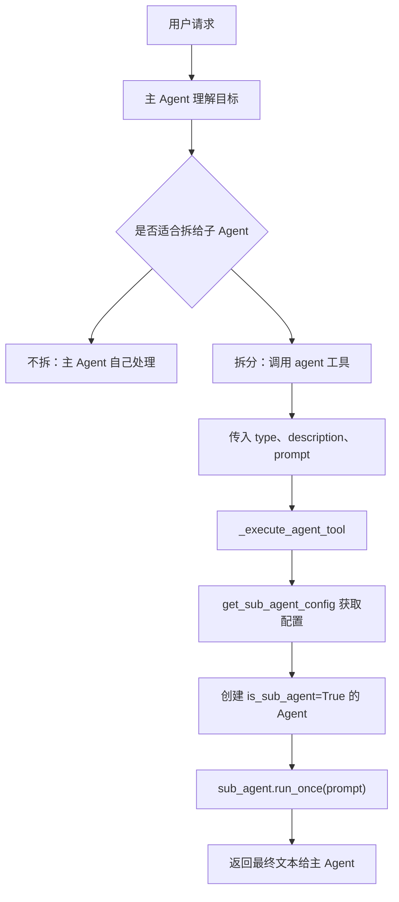
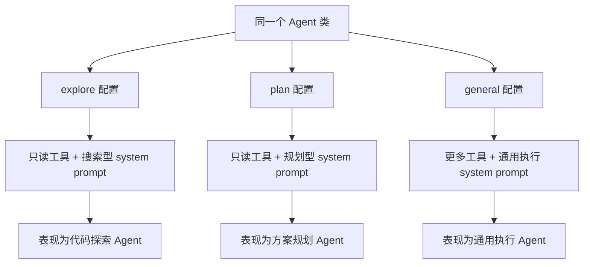
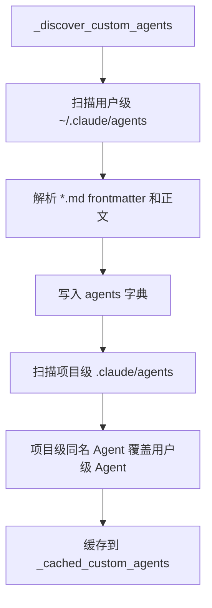
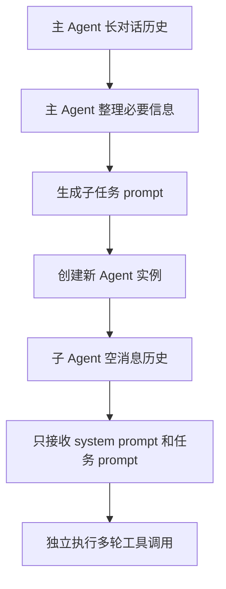
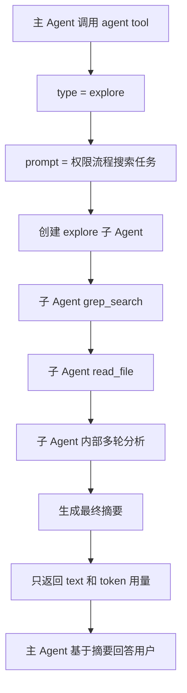
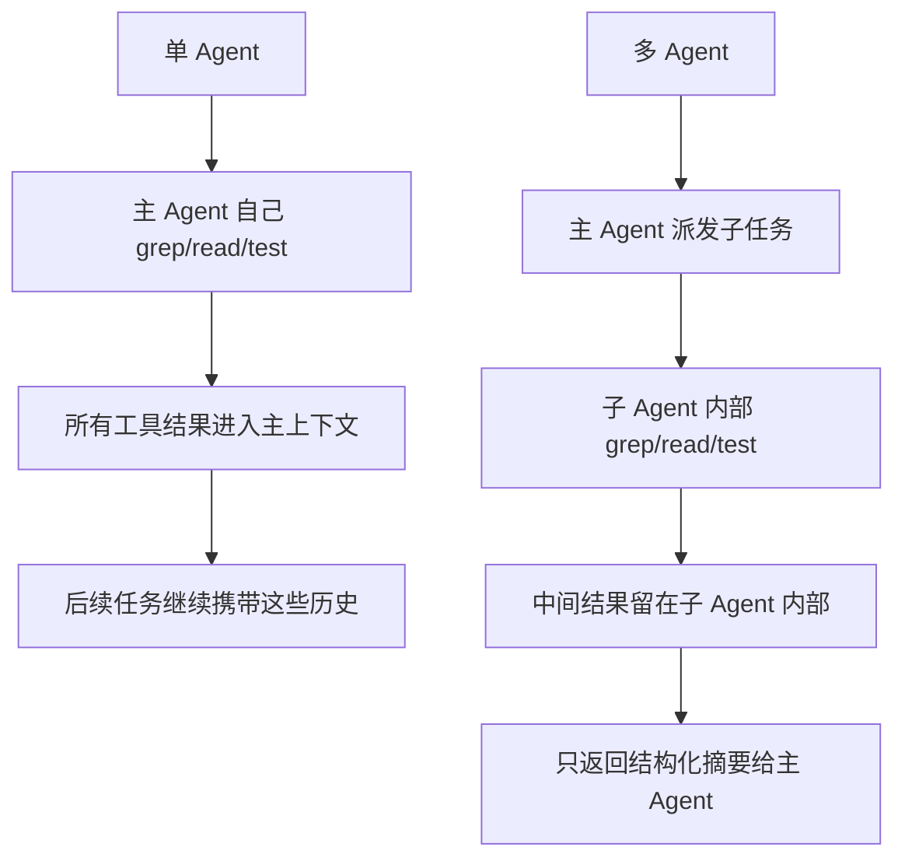
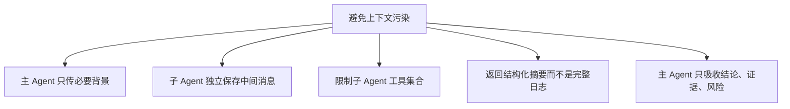

# 11 多 Agent 架构

## 第一部分：总结介绍

这个项目里的多 Agent 架构，本质是 `fork-return pattern`：主 Agent 把一个边界清楚的子任务交给子 Agent，子 Agent 在自己的上下文里独立完成搜索、分析或执行，最后只把最终结果返回给主 Agent。它不是把多个 Agent 混在同一个 message list 里协作，而是通过隔离上下文来降低主会话污染。

主入口是 `agent` 工具，定义在 `python/mini_claude/tools.py`。它要求模型传入 `type`、`description` 和 `prompt`。`type` 决定启动哪类子 Agent，`description` 用于 UI 展示和日志，`prompt` 是主 Agent 整理后交给子 Agent 的具体任务说明。这里要注意，主 Agent 不会把自己的长对话历史完整传给子 Agent，而是只传这个结构化 prompt。

真正创建子 Agent 的逻辑在 `python/mini_claude/agent.py` 的 `_execute_agent_tool()`。主 Agent 收到 `agent` 工具调用后，会先根据 `type` 调用 `get_sub_agent_config()` 取得子 Agent 的 system prompt 和工具集合，然后重新构造一个新的 `Agent` 实例，并传入 `custom_system_prompt`、`custom_tools`、`is_sub_agent=True` 和继承后的 `permission_mode`。因此子 Agent 复用同一个 `Agent` 类，但它的系统提示词、工具可见范围、消息历史和运行行为都和主 Agent 不同。



子 Agent 类型分为内置类型和自定义类型。内置类型在 `python/mini_claude/subagent.py` 中硬编码，包括 `explore`、`plan` 和 `general`。这三个子 Agent 并不是三个不同的 Python 类，它们都复用同一个 `Agent` 类，区别来自 `get_sub_agent_config()` 返回的 `system_prompt` 和 `tools`。也就是说，系统通过“角色提示词 + 工具集合 + 调用时传入的任务 prompt”控制它们表现出不同行为。

`explore` 是只读代码探索 Agent，适合找文件、查调用链、定位实现。它只拿 `read_file`、`list_files`、`grep_search`，system prompt 明确要求快速搜索、分析现有代码、禁止任何修改。`plan` 也是只读 Agent，工具集合和 `explore` 一样，但 system prompt 的目标不同：它不是单纯找信息，而是理解架构后输出结构化实施计划、关键文件和风险。`general` 是通用执行 Agent，默认拿除 `agent` 以外的大部分工具，能完成更完整的独立任务，但不能继续创建子 Agent，避免递归委派不可控。

| 子 Agent 类型 | 主要职责 | 工具集合 | 行为控制方式 | 适合场景 |
|---|---|---|---|---|
| `explore` | 快速搜索和事实收集 | `read_file`、`list_files`、`grep_search` | system prompt 强调只读、快速定位、返回发现 | 查调用链、找实现位置、收集代码事实 |
| `plan` | 只读分析并制定方案 | `read_file`、`list_files`、`grep_search` | system prompt 强调架构理解、步骤、风险 | 修改前规划、方案评估、列实施步骤 |
| `general` | 独立完成较完整任务 | 除 `agent` 外的大部分工具 | system prompt 强调完成任务但不过度扩展 | 相对独立的执行、验证、整理任务 |



自定义 Agent 从 `~/.claude/agents/*.md` 和项目级 `.claude/agents/*.md` 加载。用户级优先级低，项目级优先级高，同名时项目级覆盖用户级。每个自定义 Agent 文件通过 frontmatter 定义 `name`、`description`、`allowed-tools`，正文则作为该子 Agent 的 system prompt。当前项目里的 `.claude/agents/reviewer.md` 就是一个代码审查子 Agent，它通过 `allowed-tools: read_file,list_files,grep_search` 把能力限制为只读分析。



自定义 Agent 的披露也采用渐进式披露。`build_agent_descriptions()` 只把自定义 Agent 的名称和描述加入动态 system prompt，让主 Agent 知道有哪些额外类型可用。真正调用某个类型时，才通过 `get_sub_agent_config()` 读取它的完整 system prompt 和工具限制。这样可以避免把所有自定义 Agent 的完整 prompt 一开始就塞进主 Agent 上下文。

子 Agent 的上下文是独立的。它不是复用主 Agent 的 `_anthropic_messages` 或 `_openai_messages`，而是在新 `Agent` 实例里重新初始化自己的消息列表。主 Agent 传给子 Agent 的只有整理后的 `prompt`、子 Agent 类型对应的 system prompt、工具集合、权限模式、模型和 API base。主 Agent 前面长对话中的所有工具结果、历史问答、临时分析，不会自动进入子 Agent。



举一个具体例子。用户问：“帮我分析权限系统的执行流程，重点看危险命令如何拦截。”主 Agent 可能判断这个任务需要大量搜索，但不希望这些 grep 和 read 结果污染主上下文，于是调用：

```json
{
  "type": "explore",
  "description": "trace permission flow",
  "prompt": "请只读搜索权限系统相关代码，重点定位 check_permission、危险 shell 判断、plan mode、acceptEdits、allow/deny 规则的调用链。返回关键文件、函数、执行顺序和风险点，不要修改文件。"
}
```

这个 prompt 是主 Agent 对用户意图的压缩和任务化表达。子 Agent 收到后，只知道这段明确任务，不知道主 Agent 前面所有长对话。它会在自己的消息历史里调用 `grep_search`、`read_file`、`list_files`，最后输出一段结构化摘要。主 Agent 收到的不是子 Agent 的完整 message history，而是 `run_once()` 返回的最终 `text` 和 token 用量。



`run_once()` 是子 Agent 隔离输出的关键。它会设置 `_output_buffer` 捕获子 Agent 的最终输出，然后调用 `sub_agent.chat(prompt)`。子 Agent 在内部可能经历多轮模型调用和工具调用，但这些中间 messages 都留在子 Agent 自己的 `_anthropic_messages` 或 `_openai_messages`。最后 `run_once()` 只返回拼接后的文本，以及本次子 Agent 消耗的 input/output token。主 Agent 再把这段文本当作工具结果接收。

这就是多 Agent 和单 Agent 的关键区别。单 Agent 会把所有探索、工具结果、中间失败、临时分析都留在同一个上下文里；多 Agent 把局部任务的过程上下文放在子 Agent 内部，主 Agent 只接收结果上下文。它不是让模型天然变聪明，而是在工程上重新划分上下文边界。



主 Agent 和子 Agent 的分工也很明确。主 Agent 负责理解用户目标、判断是否拆分、选择子 Agent 类型、构造子任务 prompt、控制整体安全边界、整合结果并最终对用户负责。子 Agent 负责执行一个边界清楚的局部任务，比如代码探索、方案规划、代码审查、测试定位或文档梳理，并把结果结构化返回。

子 Agent 的切分维度通常有四类。第一是任务阶段，例如探索、规划、执行、审查；第二是专业角色，例如 reviewer、tester、security-auditor、doc-writer；第三是权限范围，例如只读、可编辑、可运行命令；第四是上下文污染风险，例如是否会读取大量文件、产生大量日志、进行多轮试错。这个项目的 `explore` 和 `plan` 就是按任务阶段和只读权限切分，`reviewer` 则是按专业角色和只读工具切分。

为了避免上下文污染，主 Agent 不应该把完整历史复制给子 Agent，而应该只传必要上下文。子 Agent 也不应该把完整工具日志倒灌给主 Agent，而应该返回结论、关键依据、涉及文件、风险和未验证点。这样既能保留可审计性，又不会把大量中间过程重新塞回主上下文。



权限继承是多 Agent 里不能漏的安全点。子 Agent 的权限模式由 `_child_permission_mode()` 决定：如果主 Agent 是 `plan`，子 Agent 也必须是 `plan`；如果主 Agent 是 `auto`，子 Agent 也必须是 `auto`；其他模式在这个教学实现里统一变成 `bypassPermissions`。这样做主要是防止主 Agent 在 plan mode 或 auto mode 下，通过委派子 Agent 绕过只读限制或自动安全分类。

不过这份 Python 实现有教学项目的简化。生产级系统里，更稳妥的做法是每个子 Agent 工具调用都继续按照主会话策略逐个检查，并保留更细粒度的权限继承规则。`allowed-tools` 也不能代替权限系统，因为它只决定子 Agent 看得到哪些工具，不决定工具是否允许执行。

子 Agent 和 MCP 的关系也有边界。主 Agent 首次 `chat()` 时会懒加载 MCP，但条件是 `not self.is_sub_agent`，所以子 Agent 不会自己初始化 MCP。当前实现下，子 Agent 更适合使用内置本地工具。如果生产级要让子 Agent 稳定调用 MCP，需要共享主 Agent 已连接的 MCP manager，或者在创建子 Agent 时注入可用的 MCP 连接。

最后，多 Agent 和 Skill fork 是相邻但不同的机制。普通多 Agent 通过 `agent` tool 创建子 Agent，system prompt 来自 agent type；Skill fork 通过 `skill` tool 创建子 Agent，system prompt 来自 `SKILL.md`。两者底层都使用 `Agent(..., is_sub_agent=True)` 和 `run_once()`，都是 fork-return，但一个强调通用任务委派，一个强调可复用工作流隔离执行。

## 面试话术版本

这个项目的多 Agent 架构采用 fork-return pattern。主 Agent 通过 `agent` 工具把一个明确的子任务派发给子 Agent，子 Agent 是重新创建的 `Agent` 实例，有自己的 system prompt、工具集合和消息历史。主 Agent 的完整长对话不会传给子 Agent，子 Agent 内部多轮工具调用产生的 messages 也不会完整返回主 Agent，最后只返回文本结果和 token 用量。

这样做的核心价值是上下文隔离。单 Agent 会把搜索、读文件、测试日志和中间分析都堆在主上下文里，容易污染后续决策；多 Agent 把局部任务的过程上下文留在子 Agent 内部，只把结论、依据和风险返回主 Agent。主 Agent 负责理解目标、拆任务、选 Agent 类型、写清楚 prompt、整合结果；子 Agent 负责边界清楚的局部任务。

子 Agent 通常按任务阶段、专业角色、权限范围和上下文污染风险切分。比如 `explore` 只读探索代码，`plan` 只读生成方案，`reviewer` 做代码审查。为了避免污染，主 Agent 不复制完整历史，只传必要背景；子 Agent 不返回完整消息列表，只返回结构化摘要。这里的重点不是“多开几个模型”，而是清晰划分上下文生命周期和工具权限边界。

## 第二部分：面试问答与追问补充

### Q1：面试官问：主 Agent 的长对话列表会完整传给子 Agent 吗？

不会。子 Agent 是新建的 `Agent` 实例，有自己的 `_anthropic_messages` 和 `_openai_messages`。主 Agent 只通过 `agent` tool 的 `prompt` 字段传一个整理后的子任务说明。

这意味着子 Agent 不会自动知道主 Agent 之前的全部对话、工具结果和临时分析。如果这些信息对子任务必要，主 Agent 必须显式写进 prompt。

### Q2：面试官问：子 Agent 能读到主 Agent 的上下文信息吗？

不能直接读到完整上下文。它只能读到主 Agent 传给它的 prompt，以及它自己通过工具重新读取到的项目文件或外部信息。

这是有意设计的隔离。好处是减少污染和成本，代价是上下文传递需要更明确。

### Q3：面试官问：能举例说明主 Agent 怎么把任务给子 Agent 吗？

比如用户让主 Agent 分析权限系统。主 Agent 可以调用 `agent` 工具，传入 `type: explore`，并把任务写成：“请只读搜索权限系统相关代码，定位 check_permission、危险 shell 判断、plan mode、acceptEdits 的调用链，返回关键文件、函数、执行顺序和风险点。”

子 Agent 收到的是这个子任务 prompt，而不是整段主会话。它独立搜索和读取文件，最后返回摘要给主 Agent。

### Q4：面试官问：子 Agent 多轮对话后的所有 messages 会返回给主 Agent 吗？

不会。子 Agent 内部可能多轮调用模型和工具，但这些 messages 留在它自己的消息历史里。`run_once()` 最后只返回最终文本和 token 用量。

这正是拆分子 Agent 的意义：主 Agent 不需要背负子任务的所有中间过程，只吸收压缩后的结果。

### Q5：面试官问：那多 Agent 和单 Agent 有什么本质区别？

本质区别是上下文边界。单 Agent 的所有工具结果、中间日志和推理过程都进入同一个上下文；多 Agent 把局部任务放进独立上下文，主 Agent 只接收最终摘要。

所以多 Agent 不一定让单个模型能力变强，但能让复杂任务的上下文更干净，职责更清楚，工具权限更容易收缩。

### Q6：面试官问：拆子 Agent 的意义是什么？

主要是四点：隔离上下文污染、降低主上下文 token 压力、让任务职责更清晰、限制子任务的工具范围。

例如代码探索任务可能读很多文件，但主 Agent 最后只需要调用链结论。用子 Agent 可以让文件内容和搜索噪声留在子 Agent 内部。

### Q7：面试官问：主 Agent 和子 Agent 分别负责什么？

主 Agent 负责理解用户目标、拆分任务、选择子 Agent 类型、写清楚子任务 prompt、控制整体方向、整合返回结果并最终回复用户。

子 Agent 负责执行一个边界清楚的局部任务，比如探索、规划、审查或验证。它不应该替代主 Agent 做整体决策。

### Q8：面试官问：子 Agent 是按什么维度切分的？

可以按任务阶段切分，比如 explore、plan、execute、review；按专业角色切分，比如 reviewer、tester、security-auditor；按权限范围切分，比如只读、可编辑、可运行命令；也可以按上下文污染风险切分，比如会不会产生大量中间日志。

这个项目里的内置类型主要体现了任务阶段和权限范围：`explore` 与 `plan` 是只读，`general` 是通用执行但不允许继续调用 `agent`。

### Q9：面试官问：如何避免上下文污染？

第一，主 Agent 不把完整历史传给子 Agent，只传必要背景。第二，子 Agent 的中间 messages 不返回主 Agent，只返回结构化摘要。第三，限制子 Agent 工具集合，避免它做无关操作。第四，主 Agent 对返回结果做整合，不把完整日志再塞回主回答。

好的子 Agent 返回应该包含结论、依据、涉及文件、风险和未验证点，而不是完整工具输出。

### Q10：面试官问：如果子 Agent 不拿完整上下文，会不会漏信息？

会有这个风险，所以主 Agent 的子任务 prompt 要写清楚。需要传递任务目标、约束、相关文件、用户特别强调的点和期望输出格式。

工程上不要用“复制完整历史”解决这个问题，而是用最小必要上下文。必要时让子 Agent 用工具重新读取真实文件状态，这比依赖旧上下文更可靠。

### Q11：面试官问：子 Agent 为什么不返回完整日志，完整日志不是更安全吗？

完整日志会重新污染主上下文，抵消拆分子 Agent 的价值。更好的方式是返回结构化证据，而不是返回所有中间过程。

例如返回“读取了哪些文件、定位到哪些函数、关键结论是什么、哪里没有验证”，这比贴出全部 grep 输出更适合主 Agent 后续决策。

### Q12：面试官问：`explore` 和 `plan` 都是只读，区别是什么？

工具集合一样，都是 `read_file`、`list_files`、`grep_search`。区别在 system prompt 的目标不同：`explore` 偏搜索和事实收集，`plan` 偏架构理解、步骤设计和风险评估。

也就是说，同一组工具可以通过不同 system prompt 形成不同角色。

### Q13：面试官问：为什么 `general` 子 Agent 默认排除 `agent` 工具？

为了避免递归委派。如果子 Agent 也能继续创建子 Agent，调用链会变复杂，权限边界、成本控制和上下文流向都更难管理。

生产系统不是不能支持多层 Agent，而是必须有最大深度、预算、审计和权限传递规则。这个项目选择了更简单的单层委派。

### Q14：面试官问：`allowed-tools` 能保证安全吗？

不能单独保证。`allowed-tools` 只是工具可见性过滤，让子 Agent 看不到未授权工具。真正能不能执行，还要看权限系统。

安全需要两层：先缩小工具面，再在每次工具调用时做权限检查。

### Q15：面试官问：为什么 plan 和 auto 权限要继承给子 Agent？

因为它们是安全边界。主 Agent 在 plan mode 时不能修改文件，子 Agent 也不能修改；主 Agent 在 auto mode 时要经过自动安全分类，子 Agent 也必须经过。

否则主 Agent 可以把危险操作包装成子任务交给子 Agent，相当于绕过权限系统。

### Q16：面试官问：其他权限模式为什么变成 bypassPermissions？

这是教学实现的简化。代码里只特殊处理 `plan` 和 `auto`，其他都返回 `bypassPermissions`。

面试时不能把它说成生产级最优设计。更合理的生产实现应该逐个继承或映射权限模式，并让子 Agent 的每次工具调用都在主会话策略下检查。

### Q17：面试官问：子 Agent 会初始化 MCP 吗？

当前不会。主 Agent 懒加载 MCP 的条件里有 `not self.is_sub_agent`，所以子 Agent 不会自己连接 MCP server。

这意味着当前 Python 实现里，子 Agent 更适合用内置本地工具。如果要支持子 Agent 调 MCP，需要共享主 Agent 的 MCP manager 或显式注入已连接的 MCP manager。

### Q18：面试官问：子 Agent 的行为会进入经验日志或 Memory 吗？

默认不会。代码里记录工具请求、工具结果和权限拒绝时，遇到 `is_sub_agent` 会直接返回；Memory 预取也对子 Agent 关闭；子 Agent 结束后不会触发主会话自动保存。

这能减少噪声，但也意味着子 Agent 的关键发现必须通过最终结果返回，主 Agent 才能进一步保存或复用。

### Q19：面试官问：多 Agent 和 Skill fork 有什么关系？

两者底层都创建 `Agent(..., is_sub_agent=True)` 并调用 `run_once()`。不同点是入口和 system prompt 来源不同。

普通多 Agent 通过 `agent` tool，system prompt 来自 agent type；Skill fork 通过 `skill` tool，system prompt 来自 `SKILL.md`。前者是通用任务委派，后者是可复用工作流的隔离执行。

### Q20：面试官问：什么任务不适合拆给子 Agent？

任务很短、需要频繁用户确认、强依赖主 Agent 隐含上下文、涉及高风险状态修改、或者返回结果很难被主 Agent审计时，不适合轻易拆。

子 Agent 适合边界清楚、可独立完成、结果能被结构化摘要表达的任务。

### Q21：面试官问：如何设计一个好的子 Agent prompt？

好的 prompt 要写清楚任务目标、范围、禁止事项、可用信息、输出格式和验证要求。比如：“只读分析权限系统，不要修改文件；关注 check_permission 和危险 shell 判断；返回调用链、关键文件、风险点和未验证项。”

子 Agent prompt 越明确，越不需要继承主 Agent 的长上下文，也越能减少无关工具调用。

### Q22：面试官问：如何评估多 Agent 是否真的有效？

不能只看有没有用了子 Agent。应该比较单 Agent 和多 Agent 在同一批复杂任务上的成功率、主上下文 token 峰值、工具结果进入主上下文的体积、任务耗时、额外模型调用成本和失败原因。

如果多 Agent 降低了主上下文污染，但导致信息传递不足、成功率下降，就说明拆分粒度或返回格式需要调整。
