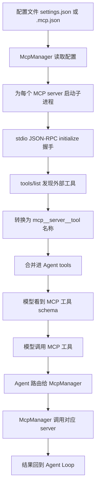
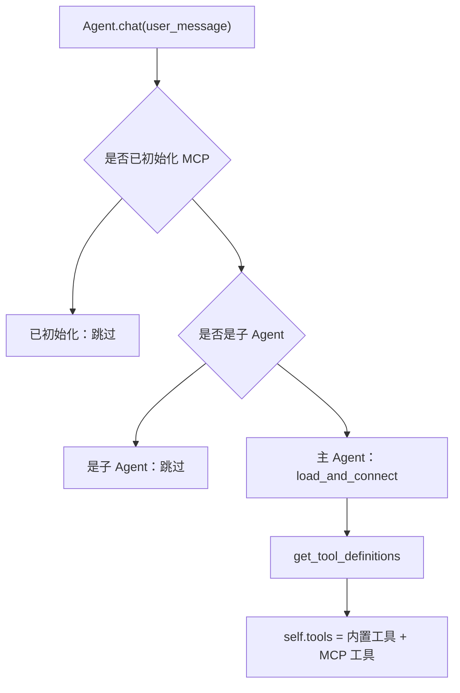
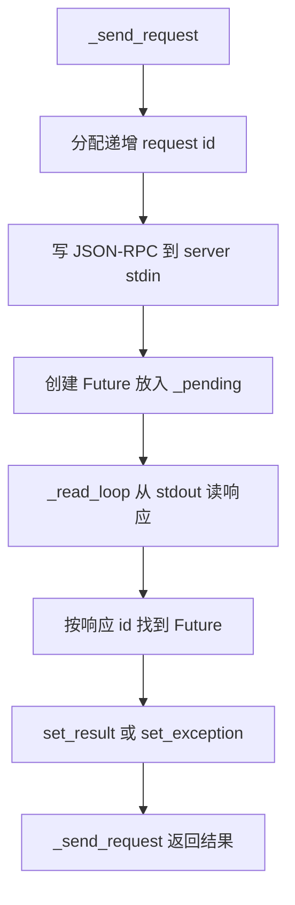
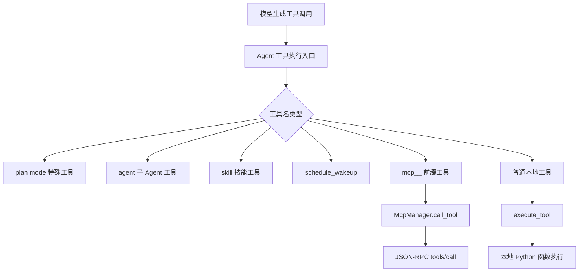
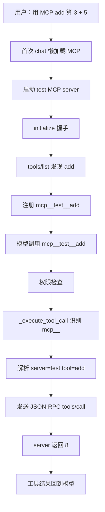

# 12 MCP 集成

## 第一部分：总结介绍

MCP 集成解决的是 Agent 工具扩展问题。没有 MCP 时，Agent 能调用的工具都写死在 `python/mini_claude/tools.py` 的 `tool_definitions` 里。如果要接入 GitHub、数据库、Slack、浏览器或公司内部系统，就需要改 Agent 源码、增加工具 schema、增加执行函数。MCP 把这些外部能力放到独立的 MCP Server 里，Agent 只负责按协议连接、发现工具、注册工具和转发调用。

这个项目的 Python 版本实现了一个最小 MCP Client，核心文件是 `python/mini_claude/mcp_client.py`。它使用 JSON-RPC over stdio，不依赖 MCP SDK。Agent 启动外部 MCP server 子进程，把 JSON-RPC 请求写入 server 的 stdin，再从 stdout 按行读取响应。整个流程可以概括成：读取配置、启动 server、initialize 握手、`tools/list` 发现工具、给工具名加 `mcp__server__tool` 前缀、合并进 Agent 的工具列表、模型调用时再路由回对应 server 的 `tools/call`。



配置加载由 `McpManager._load_configs()` 完成。它依次读取 `~/.claude/settings.json`、项目级 `.claude/settings.json` 和项目根目录 `.mcp.json`。每个配置文件可以写标准的 `mcpServers` 字段，也可以直接把 server map 写在顶层。后加载的配置会覆盖先加载的同名 server，所以项目级配置可以覆盖用户级配置。当前项目根目录的 `.mcp.json` 注册了一个名为 `test` 的 server，启动命令是 `node test/mcp-server.cjs`。

```json
{
  "mcpServers": {
    "test": {
      "command": "node",
      "args": ["test/mcp-server.cjs"]
    }
  }
}
```

MCP 不是在 `Agent.__init__()` 里立即连接，而是在主 Agent 第一次 `chat()` 时懒加载。`agent.py` 的 `chat()` 里判断 `not self._mcp_initialized and not self.is_sub_agent`，只有主 Agent 会连接 MCP，子 Agent 默认不会连接。连接成功后，`McpManager.get_tool_definitions()` 会把外部工具 schema 转成 Agent 可用格式，并追加到 `self.tools`。这样做的好处是 CLI 启动时不会立即拉起外部进程，只有真正开始对话时才连接；同时每个 Agent 实例只初始化一次 MCP。



单个 MCP server 连接由 `McpConnection` 管理。`connect()` 使用 `asyncio.create_subprocess_exec()` 启动 server 子进程，并把 stdin、stdout、stderr 都接成 pipe。随后启动一个后台 `_read_loop()`，不断从 stdout 读取 newline-delimited JSON-RPC 响应。每个请求由 `_send_request()` 分配递增 id，写入 stdin 后创建 Future 放进 `_pending`；后台读循环读到相同 id 的响应后，把 result 填回对应 Future。



连接建立后会先调用 `initialize()`。Client 发送 `initialize`，里面带 `protocolVersion`、`capabilities` 和 `clientInfo`；server 返回协议版本、能力和 server 信息；随后 client 发送 `notifications/initialized`。这个握手用于确认双方协议和能力。当前教学实现没有严格校验 server 返回内容，但生产环境应该校验协议版本、capabilities 和 server 身份，避免接入不兼容或不可信 server。

握手后调用 `tools/list` 发现工具。测试 server `test/mcp-server.cjs` 暴露了 `echo`、`add`、`timestamp` 三个工具，每个工具包含 `name`、`description` 和 `inputSchema`。`McpConnection.list_tools()` 会把这些工具加上 `serverName` 保存到 `McpManager._tools`。随后 `get_tool_definitions()` 把它们转换成 Anthropic tool schema，并把名字改成 `mcp__test__echo`、`mcp__test__add`、`mcp__test__timestamp`。

给 MCP 工具名加 `mcp__server__tool` 前缀非常关键。第一，它避免和内置工具重名，例如外部 server 也可能提供 `read_file`、`search`、`query`。第二，它把路由信息编码进工具名，Agent 执行时能从 `mcp__test__add` 解析出 server 是 `test`，真实工具是 `add`。第三，它允许多个 server 同时存在，例如 `mcp__github__search_issues`、`mcp__slack__send_message`、`mcp__db__query`。

模型视角下，MCP 工具和普通工具没有区别，都是 name、description、input_schema。真正的区别发生在工具执行分发阶段。`agent.py` 的 `_execute_tool_call()` 先处理特殊工具：`enter_plan_mode`、`exit_plan_mode`、`agent`、`skill`、`schedule_wakeup`。随后如果工具名以 `mcp__` 开头，就转发给 `self._mcp_manager.call_tool(name, inp)`；否则才交给本地 `execute_tool()`。所以 MCP 工具不会进入 `tools.py` 的普通工具执行函数，而是走外部 server 路由。



`McpManager.call_tool()` 会把 prefixed name 还原成 server name 和真实 tool name。比如 `mcp__test__add` 会被拆成 `server_name = "test"` 和 `tool_name = "add"`，然后从 `_connections` 找到 `test` 对应的 `McpConnection`，发送 `tools/call`。代码里用 `"__".join(parts[2:])` 还原 tool name，是为了支持真实工具名本身包含 `__` 的情况。

一次完整调用可以这样看：用户让模型用 MCP add 算 `3 + 5`。主 Agent 第一次 chat 时读取 `.mcp.json`，启动 `node test/mcp-server.cjs`，握手后通过 `tools/list` 发现 `add`，注册为 `mcp__test__add`。模型看到工具 schema 后生成工具调用 `mcp__test__add`，输入 `{"a": 3, "b": 5}`。Agent 权限检查通过后，在 `_execute_tool_call()` 识别 `mcp__` 前缀，转发给 `McpManager`。MCP server 实际收到的是 `tools/call`，工具名为 `add`，arguments 为 `{"a": 3, "b": 5}`，最后返回文本 `8`。



MCP 工具不是绕过 Agent Loop 执行的。Anthropic 和 OpenAI-compatible 两条路径里，工具执行前都会记录工具请求、做权限判断、必要时请求确认，然后才进入 `_execute_tool_call()`。执行后还会做大结果持久化、记录工具结果，并把结果塞回 message history。因此从 Agent Loop 角度看，MCP 工具仍然属于工具调用生命周期的一部分。

但当前 Python 实现的权限系统对 MCP 工具不够细。`check_permission()` 没有专门识别 `mcp__` 工具。default mode 下，如果没有 deny rule，MCP 工具通常会落到最后的默认 allow。Plan Mode 也只明确拦截本地 `EDIT_TOOLS` 和 `run_shell`，而 MCP 工具名一般是 `mcp__server__tool`，不在这些集合里。因此，如果某个 MCP server 暴露了写操作，例如 `mcp__github__create_issue` 或 `mcp__slack__send_message`，当前实现不一定能按外部副作用正确审批。

这就是 MCP 面试里最重要的安全点：动态外部工具不能只靠工具名判断风险。生产系统应该为 MCP 工具引入独立信任域和风险元数据，例如按 server 分级、按 tool 标注 read/write/destructive/external-side-effect、支持 permission rule 匹配 `mcp__server__tool`、让 Auto Mode 分类器理解 MCP tool description 和 input，并对外部可见动作做确认和审计。

MCP 和子 Agent 的关系也要讲清楚。主 Agent 懒加载 MCP 的条件包含 `not self.is_sub_agent`，所以子 Agent 默认不会连接 MCP。当前实现里，子 Agent 更适合使用内置本地工具。如果将来希望子 Agent 调 MCP，有两种路线：一种是禁止子 Agent 使用 MCP，把外部系统调用集中在主 Agent；另一种是创建子 Agent 时注入主 Agent 已连接的 `McpManager`，同时保留权限检查、调用链 trace 和审计。否则子 Agent 可能看得到 MCP schema，却没有可用连接。

MCP server 是外部子进程，所以资源释放也很重要。`Agent.close()` 会在 `_mcp_initialized` 为真时调用 `McpManager.disconnect_all()`。CLI 退出和 one-shot 模式结束时都会调用 `agent.close()`。单个 `McpConnection.close()` 会先让 pending Future 失败、关闭 stdin、尝试 terminate server，2 秒后还没退出就 kill，然后取消后台 reader task。这避免 CLI 退出后遗留 MCP server 子进程。

当前实现是教学级最小版本，边界比较清楚：只支持 stdio，不支持 HTTP/SSE；只实现 tools，没有实现 MCP resources、prompts、sampling 等能力；配置错误会静默跳过；stderr 接成 pipe 但没有读取，大量 stderr 输出理论上可能阻塞；initialize 没有严格校验能力；工具结果主要提取 text content，非 text 内容会被简化；`is_mcp_tool()` 只看 `mcp__` 前缀，生产环境应该对工具来源做更强校验。

## 面试话术版本

这个项目通过 MCP 把外部工具动态接入 Agent Loop。主 Agent 第一次 `chat()` 时会懒加载 MCP 配置，读取用户级和项目级 settings 以及 `.mcp.json`，为每个 server 启动 stdio 子进程，然后用 JSON-RPC 做 `initialize` 握手，再调用 `tools/list` 发现工具。

发现后的 MCP 工具会被转换成 `mcp__server__tool` 这种带命名空间的工具名，并合并到 Agent 的工具列表里。模型调用时和普通工具一样生成 tool call；执行时 `_execute_tool_call()` 识别 `mcp__` 前缀，把调用转发给 `McpManager`，再由它解析 server name 和 tool name，通过 JSON-RPC `tools/call` 发给对应 MCP server。

我理解 MCP 的关键价值是解耦：Agent 本体不用为每个外部系统写死工具代码，只要实现统一的发现、注册和路由协议。但它也引入新的安全边界，因为外部工具可能有副作用。当前项目的权限系统没有专门区分 MCP 工具的读写风险，生产里应该按 server 和 tool 做信任分级、权限审批、审计和 Plan Mode 只读约束。

## 第二部分：面试问答与追问补充

### Q1：面试官问：MCP 在这个项目里解决什么问题？

MCP 解决的是工具扩展和工具解耦问题。没有 MCP 时，所有工具都写死在 `tools.py`，新增外部能力就要改 Agent 源码。MCP 把外部能力放进独立 server，Agent 通过协议动态发现它提供的工具。

所以 MCP 的价值不是某个具体工具，而是统一了外部工具接入方式。Agent 只需要实现连接、工具发现、schema 注册和调用转发，就能接入多个外部系统。

### Q2：面试官问：MCP 工具什么时候加载？

MCP 工具在主 Agent 第一次 `chat()` 时懒加载。代码里检查 `not self._mcp_initialized and not self.is_sub_agent`，所以只主 Agent 加载一次，子 Agent 不会自己加载。

这个设计有两个考虑。第一，CLI 启动时不必立即拉起外部进程，降低启动成本。第二，MCP 连接属于会话级外部资源，初始化一次后把工具 schema 合并进 `self.tools`，后续对话可以复用。

### Q3：面试官问：MCP 配置从哪里读，优先级是什么？

配置依次从 `~/.claude/settings.json`、项目 `.claude/settings.json`、项目 `.mcp.json` 读取。每个文件既可以使用 `mcpServers` 包一层，也可以直接写 server map。

合并时同名 server 后加载覆盖先加载，所以项目级配置可以覆盖用户级配置。这个优先级符合常见配置设计：用户级提供默认能力，项目级可以按项目需要定制或替换。

### Q4：面试官问：为什么 MCP 工具名要加 `mcp__server__tool` 前缀？

主要是为了命名隔离和路由。外部 server 可能提供很通用的工具名，比如 `search`、`query`、`read_file`，如果直接暴露就可能和内置工具或其他 MCP server 冲突。

加前缀后，工具名天然带 server namespace。模型调用 `mcp__test__add` 时，Agent 能解析出 server 是 `test`，真实工具名是 `add`，然后转发给对应连接。这个前缀既解决冲突，也保存了路由信息。

### Q5：面试官问：MCP 工具和普通工具的调用链有什么不同？

模型视角没有区别，都是工具 schema，模型只需要按 name 和 input_schema 生成 tool call。宿主执行视角不同：普通工具最终进入本地 `execute_tool()`，MCP 工具在 `_execute_tool_call()` 里被识别为 `mcp__` 前缀，然后进入 `McpManager.call_tool()`。

所以可以总结为：同一个模型工具调用接口，不同执行后端。普通工具在本地 Python 函数执行，MCP 工具通过 JSON-RPC 转发给外部 server 执行。

### Q6：面试官问：MCP Server 是怎么通信的？

当前项目使用 stdio 上的 JSON-RPC。Agent 启动 MCP server 子进程，把 JSON-RPC 请求按行写入 stdin，从 stdout 按行读取响应。每个请求都有递增 id，后台 `_read_loop()` 根据响应 id 找到 `_pending` 里的 Future，并填入 result 或 exception。

这个模型支持多个并发请求，因为不同请求用 id 区分。虽然 transport 很简单，但已经覆盖 MCP 工具能力的核心路径：`initialize`、`tools/list`、`tools/call`。

### Q7：面试官问：为什么要做 initialize 握手？

initialize 握手用于确认协议版本、双方能力和 server 信息。Client 先发送 `initialize`，server 返回 protocolVersion、capabilities 和 serverInfo；然后 client 发送 `notifications/initialized` 表示初始化完成。

当前教学实现没有严格校验返回内容，但生产级应该校验版本和能力。如果 server 不支持 tools capability，或者协议版本不兼容，应该拒绝注册工具，而不是假设后续调用一定成功。

### Q8：面试官问：MCP 工具发现后如何让模型可见？

`McpConnection.list_tools()` 从 server 获取原始工具列表，`McpManager.get_tool_definitions()` 再把它们转换成 Agent 使用的 tool schema，并加上 `mcp__server__tool` 前缀。主 Agent 首次 chat 时把这些 schema 追加到 `self.tools`。

后续调用模型时，`self.tools` 会作为可用工具列表传给模型。模型因此能看到 MCP 工具的名称、描述和输入 schema，并据此生成工具调用。

### Q9：面试官问：MCP 工具调用如何从 prefixed name 路由回真实工具？

`McpManager.call_tool()` 会 split 工具名。以 `mcp__test__add` 为例，拆分后 `server_name` 是 `test`，真实 `tool_name` 是 `add`。然后它从 `_connections` 找到 test server 对应的 `McpConnection`，发送 JSON-RPC `tools/call`。

代码里还考虑了真实工具名可能包含 `__` 的情况，所以用 `"__".join(parts[2:])` 还原工具名，而不是只取第三段。这是一个小但重要的健壮性细节。

### Q10：面试官问：MCP 会绕过权限系统吗？

不会完全绕过。MCP 工具仍然走 Agent Loop，工具执行前会记录请求、做权限判断，必要时请求用户确认，执行后还会做大结果持久化和结果记录。

但当前实现的权限规则对 MCP 不够细。`check_permission()` 没有识别 `mcp__` 工具的读写风险，所以 default mode 下很多 MCP 工具会默认 allow。生产系统需要为 MCP 工具加独立权限策略，不能只依赖本地工具名集合。

### Q11：面试官问：Plan Mode 下 MCP 写操作会被拦截吗？

当前实现不一定。Plan Mode 只显式拦截本地 `EDIT_TOOLS` 和 `run_shell`，而 MCP 工具名通常是 `mcp__server__tool`，不在这些集合里。

这说明动态工具接入会打破原来“按工具名判断读写风险”的假设。生产级应该要求 MCP 工具提供风险元数据，或者在配置里为每个 MCP tool 声明 read/write/destructive 类别，Plan Mode 只允许 read-only MCP 工具。

### Q12：面试官问：MCP 和子 Agent 是什么关系？

当前子 Agent 不会自己初始化 MCP，因为 MCP 懒加载条件排除了 `is_sub_agent`。所以主 Agent 能连接 MCP，子 Agent 默认没有连接 MCP server。

这是一种简化和隔离。生产里可以选择两种策略：要么外部系统调用只允许主 Agent 做，子 Agent 不使用 MCP；要么把主 Agent 已连接的 `McpManager` 注入子 Agent，并确保权限、审计、预算和 trace 能覆盖子 Agent 的 MCP 调用。

### Q13：面试官问：MCP 工具结果怎么返回给模型？

MCP server 返回 JSON-RPC result，通常包含 `content` 数组。当前 Python 实现只提取 `type == "text"` 的内容，用换行拼成字符串作为工具结果。如果不是 text content，就退化成 `json.dumps(result)`。

这能支持最常见的文本工具结果，但对图片、文件资源、结构化内容支持有限。生产级需要更完整地处理 MCP content types，并在上下文里控制大结果的持久化和预览。

### Q14：面试官问：MCP 连接失败怎么办？

`load_and_connect()` 对每个 server 单独 try/except。某个 server 连接失败时，会打印失败信息并关闭该连接，不会让整个 Agent 启动失败。

这是可用性上的折中：外部工具坏了，内置工具仍可用。但生产环境最好把失败更结构化地暴露出来，比如告诉用户哪个 server 不可用、失败原因是什么、哪些工具因此没有注册。

### Q15：面试官问：为什么需要关闭 MCP server？

因为 MCP server 是外部子进程。如果 CLI 退出时不关闭，可能留下孤儿进程、占用文件句柄或继续持有外部资源。

当前实现里 `Agent.close()` 调用 `disconnect_all()`，单个连接会关闭 stdin、terminate 进程、必要时 kill，并取消 reader task。这个清理流程是 MCP 集成里容易被忽略但很重要的工程细节。

### Q16：面试官问：当前 MCP 实现有哪些风险或不足？

主要风险在安全、协议完整性和资源管理。安全上，权限系统没有理解 MCP 工具的读写和外部副作用；协议上，只实现 tools，没有 resources、prompts、sampling 等能力；传输上只支持 stdio；资源上 stderr 没有被读取，大量 stderr 输出可能阻塞。

此外，配置解析失败会静默跳过，initialize 没有严格校验，非 text 结果处理较粗，`is_mcp_tool()` 只靠 `mcp__` 前缀。面试时要把这些说成教学项目的边界，而不是生产级完整方案。

### Q17：面试官问：如何评估 MCP 集成是否可靠？

我会从发现、调用、安全、资源四个维度评估。发现层面看多个 server 是否能稳定连接、schema 是否正确注册、同名工具是否正确隔离。调用层面看路由是否准确、错误是否能返回、并发请求是否按 id 匹配。

安全层面看 MCP 工具是否有权限分类、外部副作用是否确认、Plan Mode 是否只读、审计是否完整。资源层面看 server 退出是否清理、超时是否生效、stderr 和异常是否处理。只有 demo `add` 能跑通还不够，生产可用性取决于这些边界。

