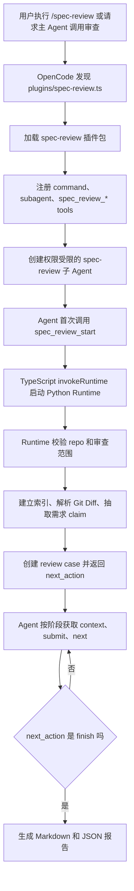

# 整体架构：代码-设计文档一致性审查 Agent 是如何工作的

## 第一部分：总结介绍

这个插件解决的问题不是简单让大模型阅读需求文档和代码变更，然后输出一个主观判断，而是把“需求文档是否被代码变更正确实现”拆成一条可控、可追溯、可复盘的 Agent 审查链路。用户在 OpenCode 里发起审查后，系统会创建一个专用的 `spec-review` 子 Agent。这个子 Agent 并不能自由读取仓库、执行 shell 或自行搜索文件，它只能调用 `spec_review_*` 这一组受控工具。真正的代码范围解析、Git Diff 解析、索引构建、证据生成、状态持久化和报告输出，都由本地 Python Runtime 完成。

整体架构可以分成三层。第一层是 OpenCode 插件接入层，负责让 OpenCode 发现插件、注册 `/spec-review` 命令、注册 `spec-review` 子 Agent 和工具集合。第二层是 Agent 编排层，负责按照 prompt 和 Runtime 返回的 `next_action` 顺序执行 L3 或 L4 审查。第三层是确定性 Runtime 层，负责把需求文档、MR 变更和代码结构转成证据上下文，并维护整个审查 case 的状态。

入口从 `plugins/spec-review.ts` 开始。这个文件本身只做一件事：把 OpenCode 扫描到的顶层插件文件转发到 `plugins/spec-review/index.ts`。这里的设计是为了适配 OpenCode 1.x 的插件发现规则，它会扫描 `plugins` 目录下的直接 `.ts` 或 `.js` 文件。因此顶层 loader 保持稳定，真正的插件包放在 `plugins/spec-review/` 目录内，方便目录投放和整体替换升级。

真正的插件注册逻辑在 `plugins/spec-review/src/index.ts`。`config` 函数里注册了一个命令 `spec-review`，这个命令绑定到同名子 Agent，并声明 `subtask: true`。这意味着用户执行 `/spec-review` 后，OpenCode 不会让主 Agent 自己审查，而是把任务交给专用子 Agent。这个子 Agent 的配置里有一个非常关键的权限边界：`"*": "deny"` 和 `"spec_review_*": "allow"`。也就是说，模型不能绕开 Runtime 自己读文件、搜代码或执行命令，只能通过受控工具拿证据和推进阶段。

这种设计背后的核心思想是：LLM 负责语义判断，Runtime 负责事实边界。需求实现一致性审查涉及大量不确定判断，比如某段代码是否满足需求、某个异常分支是否覆盖文档约束、某个调用链是否能触达真实业务入口。这些适合交给模型推理。但仓库路径、MR 范围、diff seed、符号索引、证据 ID、阶段状态这些内容必须由确定性程序控制，否则模型很容易因为上下文过大、文件读取不完整或自信幻觉，给出不可复现的结论。

一次完整审查的事件流是这样的：用户通过 `/spec-review` 或自然语言发起审查，OpenCode 根据插件配置创建 `spec-review` 子 Agent。子 Agent 按 prompt 要求首次调用 `spec_review_start`，输入需求文档、仓库路径、base/head、路径过滤、章节过滤和模式。TypeScript 工具函数会先解析仓库路径，拒绝把 `/` 当作业务仓库，然后通过 `invokeRuntime("start", payload, repo)` 启动 Python Runtime。Runtime 收到 payload 后，会读取 JSON、解析 repo、获取仓库级锁、连接 `.spec-review/index.sqlite`，再进入 `workflow.start_case` 创建审查案例。

`start_case` 是整条链路的初始化核心。它先校验 `docs`、`paths`、`sections`、`mode`、`base` 和 `fullRepo`。如果没有 `base`、没有 `paths`，也没有显式 `fullRepo=true`，Runtime 会直接拒绝。这一层校验非常重要，因为 prompt 只能约束模型行为，不能作为真正的安全边界。Runtime 在写入任何审查数据之前强制校验范围，才能避免误把整个仓库甚至错误目录作为审查对象。

范围校验通过后，Runtime 会依次执行三个动作。第一，调用 `build_or_update_index` 建立或复用代码索引，得到当前仓库快照 `snapshot_id`。第二，调用 `resolve_change_scope` 解析 Git Diff，得到本次变更涉及的文件、hunk 和命中的符号，形成 `change_seeds`。如果没有 base 但指定了 paths，则会从路径范围内的符号构造 scoped seeds。第三，调用 `load_claim_candidates` 从需求文档里抽取候选需求声明，也就是后续要被审查的 claim。

初始化完成后，Runtime 返回一个结构化结果，其中包括 `repo`、`case_id`、`index`、`scope`、`claims` 和 `next_action`。这里最重要的是 `case_id` 和 `next_action`。`case_id` 是后续所有工具调用的上下文锚点，避免不同审查案例混在一起。`next_action` 则是 Runtime 告诉 Agent 下一步应该执行哪个阶段，比如 `l3_review`、`l4_initial` 或 `finish`。Agent 不应该自己猜下一步，而是严格按照 `next_action.action` 执行。

审查阶段不是一次性 prompt，而是一个状态机循环。每个阶段都遵循同样的顺序：先调用 `spec_review_context` 获取有界上下文包，再由 LLM 基于证据进行阶段判断，然后调用 `spec_review_submit` 提交结构化 JSON，最后调用 `spec_review_next` 推进到下一阶段。Runtime 对这个顺序也做了硬校验：提交的 stage 必须等于当前 case 的 stage；同一个阶段只能提交一次；没有提交阶段结果之前不能推进。这样即使模型没有完全遵守 prompt，Runtime 也能阻止跳阶段、重复提交或空推进。

上下文包是这个 Agent 的关键产物。`spec_review_context` 最终会进入 `context.build_context_packs`。它会读取当前 case 下的 claims、change seeds，从 diff seed 命中的符号出发，在调用图里按 callers、callees 或 both 做有界 BFS，然后把 diff 片段、源码片段、调用图和 evidence gaps 组合成 evidence pack。每条 diff 或 source 证据都会被持久化，并生成稳定的 `evidence_id`。因此最终审查结论不是一句“模型认为不一致”，而是“某个需求 claim 基于哪些 diff/source evidence_id 被判定为 inconsistent 或 uncertain”。

当状态机进入 `ready_to_finish` 后，Agent 调用 `spec_review_finish`。Runtime 会读取所有 `stage_runs`，优先使用 `l4_converge` 作为最终结果，如果没有 L4 则使用 `l3_review`，然后生成 Markdown 和 JSON 两份报告。报告写入业务仓库的 `.spec-review/reports/<case-id>/` 下，同时 case 状态更新为 `finished/completed`。JSON 保存完整阶段结果，Markdown 面向用户阅读，这样既能用于 MR 审查，也能用于后续复盘和指标评估。

整条流程可以概括为下面的事件流：

从工程取舍看，这个实现选择了短生命周期 Runtime，而不是常驻服务或 MCP sidecar。优点是部署简单，只需要投放插件目录，不需要启动后台服务，不需要开放端口，也不依赖 OpenCode 内部数据库。缺点是每次工具调用都要启动 Python 进程，存在进程启动开销，因此代码用 SQLite 快照、文件哈希复用和 WAL 来降低重复索引成本。

另一个重要取舍是权限收敛。让 Agent 只能调用 `spec_review_*` 会牺牲一些灵活性，但换来的是更强的可复现性和安全边界。因为所有上下文都经过 Runtime，结论必须引用 `evidence_id`，最终报告可以追溯到具体文件、行号、diff 和阶段判断。对于面试来说，这一点比“模型能不能多读几个文件”更关键，因为生产系统需要的是可审计、可解释、可控的 Agent，而不是一次看似聪明但不可复盘的输出。

当前实现也有边界。它依赖静态索引和静态调用图，不能完整覆盖反射、动态派发、依赖注入、配置驱动路由和跨服务调用。遇到这些情况时，正确做法不是强行判定一致或不一致，而是形成 evidence gap，并在 L4 中输出 `uncertain` 或要求人工补充证据。生产化时可以接入 MR 平台 API、需求文档系统版本、CI 测试覆盖率、运行时链路日志和服务调用关系，增强证据来源。

## 面试话术版本

如果面试官问“这个代码-设计文档一致性审查 Agent 是怎么工作的”，我会这样介绍：

我做的不是一个简单的 prompt 审查工具，而是一个证据驱动的 Agent workflow。用户在 OpenCode 里发起审查后，会进入一个专用的 `spec-review` 子 Agent。这个子 Agent 的权限被收敛，只能调用我们定义的 `spec_review_*` 工具，不能自由 shell、grep 或读取文件。这样做是为了保证所有结论都来自 Runtime 生成的证据上下文，而不是模型临时搜索到的零散信息。

首次调用 `spec_review_start` 时，TypeScript 插件层会解析仓库路径并启动 Python Runtime。Runtime 会校验审查范围，拒绝无 base、无 path、无 fullRepo 的模糊审查，然后建立或复用代码索引，解析 Git Diff 得到变更种子，从需求文档里抽取候选 claim，并创建一个持久化的 review case。这个 case 会返回 `case_id` 和 `next_action`，后续 Agent 只能按照 Runtime 给出的状态机继续执行。

真正审查时，每个阶段都是先调用 `spec_review_context` 获取 evidence pack，再由 LLM 做阶段判断，然后 `submit` 结构化结果，最后 `next` 推进状态。evidence pack 里包含需求 claim、本次 MR 的 diff seed、相关源码片段、从变更符号扩展出来的调用图，以及 unresolved edge 或预算触顶这类证据缺口。最终报告里的每个结论都要求引用 evidence_id，所以能追溯到具体证据。

这个设计的核心分工是：LLM 负责需求和代码行为之间的语义判断，Runtime 负责范围控制、索引、证据生成、状态持久化、并发锁和报告输出。这样可以降低模型幻觉，避免上下文失控，同时让审查过程可以复盘和评估。

## 第二部分：面试问答与追问补充

Q：为什么不直接把需求文档和 MR diff 丢给大模型审查？

A：直接丢给模型的问题是上下文不可控，证据不可追溯，而且模型容易把“没看到实现”误判成“没有实现”。我这里先用 Runtime 做确定性取证，把需求 claim、Git Diff、代码符号、调用链和源码片段组织成 evidence pack，再让模型判断。这样每个结论都可以回到具体 evidence_id，后续能复盘误报和漏报。

Q：为什么要做成 OpenCode 子 Agent，而不是一个普通脚本？

A：因为一致性审查本质上不是一次静态分析就能完成的，它需要语义判断。普通脚本适合做 diff、索引和证据抽取，但判断“需求是否被正确实现”需要结合上下文推理。子 Agent 可以承载多阶段推理，但我没有让它自由行动，而是用 Runtime 的 `next_action` 状态机约束它，保证流程可控。

Q：为什么 Agent 不能自己 grep 或 read 文件？

A：如果允许它自由读文件，最终结论就可能来自证据系统之外，报告里的依据无法复现。比如模型可能读到了某个文件，但没有把具体片段持久化成 evidence，后续人工无法确认它的判断来源。限制为 `spec_review_*` 工具后，所有证据都由 Runtime 生成、编号和保存，审查结果才可审计。

Q：为什么 start 阶段要先校验 repo 和范围？

A：这是为了防止误审和越界。需求审查必须绑定明确的业务仓库和变更范围。如果没有 base、path 或 fullRepo，系统不知道本次 MR 到底要审查什么，直接全仓扫描会带来成本、误报和安全风险。代码里不仅 prompt 要求这一点，Runtime 的 `start_case` 也强制校验，避免只依赖模型遵守指令。

Q：如果 Agent 跳过阶段或者重复提交怎么办？

A：Runtime 有兜底校验。`submit_stage` 会检查提交的 stage 是否等于当前 case 的 stage，并且数据库里 `stage_runs` 对 `case_id + stage` 有唯一约束，所以同一阶段只能提交一次。`advance` 也要求当前阶段已经有提交结果，否则不能推进。这保证了多阶段流程不会因为模型行为不稳定而乱序。

Q：怎么证明这个设计比一次 prompt 更可靠？

A：可以用三类指标验证。第一是流程约束指标，比如无范围审查是否被拒绝、阶段是否按 `context -> submit -> next` 执行。第二是证据质量指标，比如 inconsistent 结论是否都有 claim、diff evidence、source evidence 和归因。第三是审查效果指标，用历史 MR 做评估集，比较 L3 初筛和 L4 收敛后的误报率、漏报率，以及 L4 反向质疑消掉了多少误报。

