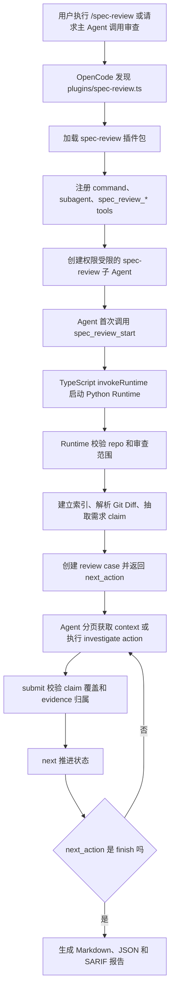

# 整体架构：代码-设计文档一致性审查 Agent 是如何工作的

## 第一部分：总结介绍

这个插件解决的问题不是简单让大模型阅读需求文档和代码变更，然后输出一个主观判断，而是把“需求文档是否被代码变更正确实现”拆成一条可控、可追溯、可复盘的 Agent 审查链路。用户在 OpenCode 里发起审查后，系统会创建一个专用的 `spec-review` 子 Agent。这个子 Agent 并不能自由读取仓库、执行 shell 或自行搜索文件，它只能调用 `spec_review_*` 这一组受控工具。真正的代码范围解析、Git Diff 解析、索引构建、证据生成、状态持久化和报告输出，都由本地 Python Runtime 完成。

整体架构可以分成三层。第一层是 OpenCode 插件接入层，负责让 OpenCode 发现插件、注册 `/spec-review` 命令、注册 `spec-review` 子 Agent 和工具集合。第二层是 Agent 编排层，负责按照 prompt 和 Runtime 返回的 `next_action` 顺序执行 L3 或 L4 审查。第三层是确定性 Runtime 层，负责把需求文档、MR 变更和代码结构转成证据上下文，并维护整个审查 case 的状态。

入口从 `plugins/spec-review.ts` 开始。这个文件本身只做一件事：把 OpenCode 扫描到的顶层插件文件转发到 `plugins/spec-review/index.ts`。这里的设计是为了适配 OpenCode 1.x 的插件发现规则，它会扫描 `plugins` 目录下的直接 `.ts` 或 `.js` 文件。因此顶层 loader 保持稳定，真正的插件包放在 `plugins/spec-review/` 目录内，方便目录投放和整体替换升级。

真正的插件注册逻辑在 `plugins/spec-review/src/index.ts`。`config` 函数里注册了一个命令 `spec-review`，这个命令绑定到同名子 Agent，并声明 `subtask: true`。这意味着用户执行 `/spec-review` 后，OpenCode 不会让主 Agent 自己审查，而是把任务交给专用子 Agent。这个子 Agent 的配置里有一个非常关键的权限边界：`"*": "deny"` 和 `"spec_review_*": "allow"`。也就是说，模型不能绕开 Runtime 自己读文件、搜代码或执行命令，只能通过受控工具拿证据和推进阶段。

这种设计背后的核心思想是：LLM 负责语义判断，Runtime 负责事实边界。需求实现一致性审查涉及大量不确定判断，比如某段代码是否满足需求、某个异常分支是否覆盖文档约束、某个调用链是否能触达真实业务入口。这些适合交给模型推理。但仓库路径、MR 范围、diff seed、符号索引、证据 ID、阶段状态这些内容必须由确定性程序控制，否则模型很容易因为上下文过大、文件读取不完整或自信幻觉，给出不可复现的结论。

一次完整审查的事件流是这样的：用户通过 `/spec-review` 或自然语言发起审查，OpenCode 根据插件配置创建 `spec-review` 子 Agent。子 Agent 按 prompt 要求首次调用 `spec_review_start`，输入 MR 标识或 MR 链接、需求文档关联信息、仓库路径、路径过滤、章节过滤和模式。TypeScript 工具函数会先解析仓库路径，拒绝把 `/` 当作业务仓库，然后通过 `invokeRuntime("start", payload, repo)` 启动 Python Runtime。Runtime 收到 payload 后，会读取 JSON、解析 repo、获取仓库级锁、连接 `.spec-review/index.sqlite`，再进入 `workflow.start_case` 创建审查案例。MR 模式下，Runtime 会通过内部 MCP 与平台接口获取 MR 信息和设计文档，锁定 MR 的 base/head SHA，并准备一个 detached analysis worktree，避免审查过程中 MR head 漂移导致证据和发布对象不一致。

`start_case` 是整条链路的初始化核心。它先校验需求文档来源、路径过滤、章节过滤、审查模式、MR 范围、`base/head` 和 `fullRepo`。如果使用 MR 模式，`base/head` 必须由内部平台返回的完整 SHA 锁定，不能再手工混传；如果没有 MR、没有 `base`、没有 `paths`，也没有显式 `fullRepo=true`，Runtime 会直接拒绝。这一层校验非常重要，因为 prompt 只能约束模型行为，不能作为真正的安全边界。Runtime 在写入任何审查数据之前强制校验范围，才能避免误把整个仓库甚至错误目录作为审查对象。

范围校验通过后，Runtime 会依次执行三个动作。第一，调用 `build_or_update_index` 建立或复用代码索引，得到当前仓库快照 `snapshot_id`。第二，调用 `resolve_change_scope` 解析 Git Diff，得到本次变更涉及的文件、hunk 和命中的符号，形成 `change_seeds`。如果没有 base 但指定了 paths，则会从路径范围内的符号构造 scoped seeds。第三，调用 `load_claim_candidates` 从需求文档里抽取候选需求声明，也就是后续要被审查的 claim。

初始化完成后，Runtime 返回一个结构化结果，其中包括 `repo`、`case_id`、`index`、`scope`、`claims` 和 `next_action`。这里最重要的是 `case_id` 和 `next_action`。`case_id` 是后续所有工具调用的上下文锚点，避免不同审查案例混在一起。`next_action` 则是 Runtime 告诉 Agent 下一步应该执行哪个阶段，比如 `l3_review`、`l4_initial` 或 `finish`。Agent 不应该自己猜下一步，而是严格按照 `next_action.action` 执行。

审查阶段不是一次性 prompt，而是一个状态机循环。L3、L4 initial、L4 challenge 和 L4 converge 都以分页方式调用 `spec_review_context`，从 `cursor=0, limit=3` 开始覆盖当前阶段全部真实 claim；L4 investigate 则进入专用的 `spec_review_investigate` ReAct 取证闭环，每轮只执行一个 action 并记录 observation。每个阶段完成后，Agent 调用 `spec_review_submit` 提交结构化 JSON，再调用 `spec_review_next` 推进到下一阶段。Runtime 对这个顺序做了硬校验：提交的 stage 必须等于当前 case 的 stage；同一个阶段只能提交一次；没有提交阶段结果之前不能推进；提交结果必须逐 claim 覆盖当前阶段要求的 claim_id，且 `consistent/inconsistent` 必须引用属于当前 case 和当前 claim 的 evidence_id。这样即使模型没有完全遵守 prompt，Runtime 也能阻止跳阶段、重复提交、空推进、占位 claim 和伪造证据。

上下文包是这个 Agent 的关键产物。`spec_review_context` 最终会进入 `context.build_context_packs`。新版实现不会一次返回所有 claim 和所有 seed，而是按页返回少量 claim，并针对每条 claim 对 diff seed 和 symbol 做相关性排序，再用有限的 callers/callees 图扩展补充源码证据。每条 diff 或 source 证据都会被持久化，并生成稳定的 `evidence_id`。因此最终审查结论不是一句“模型认为不一致”，而是“某个需求 claim 基于哪些 diff/source evidence_id 被判定为 inconsistent 或 uncertain”。

### 先区分六种对象：它们不是同一份数据换了名字

理解整个过程最容易卡住的地方，是把“索引、调用图、证据包、阶段结果”都笼统理解成上下文。实际上它们分属不同生命周期：

| 对象 | 由谁产生 | 表达什么 | 是否绑定本次 MR | 是否直接给最终结论引用 |
| --- | --- | --- | --- | --- |
| `symbol` | Tree-sitter 索引器 | 仓库中有哪些类、函数、方法，它们在哪些行 | 否，属于代码快照 | 否，它主要用于定位和导航 |
| `edge` | Tree-sitter 索引器和调用目标解析器 | 哪个符号调用了哪个符号 | 否，属于代码快照 | 否，调用图本身不能单独证明运行时行为 |
| `change_seed` | Git Diff 范围解析器 | 本次 MR 改了哪段代码、命中了哪个符号 | 是，绑定 `case_id` | 间接使用，它会被转换成 diff evidence |
| `claim` | 需求文档解析器 | 文档中一条可独立核验的要求 | 是，绑定 `case_id` | 是最终判定的审查单位 |
| `evidence` | context 或 investigate | 某个 claim 可引用的 diff/source 事实 | 是，同时绑定 `case_id + claim_id` | 是，确定性结论必须引用 `evidence_id` |
| `stage_run` | Agent 提交、Runtime 校验后保存 | 当前阶段对各 claim 的结构化判断 | 是，绑定 `case_id + stage` | 最终报告会综合这些阶段产物 |

最关键的转换关系是：Tree-sitter 先产生全仓可复用的 `symbol/edge`；Git Diff 再把本次 MR 映射成 `change_seed`；Runtime 针对每个 `claim` 从 seed 出发检索符号、源码和调用图，把其中能被审查引用的部分固化成 `evidence`；Agent 最后只能用这些 evidence 形成 `stage_run`。所以索引不是报告，调用图不是结论，evidence pack 也不是模型输出。

### 一个从输入到报告的完整演算案例

下面始终使用同一个案例。为便于阅读，示例 ID 做了缩写；真实实现使用 `stable_id` 生成稳定 ID。

设计文档《会议准入设计》包含两条验收要求：

```text
R1：用户没有加入权限时，接口必须拒绝加入会议。
R2：每次拒绝加入会议时，必须写入安全审计日志，日志包含 user_id 和 room_id。
```

MR 把 `MeetingService::Join` 从“直接加入”改成“先鉴权再加入”，但是没有显式增加审计调用：

```cpp
bool MeetingService::Join(const User& user, const Room& room) {
    if (!ValidateJoinPermission(user, room)) {
        return false;
    }
    session_store_.Add(user.id(), room.id());
    return true;
}
```

#### 时刻 T0：`spec_review_start` 只负责建立审查世界

Agent 发起的逻辑输入可以理解为：

```json
{
  "repo": "/workspace/meeting-server",
  "mr": "MR-4821",
  "docs": ["DOC-meeting-access-v3"],
  "paths": ["src/**"],
  "sections": ["加入权限", "安全审计"],
  "mode": "auto"
}
```

内部 MCP 与平台接口先把 `MR-4821` 解析成确定的仓库、base SHA、head SHA、变更文件和关联设计文档版本。Runtime 随后创建 `CASE-7A91`。这个时刻还没有模型结论，数据库发生的是事实层初始化：

```text
review_cases  + CASE-7A91(stage=l3_review, status=active, base=B100, head=H120)
claims        + CLAIM-R1("无权限必须拒绝加入")
claims        + CLAIM-R2("拒绝时必须记录安全审计日志")
change_seeds  + SEED-JOIN(src/meeting/meeting_service.cc:40-46, SYM-JOIN)
```

这里的事件顺序不能调换。先锁定 base/head，是为了保证 diff、源码证据和未来发布都指向同一个 MR 版本；先建立 head 快照的索引，才能把 diff 第 40 至 46 行映射到 `SYM-JOIN`；先把文档拆成两条 claim，后面才能分别判断“拒绝行为”和“审计行为”，而不是把两个验收条件合并成一个模糊结论。

#### 时刻 T1：Tree-sitter 把源码变成可查询结构

解析前，Runtime 面对的是文件字符和行号。Tree-sitter 解析后先得到语法节点，再由索引器投影成符号和调用边。可以把中间过程简化理解为：

```text
源码文本
  -> function_definition "MeetingService::Join" [40, 47]
     -> call_expression "ValidateJoinPermission" [41]
     -> call_expression "session_store_.Add" [44]
  -> function_definition "MeetingService::ValidateJoinPermission" [50, 54]
     -> call_expression "permission_client_.CanJoin" [52]
```

落入索引后的形态不是一棵巨大语法树，而是更适合查询的关系数据：

```text
symbols
  SYM-JOIN       MeetingService::Join                    line 40-47
  SYM-VALIDATE   MeetingService::ValidateJoinPermission  line 50-54
  SYM-CAN-JOIN   PermissionClient::CanJoin               line 18-26

edges
  SYM-JOIN     --calls--> SYM-VALIDATE
  SYM-JOIN     --calls--> SYM-SESSION-ADD
  SYM-VALIDATE --calls--> SYM-CAN-JOIN
```

索引覆盖整个 head 快照，可以被多个 case 复用；`SEED-JOIN` 则只属于 `CASE-7A91`，表示本次 MR 的 diff 命中了 `SYM-JOIN`。这就是“仓库知识”和“本次变更范围”的边界。

#### 时刻 T2：同一个变更为不同 claim 生成不同证据包

Agent 调用：

```text
spec_review_context(caseId="CASE-7A91", cursor=0, limit=3, direction="both")
```

Runtime 不会把 `SYM-JOIN` 周围的所有代码原样塞给两个 claim。它会分别使用 claim 文本给 seed 和符号排序，然后为每条 claim 固化 evidence。简化后的返回如下：

```json
{
  "case_id": "CASE-7A91",
  "stage": "l3_review",
  "page": {"cursor": 0, "returned": 2, "total": 2, "next_cursor": null},
  "packs": [
    {
      "claim": {"claim_id": "CLAIM-R1", "statement": "无权限必须拒绝加入"},
      "change_summary": [{"seed_id": "SEED-JOIN", "symbol_id": "SYM-JOIN"}],
      "graph": {
        "symbols": ["SYM-JOIN", "SYM-VALIDATE", "SYM-CAN-JOIN"],
        "edges": ["SYM-JOIN -> SYM-VALIDATE", "SYM-VALIDATE -> SYM-CAN-JOIN"],
        "gaps": []
      },
      "evidence": [
        {"evidence_id": "EVID-R1-DIFF", "kind": "diff", "path": "src/meeting/meeting_service.cc"},
        {"evidence_id": "EVID-R1-JOIN", "kind": "source", "path": "src/meeting/meeting_service.cc"},
        {"evidence_id": "EVID-R1-CAN", "kind": "source", "path": "src/auth/permission_client.cc"}
      ]
    },
    {
      "claim": {"claim_id": "CLAIM-R2", "statement": "拒绝时必须写安全审计日志"},
      "change_summary": [{"seed_id": "SEED-JOIN", "symbol_id": "SYM-JOIN"}],
      "graph": {
        "symbols": ["SYM-JOIN", "SYM-VALIDATE", "SYM-CAN-JOIN"],
        "edges": ["SYM-JOIN -> SYM-VALIDATE", "SYM-VALIDATE -> SYM-CAN-JOIN"],
        "gaps": []
      },
      "evidence": [
        {"evidence_id": "EVID-R2-DIFF", "kind": "diff", "path": "src/meeting/meeting_service.cc"},
        {"evidence_id": "EVID-R2-JOIN", "kind": "source", "path": "src/meeting/meeting_service.cc"}
      ]
    }
  ],
  "prior_stage_results": {}
}
```

注意 `EVID-R1-JOIN` 和 `EVID-R2-JOIN` 即使可能指向同一段源码，也分别属于不同 claim。这样做看似重复，却阻止模型拿“R1 的鉴权证据”去证明“R2 已经记录审计”。`evidence_id` 的作用不仅是定位片段，更重要的是表达“这段事实被分配给哪条需求进行判断”。

还要注意，返回中的 `graph.gaps` 不是“业务需求缺口检测器”。Runtime 只会在调用目标无法唯一解析或图扩展达到预算时记录 `unresolved_edge`、`ambiguous` 或 `budget_limit`。像“审计日志可能遗漏”这样的语义缺口，是 Agent 比较 `CLAIM-R2` 与现有 evidence 后提出的假设，再由 challenge 阶段整理成 `gap_id`；Runtime 不会因为函数名里没有 `Audit` 就自动宣布需求未实现。

#### 时刻 T3：L3 只筛选风险，不急着把“没看到”判成“没有”

Agent 读取 evidence pack 后提交：

```json
{
  "summary": "拒绝路径已有直接证据，审计行为仍需补证。",
  "claims": [
    {
      "claim_id": "CLAIM-R1",
      "verdict": "consistent",
      "evidence_ids": ["EVID-R1-DIFF", "EVID-R1-JOIN", "EVID-R1-CAN"],
      "reason": "无权限时 ValidateJoinPermission 返回 false，Join 随即返回 false。"
    },
    {
      "claim_id": "CLAIM-R2",
      "verdict": "uncertain",
      "evidence_ids": ["EVID-R2-DIFF", "EVID-R2-JOIN"],
      "reason": "当前片段未出现审计调用，但尚未排除上游、封装层或统一拦截器实现。"
    }
  ]
}
```

`spec_review_submit` 不会盲目接受。Runtime 会检查两条真实 claim 是否都出现、有没有重复、verdict 是否属于固定枚举、每个 evidence 是否属于 `CASE-7A91 + 对应 claim`。通过后才新增：

```text
stage_runs + RUN-L3(case=CASE-7A91, stage=l3_review, result=上述 JSON)
```

此时 `review_cases.stage` 仍然是 `l3_review`，所以 `next_action` 是 `awaiting_next`。只有 Agent 再调用 `spec_review_next`，Runtime 才读取 L3 结果，发现 `CLAIM-R2=uncertain`，把 stage 更新为 `l4_initial`。这体现了 `submit` 和 `next` 分离的意义：前者记录不可变的阶段产物，后者根据已记录事实推进状态。

#### 时刻 T4：L4 不是重复审查，而是在同一条疑点上逐步减少未知量

进入 L4 后，`CLAIM-R1` 不再返回，因为 auto 模式只深审 L3 的 `inconsistent/uncertain` 候选。四个阶段的输入增量和输出增量如下：

| 阶段 | 进入时比上一阶段多看到什么 | Agent 要解决的问题 | 新持久化产物 |
| --- | --- | --- | --- |
| `l4_initial` | evidence pack + L3 对 R2 的 `uncertain` 原因 | 把怀疑写成可验证假设 | `RUN-L4-INITIAL`：期望、观察、候选差异、未证实前提 |
| `l4_challenge` | 再加 initial 的候选问题 | 主动寻找能推翻初判的替代解释 | `RUN-L4-CHALLENGE`：`GAP-AUDIT-1/2` |
| `l4_investigate` | 再加 challenge 的 gap | 每轮执行一个定向查询，收集 observation | `investigation_actions`、预算消耗、新 evidence、`RUN-L4-INVESTIGATE` |
| `l4_converge` | 全部阶段结果 + 取证轨迹 + 新证据 | 在支持证据与反证都检查后给最终结论 | `RUN-L4-CONVERGE`：最终 verdict、severity、attribution、root cause |

`l4_initial` 的核心不是把 uncertain 改成 inconsistent，而是把未知量显式化：

```json
{
  "claim_id": "CLAIM-R2",
  "verdict": "uncertain",
  "hypothesis": "MR 新增拒绝分支，但该分支没有触发安全审计。",
  "unverified_assumptions": [
    "ValidateJoinPermission 内部没有统一审计",
    "Join 的上游入口没有在 false 返回后记录审计",
    "框架拦截器没有统一记录准入失败"
  ]
}
```

`l4_challenge` 随后反向质疑这三个前提，不能只重复“代码里没看到日志”：

```json
{
  "claim_id": "CLAIM-R2",
  "verdict": "uncertain",
  "gaps": [
    {"gap_id": "GAP-AUDIT-1", "question": "ValidateJoinPermission 的 callees 中是否存在审计封装？"},
    {"gap_id": "GAP-AUDIT-2", "question": "Join 的 callers 是否在返回 false 后统一记录拒绝事件？"},
    {"gap_id": "GAP-AUDIT-3", "question": "是否存在按该路由生效的安全审计拦截器？"}
  ]
}
```

到了 `l4_investigate`，Agent 才围绕 gap 执行动作。一次动作只回答一个问题：

```text
Action 1: get_callees(SYM-VALIDATE), gap=GAP-AUDIT-1
Observation 1: 只发现 PermissionClient::CanJoin，没有审计封装
数据库增量: IACT-01，rounds 1/12，tool_calls 1/32

Action 2: get_callers(SYM-JOIN), gap=GAP-AUDIT-2
Observation 2: 找到 JoinController::Handle 和 MeetingRpcHandler::JoinMeeting
数据库增量: IACT-02，rounds 2/12，tool_calls 2/32

Action 3: read_source_range(join_controller.cc:72-96), gap=GAP-AUDIT-2
Observation 3: caller 仅把 false 转成 PERMISSION_DENIED，没有调用审计服务
新增证据: EVID-R2-CALLER
数据库增量: IACT-03，rounds 3/12，tool_calls 3/32

Action 4: search_code("SecurityAudit RecordDeny meeting join"), gap=GAP-AUDIT-3
Observation 4: 仓库存在 SecurityAudit::RecordDeny，但本次拒绝路径不可达
新增证据: EVID-R2-AUDIT-API
数据库增量: IACT-04，rounds 4/12，tool_calls 4/32

Action 5: finish_investigation(note="三个替代路径均已检查")
Observation 5: ready_for_converge=true
```

这里 `search_code` 命中一个审计 API 并不自动证明需求已实现。只有它位于本次拒绝路径上，才可能成为支持一致性的证据；现在的事实恰好是“API 存在，但从 Join 拒绝路径不可达”。Agent 将 action 摘要提交为 `RUN-L4-INVESTIGATE`，再由 `next` 推进到收敛阶段。

`l4_converge` 最终同时考虑原始证据和反证检查：

```json
{
  "final_verdicts": [
    {
      "claim_id": "CLAIM-R2",
      "verdict": "inconsistent",
      "severity": "high",
      "attribution": "introduced",
      "root_cause_id": "ROOT-MISSING-DENY-AUDIT",
      "evidence_ids": ["EVID-R2-DIFF", "EVID-R2-JOIN", "EVID-R2-CALLER", "EVID-R2-AUDIT-API"],
      "reason": "MR 在 Join 中引入新的拒绝分支，但该分支及两个真实入口均未记录审计；仓库中的审计 API 不在此调用路径上。"
    }
  ]
}
```

所以最终的 `inconsistent` 不是来自“模型第一次没看到日志”，而是来自一条完整论证：需求明确要求记录日志；MR 引入了拒绝分支；拒绝分支源码没有审计；下游鉴权封装没有审计；两个上游入口也没有审计；仓库虽有审计 API，但当前路径不可达。L4 的价值就是把“缺少直接观察”逐步变成“主要替代解释已经被证据排除”。

#### 时刻 T5：错误和中断不会抹掉已经确认的状态

假设 Agent 错把 `EVID-R1-CAN` 放进 `CLAIM-R2` 的提交，Runtime 会在 evidence ownership 校验时拒绝，`stage_runs` 不会新增记录，case 仍停在当前阶段。Agent 需要重新读取该 claim 的 pack，使用属于 R2 的 evidence 再提交。失败不会自动跳过，也不会把半份结果当成成功。

假设进程在 `IACT-03` 后中断，SQLite 中已经存在 L3、initial、challenge 的 `stage_runs`，也存在前三轮 `investigation_actions`、预算消耗和 observation cache。恢复时：

```text
spec_review_status(CASE-7A91)
  -> stage=l4_investigate
  -> next_action.action=l4_investigate

spec_review_investigation_status(CASE-7A91)
  -> recent_actions=[IACT-03, IACT-02, IACT-01]
  -> rounds.used=3
  -> tool_calls.used=3
```

恢复的是“可验证的外部状态”，不是模型尚未提交的思维过程。Agent 从已有轨迹继续查 `GAP-AUDIT-3` 即可，不需要重建索引，也不能假装记得中断前没有落库的推理。即使 Agent 不断重复取证，round、tool call、返回字符和源码行数预算也会形成硬停止条件；主状态机自身则只能单向从当前阶段推进到 `ready_to_finish`，不存在回到前一阶段的边。

#### 时刻 T6：报告展示结论，JSON 保留完整审计轨迹

进入 `ready_to_finish` 后，`spec_review_finish` 才被允许执行。最终面向人的摘要可以是：

```text
CLAIM-R1  consistent   无权限加入已被拒绝
CLAIM-R2  inconsistent 拒绝路径缺少安全审计，high，introduced
证据       meeting_service.cc、join_controller.cc、permission_client.cc
根因       ROOT-MISSING-DENY-AUDIT
```

而 `review.json` 还会保留逐 claim 结果、coverage、verdict 统计和各阶段结果。这样 reviewer 看到的是简洁结论，评估系统和审计人员仍然可以回答“L3 为什么升级、challenge 提了哪些反证、investigate 查了什么、最终为何改变 verdict”。

当状态机进入 `ready_to_finish` 后，Agent 调用 `spec_review_finish`。Runtime 会读取所有 `stage_runs`，把 L3 结果和 L4 收敛结果重新组装成逐 claim 覆盖结果，统计 `verdict_counts`，并按 `root_id/root_cause_id` 聚合不一致项。报告写入业务仓库的 `.spec-review/reports/<case-id>/` 下，包括 `review.md`、`review.json` 和 `review.sarif`。如果覆盖率完整，case 状态更新为 `finished/completed`；如果仍有缺失 claim，会写出不完整报告并标记为 `coverage_incomplete/incomplete`。JSON 保存完整阶段结果和覆盖率，Markdown 面向用户阅读，SARIF 面向代码扫描或平台集成。

整条流程可以概括为下面的事件流：



从工程取舍看，这个实现选择了短生命周期 Runtime，而不是把审查状态机放进常驻服务。优点是部署简单，只需要投放插件目录，不需要额外开放端口，也不依赖 OpenCode 内部数据库；内部 MCP 与平台接口负责 MR 和需求文档输入获取，审查过程状态仍由本地 Runtime 和 SQLite 控制。缺点是每次工具调用都要启动 Python 进程，存在进程启动开销，因此代码用 SQLite 快照、文件哈希复用和 WAL 来降低重复索引成本。

另一个重要取舍是权限收敛。让 Agent 只能调用 `spec_review_*` 会牺牲一些灵活性，但换来的是更强的可复现性和安全边界。因为所有上下文都经过 Runtime，结论必须引用 `evidence_id`，最终报告可以追溯到具体文件、行号、diff 和阶段判断。对于面试来说，这一点比“模型能不能多读几个文件”更关键，因为生产系统需要的是可审计、可解释、可控的 Agent，而不是一次看似聪明但不可复盘的输出。

当前落地也有边界。它依赖静态索引和静态调用图，不能完整覆盖反射、动态派发、依赖注入、配置驱动路由和跨服务调用。遇到这些情况时，正确做法不是强行判定一致或不一致，而是形成 evidence gap，并在 L4 中输出 `uncertain` 或要求人工补充证据。插件已经通过内部 MCP 与平台接口获取 MR 信息和设计文档，支持 head SHA 锁定、发布预览、幂等发布和 Fix MR 安全路径；生产化时还可以继续接入 CI 测试覆盖率、运行时链路日志和服务调用关系，增强证据来源。

## 面试话术版本

如果面试官问“这个代码-设计文档一致性审查 Agent 是怎么工作的”，我会这样介绍：

我做的不是一个简单的 prompt 审查工具，而是一个证据驱动的 Agent workflow。用户在 OpenCode 里发起审查后，会进入一个专用的 `spec-review` 子 Agent。这个子 Agent 的权限被收敛，只能调用我们定义的 `spec_review_*` 工具，不能自由 shell、grep 或读取文件。这样做是为了保证所有结论都来自 Runtime 生成的证据上下文，而不是模型临时搜索到的零散信息。

首次调用 `spec_review_start` 时，TypeScript 插件层会解析仓库路径并启动 Python Runtime。Runtime 会校验审查范围，拒绝无 MR、无 base、无 path、无 fullRepo 的模糊审查；如果是 MR 模式，会先通过内部 MCP 与平台接口获取 MR 信息和设计文档，锁定 base/head SHA 并准备 analysis worktree。之后 Runtime 建立或复用代码索引，解析 Git Diff 得到变更种子，从需求文档里抽取候选 claim，并创建一个持久化的 review case。这个 case 会返回 `case_id`、`review_type`、分页信息和 `next_action`，后续 Agent 只能按照 Runtime 给出的状态机继续执行。

真正审查时，L3 和 L4 的大部分阶段都通过分页 `spec_review_context` 获取 evidence pack；到 L4 investigate 时，则使用 `spec_review_investigate` 按 action/observation 方式定向取证。evidence pack 里包含需求 claim、本次 MR 的 diff seed、相关源码片段、从变更符号扩展出来的调用图，以及 unresolved edge 或预算触顶这类证据缺口。最终报告里的每个确定性结论都要求引用 evidence_id，Runtime 会校验证据确实属于当前 case 和当前 claim，所以能追溯到具体证据。

这个设计的核心分工是：LLM 负责需求和代码行为之间的语义判断，Runtime 负责范围控制、索引、证据生成、状态持久化、并发锁和报告输出。这样可以降低模型幻觉，避免上下文失控，同时让审查过程可以复盘和评估。

## 第二部分：面试问答与追问补充

Q：为什么不直接把需求文档和 MR diff 丢给大模型审查？

A：直接丢给模型的问题是上下文不可控，证据不可追溯，而且模型容易把“没看到实现”误判成“没有实现”。我这里先用 Runtime 做确定性取证，把需求 claim、Git Diff、代码符号、调用链和源码片段组织成 evidence pack，再让模型判断。这样每个结论都可以回到具体 evidence_id，后续能复盘误报和漏报。

Q：为什么要做成 OpenCode 子 Agent，而不是一个普通脚本？

A：因为一致性审查本质上不是一次静态分析就能完成的，它需要语义判断。普通脚本适合做 diff、索引和证据抽取，但判断“需求是否被正确实现”需要结合上下文推理。子 Agent 可以承载多阶段推理，但我没有让它自由行动，而是用 Runtime 的 `next_action` 状态机约束它，保证流程可控。

Q：为什么 Agent 不能自己 grep 或 read 文件？

A：如果允许它自由读文件，最终结论就可能来自证据系统之外，报告里的依据无法复现。比如模型可能读到了某个文件，但没有把具体片段持久化成 evidence，后续人工无法确认它的判断来源。限制为 `spec_review_*` 工具后，所有证据都由 Runtime 生成、编号和保存，审查结果才可审计。

Q：为什么 start 阶段要先校验 repo 和范围？

A：这是为了防止误审和越界。需求审查必须绑定明确的业务仓库和变更范围。如果没有 base、path 或 fullRepo，系统不知道本次 MR 到底要审查什么，直接全仓扫描会带来成本、误报和安全风险。代码里不仅 prompt 要求这一点，Runtime 的 `start_case` 也强制校验，避免只依赖模型遵守指令。

Q：如果 Agent 跳过阶段或者重复提交怎么办？

A：Runtime 有兜底校验。`submit_stage` 会检查提交的 stage 是否等于当前 case 的 stage，并且数据库里 `stage_runs` 对 `case_id + stage` 有唯一约束，所以同一阶段只能提交一次。`advance` 也要求当前阶段已经有提交结果，否则不能推进。这保证了多阶段流程不会因为模型行为不稳定而乱序。

Q：怎么证明这个设计比一次 prompt 更可靠？

A：可以用三类指标验证。第一是流程约束指标，比如无范围审查是否被拒绝、普通阶段是否分页覆盖 claim、L4 investigate 是否形成 action/observation 轨迹、submit/next 是否严格按状态机执行。第二是证据质量指标，比如 inconsistent 结论是否都有 claim、diff evidence、source evidence、归因，以及 evidence_id 是否通过归属校验。第三是审查效果指标，用历史 MR 做评估集，比较 L3 初筛和 L4 收敛后的误报率、漏报率，以及 L4 反向质疑消掉了多少误报。
