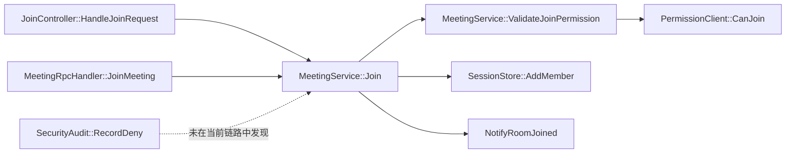
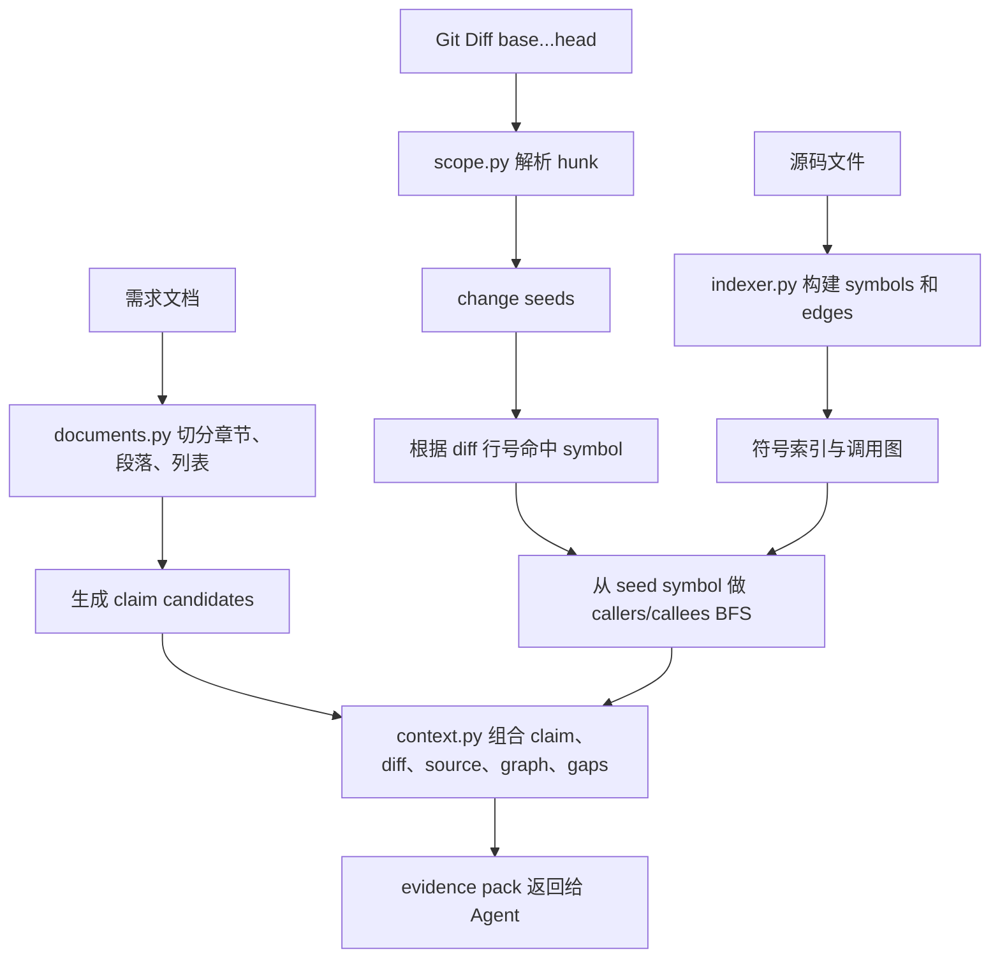

# 证据上下文构建与 Agent 工具权限设计

## 第一部分：总结介绍

这一部分对应简历里的两段能力：一是“调取内部需求文档和 MR 变更信息，基于 Git Diff、AST/Tree-sitter 构建符号索引与双向调用链，形成需求-变更-代码关联的证据上下文”；二是“通过受控工具约束 Agent 的取证范围”。这两者必须放在一起理解，因为证据上下文不是普通检索结果，而是 Agent 能够判断一致性的唯一事实来源。

整个数据流从 `spec_review_start` 开始。用户输入 MR 标识或 MR 链接、仓库范围、路径过滤、章节过滤和审查模式后，TypeScript 工具会把 payload 交给 Python Runtime。Runtime 的 `workflow.start_case` 先校验范围；MR 模式下会通过内部 MCP 与平台接口获取 MR 信息和设计文档，锁定 base/head SHA，并准备 detached analysis worktree；然后依次调用索引、diff 范围解析和需求声明抽取。这里的顺序不是随意的：先建索引，才能把 diff hunk 关联到代码符号；先解析变更范围，才能知道后续上下文应该从哪些 seed 出发；再抽取需求 claim，才能把同一批变更证据与每条需求声明组合成 evidence pack。

需求文档处理在 `runtime/spec_review_runtime/documents.py`。它支持 Markdown、txt、rst、adoc 这类文本文件。`load_claim_candidates` 会先通过 `resolve_inside(repo, value)` 把文档路径解析到 analysis repo 内，然后读取文档内容。文档不是直接整篇丢给模型，而是通过标题、段落和列表切成候选块。标题会形成 section，段落和列表项会形成 source_text，再被 `_candidate_statement` 清洗成 statement。新版还会把明显的文档信息、版本历史、目录、负责人、状态等块预标记为 `verifiability=metadata`，这些 claim 不会被丢弃，但 L3 通常应判为 `not_applicable`，避免把文档元数据误当成功能需求。

这个设计解决了两个问题。第一，需求文档通常包含背景、目标、边界、非功能要求、示例和验收标准，如果整篇给模型，模型很难把某个结论对应到具体需求点。第二，一致性审查需要支持 `sections` 过滤，比如只审查“重试策略”或“权限校验”章节。把文档拆成 claim 后，Runtime 可以只加载相关 section，减少上下文并提高审查聚焦度。

MR 变更处理在 `runtime/spec_review_runtime/scope.py`。当用户提供 `base` 时，Runtime 通过 `git diff --no-ext-diff --no-color --unified=3 base...head -- paths` 计算 diff。`_parse_diff` 会解析 diff hunk，提取文件路径、old/new 起始行、行数、变更类型和 diff 文本。然后 `_symbol_at_line` 会根据 hunk 的新行号，到当前 snapshot 的符号表里查找覆盖该行的最小符号。这样一个 diff hunk 就不只是“某个文件几行变化”，而是可以变成“某个函数或方法附近发生变化”的 seed。

如果没有 base 但提供了 paths，系统不会产生 Git Diff seed，而是调用 `_seed_scoped_symbols`，把路径范围内的符号作为 scoped seeds。这是一个折中：有 MR diff 时，审查更精准；没有 diff 但用户明确指定路径时，系统仍然可以围绕这些路径做需求实现检查；如果既没有 diff 又没有 path，也没有显式 fullRepo，Runtime 会拒绝审查。

代码索引构建在 `runtime/spec_review_runtime/indexer.py`。`build_or_update_index` 会扫描业务仓库内的源文件，跳过 `.git`、`.spec-review`、`node_modules`、虚拟环境、构建目录和 vendor 等目录。每次索引会创建一个 snapshot，并基于文件 sha256 判断是否可以复用上一快照的符号和边。这样做的目的是支持短生命周期 Runtime：虽然每次工具调用都会启动新进程，但索引结果可以持久化复用，避免每次从零解析全仓。

索引的核心产物是两类事实：`symbols` 和 `edges`。`symbols` 表示类、函数、方法以及模块级变量/常量等代码定义，包含名称、qualified_name、kind、起止行、签名、解析后端和精度。`edges` 表示调用关系，包含 source_symbol_id、target_name、target_symbol_id、行号、解析器、置信度和解析状态。部署环境里 Tree-sitter 作为主要结构化解析能力，结合语言 AST 和查询规则提取函数、类、方法、常量与调用引用，再把调用目标解析成 resolved、ambiguous 或 unresolved。这样符号索引不是简单文本检索，而是能支撑 diff 行号归因、双向调用链扩展和 evidence_id 追溯的结构化代码视图。

这个边界在面试里很重要。静态索引不是万能的，尤其是动态语言、反射、依赖注入、框架路由、跨服务 RPC 都可能无法靠静态调用图准确建模。因此代码里给 `edges` 设计了 `confidence` 和 `resolution_status`。如果某个调用只能解析出名字，找不到唯一目标，就会标记为 `unresolved` 或 `ambiguous`。后续 context 构建时，这些不确定边会变成 `gaps`，提示 Agent 不要把“解析不到”当作“不存在”。

上下文构建在 `runtime/spec_review_runtime/context.py`。当 Agent 调用 `spec_review_context` 时，Runtime 会先根据当前阶段确定目标 claim：L3 返回全部真实 claim，L4 在 auto 模式下主要返回 L3 判为 `inconsistent/uncertain` 的候选 claim。新版 context 是分页返回的，默认 `cursor=0, limit=3`，每页最多 10 条 claim，返回值里有 `page.next_cursor`。对于每条 claim，Runtime 会根据需求文本、章节和可选 query 对 diff seed、symbol 和源码内容做相关性排序，再从高相关 seed symbol 出发调用 `_bounded_graph` 做 BFS。`direction` 可以是 `callers`、`callees` 或 `both`，`maxNodes` 会受到 workflow 里的预算限制；新版普通阶段默认最多 20 个节点，L4 investigate 相关预算最多 60 个节点。这个设计体现了上下文预算控制：不是让模型一次拿全图，而是分页、排序、截断地返回最相关证据。

`_bounded_graph` 做的事情是从变更符号开始，沿调用边查上下游关系。如果 direction 是 `callees`，就看当前变更会调用哪些下游；如果是 `callers`，就看哪些入口或上游会调用这个变更；如果是 `both`，就双向扩展。每条边都会带上 resolver、confidence 和 resolution_status。当遇到 ambiguous 或 unresolved 边时，会生成 `unresolved_edge` gap；当 BFS 达到节点上限时，会生成 `budget_limit` gap。

最后，`build_context_packs` 会为当前页每条 claim 构造一个 pack。pack 里包含 claim 本身、review_type、change_summary、graph、evidence 和 gaps。comparison 模式下会返回 diff evidence；snapshot 模式没有 base，不会伪造 diff 归因，而是围绕路径或全仓符号返回 source evidence。源码证据会限制单段字符数，图边和 gap 也会截断，避免一次工具输出过大。每条 evidence 都有 `evidence_id`、path、start_line、end_line、revision、content 和 metadata。这个 evidence_id 是最终报告可追溯的核心。

为了让这个中间结果更直观，可以假设设计文档里有一条需求：“当会话鉴权失败时，系统必须拒绝加入会议，并记录安全审计日志。”MR 改动了 `MeetingService::Join`，diff 中新增了 `ValidateJoinPermission(user, room)`，但没有明显看到审计日志。索引前，模型看到的可能只是一段 C++ 文本；索引后，Runtime 会把代码变成可查询的结构化事实。

索引前的源码片段大概是这样：

```cpp
bool MeetingService::Join(const User& user, const Room& room) {
    if (!ValidateJoinPermission(user, room)) {
        return false;
    }
    sessionStore_.AddMember(room.id(), user.id());
    NotifyRoomJoined(room.id(), user.id());
    return true;
}

bool MeetingService::ValidateJoinPermission(const User& user, const Room& room) {
    return permissionClient_.CanJoin(user.id(), room.id());
}
```

Tree-sitter 解析后，不是只得到“这段文本包含 Join 和 ValidateJoinPermission”，而是先得到语法树节点，例如函数定义、参数列表、成员调用、返回语句和调用表达式。Runtime 再把这些语法节点转换成索引 facts。可以把结果理解成下面这种表，而不是一大段自然语言：

| 表 | 关键字段 | 示例值 |
| --- | --- | --- |
| `symbols` | `symbol_id` | `sym_1024` |
| `symbols` | `qualified_name` | `MeetingService::Join` |
| `symbols` | `kind` | `method` |
| `symbols` | `path` | `src/meeting/meeting_service.cpp` |
| `symbols` | `start_line/end_line` | `41/49` |
| `symbols` | `signature` | `bool Join(const User& user, const Room& room)` |
| `edges` | `source_symbol_id` | `sym_1024` |
| `edges` | `target_name` | `ValidateJoinPermission` |
| `edges` | `target_symbol_id` | `sym_1031` |
| `edges` | `line` | `42` |
| `edges` | `direction` | `callee` |
| `edges` | `resolution_status` | `resolved` |

所以“为代码库建立索引”的结果，本质上是把文件系统中的代码转成四类可复用对象：文件快照、符号表、调用边和解析状态。后续 diff 命中第 42 行时，Runtime 不再只知道“某一行变了”，而是知道“`MeetingService::Join` 这个方法的鉴权路径变了，并且它调用了 `ValidateJoinPermission`，下游又调用了 `permissionClient_.CanJoin`”。

双向调用链也可以用这个例子理解。如果从 `MeetingService::Join` 出发查 `callees`，系统看到的是它调用了鉴权、写 session、通知房间加入；如果查 `callers`，系统会沿反向边找到 `JoinController::HandleJoinRequest` 或 `MeetingRpcHandler::JoinMeeting` 这类入口。对一致性审查来说，两边都重要：下游能证明是否真的执行了鉴权和审计，上游能证明这个变更是否在真实业务入口可达。



这张图里，`A/C -> B` 是 callers 方向，回答“谁会触发这个变更”；`B -> D/E/F/G` 是 callees 方向，回答“这个变更会产生什么下游行为”。虚线的 `SecurityAudit::RecordDeny` 不是系统编造的调用边，而是需求期望中的候选证据缺口：文档要求鉴权失败要记录安全审计日志，但当前从 diff seed 扩展出的调用链里没有找到审计动作，因此会形成 gap，等待 L4 investigate 定向取证。

一个真实 evidence pack 可以理解成下面这种形态。它不是最终结论，而是给 Agent 做判断的事实包：

```json
{
  "case_id": "case_20260901_001",
  "stage": "l3_review",
  "page": { "cursor": 0, "limit": 3, "next_cursor": 3 },
  "packs": [
    {
      "claim": {
        "claim_id": "C-002",
        "section": "权限与审计",
        "statement": "当会话鉴权失败时，系统必须拒绝加入会议，并记录安全审计日志。",
        "verifiability": "code"
      },
      "change_summary": {
        "changed_files": ["src/meeting/meeting_service.cpp"],
        "seed_symbols": ["MeetingService::Join"]
      },
      "evidence": [
        {
          "evidence_id": "E-diff-201",
          "kind": "diff",
          "path": "src/meeting/meeting_service.cpp",
          "start_line": 42,
          "end_line": 45,
          "content": "+ if (!ValidateJoinPermission(user, room)) { return false; }"
        },
        {
          "evidence_id": "E-src-318",
          "kind": "source",
          "path": "src/meeting/meeting_service.cpp",
          "start_line": 41,
          "end_line": 49,
          "content": "MeetingService::Join 函数体片段"
        }
      ],
      "graph": {
        "nodes": ["MeetingService::Join", "ValidateJoinPermission", "PermissionClient::CanJoin"],
        "edges": [
          {
            "from": "MeetingService::Join",
            "to": "ValidateJoinPermission",
            "resolution_status": "resolved"
          }
        ]
      },
      "gaps": [
        {
          "gap_id": "G-007",
          "type": "missing_expected_behavior",
          "reason": "当前证据能证明失败时拒绝加入，但没有证明失败路径记录安全审计日志。"
        }
      ]
    }
  ]
}
```

这里每个字段都有作用。`claim` 让模型知道要判断哪条需求；`change_summary` 把 MR diff 和命中符号联系起来；`evidence` 提供可引用的 diff/source 证据；`graph` 告诉模型上下游调用关系；`gaps` 告诉模型哪些部分不能直接下结论。最终如果模型判 `inconsistent`，必须引用 `E-diff-201`、`E-src-318` 这类 evidence_id，并说明为什么这些证据不足以满足“记录安全审计日志”的需求。

这个数据流可以表示为：



Agent 工具权限设计和这个数据流是绑定的。`plugins/spec-review/src/index.ts` 里注册工具时，除 `spec_review_start/status/context/submit/next/finish` 外，新版还暴露了 `spec_review_investigate`、`spec_review_investigation_status`、`spec_review_publish_preview`、`spec_review_publish`、`spec_review_fix_preview` 和 `spec_review_create_fix_pr`。子 Agent 的 permission 明确拒绝所有工具，只允许 `spec_review_*`。这不是单纯为了安全，而是为了让审查证据闭环。Agent 如果需要更多普通上下文，只能通过分页 `spec_review_context` 请求；如果进入 L4 取证阶段，则必须通过 `spec_review_investigate` 执行一个个受控 action，并受 investigation budget 约束。

这里的工程边界是：模型可以提出“我需要沿 callers 查上游入口”或“我需要围绕某个 gap 补证”，但它不能直接打开任意文件。这样系统把 Agent 的自主性限制在“取证策略选择”层面，而不是“任意数据访问”层面。对于生产 Agent，这是更稳的设计，因为企业内部需求文档和代码仓库往往有权限边界，审查结果还可能进入 MR 评论。如果证据来源无法解释，工具就很难被信任。

当前落地也有几个工程边界。第一，插件会通过内部 MCP 与平台接口获取 MR 信息和设计文档，并把需求 ID、章节、验收项和文档版本规范化成 claim；同时保留 Markdown/text 解析作为离线调试和兜底输入。第二，MR 信息会被规范化成 base/head、changed files、review context 和发布目标，后续如果对接更多内部平台实例，只需要扩展适配层，不改变 Runtime 的 evidence pack 结构。第三，静态调用图对动态行为覆盖有限，生产中应结合测试覆盖率、运行日志、链路追踪或框架路由表补充证据。

## 面试话术版本

如果面试官问“你是怎么把需求文档、MR 变更和代码关联起来的”，我会这样回答：

我没有让模型直接读全量文档和代码，而是先用 Runtime 构造一个结构化证据上下文。需求侧，插件通过内部 MCP 与平台接口获取设计文档，再把章节、段落、表格和验收项规范化成候选 claim，并把明显文档元数据标成 metadata，避免当成功能需求误审。变更侧，MR 信息由内部平台提供，Runtime 会锁定 MR 的 base/head SHA 并准备 analysis worktree，再基于 `base...head` 计算 Git Diff，把每个 diff hunk 解析成 change seed。代码侧，我会用 AST/Tree-sitter 构建符号表和调用边。

Diff seed 会根据新行号映射到当前 snapshot 的函数或方法符号，然后系统从这些 seed symbol 出发，沿 callers 和 callees 做有界 BFS，找到上下游相关代码。最后 Runtime 会把 claim、diff、源码片段、调用图和证据缺口组合成 evidence pack 返回给 Agent。每条 diff 和 source 证据都会持久化，并生成 evidence_id。Agent 最终的 inconsistent 或 uncertain 结论必须引用这些 evidence_id。

为了保证这个证据链闭环，我把子 Agent 的权限限制为只能调用 `spec_review_*` 工具。它不能自己 grep 或 read 文件。如果它需要普通上下文，只能通过 `spec_review_context` 分页拿证据；如果进入 L4 取证，则通过 `spec_review_investigate` 选择一个 action，拿到 observation 后再决定下一步。这样模型有推理能力和有限取证策略，但事实边界、预算和证据归属由程序控制，审查结论更可复现。

## 第二部分：面试问答与追问补充

Q：为什么要先建符号索引，再解析 diff？

A：因为 diff 本身只告诉我们某个文件的某几行变了，但审查需要知道这些行属于哪个函数、方法或类。先建当前 snapshot 的符号表后，diff hunk 可以通过新行号映射到覆盖它的最小符号。这样后续调用链扩展就有了稳定 seed，而不是只围绕文件级别做粗粒度检索。

Q：为什么要做双向调用链，而不是只看被改函数？

A：需求实现经常不只体现在被改函数内部。比如权限校验可能在上游入口，重试和降级可能在调用方，副作用可能在下游服务封装。如果只看被改函数，很容易漏掉真实业务路径。所以我从 diff 命中的 symbol 出发，支持 callers 和 callees 双向扩展，用调用图帮助模型理解变更的上下游影响。

Q：如果调用图解析不准怎么办？

A：这个设计没有把调用图当成最终证据，而是把它当成导航线索。每条 edge 都带有 confidence 和 resolution_status。未解析或多候选的边会形成 gap，Agent 不能把“图里没有边”直接当成“运行时不可达”。最终 inconsistent 必须同时有需求 claim、具体源码或 diff evidence、替代路径检查和与本次变更范围的关系。

Q：为什么 evidence pack 要按 claim 组织？

A：一致性审查的结论必须对应到某条需求。如果只按文件或函数组织证据，最后可能变成泛泛的代码 review。按 claim 组织后，模型每次判断的对象就是“这条需求是否被本次变更满足”，证据则围绕这条 claim 展开。这样报告更接近需求验收，也方便统计哪些需求被实现、哪些不确定、哪些不适用。

Q：为什么不直接用 RAG 检索相关代码？

A：普通 RAG 往往基于文本相似度，适合找“可能相关”的内容，但代码实现一致性更依赖结构关系。比如函数名不相似但处在调用链上，文本检索可能找不到；相反，名字相似的函数也可能不是本次变更路径。这里用 Git Diff seed、AST/Tree-sitter 符号和调用图构造证据，比纯文本召回更可解释。当然生产化可以把 RAG 作为补充，比如用于需求术语到代码模块的候选映射，但不能替代证据链。

Q：为什么要限制 Agent 只能通过工具取证？

A：因为企业代码审查需要可审计。如果模型自由读文件，它可能引用了没有持久化的上下文，后续无法复盘。受控工具让所有上下文都经过 Runtime，并被保存成 evidence。模型需要更多信息时，可以选择 direction 和 maxNodes，但不能绕开 evidence 系统。这是把 Agent 自主性和工程可控性分开的设计。

Q：生产环境里怎么接入真实需求文档和 MR？

A：插件会通过内部 MCP 与平台接口获取 MR 信息和设计文档。MR 侧会拿到仓库、目标分支、源分支、base/head SHA、变更文件、作者、状态和发布上下文；需求侧会拿到需求 ID、标题、章节、验收标准、文档版本和权限信息。Runtime 不直接把这些原始平台数据交给模型，而是先规范化成 claim、change seed 和 evidence pack。这样平台接入可以替换，但 Agent workflow 不需要大改。
