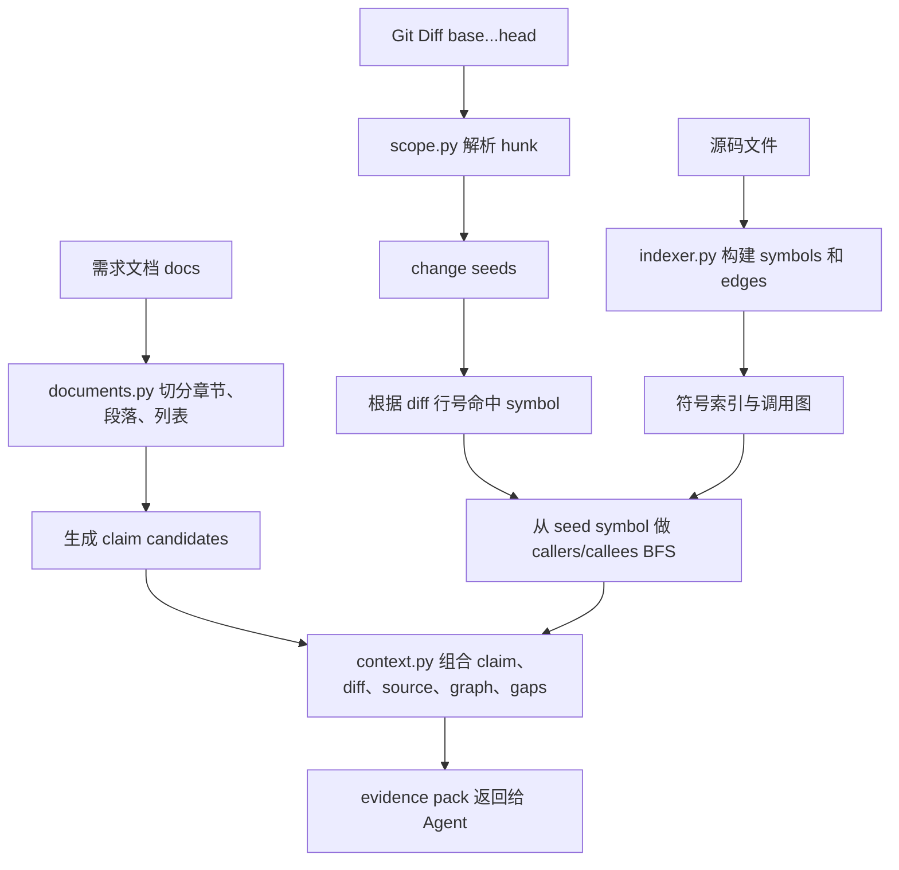

# 证据上下文构建与 Agent 工具权限设计

## 第一部分：总结介绍

这一部分对应简历里的两段能力：一是“调取内部需求文档和 MR 变更信息，基于 Git Diff、AST/Tree-sitter 构建符号索引与双向调用链，形成需求-变更-代码关联的证据上下文”；二是“通过受控工具约束 Agent 的取证范围”。这两者必须放在一起理解，因为证据上下文不是普通检索结果，而是 Agent 能够判断一致性的唯一事实来源。

整个数据流从 `spec_review_start` 开始。用户输入 `docs`、`base`、`head`、`paths`、`sections` 和 `mode` 后，TypeScript 工具会把 payload 交给 Python Runtime。Runtime 的 `workflow.start_case` 先校验范围，再依次调用索引、diff 范围解析和需求声明抽取。这里的顺序不是随意的：先建索引，才能把 diff hunk 关联到代码符号；先解析变更范围，才能知道后续上下文应该从哪些 seed 出发；再抽取需求 claim，才能把同一批变更证据与每条需求声明组合成 evidence pack。

需求文档处理在 `runtime/spec_review_runtime/documents.py`。它支持 Markdown、txt、rst、adoc 这类文本文件。`load_claim_candidates` 会先通过 `resolve_inside(repo, value)` 把文档路径解析到业务仓库内，然后读取文档内容。文档不是直接整篇丢给模型，而是通过标题、段落和列表切成候选块。标题会形成 section，段落和列表项会形成 source_text，再被 `_candidate_statement` 清洗成 statement。这样后续 Agent 审查的基本单位不是整篇文档，而是一条条可定位的 claim。

这个设计解决了两个问题。第一，需求文档通常包含背景、目标、边界、非功能要求、示例和验收标准，如果整篇给模型，模型很难把某个结论对应到具体需求点。第二，一致性审查需要支持 `sections` 过滤，比如只审查“重试策略”或“权限校验”章节。把文档拆成 claim 后，Runtime 可以只加载相关 section，减少上下文并提高审查聚焦度。

MR 变更处理在 `runtime/spec_review_runtime/scope.py`。当用户提供 `base` 时，Runtime 通过 `git diff --no-ext-diff --no-color --unified=3 base...head -- paths` 计算 diff。`_parse_diff` 会解析 diff hunk，提取文件路径、old/new 起始行、行数、变更类型和 diff 文本。然后 `_symbol_at_line` 会根据 hunk 的新行号，到当前 snapshot 的符号表里查找覆盖该行的最小符号。这样一个 diff hunk 就不只是“某个文件几行变化”，而是可以变成“某个函数或方法附近发生变化”的 seed。

如果没有 base 但提供了 paths，系统不会产生 Git Diff seed，而是调用 `_seed_scoped_symbols`，把路径范围内的符号作为 scoped seeds。这是一个折中：有 MR diff 时，审查更精准；没有 diff 但用户明确指定路径时，系统仍然可以围绕这些路径做需求实现检查；如果既没有 diff 又没有 path，也没有显式 fullRepo，Runtime 会拒绝审查。

代码索引构建在 `runtime/spec_review_runtime/indexer.py`。`build_or_update_index` 会扫描业务仓库内的源文件，跳过 `.git`、`.spec-review`、`node_modules`、虚拟环境、构建目录和 vendor 等目录。每次索引会创建一个 snapshot，并基于文件 sha256 判断是否可以复用上一快照的符号和边。这样做的目的是支持短生命周期 Runtime：虽然每次工具调用都会启动新进程，但索引结果可以持久化复用，避免每次从零解析全仓。

索引的核心产物是两类事实：`symbols` 和 `edges`。`symbols` 表示类、函数、方法等代码定义，包含名称、qualified_name、kind、起止行、签名、解析后端和精度。`edges` 表示调用关系，包含 source_symbol_id、target_name、target_symbol_id、行号、解析器、置信度和解析状态。对于 Python，当前实现可以使用标准库 AST 解析函数、类和调用表达式；对于其他语言，如果 Tree-sitter 原生语法模块可用，则使用查询文件提取标签；如果不可用，会记录 `backend_unavailable`，不会伪称已经完成语义索引。

这个边界在面试里很重要。静态索引不是万能的，尤其是动态语言、反射、依赖注入、框架路由、跨服务 RPC 都可能无法靠静态调用图准确建模。因此代码里给 `edges` 设计了 `confidence` 和 `resolution_status`。如果某个调用只能解析出名字，找不到唯一目标，就会标记为 `unresolved` 或 `ambiguous`。后续 context 构建时，这些不确定边会变成 `gaps`，提示 Agent 不要把“解析不到”当作“不存在”。

上下文构建在 `runtime/spec_review_runtime/context.py`。当 Agent 调用 `spec_review_context` 时，Runtime 会读取当前 case 的 claims 和 change_seeds，然后从 seed_symbols 出发调用 `_bounded_graph` 做 BFS。`direction` 可以是 `callers`、`callees` 或 `both`，`maxNodes` 会受到 workflow 里的预算限制。普通阶段默认最多 40 个节点，L4 investigate 阶段最多 120 个节点。这个设计体现了上下文预算控制：不是让模型一次拿全图，而是在初筛阶段保持小上下文，在定向取证阶段扩大范围。

`_bounded_graph` 做的事情是从变更符号开始，沿调用边查上下游关系。如果 direction 是 `callees`，就看当前变更会调用哪些下游；如果是 `callers`，就看哪些入口或上游会调用这个变更；如果是 `both`，就双向扩展。每条边都会带上 resolver、confidence 和 resolution_status。当遇到 ambiguous 或 unresolved 边时，会生成 `unresolved_edge` gap；当 BFS 达到节点上限时，会生成 `budget_limit` gap。

最后，`build_context_packs` 会为每条 claim 构造一个 pack。pack 里包含 claim 本身、change_summary、graph、evidence 和 gaps。diff seed 会被持久化为 kind=`diff` 的 evidence，调用图命中的源码片段会被持久化为 kind=`source` 的 evidence。每条 evidence 都有 `evidence_id`、path、start_line、end_line、revision、content 和 metadata。这个 evidence_id 是最终报告可追溯的核心。

这个数据流可以表示为：

Agent 工具权限设计和这个数据流是绑定的。`plugins/spec-review/src/index.ts` 里注册工具时，只暴露了 `spec_review_start`、`spec_review_status`、`spec_review_context`、`spec_review_submit`、`spec_review_next` 和 `spec_review_finish`。子 Agent 的 permission 明确拒绝所有工具，只允许 `spec_review_*`。这不是单纯为了安全，而是为了让审查证据闭环。Agent 如果需要更多上下文，只能通过 `spec_review_context` 请求，并且要带上 caseId、claimId、gapId、direction 和 maxNodes。Runtime 会根据 case 状态和预算决定返回多少。

这里的工程边界是：模型可以提出“我需要沿 callers 查上游入口”或“我需要围绕某个 gap 补证”，但它不能直接打开任意文件。这样系统把 Agent 的自主性限制在“取证策略选择”层面，而不是“任意数据访问”层面。对于生产 Agent，这是更稳的设计，因为企业内部需求文档和代码仓库往往有权限边界，审查结果还可能进入 MR 评论。如果证据来源无法解释，工具就很难被信任。

当前实现有几个简化。第一，需求 claim 抽取主要基于 Markdown 结构和文本块，没有使用需求管理系统里的需求 ID、验收标准字段或文档版本号。生产化可以接入内部文档 API，把 claim 和需求 ID、版本、作者、发布时间绑定。第二，当前 diff 来源是本地 Git，对真实 MR 平台的评论、commit 列表、变更文件元数据、review thread 没有直接接入。生产化可以接 GitHub/GitLab 内部 API。第三，静态调用图对动态行为覆盖有限，生产中应结合测试覆盖率、运行日志、链路追踪或框架路由表补充证据。

## 面试话术版本

如果面试官问“你是怎么把需求文档、MR 变更和代码关联起来的”，我会这样回答：

我没有让模型直接读全量文档和代码，而是先用 Runtime 构造一个结构化证据上下文。需求侧，我会把 Markdown 需求文档按标题、段落和列表拆成候选 claim，并支持按章节过滤。变更侧，我会基于 `base...head` 计算 Git Diff，把每个 diff hunk 解析成 change seed。代码侧，我会扫描仓库构建符号表和调用边，Python 使用 AST，其他语言在 Tree-sitter 后端可用时使用 tags query。

Diff seed 会根据新行号映射到当前 snapshot 的函数或方法符号，然后系统从这些 seed symbol 出发，沿 callers 和 callees 做有界 BFS，找到上下游相关代码。最后 Runtime 会把 claim、diff、源码片段、调用图和证据缺口组合成 evidence pack 返回给 Agent。每条 diff 和 source 证据都会持久化，并生成 evidence_id。Agent 最终的 inconsistent 或 uncertain 结论必须引用这些 evidence_id。

为了保证这个证据链闭环，我把子 Agent 的权限限制为只能调用 `spec_review_*` 工具。它不能自己 grep 或 read 文件。如果它需要补充上下文，只能通过 `spec_review_context` 指定 claim、gap、方向和节点预算，由 Runtime 返回受控证据。这样模型有推理能力，但事实边界由程序控制，审查结论更可复现。

## 第二部分：面试问答与追问补充

Q：为什么要先建符号索引，再解析 diff？

A：因为 diff 本身只告诉我们某个文件的某几行变了，但审查需要知道这些行属于哪个函数、方法或类。先建当前 snapshot 的符号表后，diff hunk 可以通过新行号映射到覆盖它的最小符号。这样后续调用链扩展就有了稳定 seed，而不是只围绕文件级别做粗粒度检索。

Q：为什么要做双向调用链，而不是只看被改函数？

A：需求实现经常不只体现在被改函数内部。比如权限校验可能在上游入口，重试和降级可能在调用方，副作用可能在下游服务封装。如果只看被改函数，很容易漏掉真实业务路径。所以我从 diff 命中的 symbol 出发，支持 callers 和 callees 双向扩展，用调用图帮助模型理解变更的上下游影响。

Q：如果调用图解析不准怎么办？

A：这个设计没有把调用图当成最终证据，而是把它当成导航线索。每条 edge 都带有 confidence 和 resolution_status。未解析或多候选的边会形成 gap，Agent 不能把“图里没有边”直接当成“运行时不可达”。最终 inconsistent 必须同时有需求 claim、具体源码或 diff evidence、替代路径检查和与本次变更范围的关系。

Q：为什么 evidence pack 要按 claim 组织？

A：一致性审查的结论必须对应到某条需求。如果只按文件或函数组织证据，最后可能变成泛泛的代码 review。按 claim 组织后，模型每次判断的对象就是“这条需求是否被本次变更满足”，证据则围绕这条 claim 展开。这样报告更接近需求验收，也方便统计哪些需求被实现、哪些不确定、哪些不适用。

Q：为什么不直接用 RAG 检索相关代码？

A：普通 RAG 往往基于文本相似度，适合找“可能相关”的内容，但代码实现一致性更依赖结构关系。比如函数名不相似但处在调用链上，文本检索可能找不到；相反，名字相似的函数也可能不是本次变更路径。这里用 Git Diff seed、AST/Tree-sitter 符号和调用图构造证据，比纯文本召回更可解释。当然生产化可以把 RAG 作为补充，比如用于需求术语到代码模块的候选映射，但不能替代证据链。

Q：为什么要限制 Agent 只能通过工具取证？

A：因为企业代码审查需要可审计。如果模型自由读文件，它可能引用了没有持久化的上下文，后续无法复盘。受控工具让所有上下文都经过 Runtime，并被保存成 evidence。模型需要更多信息时，可以选择 direction 和 maxNodes，但不能绕开 evidence 系统。这是把 Agent 自主性和工程可控性分开的设计。

Q：生产环境里怎么接入真实需求文档和 MR？

A：当前实现用本地文件和本地 Git Diff 模拟这两个输入。生产化时，我会接入内部需求文档系统 API，拿到需求 ID、标题、验收标准、版本号和发布时间；同时接入 MR 平台 API，拿到目标分支、源分支、commit、变更文件、review thread 和 CI 状态。Runtime 仍然负责把这些输入规范化成 claim、change seed 和 evidence pack，Agent workflow 不需要大改。

