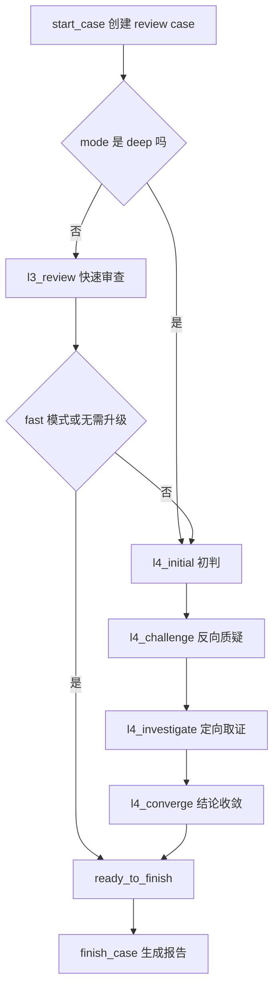

# 多阶段审查引擎与工程化生产边界

## 第一部分：总结介绍

这一部分对应简历里的“设计证据驱动的多阶段审查引擎，引导大模型依次完成初判、反向质疑、定向取证与结论收敛，实现对需求实现情况的判定与证据追溯”。这里的重点不是 LLM 能不能回答问题，而是如何把一次容易幻觉的一次性判断，改造成可控的 Agentic Workflow。

这个插件的审查状态定义在 `runtime/spec_review_runtime/workflow.py`。状态集合包括 `l3_review`、`l4_initial`、`l4_challenge`、`l4_investigate` 和 `l4_converge`。其中 L3 是快速审查，目标是低成本形成候选结论；L4 是深度审查，目标是通过初判、质疑、补证和收敛降低误报。模式由用户传入的 `mode` 控制：`fast` 只执行 L3，`deep` 直接进入 L4，`auto` 先执行 L3，如果出现 inconsistent、uncertain 或模型主动设置 `escalate=true`，再升级到 L4。

`workflow.start_case` 创建 case 时会决定初始阶段。如果 mode 是 `deep`，初始阶段是 `l4_initial`；否则初始阶段是 `l3_review`。这个设计兼顾效率和质量。大多数 MR 可以先用 L3 快速筛查，只有出现不一致候选或证据不足时才进入 L4。对于高风险需求，比如支付、权限、数据一致性，可以直接用 deep 模式进入 L4，牺牲一些成本换更充分的审查。

多阶段流程由 Runtime 的 `action_packet` 驱动。Agent 不自己决定下一步，而是每次读取 `next_action.action`。如果当前阶段未提交，Runtime 返回当前 stage 和对应 instructions；如果已经提交但还没推进，返回 `awaiting_next`；如果进入 `ready_to_finish`，返回 `finish`；如果状态异常，返回 `blocked`。这相当于把 Agent 的行动空间收束到一条明确轨道里，避免模型跳过质疑阶段或重复提交。

每个阶段的顺序是固定的：先 `spec_review_context`，再 `spec_review_submit`，最后 `spec_review_next`。prompt 里要求这个顺序，Runtime 也在代码里 enforce。`submit_stage` 会检查提交的 stage 必须等于 case 当前 stage，并且 `stage_runs` 表通过唯一约束保证每个阶段只能提交一次。`advance` 会先确认当前阶段已经存在提交结果，才能根据 `_next_stage` 推进。这样设计的原因是，Agent 的自然语言推理不稳定，必须用外部状态机来保证审查流程不会乱。

L3 阶段的定位是快速筛查。Agent 调用 `spec_review_context` 获取有界上下文包，对每条 claim 输出 `consistent`、`inconsistent`、`uncertain` 或 `not_applicable`。这里 L3 的结果不应该被包装成强结论，尤其当证据不足时必须输出 uncertain。`_needs_deep_review` 会检查 L3 提交结果，如果出现 `inconsistent` 或 `uncertain`，auto 模式会进入 `l4_initial`。这个机制相当于把 L3 作为候选问题发现器，而不是最终裁判。

L4 的第一步是 `l4_initial`，也就是初判。这个阶段要求 Agent 写清楚文档期望、观察到的代码行为、候选差异、变更归因假设、支持证据和未证实前提。初判阶段的价值在于把模型的第一反应结构化，明确它为什么认为某个需求可能没实现，引用了哪些 evidence_id，还有哪些前提没有验证。没有这个结构化初判，后面的质疑和取证就没有靶子。

L4 的第二步是 `l4_challenge`，也就是反向质疑。这一步是多阶段审查里最有面试价值的设计。因为代码-需求一致性审查特别容易误报：需求可能不适用于当前路径；实现可能在别名函数、装饰器、配置项或上游调用里；某个行为可能由框架默认机制提供；diff 只是暴露了历史问题而不是引入问题。反向质疑要求 Agent 主动尝试推翻自己的初判，并输出按优先级排序的 evidence gaps。

L4 的第三步是 `l4_investigate`，也就是定向取证。这个阶段不是重新全量阅读，而是围绕已有 gap 调用 `spec_review_context`，选择 callers、callees 或 both，并控制 maxNodes。Runtime 在 `workflow.context` 中给 investigate 阶段更大的上下文预算：普通阶段用 `max_context_nodes`，investigate 阶段用 `max_investigation_nodes`。这体现了一个工程策略：只有当问题和缺口已经明确时，才扩大上下文，避免从一开始就让模型处理过多代码。

L4 的最后一步是 `l4_converge`，也就是结论收敛。这个阶段要去除误报，合并相同根因，给出严重级别和归因。归因枚举包括 introduced、exposed、pre_existing 和 unattributed。这里的要求很严格：一个 inconsistent 结论必须同时具备可验证需求、精确代码证据、替代路径检查，以及与本次审查范围的可辩护关系。换句话说，模型不能只因为“看起来没实现”就报问题，它必须说明证据链闭合。

多阶段审查流程可以表示为：

工程化方面，Runtime 使用 SQLite 保存所有状态，数据库路径是业务仓库下的 `.spec-review/index.sqlite`。`db.py` 中的 schema 包含 index_snapshots、files、file_versions、symbols、edges、documents、claims、review_cases、change_seeds、evidence 和 stage_runs。这里不是简单缓存，而是把一次审查拆成可恢复、可检查的状态记录。比如 review_cases 保存 case 当前阶段和状态，stage_runs 保存每个阶段的模型结构化输出，evidence 保存模型可引用的证据，change_seeds 保存本次变更范围。

并发控制由 `locking.py` 负责。每次 Python Runtime 启动后，会先获取仓库级 `runtime.lock` 的 fcntl 排他锁，再连接 SQLite。锁文件会保留，但真正有效的是操作系统内核锁，进程退出后自动释放。因此异常退出不会留下必须人工删除的僵尸锁。SQLite 同时开启 WAL 和 busy_timeout，用来改善读写并发和短暂锁竞争。这个设计适合短生命周期命令式 Runtime：简单、可靠，不需要额外服务治理。

报告生成在 `report.py`。只有当 case stage 是 `ready_to_finish` 或 `finished` 时，Runtime 才允许生成报告。它会读取所有阶段结果，优先选 `l4_converge` 作为最终结果，如果没有 L4 就使用 `l3_review`。最终输出 JSON 和 Markdown。JSON 保存完整 payload 和 stage_results，适合机器消费和后续指标分析；Markdown 面向用户，展示审查结论、问题清单、严重级别、变更归因和证据 ID。

这套工程化设计有几个明显优点。第一，审查过程可恢复和可追溯，因为每一步都落库。第二，Agent 行为可约束，因为状态机和工具权限都在代码里 enforce。第三，证据上下文可复盘，因为 evidence 不只是 prompt 临时文本，而是持久化记录。第四，部署简单，因为不依赖 MCP、sidecar、网络服务或 OpenCode 内部数据库。

同时也要明确边界。当前实现偏教学和本地发行形态，生产能力还需要增强。比如 README 提到维护者可以运行 `runtime/tests`，但当前项目目录里没有这个测试目录，说明发行包或当前仓库没有包含完整测试资产。非 Python 语言的 Tree-sitter 能力依赖原生语法模块，如果发行物没有预打包，就会降级为 `backend_unavailable`。静态调用图无法完整覆盖动态行为，所以不能把 unresolved edge 解释为没有实现。报告目前写入本地 `.spec-review`，还没有自动回写 MR 评论或和内部质量平台打通。

生产化改进可以沿四个方向做。第一是输入源增强：接入 GitHub/GitLab MR API 和内部需求文档系统，保留 MR 编号、commit、需求 ID、文档版本和审批状态。第二是证据源增强：引入测试覆盖率、CI 结果、运行日志、链路追踪、配置解析和服务依赖图，补静态分析的盲区。第三是评估体系：建立历史 MR gold set，统计误报率、漏报率、uncertain 占比、证据命中率和 L4 消除误报比例。第四是安全与权限：按用户身份读取需求和代码，做 evidence 脱敏，限制报告输出位置，并对 Agent 工具调用进行审计。

## 面试话术版本

如果面试官问“你这个多阶段审查引擎是怎么设计的”，我会这样回答：

我把一致性审查拆成 L3 和 L4。L3 是快速审查，基于 Runtime 返回的 evidence pack 对每条需求 claim 做初步判断，输出 consistent、inconsistent、uncertain 或 not_applicable。auto 模式下，如果 L3 出现 inconsistent 或 uncertain，就进入 L4。L4 是一个单 Agent 的多阶段状态机，依次执行初判、反向质疑、定向取证和结论收敛。

初判阶段先让模型明确文档期望、代码观察、候选差异和支持证据。质疑阶段要求模型主动推翻自己的初判，检查需求适用性、路径可达性、替代实现、配置开关、框架默认行为和变更归因。取证阶段只围绕已经识别出的 gap 调用 context，选择 callers、callees 或 both 进行有界扩展。收敛阶段再去误报、合并根因、定级并给出 introduced、exposed、pre_existing 或 unattributed 的归因。

为了避免模型乱序执行，我把阶段状态放在 Runtime 里。每次 Runtime 返回 `next_action`，Agent 必须按 `context -> submit -> next` 的顺序推进。`submit_stage` 会校验当前阶段，数据库也限制同一阶段只能提交一次。最终只有进入 `ready_to_finish` 后才能生成报告。这样 LLM 负责推理，但审查流程、状态持久化、并发锁和报告生成由确定性代码控制。

## 第二部分：面试问答与追问补充

Q：为什么需要 L4 的反向质疑阶段？

A：因为需求一致性审查非常容易误报。模型初判时可能只看到被改函数，没有看到上游已经做了校验，也可能不知道某个行为由配置或框架默认实现。反向质疑阶段强制模型尝试推翻自己的结论，把适用性、可达性、替代实现、防护条件和归因都检查一遍。它的目标不是增加流程复杂度，而是显式降低误报。

Q：为什么 L4 investigate 不直接全仓取证？

A：全仓取证会让上下文爆炸，也会增加模型幻觉概率。我的设计是先在 initial 和 challenge 阶段形成明确 gap，再围绕 gap 定向取证。Runtime 允许 investigate 阶段使用更大的节点预算，但仍然是 bounded BFS。这样上下文扩展有目标、有方向、有上限。

Q：为什么每个阶段只能提交一次？

A：这是为了保证审查轨迹清晰。如果一个阶段可以反复覆盖，后续就很难复盘模型当时基于什么做判断，也难以比较 L3 和 L4 的变化。每阶段一次提交让 stage_runs 成为审查过程的审计日志。模型如果需要补证，应该进入下一阶段，而不是覆盖历史判断。

Q：如果 L3 判定 consistent，但其实漏报了怎么办？

A：这是 fast 和 auto 模式的边界。L3 是低成本初筛，不能保证覆盖所有深层问题。生产中可以基于风险策略决定是否强制 deep，比如支付、权限、数据删除、资金结算等高风险模块直接走 L4。另外可以用评估集统计 L3 漏报率，根据历史数据调整升级策略，比如只要证据覆盖不足或解析 gap 较多就升级。

Q：怎么验证 L4 确实降低误报？

A：可以把历史 MR 和人工 review 结论作为 gold set。先跑 L3，记录候选 inconsistent，再跑 L4，观察 challenge 和 converge 阶段消除了多少误报、保留的问题是否有更完整证据链。同时统计最终报告中每个 inconsistent 是否包含 claim、diff evidence、source evidence、替代路径检查和归因。如果 L4 后误报率下降，同时漏报没有明显上升，就说明多阶段设计有效。

Q：SQLite 和文件锁是否适合生产？

A：对于本地 OpenCode 插件和单仓审查，SQLite 加仓库级文件锁是一个务实选择，部署简单且故障边界小。同一仓库写操作串行化，可以避免 `database is locked` 直接暴露给用户。但如果生产环境要做集中式平台、多用户并发和跨仓批量审查，就应该把状态存储迁移到服务端数据库，并把索引任务异步化。

Q：如果 Runtime 执行中断，会不会破坏状态？

A：Runtime 在关键写入时使用事务，索引构建里有 `BEGIN IMMEDIATE` 和异常 rollback；锁是 fcntl 内核锁，进程退出会自动释放。中断后可能留下未完成 case，但不会长期占锁。生产化可以增加 case recovery 机制，比如标记 stale active case、允许重新 resume、记录 runtime invocation 日志。

Q：最终报告为什么要同时生成 Markdown 和 JSON？

A：Markdown 面向人阅读，可以直接贴到 MR 或发给开发；JSON 面向机器消费，保存完整 scope、stage_results 和最终 result，方便后续评估、统计和平台集成。比如可以统计哪些需求类型最容易 inconsistent、哪些模块 uncertain 比例最高、L4 哪个阶段最常产生有效反证。

Q：生产化还需要补哪些能力？

A：我会优先补四类。第一，真实输入源，接 MR 平台和需求系统。第二，更多证据源，包括测试、CI、日志、链路追踪和配置解析。第三，评估体系，用历史样本量化误报、漏报和证据命中率。第四，权限和审计，确保 Agent 只能读取用户有权访问的需求和代码，报告输出也要受控。

