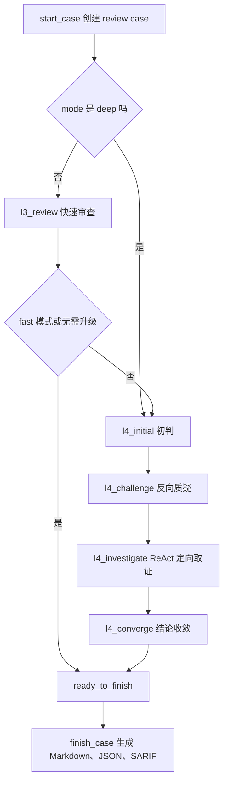

# 多阶段审查引擎与工程化生产边界

## 第一部分：总结介绍

这一部分对应简历里的“设计证据驱动的多阶段审查引擎，引导大模型依次完成初判、反向质疑、定向取证与结论收敛，实现对需求实现情况的判定与证据追溯”。这里的重点不是 LLM 能不能回答问题，而是如何把一次容易幻觉的一次性判断，改造成可控的 Agentic Workflow。

这个插件的审查状态定义在 `runtime/spec_review_runtime/workflow.py`。状态集合包括 `l3_review`、`l4_initial`、`l4_challenge`、`l4_investigate` 和 `l4_converge`。其中 L3 是快速审查，目标是低成本形成候选结论；L4 是深度审查，目标是通过初判、质疑、补证和收敛降低误报。模式由用户传入的 `mode` 控制：`fast` 只执行 L3，`deep` 直接进入 L4，`auto` 先执行 L3，如果出现 inconsistent、uncertain 或模型主动设置 `escalate=true`，再升级到 L4。

`workflow.start_case` 创建 case 时会决定初始阶段。如果 mode 是 `deep`，初始阶段是 `l4_initial`；否则初始阶段是 `l3_review`。这个设计兼顾效率和质量。大多数 MR 可以先用 L3 快速筛查，只有出现不一致候选或证据不足时才进入 L4。对于高风险需求，比如支付、权限、数据一致性，可以直接用 deep 模式进入 L4，牺牲一些成本换更充分的审查。

多阶段流程由 Runtime 的 `action_packet` 驱动。Agent 不自己决定下一步，而是每次读取 `next_action.action`。如果当前阶段未提交，Runtime 返回当前 stage 和对应 instructions；如果已经提交但还没推进，返回 `awaiting_next`；如果进入 `ready_to_finish`，返回 `finish`；如果状态异常，返回 `blocked`。这相当于把 Agent 的行动空间收束到一条明确轨道里，避免模型跳过质疑阶段或重复提交。

每个阶段的顺序是固定的，但新版实现更细：L3、L4 initial、L4 challenge 和 L4 converge 需要分页调用 `spec_review_context` 覆盖当前阶段全部目标 claim；L4 investigate 必须使用 `spec_review_investigate` 形成 action/observation 轨迹。阶段完成后再 `spec_review_submit`，最后 `spec_review_next`。prompt 里要求这个顺序，Runtime 也在代码里 enforce。`submit_stage` 会检查提交的 stage 必须等于 case 当前 stage，并且 `stage_runs` 表通过唯一约束保证每个阶段只能提交一次；`_validate_stage_result` 会校验 claim_id、verdict、evidence_id 归属和逐条覆盖率；`advance` 会先确认当前阶段已经存在合法提交结果，才能根据 `_next_stage` 推进。这样设计的原因是，Agent 的自然语言推理不稳定，必须用外部状态机来保证审查流程不会乱。

L3 阶段的定位是快速筛查。Agent 分页调用 `spec_review_context` 获取有界上下文包，对每条真实 claim 输出 `consistent`、`inconsistent`、`uncertain` 或 `not_applicable`。metadata 类型 claim 通常应该判为 `not_applicable`；`consistent/inconsistent` 必须引用当前 claim 上下文中的 evidence_id。新版 Runtime 会校验 L3 的 claims 必须恰好覆盖全部真实声明，不能用 UNKNOWN、REMAINING 或“其余需求”这类占位结果。`_needs_deep_review` 会检查 L3 提交结果，如果出现 `inconsistent` 或 `uncertain`，auto 模式会进入 `l4_initial`。这个机制相当于把 L3 作为候选问题发现器，而不是最终裁判。

L4 的第一步是 `l4_initial`，也就是初判。这个阶段要求 Agent 写清楚文档期望、观察到的代码行为、候选差异、变更归因假设、支持证据和未证实前提。初判阶段的价值在于把模型的第一反应结构化，明确它为什么认为某个需求可能没实现，引用了哪些 evidence_id，还有哪些前提没有验证。没有这个结构化初判，后面的质疑和取证就没有靶子。

L4 的第二步是 `l4_challenge`，也就是反向质疑。这一步是多阶段审查里最有面试价值的设计。因为代码-需求一致性审查特别容易误报：需求可能不适用于当前路径；实现可能在别名函数、装饰器、配置项或上游调用里；某个行为可能由框架默认机制提供；diff 只是暴露了历史问题而不是引入问题。反向质疑要求 Agent 主动尝试推翻自己的初判，并输出按优先级排序的 evidence gaps。

L4 的第三步是 `l4_investigate`，也就是定向取证。新版这里不是继续用普通 `spec_review_context` 做一次扩图，而是进入专用 ReAct 闭环：Agent 围绕 `l4_challenge` 产出的 gap_id，调用 `spec_review_investigate`，每一轮只选择一个 action，例如 `get_claim_evidence`、`search_symbols`、`get_symbol`、`get_callers`、`get_callees`、`read_source_range`、`get_diff_context`、`search_code` 或 `finish_investigation`。Runtime 每次返回结构化 observation，同时记录 `investigation_actions`，并扣减硬预算。预算包括 rounds、tool_calls、observation_chars 和 source_lines，达到上限后 Runtime 会拒绝继续取证，要求提交 `l4_investigate` 并进入收敛。这个设计把“模型要不要继续查”变成有轨迹、有上限、可恢复的取证过程。

L4 的最后一步是 `l4_converge`，也就是结论收敛。这个阶段要去除误报，给出严重级别和归因。归因枚举包括 introduced、exposed、pre_existing 和 unattributed；如果是 snapshot 审查，没有 base，就不能判断 introduced/exposed/pre_existing，只能使用 unattributed。新版还要求多条需求如果来自同一个代码根因，仍然要逐 claim 提交结果，但可以填写相同 `root_id` 或 `root_cause_id`，最终报告会按根因聚合展示，同时保留逐声明覆盖明细。这里的要求很严格：一个 inconsistent 结论必须同时具备可验证需求、精确代码证据、替代路径检查，以及与本次审查范围的可辩护关系。

用一个具体例子看，每个阶段拿到的上下文和产生的增量是不一样的。假设同一个 MR 改了 `MeetingService::Join`，需求 claim 是“鉴权失败必须拒绝加入会议并记录安全审计日志”。L3 阶段拿到的是分页 evidence pack，重点是需求、diff、命中符号、有限调用图和初始 gap。它的预期产物不是深度结论，而是逐 claim 初筛：

```json
{
  "stage": "l3_review",
  "claims": [
    {
      "claim_id": "C-002",
      "verdict": "uncertain",
      "evidence_ids": ["E-diff-201", "E-src-318"],
      "reasoning": "失败路径返回 false，能证明拒绝加入；但当前证据没有看到安全审计日志调用。",
      "escalate": true
    }
  ]
}
```

L4 initial 阶段拿到的上下文会多一层“上一阶段结果”。也就是说，Agent 不只是重新看 evidence pack，而是带着 L3 的 `uncertain` 原因进入深审。这个阶段的产物要把候选问题拆清楚：文档期望是什么、代码观察是什么、候选差异是什么、哪些前提还没验证。

```json
{
  "stage": "l4_initial",
  "claims": [
    {
      "claim_id": "C-002",
      "candidate_issue": "失败路径缺少安全审计日志",
      "expected_behavior": "鉴权失败时拒绝加入会议，并记录安全审计日志。",
      "observed_behavior": "Join 在 ValidateJoinPermission 返回 false 时直接 return false。",
      "unverified_assumptions": [
        "ValidateJoinPermission 内部是否已经记录审计日志",
        "上游入口是否统一记录鉴权失败审计"
      ],
      "evidence_ids": ["E-diff-201", "E-src-318"]
    }
  ]
}
```

L4 challenge 阶段拿到的上下文包含 L3 和 L4 initial 的结果，它不是继续强化怀疑，而是专门找“这个问题可能是误报”的解释。这个阶段的产物通常不是最终 verdict，而是反证方向和 gap 列表：

```json
{
  "stage": "l4_challenge",
  "gaps": [
    {
      "gap_id": "G-007",
      "claim_id": "C-002",
      "question": "ValidateJoinPermission 内部是否记录 SecurityAudit::RecordDeny",
      "priority": "high",
      "suggested_action": "get_callees",
      "target_symbol": "MeetingService::ValidateJoinPermission"
    },
    {
      "gap_id": "G-008",
      "claim_id": "C-002",
      "question": "JoinController 是否在 Join 返回 false 后统一记录审计",
      "priority": "medium",
      "suggested_action": "get_callers",
      "target_symbol": "MeetingService::Join"
    }
  ]
}
```

L4 investigate 阶段的上下文形式变化最大。它不再主要依赖一次分页 `context`，而是围绕 gap 做 action/observation。比如 Agent 先执行 `get_callees` 查 `ValidateJoinPermission` 的下游，Runtime 返回 observation；如果没有发现审计，再查 callers 或读具体源码范围。每轮都是一个受控动作，都会落库并扣预算：

```json
{
  "action": "get_callees",
  "gap_id": "G-007",
  "target_symbol": "MeetingService::ValidateJoinPermission",
  "observation": {
    "edges": [
      {
        "from": "MeetingService::ValidateJoinPermission",
        "to": "PermissionClient::CanJoin",
        "resolution_status": "resolved"
      }
    ],
    "new_evidence_ids": ["E-src-422"],
    "summary": "ValidateJoinPermission 只调用权限服务，没有发现安全审计日志调用。"
  },
  "budget": {
    "rounds_used": 1,
    "tool_calls_used": 1,
    "source_lines_used": 18
  }
}
```

最后 L4 converge 阶段拿到的是完整的阶段历史：L3 初筛、initial 候选问题、challenge 反证问题、investigate observations 和新增 evidence。它的产物才是面向报告的最终判断：

```json
{
  "stage": "l4_converge",
  "claims": [
    {
      "claim_id": "C-002",
      "verdict": "inconsistent",
      "severity": "major",
      "attribution": "introduced",
      "root_cause_id": "R-audit-missing-on-auth-deny",
      "reasoning": "MR 新增了鉴权失败 return false 路径，但 Join、ValidateJoinPermission 及上游入口证据均未显示安全审计日志记录。",
      "evidence_ids": ["E-diff-201", "E-src-318", "E-src-422"],
      "checked_alternatives": [
        "ValidateJoinPermission 内部审计",
        "JoinController 统一审计",
        "权限客户端统一审计"
      ],
      "suggested_action": "在鉴权失败分支补充 SecurityAudit::RecordDeny 或复用统一审计封装。"
    }
  ]
}
```

所以每个阶段的增量可以这样记：L3 产出“风险候选”；L4 initial 产出“候选问题结构化”；L4 challenge 产出“反证问题和 gap”；L4 investigate 产出“新的 observation 和 evidence”；L4 converge 产出“可发布、可追溯、可归因的最终 finding”。这也是为什么不能把 L3/L4 理解成多问几次模型，它们在数据结构上确实写入不同阶段产物，后续阶段会读取前序产物继续推理。

多阶段审查流程可以表示为：



工程化方面，Runtime 使用 SQLite 保存所有状态，数据库路径是业务仓库下的 `.spec-review/index.sqlite`。新版 `db.py` 的 schema 除 index_snapshots、files、file_versions、symbols、edges、documents、claims、review_cases、change_seeds、evidence 和 stage_runs 外，还包含 `investigation_budget`、`investigation_actions`、`observation_cache` 和 `publications`。这里不是简单缓存，而是把一次审查拆成可恢复、可检查的状态记录。比如 review_cases 保存 case 当前阶段和状态，stage_runs 保存每个阶段的模型结构化输出，evidence 保存模型可引用的证据，change_seeds 保存本次变更范围，investigation_actions 保存 L4 取证轨迹，publications 保存 MR 平台 回写的幂等记录。

并发控制由 `locking.py` 负责。每次 Python Runtime 启动后，会先获取仓库级 `runtime.lock` 的 fcntl 排他锁，再连接 SQLite。锁文件会保留，但真正有效的是操作系统内核锁，进程退出后自动释放。因此异常退出不会留下必须人工删除的僵尸锁。SQLite 同时开启 WAL 和 busy_timeout，用来改善读写并发和短暂锁竞争。这个设计适合短生命周期命令式 Runtime：简单、可靠，不需要额外服务治理。

报告生成在 `report.py`。只有当 case stage 是 `ready_to_finish` 或 `finished` 时，Runtime 才允许生成报告。它会读取所有阶段结果，把 L3 和 L4 收敛结果重新组装成逐 claim 结果，计算覆盖率和 verdict 统计，并把 inconsistent 按 root cause 聚合。最终输出 JSON、Markdown 和 SARIF。JSON 保存完整 payload、coverage 和 stage_results，适合机器消费和后续指标分析；Markdown 面向用户，只突出需要处理的问题；SARIF 面向代码扫描、安全平台或 MR 平台的代码扫描集成。

这套工程化设计有几个明显优点。第一，审查过程可恢复和可追溯，因为每一步都落库。第二，Agent 行为可约束，因为状态机和工具权限都在代码里 enforce。第三，证据上下文可复盘，因为 evidence 不只是 prompt 临时文本，而是持久化记录。第四，部署简单，因为内部 MCP 与平台接口只负责 MR 和需求文档输入获取，审查状态机、证据和报告仍由本地 Runtime 控制，不依赖 OpenCode 内部数据库。

同时也要明确边界。插件已经支持内部 MR 模式、publish preview、真实发布前 head SHA 复验、commit status/check-run、SARIF 上传选项，以及基于 suggested_patch 创建 Fix MR 的安全路径；也已经通过内部 MCP 与平台接口获取 MR 信息和设计文档。Tree-sitter 在部署环境中作为结构化解析底座，静态调用图仍然无法完整覆盖动态行为，所以不能把 unresolved edge 解释为没有实现；遇到反射、动态派发、依赖注入、跨服务调用这类场景，需要结合 L4 定向取证、测试、日志或链路追踪补证。

生产化改进可以沿四个方向做。第一是输入源增强：在已有内部 MR 和需求文档接入基础上，继续统一不同平台实例的 MR 编号、commit、需求 ID、文档版本和审批状态。第二是证据源增强：引入测试覆盖率、CI 结果、运行日志、链路追踪、配置解析和服务依赖图，补静态分析的盲区。第三是评估体系：建立历史 MR gold set，统计误报率、漏报率、uncertain 占比、证据命中率和 L4 消除误报比例。第四是安全与权限：按用户身份读取需求和代码，做 evidence 脱敏，限制报告输出位置，并对 Agent 工具调用、发布和 Fix MR 创建进行审计。

## 面试话术版本

如果面试官问“你这个多阶段审查引擎是怎么设计的”，我会这样回答：

我把一致性审查拆成 L3 和 L4。L3 是快速审查，基于 Runtime 返回的 evidence pack 对每条需求 claim 做初步判断，输出 consistent、inconsistent、uncertain 或 not_applicable。auto 模式下，如果 L3 出现 inconsistent 或 uncertain，就进入 L4。L4 是一个单 Agent 的多阶段状态机，依次执行初判、反向质疑、定向取证和结论收敛。

初判阶段先让模型明确文档期望、代码观察、候选差异和支持证据。质疑阶段要求模型主动推翻自己的初判，检查需求适用性、路径可达性、替代实现、配置开关、框架默认行为和变更归因。取证阶段只围绕已经识别出的 gap 调用 `spec_review_investigate`，以 action/observation 的方式查 callers、callees、符号、diff 或源码范围，并受硬预算约束。收敛阶段再去误报、合并根因、定级并给出 introduced、exposed、pre_existing 或 unattributed 的归因。

为了避免模型乱序执行，我把阶段状态放在 Runtime 里。每次 Runtime 返回 `next_action`，Agent 必须按分页 context 或 investigate 取证、submit、next 的顺序推进。`submit_stage` 会校验当前阶段、claim 覆盖率、verdict 枚举和 evidence 归属，数据库也限制同一阶段只能提交一次。最终只有进入 `ready_to_finish` 后才能生成报告。这样 LLM 负责推理，但审查流程、状态持久化、并发锁、预算控制和报告生成由确定性代码控制。

## 第二部分：面试问答与追问补充

Q：为什么需要 L4 的反向质疑阶段？

A：因为需求一致性审查非常容易误报。模型初判时可能只看到被改函数，没有看到上游已经做了校验，也可能不知道某个行为由配置或框架默认实现。反向质疑阶段强制模型尝试推翻自己的结论，把适用性、可达性、替代实现、防护条件和归因都检查一遍。它的目标不是增加流程复杂度，而是显式降低误报。

Q：为什么 L4 investigate 不直接全仓取证？

A：全仓取证会让上下文爆炸，也会增加模型幻觉概率。我的设计是先在 initial 和 challenge 阶段形成明确 gap，再围绕 gap 定向取证。新版 investigate 阶段不是一次性拿更大上下文，而是通过 `spec_review_investigate` 每轮执行一个 action，读取 observation 后再决定下一步，并由 Runtime 强制 rounds、tool_calls、observation_chars 和 source_lines 预算。这样上下文扩展有目标、有方向、有轨迹、有上限。

Q：为什么每个阶段只能提交一次？

A：这是为了保证审查轨迹清晰。如果一个阶段可以反复覆盖，后续就很难复盘模型当时基于什么做判断，也难以比较 L3 和 L4 的变化。每阶段一次提交让 stage_runs 成为审查过程的审计日志。模型如果需要补证，应该进入下一阶段，而不是覆盖历史判断。

Q：如果 L3 判定 consistent，但其实漏报了怎么办？

A：这是 fast 和 auto 模式的边界。L3 是低成本初筛，不能保证覆盖所有深层问题。生产中可以基于风险策略决定是否强制 deep，比如支付、权限、数据删除、资金结算等高风险模块直接走 L4。另外可以用评估集统计 L3 漏报率，根据历史数据调整升级策略，比如只要证据覆盖不足或解析 gap 较多就升级。

Q：怎么验证 L4 确实降低误报？

A：可以把历史 MR 和人工 review 结论作为 gold set。先跑 L3，记录候选 inconsistent，再跑 L4，观察 challenge 和 converge 阶段消除了多少误报、保留的问题是否有更完整证据链。同时统计最终报告中每个 inconsistent 是否包含 claim、diff evidence、source evidence、替代路径检查和归因。如果 L4 后误报率下降，同时漏报没有明显上升，就说明多阶段设计有效。

Q：SQLite 和文件锁是否适合生产？

A：对于本地 OpenCode 插件和单仓审查，SQLite 加仓库级文件锁是一个务实选择，部署简单且故障边界小。同一仓库写操作串行化，可以避免 `database is locked` 直接暴露给用户。但如果生产环境要做集中式平台、多用户并发和跨仓批量审查，就应该把状态存储迁移到服务端数据库，并把索引任务异步化。

Q：如果 Runtime 执行中断，会不会破坏状态？

A：Runtime 在关键写入时使用事务，索引构建里有 `BEGIN IMMEDIATE` 和异常 rollback；锁是 fcntl 内核锁，进程退出会自动释放。中断后可能留下未完成 case，但不会长期占锁。生产化可以增加 case recovery 机制，比如标记 stale active case、允许重新 resume、记录 runtime invocation 日志。

Q：最终报告为什么要同时生成 Markdown、JSON 和 SARIF？

A：Markdown 面向人阅读，可以直接贴到 MR 或发给开发；JSON 面向机器消费，保存完整 scope、coverage、stage_results 和最终 result，方便后续评估、统计和平台集成；SARIF 面向代码扫描和平台展示，可以把不一致项定位到文件行。比如可以统计哪些需求类型最容易 inconsistent、哪些模块 uncertain 比例最高、L4 哪个阶段最常产生有效反证。

Q：生产化还需要补哪些能力？

A：我会优先补四类。第一，在已有内部 MR 和需求文档接入基础上，继续统一不同平台实例的字段和权限模型。第二，接入更多证据源，包括测试、CI、日志、链路追踪和配置解析。第三，建设评估体系，用历史样本量化误报、漏报和证据命中率。第四，强化权限和审计，确保 Agent 只能读取用户有权访问的需求和代码，报告发布、SARIF 上传和 Fix MR 创建都要受控。
