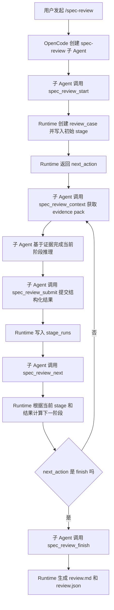

# L3 与 L4 多阶段审查工作流详解

## 第一部分：总结介绍

这个项目里的 L3 和 L4 不是 OpenCode 原生提供的固定工作流，也不是传统意义上只靠 skill 定义出来的流程。它本质上是三层机制叠加出来的 Agentic Workflow：第一层是 prompt 对子 Agent 行为的约束，第二层是 OpenCode 插件配置对子 Agent 工具权限的限制，第三层是 Python Runtime 用 SQLite 状态机强制记录和推进阶段。也就是说，L3/L4 不是某个单独文件里的“魔法能力”，而是一套由 Agent 提示词、工具边界、状态持久化和运行时校验共同保证的多阶段审查协议。

从代码上看，L3/L4 的定义首先出现在 `plugins/spec-review/src/prompts.ts`。这里的 `REVIEW_AGENT_PROMPT` 告诉子 Agent：它只能使用 `spec_review_*` 工具，首次必须调用 `spec_review_start`，后续必须保存 `repo` 和 `case_id`，每个阶段必须先调用 `spec_review_context` 获取上下文，再调用 `spec_review_submit` 提交结构化结果，最后调用 `spec_review_next` 推进阶段。prompt 还定义了 L3 是快速审查，输出 `consistent`、`inconsistent`、`uncertain` 或 `not_applicable`；L4 是单 Agent 四阶段深审，依次是 `l4_initial`、`l4_challenge`、`l4_investigate` 和 `l4_converge`。

但是只靠 prompt 是不够的，因为模型可能忘记、跳步、重复提交或者用错误阶段提交。所以第二层约束在 `plugins/spec-review/src/index.ts` 里完成。插件注册 `spec-review` 子 Agent 时，把权限配置成 `"*": "deny"` 和 `"spec_review_*": "allow"`。这意味着子 Agent 不能使用 shell、read、grep、edit 或 task 工具，也不能绕开 Runtime 自己读取仓库。它只能通过 `spec_review_start`、`spec_review_context`、`spec_review_submit`、`spec_review_next`、`spec_review_finish` 这组工具和 Python Runtime 交互。这个设计让 LLM 只负责审查推理，确定性的流程控制、证据生成、阶段推进和状态保存都交给 Runtime。

第三层是最关键的硬约束，写在 `plugins/spec-review/runtime/spec_review_runtime/workflow.py`。这里用 `STAGES` 定义了允许的阶段集合：`l3_review`、`l4_initial`、`l4_challenge`、`l4_investigate`、`l4_converge`。`start_case` 根据用户传入的 `mode` 决定初始阶段：如果是 `deep`，直接从 `l4_initial` 开始；如果是 `fast` 或 `auto`，先从 `l3_review` 开始。也就是说，L3/L4 的实际执行入口不是模型自己决定的，而是 Runtime 在创建 case 时写入 `review_cases.stage` 字段。

一次完整流程是这样的：用户通过 `/spec-review` 或主 Agent 触发审查，OpenCode 创建 `spec-review` 子 Agent；子 Agent 调用 `spec_review_start`；TypeScript 层通过 `Bun.spawn` 启动 Python Runtime；Runtime 校验 repo、加仓库级锁、连接 `.spec-review/index.sqlite`；`start_case` 建立或复用代码索引，解析 Git Diff 得到 change seeds，抽取需求文档 claim，然后创建一条 `review_cases` 记录，并返回 `next_action`。后续子 Agent 不应该自己猜下一步，而是根据 `next_action.action` 执行对应阶段。

可以把它理解成下面这条事件流：

L3 的定位是快速筛查。它不是最终深度审计，而是用有限 evidence pack 对需求声明做初步分类。Runtime 通过 `spec_review_context` 返回需求 claim、变更 summary、调用图、diff/source evidence 和 gaps。Agent 在 L3 阶段根据这些证据判断每条 claim 是否一致。如果结果里有 `inconsistent`、`uncertain`，或者显式设置 `escalate=true`，`workflow.py` 的 `_needs_deep_review` 会让 `auto` 模式升级到 L4。这里的设计动机是节省成本：明显没有问题的变更可以快速结束，有疑点或证据不足的 case 再进入更贵的深审流程。

L4 的定位是降低误报和补齐证据。它不是简单地“再审一次”，而是把资深 reviewer 的思考拆成四个阶段。`l4_initial` 负责初判，要求模型说清文档期望、观察到的代码行为、候选差异、支持证据和未证实前提。`l4_challenge` 负责反向质疑，要求模型主动推翻自己的初判，检查需求是否适用、路径是否可达、是否有替代实现、是否有配置开关、防护条件或历史遗留问题。`l4_investigate` 负责定向取证，围绕上一阶段形成的 gap 调用 `spec_review_context`，按 `callers`、`callees` 或 `both` 扩展调用链。`l4_converge` 负责收敛，去掉误报，合并相同根因，给出严重级别和变更归因。

这里的“多阶段工作流”不是模型在脑子里自由发挥，而是 Runtime 明确限制推进顺序。`submit_stage` 会检查提交的 `stage` 必须等于当前 case 的 `stage`，否则拒绝。它还会把结果写入 `stage_runs`，而 `stage_runs` 表对 `(case_id, stage)` 设置了唯一约束，所以同一个阶段不能重复提交。`advance` 在推进前会检查当前阶段是否已经有提交结果，如果没有提交，就不能进入下一阶段。也就是说，状态顺序由数据库和代码校验保证，而不是单靠 prompt 约束。

状态推进规则写在 `_next_stage` 里。`l3_review` 如果是 `fast` 模式，直接进入 `ready_to_finish`；如果是 `auto`，则根据 `_needs_deep_review` 判断是否进入 `l4_initial`；L4 则固定从 `l4_initial` 到 `l4_challenge`，再到 `l4_investigate`，再到 `l4_converge`，最后进入 `ready_to_finish`。这说明 L4 是一个有限状态机，不是 while 循环式的自主规划。理论上，正常路径最多经历一次 L3 加四个 L4 阶段，然后 finish。

中间环节出错时，错误处理分几层。TypeScript 层的 `invokeRuntime` 会等待 Python 子进程的 stdout、stderr 和 exit code；如果 exit code 不是 0，就把错误包装成 OpenCode 工具错误。Python CLI 的 `main` 会捕获异常，把异常类型和 message 以 JSON 形式写到 stderr，然后返回退出码 2。Runtime 内部对常见错误也有明确校验，比如 repo 缺失、repo 是 `/`、审查范围不明确、case 不存在、stage 不匹配、阶段重复提交、没有提交就调用 next、case 尚未 ready 就 finish。这些错误不会静默吞掉，而是会阻断当前工具调用，让 Agent 或用户看到明确原因。

关于是否会陷入无限循环，要分“设计意图”和“当前代码实际保证”两层看。设计意图上，L3/L4 是有限状态机：阶段集合固定，`_next_stage` 每次都向后推进，最终到 `ready_to_finish`。并且每个阶段只能提交一次，这避免了同一个阶段被反复 submit。prompt 也要求持续执行 `next_action`，直到 `finish`、`done` 或 `blocked`。但是当前代码里虽然在 `start_case` 的 `budget` 中定义了 `max_tool_rounds: 8`，并没有看到 Runtime 实际统计和强制限制工具轮数。因此，如果 Agent 在 OpenCode 层不遵守 `next_action`，例如反复调用 `status` 或反复调用 `context` 而不 `submit`，Runtime 不会因为超过轮次自动 blocked。生产化时应该增加 `tool_events` 或 `case_events` 表，记录每次工具调用，并在 Runtime 层强制 `max_tool_rounds`，这样才能从代码层彻底防止异常循环。

不过，即使没有强制轮次上限，核心审查阶段本身仍然不容易无限推进，因为 `advance` 只能根据有限 `_next_stage` 后移，`submit_stage` 又禁止重复提交同一阶段。真正可能出现的是 Agent 卡在某个阶段不提交，或者在 `awaiting_next` 时没有调用 `next`。这类问题属于 Agent 执行策略不遵守协议，不是状态机无限增长。当前 prompt 通过 `next_action` 约束降低这个风险，但生产系统应该进一步做 runtime-enforced 超时、轮次计数和自动 blocked。

关于中断恢复，当前实现是有一定恢复能力的。`.spec-review/index.sqlite` 会保存 `review_cases`、`claims`、`change_seeds`、`evidence` 和 `stage_runs`。如果中断发生在 `start_case` 提交之后，case、claim 和 seed 已经持久化，之后可以用 `spec_review_status` 查询最近或指定 case 的状态。如果中断发生在某个阶段 `submit_stage` 之后但 `spec_review_next` 之前，`action_packet` 会发现该阶段已经提交，返回 `awaiting_next`，提示继续调用 `spec_review_next`。如果中断发生在 `context` 之后但 `submit` 之前，context 生成的 evidence 可能已经写入数据库，但当前阶段没有 stage run，恢复后仍然会返回同一个阶段 action，Agent 可以重新取上下文并提交。

但当前恢复也有边界。首先，`case_id` 需要被保存或能通过 `status` 查到最近 case；如果用户同时跑多个 case，只靠最近 case 可能会串上下文，所以后续调用最好显式携带 `caseId`。其次，模型自身的自然语言思考不会被保存，保存的是结构化阶段提交结果和 evidence。也就是说，只有已经 `submit` 的阶段结果能作为恢复后的正式上下文；没有提交的中间推理不会恢复。第三，`context` 会把历史 `prior_stage_results` 返回给 Agent，所以已经提交的 L3/L4 结果能被后续阶段继续使用。

这个设计和 skill 的区别也要讲清楚。skill 更像是“告诉 Agent 如何做事的一组说明和资源”，它可以定义工作方法，但通常不天然提供业务状态机、阶段唯一提交、数据库持久化、证据 ID、并发锁和报告生成。这里的 L3/L4 虽然也依赖 prompt 指令，但真正让它成为工程化多阶段审查的是 Runtime：阶段状态存在 SQLite 里，提交结果存在 `stage_runs` 里，证据存在 `evidence` 里，下一步动作由 `action_packet` 返回，阶段流转由 `_next_stage` 计算。这比单纯 prompt 或 skill 更接近“受控 Agent 工作流引擎”。

从生产化角度看，当前实现的方向是对的，但还有几个可增强点。第一，要真正实现 `max_tool_rounds`，记录每次工具调用并在超过阈值时把 case 置为 `blocked`。第二，要增加 case 的超时和租约机制，避免 Agent 长时间停在某个阶段没人处理。第三，要对 `submit_stage.result` 做更严格的 schema 校验，而不是只校验它是 JSON 对象；例如 L3 必须包含 claim verdict，L4 converge 必须包含 evidence_ids、severity、attribution。第四，要增加恢复命令，比如 `spec_review_resume`，显式返回上次 case 的当前阶段、已提交结果和下一步建议。第五，要把错误类型标准化，区分用户输入错误、环境错误、索引错误、模型提交格式错误和并发锁超时。

## 面试话术版本

如果面试官问“你说的 L3/L4 多阶段审查到底是什么实现的”，我会这样回答：

我这里的 L3/L4 不是 OpenCode 自带的固定工作流，也不是只靠 prompt 写出来的流程，而是一个受控 Agent 状态机。OpenCode 插件里注册了一个专用 `spec-review` 子 Agent，这个 Agent 的权限被限制成只能调用 `spec_review_*` 工具，不能自由 shell、grep 或 read 文件。这样做的目的是让模型不能绕过证据系统，所有上下文都必须来自 Runtime 生成的 evidence pack。

L3 和 L4 的语义定义在子 Agent prompt 里。L3 是快速审查，对每个需求 claim 给出一致、不一致、不确定或不适用的初筛判断；auto 模式下，如果 L3 出现不一致或不确定，就升级到 L4。L4 是深审流程，分成初判、反向质疑、定向取证和结论收敛四个阶段。这个拆分是为了降低误报，因为代码和需求一致性审查里，很多初看像问题的地方可能被调用路径、配置开关、替代实现或者历史归因推翻。

真正保证顺序的是 Python Runtime。Runtime 在 SQLite 的 `review_cases` 表里保存当前 case 的 `stage`，在 `stage_runs` 表里保存每个阶段的结构化结果。Agent 每个阶段必须先拿 context，再 submit，最后 next。`submit_stage` 会校验提交阶段必须等于当前阶段，并且同一个 case 的同一个阶段只能提交一次。`advance` 会检查当前阶段已有提交结果，才允许推进。下一阶段由 `_next_stage` 固定计算，所以正常流程是有限的，不是模型随意循环。

如果中间失败，TypeScript 层会检查 Python Runtime 的 exit code，失败就把 stderr 里的 JSON 错误抛给 OpenCode。Python Runtime 也会捕获异常并返回明确错误，比如范围不明确、repo 是根目录、case 不存在、阶段不匹配、重复提交、未提交就推进等。中断恢复方面，case、claim、seed、evidence 和阶段结果都会保存到仓库下的 `.spec-review/index.sqlite`。如果阶段已经 submit 但还没 next，恢复时会返回 `awaiting_next`；如果只取了 context 但没 submit，恢复时还停在原阶段，可以重新取证并提交。

我也会明确指出一个当前实现边界：代码里定义了 `max_tool_rounds`，但还没有实际强制统计工具轮次。因此状态机阶段本身是有限的，重复提交也会被拒绝，但如果 Agent 一直反复调用 context 而不 submit，目前 Runtime 不会自动 blocked。生产化我会增加工具调用事件表、轮次上限、阶段超时和严格结果 schema 校验，让工作流不只依赖 prompt 遵守协议。

## 第二部分：面试问答与追问补充

Q：你这里说的 L3 和 L4，到底是代码里的什么？是 Agent、skill，还是某种工作流？

A：它不是单独一种 OpenCode 原语，而是一个组合实现。prompt 里定义 L3/L4 的审查语义，OpenCode 插件权限限制保证子 Agent 只能调用受控工具，Python Runtime 用 SQLite 状态机保存和推进阶段。所以从工程上讲，它是一个“由 Runtime 驱动的 Agent 多阶段审查协议”。Agent 负责阶段内推理，Runtime 负责阶段边界、状态和证据。

Q：为什么不能只用 skill 来定义这个流程？

A：skill 能告诉 Agent 应该怎么做，但它很难单独保证阶段顺序、唯一提交、证据持久化和中断恢复。这个项目需要的是可审计审查流程，每个结论必须能追溯到 evidence_id，每个阶段结果必须落库，失败后还要能恢复。因此我没有只依赖 prompt 或 skill，而是把关键状态放到了 Runtime 和 SQLite 里。

Q：L3 和 L4 的边界是什么？为什么要先 L3 再 L4？

A：L3 是低成本快速筛查，目标是判断哪些需求 claim 明显一致、明显不一致或证据不足。L4 是高成本深审，目标是对 L3 发现的疑点做反向质疑和定向补证。先 L3 再 L4 是为了成本和质量平衡：没有疑点的 case 不需要跑完整深审；有不一致或 uncertain 的 case 再进入 L4，减少误报和漏判。

Q：为什么 L4 要分成初判、质疑、取证、收敛，而不是一个 prompt 完成？

A：一致性审查很容易误报。一个变更看起来没实现需求，可能是因为需求不适用、功能在另一路径实现、配置开关关闭、调用路径不可达，或者这个问题不是本次 MR 引入的。把 L4 拆成四阶段，是为了强迫模型先提出假设，再主动推翻假设，再围绕缺口补证，最后只保留证据充分的问题。这比一次性 prompt 更接近真实 code review 的思考过程。

Q：怎么保证 Agent 不跳过阶段？

A：有两层保证。prompt 要求 Agent 必须按 `next_action` 执行，每个阶段必须 `context -> submit -> next`。更重要的是 Runtime 会校验：`submit_stage` 要求提交阶段等于 `review_cases.stage`，`advance` 要求当前阶段已经有提交结果，否则拒绝推进。即使模型试图提交未来阶段，Runtime 也会报错。

Q：怎么保证同一个阶段不会重复提交？

A：`stage_runs` 表对 `(case_id, stage)` 设置了唯一约束，`submit_stage` 插入重复记录时会触发 `sqlite3.IntegrityError`，然后 Runtime 抛出“该阶段已经提交过结果”。这比只靠 prompt 更可靠。

Q：如果 Agent 在 submit 之后忘了 next，会发生什么？

A：状态不会丢。因为 submit 已经把阶段结果写进 `stage_runs`。恢复或调用 status 时，`action_packet` 会发现当前阶段已经提交，返回 `awaiting_next`。这相当于告诉 Agent：你不用重复审查了，下一步应该调用 `spec_review_next` 推进状态。

Q：如果 Agent 在 context 之后中断，但还没 submit，会发生什么？

A：当前阶段仍然停留在原 stage，因为没有 `stage_runs`。context 过程中生成的 evidence 可能已经保存到 `evidence` 表，但正式阶段结果没有保存。恢复时可以重新调用 context，再提交该阶段结果。这个设计避免了把未完成推理当成正式审查结果。

Q：如果 Python Runtime 执行失败，错误怎么传出来？

A：Python CLI 捕获异常后，会把 `{"error": 异常类型, "message": 错误信息}` 写到 stderr，并返回退出码 2。TypeScript 的 `invokeRuntime` 会检查 exit code，非 0 就抛出工具错误，错误信息里包含 stderr 或 stdout。这样 OpenCode Agent 不会拿到半成功结果继续跑。

Q：会不会陷入无限循环？

A：正常阶段推进不会，因为 `_next_stage` 是有限状态机，最多从 L3 到 L4 四阶段再到 finish。同一个阶段也不能重复 submit。但是当前代码没有真正强制 `max_tool_rounds`，所以如果 Agent 异常地反复调用 context 而不 submit，Runtime 目前不会自动 blocked。生产化时我会补一个 tool call event 表，记录每次调用，并在超过轮次、超过阶段耗时或重复无效动作时把 case 标记为 blocked。

Q：中断后如何恢复？有没有保存状态？

A：有部分恢复能力。状态保存在业务仓库的 `.spec-review/index.sqlite`，包括 `review_cases` 当前 stage、`claims`、`change_seeds`、`evidence` 和 `stage_runs`。调用 `spec_review_status` 可以拿到当前 case 的 stage、counts 和 next_action。已经 submit 的阶段会出现在后续 context 的 `prior_stage_results` 里，所以后续阶段可以继续使用历史结论。

Q：恢复能力有什么边界？

A：边界是模型未提交的自然语言思考不会保存，保存的是 evidence 和结构化提交结果。如果中断发生在模型思考中但 submit 前，需要重新执行该阶段。另外，如果同时有多个 case，只靠最近 case 恢复有串案风险，所以生产化应该要求显式 caseId，或者提供更清晰的 case 列表和 resume 命令。

Q：为什么 Runtime 要返回 next_action，而不是让 Agent 自己决定下一步？

A：因为 Agent 自己决定容易跳步，也不利于恢复。`next_action` 把流程控制权收回到 Runtime：当前 stage 是什么、是否已经提交、是否 ready_to_finish，都由数据库状态计算。Agent 只执行动作。这种设计更容易审计，也更容易处理失败和中断。

Q：如果 L3 判断没有问题，还会跑 L4 吗？

A：取决于 mode。`fast` 模式只跑 L3，然后 finish。`auto` 模式下，如果 L3 没有 `inconsistent`、`uncertain`，也没有 `escalate=true`，就直接 finish；如果有疑点才进 L4。`deep` 模式则跳过 L3，直接从 `l4_initial` 开始。

Q：L4 investigate 为什么允许更大的 maxNodes？

A：因为 investigate 是专门为了补证。普通阶段需要控制上下文，避免模型被太多无关信息干扰；取证阶段则围绕明确 gap 扩展 callers 或 callees，需要更大的图搜索预算。代码里通过当前 stage 判断使用 `max_context_nodes` 还是 `max_investigation_nodes`。

Q：怎么验证 L3/L4 工作流设计是有效的？

A：我会分三类验证。第一是状态机验证：错误阶段提交、重复提交、未提交 next、未 ready finish 都必须失败。第二是恢复验证：在 start 后、context 后、submit 后分别中断，重新 status 应该能返回正确 next_action。第三是效果验证：用历史 MR 构造评估集，比较只跑 L3 和跑 L4 后的误报率、漏报率、uncertain 占比，以及 L4 challenge 能消除多少误报。

